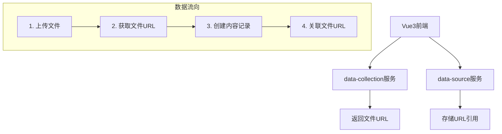

# 微服务业务功能分离分析报告

**日期**: 2025-09-04  
**类型**: 架构分析与修正  
**影响级别**: 重大架构调整  

## 🔍 问题识别

### 当前架构问题
通过深入分析发现，两个微服务存在严重的业务功能重复和边界模糊：

#### ❌ 发现的重复功能
```
data-source 服务（错误重复）:
├── src/storage/minio_client.py     # 重复MinIO实现
├── src/api/media.py               # 重复媒体上传API
└── main.py                        # 重复存储初始化

data-collection 服务（正确实现）:
├── src/utils/storage.py           # 完整MinIO实现 ✅
├── src/processors/               # 完整文件处理器 ✅
├── src/controllers/              # 文件上传API ✅
└── src/workers/                  # 异步处理工作器 ✅
```

#### 🚨 架构混乱原因
1. **功能边界不清晰**: data-source错误地添加了存储和文件处理功能
2. **重复开发**: 两个服务都实现了MinIO客户端
3. **职责混淆**: data-source本应专注数据管理，却承担了文件存储职责

## 🎯 正确的业务分离方案

### 明确的服务职责定义

#### 📊 data-source服务（数据管理服务）
**核心职责**: 纯数据管理和业务逻辑
```yaml
主要功能:
  - ✅ 内容数据的CRUD操作（创建、读取、更新、删除）
  - ✅ 内容搜索和过滤
  - ✅ 内容分类和标签管理  
  - ✅ 数据统计和分析
  - ✅ 业务规则和验证逻辑
  - ✅ 内容状态管理（发布、草稿、归档等）

数据存储:
  - ✅ MongoDB: 内容数据、元数据
  - ✅ Redis: 缓存、会话、统计数据

API端点示例:
  - POST /api/v1/content/              # 创建内容（接收URL引用）
  - GET  /api/v1/content/              # 查询内容列表
  - PUT  /api/v1/content/{id}          # 更新内容
  - DELETE /api/v1/content/{id}        # 删除内容
  - GET  /api/v1/content/search        # 内容搜索
  - GET  /api/v1/content/stats         # 内容统计
```

#### 📁 data-collection服务（文件处理服务）  
**核心职责**: 文件存储、处理和媒体管理
```yaml
主要功能:
  - ✅ 文件上传和存储（MinIO对象存储）
  - ✅ 多格式文件处理（PDF、Word、图片OCR、HTML等）
  - ✅ 文件元数据管理
  - ✅ 文件安全检测（病毒扫描）
  - ✅ 异步文件处理工作流
  - ✅ 预签名URL生成和管理

数据存储:
  - ✅ PostgreSQL: 文件元数据、处理记录
  - ✅ MinIO: 对象文件存储
  - ✅ RabbitMQ: 异步处理队列

API端点示例:
  - POST /api/v1/files/upload          # 文件上传
  - GET  /api/v1/files/{file_id}       # 获取文件信息
  - DELETE /api/v1/files/{file_id}     # 删除文件
  - POST /api/v1/files/batch-upload    # 批量文件上传
  - GET  /api/v1/files/presigned-url   # 获取预签名URL
```

## 🔧 服务间协作模式

### 推荐工作流


### Vue3前端集成示例
```javascript
// 标准工作流：先上传文件，再创建内容
async function createContentWithMedia(contentData, files) {
    // 1. 上传文件到data-collection服务
    const fileResponse = await fetch('/api/collection/files/upload', {
        method: 'POST',
        body: createFileFormData(files)
    });
    const { file_urls } = await fileResponse.json();
    
    // 2. 创建内容记录到data-source服务，关联文件URL
    const contentResponse = await fetch('/api/v1/content/', {
        method: 'POST',
        headers: { 'Content-Type': 'application/json' },
        body: JSON.stringify({
            ...contentData,
            images: file_urls.filter(url => url.includes('/images/')),
            videos: file_urls.filter(url => url.includes('/videos/')),
        })
    });
    
    return contentResponse.json();
}
```

## 🧹 必要的代码清理工作

### 需要从data-source服务删除的文件
```bash
# 重复的存储功能
rm -rf services/data-source/src/storage/
rm -f services/data-source/src/api/media.py

# 更新主应用
# 删除MinIO导入和初始化代码
# 删除媒体路由注册
```

### 需要修改的文件
```yaml
services/data-source/src/main.py:
  删除: 
    - from .storage import init_minio_client
    - from .api.media import router as media_router
    - await init_minio_client()
    - app.include_router(media_router, ...)
    
services/data-source/src/models/content.py:
  保留:
    - images: List[HttpUrl] = Field(default_factory=list)  # 存储URL引用
    - videos: List[HttpUrl] = Field(default_factory=list)  # 存储URL引用
```

### data-collection服务保持不变
data-collection服务的存储功能实现正确，保持现状：
- `src/utils/storage.py` - 完整的MinIO客户端实现
- `src/controllers/` - 文件上传API控制器
- `src/processors/` - 文件处理器
- `src/workers/` - 异步处理工作器

## 📋 修正后的API设计

### data-source服务API（纯数据管理）
```yaml
内容管理:
  POST   /api/v1/content/              # 创建内容（包含文件URL引用）
  GET    /api/v1/content/              # 查询内容列表  
  GET    /api/v1/content/{id}          # 获取单个内容
  PUT    /api/v1/content/{id}          # 更新内容
  DELETE /api/v1/content/{id}          # 删除内容

内容搜索:
  GET    /api/v1/content/search        # 内容搜索
  GET    /api/v1/content/tags          # 获取标签列表
  GET    /api/v1/content/categories    # 获取分类列表

数据统计:
  GET    /api/v1/content/stats         # 内容统计信息
  GET    /api/v1/content/analytics     # 内容分析数据
```

### data-collection服务API（文件处理）
```yaml
文件管理:
  POST   /api/v1/files/upload          # 单文件上传
  POST   /api/v1/files/batch-upload    # 批量文件上传
  GET    /api/v1/files/{file_id}       # 获取文件信息
  DELETE /api/v1/files/{file_id}       # 删除文件

文件处理:
  POST   /api/v1/files/extract-text    # 文本提取
  GET    /api/v1/files/{file_id}/metadata  # 获取文件元数据
  POST   /api/v1/files/validate        # 文件验证

存储管理:
  GET    /api/v1/files/presigned-url   # 生成预签名URL  
  POST   /api/v1/files/cleanup         # 清理未使用文件
```

## 📊 架构分离优势

### ✅ 清晰的职责分离
1. **data-source**: 专注业务逻辑和数据管理
2. **data-collection**: 专注文件处理和存储管理
3. **避免功能重复**: 每个服务都有明确的边界

### ✅ 更好的可维护性
1. **单一职责**: 每个服务专注核心功能
2. **独立部署**: 可以独立扩展和升级
3. **故障隔离**: 文件存储问题不影响数据管理

### ✅ 性能优化
1. **资源优化**: data-source不需要文件处理资源
2. **缓存策略**: 各服务可以独立优化缓存
3. **负载分离**: 文件处理负载与数据查询负载分离

## 🎯 实施计划

### 阶段1: 代码清理（立即执行）
- [ ] 删除data-source中的重复存储功能
- [ ] 更新main.py，移除MinIO初始化
- [ ] 清理重复的API端点

### 阶段2: API标准化（1天）
- [ ] 确保data-collection的文件上传API完整
- [ ] 优化data-source的内容管理API
- [ ] 更新API文档和示例

### 阶段3: 测试验证（1天）
- [ ] 测试服务间协作流程
- [ ] 验证Vue3前端集成工作流
- [ ] 端到端功能测试

### 阶段4: 文档更新（即时）
- [ ] 更新架构文档
- [ ] 更新API文档
- [ ] 更新开发指南

## 📝 关键决策记录

### 决策1: 服务职责明确分离
- **决策**: data-source专注数据管理，data-collection专注文件处理
- **原因**: 避免功能重复，提高可维护性
- **影响**: 需要删除data-source中的存储功能

### 决策2: 保持data-collection现有实现
- **决策**: data-collection的文件处理功能设计正确，保持不变
- **原因**: 已有完整的MinIO集成和文件处理器
- **影响**: 专注于清理data-source中的重复功能

### 决策3: URL引用模式
- **决策**: data-source存储文件URL引用，不直接处理文件
- **原因**: 符合微服务架构原则，清晰的数据边界
- **影响**: 内容模型保留images和videos字段作为URL引用

---

**分析结论**: 当前架构存在严重的功能重复问题，需要立即修正。删除data-source中的存储功能，保持data-collection的文件处理能力，建立清晰的服务边界。

**执行优先级**: 高优先级 - 立即执行代码清理，避免架构混乱持续扩大。