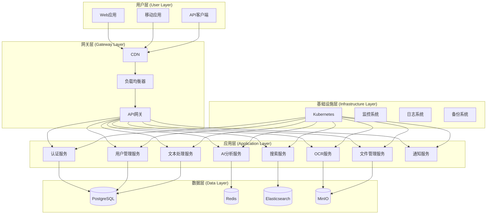
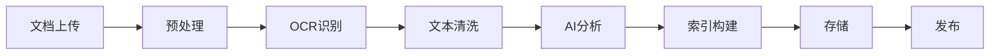

# 系统概览

## 1. 项目简介

历史文本漂洗项目是一个基于人工智能的历史文献数字化处理平台，旨在通过先进的OCR技术、自然语言处理和机器学习算法，将古籍、手稿、历史文档等传统纸质材料转换为高质量的数字化文本，并提供智能化的文本分析、检索和管理功能。

### 1.1 核心价值

- **文化传承**: 保护和传承珍贵的历史文献资料
- **学术研究**: 为历史学者和研究人员提供强大的研究工具
- **知识普及**: 让更多人能够接触和了解历史文献
- **技术创新**: 推动OCR和NLP技术在历史文献领域的应用

### 1.2 目标用户

- **历史学者和研究人员**: 进行学术研究和文献分析
- **图书馆和档案馆**: 进行文献数字化和管理
- **教育机构**: 用于教学和学习
- **文化爱好者**: 探索和学习历史文化

## 2. 系统架构概览

### 2.1 整体架构图

### 2.2 架构分层

#### 用户层 (User Layer)
- **Web应用**: 基于Vue.js的现代化Web界面
- **移动应用**: 支持iOS和Android的原生应用
- **API客户端**: 为第三方集成提供的SDK和工具

#### 网关层 (Gateway Layer)
- **CDN**: 全球内容分发网络，提升访问速度
- **负载均衡器**: 分发流量，确保高可用性
- **API网关**: 统一的API入口，处理认证、限流、监控

#### 应用层 (Application Layer)
- **认证服务**: JWT-based认证和授权
- **用户管理服务**: 用户信息和权限管理
- **文本处理服务**: 文本清洗、格式化和标准化
- **OCR服务**: 光学字符识别和图像处理
- **AI分析服务**: 自然语言处理和智能分析
- **搜索服务**: 全文搜索和语义检索
- **文件管理服务**: 文件上传、存储和管理
- **通知服务**: 消息推送和通知管理

#### 数据层 (Data Layer)
- **PostgreSQL**: 主要的关系型数据库
- **Redis**: 缓存和会话存储
- **Elasticsearch**: 搜索引擎和日志分析
- **MinIO**: 对象存储，用于文件和图像

#### 基础设施层 (Infrastructure Layer)
- **Kubernetes**: 容器编排和服务管理
- **监控系统**: Prometheus + Grafana
- **日志系统**: ELK Stack
- **备份系统**: 自动化备份和恢复

## 3. 核心功能模块

### 3.1 文档处理流水线

#### 3.1.1 文档上传
- 支持多种格式: PDF, JPEG, PNG, TIFF
- 批量上传和进度跟踪
- 文件完整性校验

#### 3.1.2 预处理
- 图像增强和去噪
- 页面分割和版面分析
- 文字区域检测

#### 3.1.3 OCR识别
- 多语言支持（中文、英文、日文等）
- 古文字识别优化
- 置信度评估

#### 3.1.4 文本清洗
- 错误字符修正
- 格式标准化
- 标点符号处理

#### 3.1.5 AI分析
- 命名实体识别
- 关键词提取
- 主题分类
- 情感分析

#### 3.1.6 索引构建
- 全文索引
- 语义索引
- 元数据索引

### 3.2 用户管理系统

- **用户注册和登录**: 支持邮箱、手机号、第三方登录
- **权限管理**: 基于角色的访问控制(RBAC)
- **用户画像**: 使用行为分析和个性化推荐
- **团队协作**: 支持团队创建和协作功能

### 3.3 搜索和检索系统

- **全文搜索**: 基于Elasticsearch的高性能搜索
- **语义搜索**: 基于向量相似度的语义检索
- **高级筛选**: 时间、地点、人物、主题等多维度筛选
- **搜索建议**: 智能搜索建议和自动补全

### 3.4 数据分析和可视化

- **统计分析**: 文档数量、处理进度、用户活跃度
- **趋势分析**: 历史数据趋势和预测
- **可视化图表**: 交互式图表和仪表板
- **报告生成**: 自动化报告生成和导出

## 4. 技术特性

### 4.1 高可用性

- **服务冗余**: 所有关键服务都有多个实例
- **故障转移**: 自动故障检测和切换
- **负载均衡**: 智能流量分发
- **健康检查**: 实时服务健康监控

### 4.2 可扩展性

- **水平扩展**: 支持服务实例的动态增减
- **微服务架构**: 服务间松耦合，独立部署
- **容器化**: 基于Docker和Kubernetes
- **弹性伸缩**: 根据负载自动调整资源

### 4.3 安全性

- **数据加密**: 传输和存储数据加密
- **访问控制**: 细粒度的权限管理
- **安全审计**: 完整的操作日志和审计
- **漏洞扫描**: 定期安全扫描和修复

### 4.4 性能优化

- **缓存策略**: 多层缓存提升响应速度
- **CDN加速**: 全球内容分发
- **数据库优化**: 索引优化和查询调优
- **异步处理**: 耗时操作异步执行

## 5. 部署环境

### 5.1 环境划分

| 环境 | 用途 | 配置 | 域名 |
|------|------|------|------|
| 开发环境 | 日常开发和测试 | 1核2G | dev.historical-text.local |
| 测试环境 | 集成测试和QA | 2核4G | test.historical-text.com |
| 预生产环境 | 生产前验证 | 4核8G | staging.historical-text.com |
| 生产环境 | 正式服务 | 8核16G+ | historical-text.com |

### 5.2 技术栈

#### 前端技术栈
- **框架**: Vue.js 3.x + TypeScript
- **UI库**: Element Plus / Ant Design Vue
- **状态管理**: Pinia
- **路由**: Vue Router
- **构建工具**: Vite

#### 后端技术栈
- **语言**: Python 3.11+ / Node.js 18+
- **框架**: FastAPI / Express.js
- **数据库**: PostgreSQL 15+
- **缓存**: Redis 7+
- **搜索**: Elasticsearch 8+
- **消息队列**: Apache Kafka / RabbitMQ

#### 基础设施
- **容器**: Docker
- **编排**: Kubernetes
- **监控**: Prometheus + Grafana
- **日志**: ELK Stack
- **CI/CD**: GitLab CI/CD

## 6. 质量保证

### 6.1 测试策略

- **单元测试**: 代码覆盖率 > 80%
- **集成测试**: API和服务间集成测试
- **端到端测试**: 完整业务流程测试
- **性能测试**: 负载测试和压力测试
- **安全测试**: 漏洞扫描和渗透测试

### 6.2 代码质量

- **代码规范**: ESLint, Prettier, Black
- **代码审查**: 强制性代码评审
- **静态分析**: SonarQube代码质量分析
- **依赖管理**: 定期更新和安全扫描

### 6.3 监控和告警

- **应用监控**: APM工具监控应用性能
- **基础设施监控**: 服务器和网络监控
- **业务监控**: 关键业务指标监控
- **告警机制**: 多渠道告警通知

## 7. 发展规划

### 7.1 短期目标 (3-6个月)

- 完成核心功能开发
- 建立CI/CD流水线
- 部署测试环境
- 进行内部测试

### 7.2 中期目标 (6-12个月)

- 上线生产环境
- 完善监控和运维体系
- 优化性能和用户体验
- 扩展用户群体

### 7.3 长期目标 (1-2年)

- 支持更多语言和文字
- 集成更多AI功能
- 建立开放平台
- 国际化扩展

---

**文档版本**: v1.0  
**最后更新**: 2024年1月  
**负责人**: 架构团队  
**审核人**: 技术总监