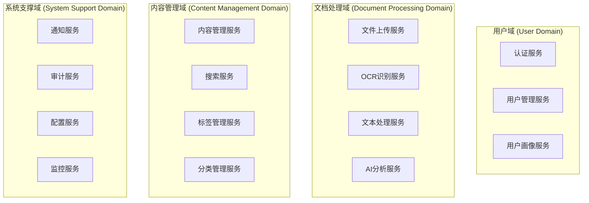
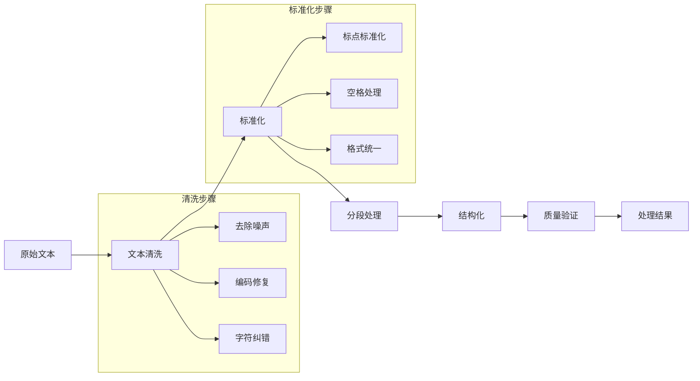
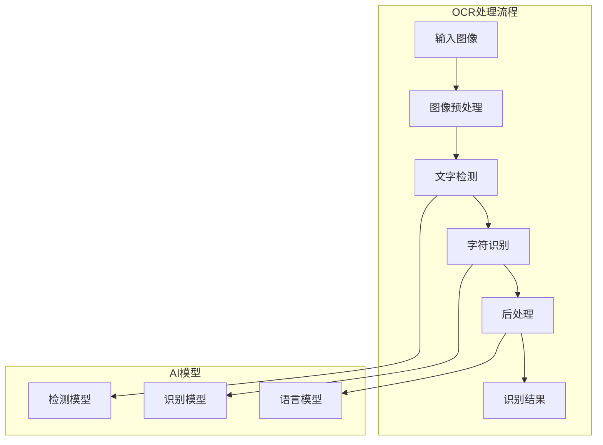

# 微服务架构

## 1. 微服务架构概述

历史文本漂洗项目采用微服务架构模式，将复杂的单体应用拆分为多个独立的、可部署的服务。每个微服务负责特定的业务功能，通过轻量级的通信机制进行协作。

### 1.1 微服务架构优势

- **独立部署**: 每个服务可以独立开发、测试和部署
- **技术多样性**: 不同服务可以使用最适合的技术栈
- **故障隔离**: 单个服务的故障不会影响整个系统
- **团队自治**: 小团队可以独立负责特定服务
- **弹性扩展**: 可以根据需求独立扩展特定服务

### 1.2 设计原则

- **单一职责**: 每个服务只负责一个业务领域
- **去中心化**: 避免单点故障和性能瓶颈
- **数据隔离**: 每个服务拥有独立的数据存储
- **接口标准化**: 使用统一的API规范
- **容错设计**: 具备故障恢复和降级能力

## 2. 服务拆分策略

### 2.1 按业务领域拆分



### 2.2 服务边界定义

| 服务名称 | 职责范围 | 数据边界 | 依赖关系 |
|----------|----------|----------|----------|
| 认证服务 | 用户认证、授权、令牌管理 | 用户凭证、权限信息 | 独立 |
| 用户管理服务 | 用户信息CRUD、角色管理 | 用户基本信息、角色权限 | 认证服务 |
| 文件上传服务 | 文件上传、存储、管理 | 文件元数据、存储路径 | 用户管理服务 |
| OCR识别服务 | 图像识别、文字提取 | OCR结果、置信度 | 文件上传服务 |
| 文本处理服务 | 文本清洗、格式化 | 处理后文本、处理日志 | OCR识别服务 |
| AI分析服务 | NLP分析、实体识别 | 分析结果、模型数据 | 文本处理服务 |
| 搜索服务 | 全文搜索、语义检索 | 搜索索引、查询日志 | 内容管理服务 |
| 通知服务 | 消息推送、邮件发送 | 通知记录、模板配置 | 用户管理服务 |

## 3. 核心微服务详细设计

### 3.1 认证服务 (Authentication Service)

#### 3.1.1 服务职责
- 用户登录认证
- JWT令牌生成和验证
- 权限检查和授权
- 第三方登录集成
- 密码策略管理

#### 3.1.2 API接口

```yaml
# 认证服务API
paths:
  /auth/login:
    post:
      summary: 用户登录
      requestBody:
        content:
          application/json:
            schema:
              type: object
              properties:
                username:
                  type: string
                password:
                  type: string
                captcha:
                  type: string
      responses:
        200:
          description: 登录成功
          content:
            application/json:
              schema:
                type: object
                properties:
                  access_token:
                    type: string
                  refresh_token:
                    type: string
                  expires_in:
                    type: integer
                  user_info:
                    type: object
  
  /auth/refresh:
    post:
      summary: 刷新令牌
      
  /auth/logout:
    post:
      summary: 用户登出
      
  /auth/verify:
    post:
      summary: 验证令牌
```

#### 3.1.3 数据模型

```python
# 用户认证相关数据模型
class User(BaseModel):
    id: UUID
    username: str
    email: str
    password_hash: str
    is_active: bool
    created_at: datetime
    updated_at: datetime

class UserSession(BaseModel):
    id: UUID
    user_id: UUID
    access_token: str
    refresh_token: str
    expires_at: datetime
    ip_address: str
    user_agent: str

class Permission(BaseModel):
    id: UUID
    name: str
    resource: str
    action: str
    description: str

class Role(BaseModel):
    id: UUID
    name: str
    description: str
    permissions: List[Permission]
```

### 3.2 文本处理服务 (Text Processing Service)

#### 3.2.1 服务职责
- 文本清洗和标准化
- 格式转换和编码处理
- 文本分段和结构化
- 质量评估和错误检测
- 文本版本管理

#### 3.2.2 处理流水线



#### 3.2.3 API接口

```python
# 文本处理服务API
from fastapi import FastAPI, BackgroundTasks
from pydantic import BaseModel
from typing import List, Optional

app = FastAPI(title="Text Processing Service")

class TextProcessingRequest(BaseModel):
    text: str
    source_type: str  # ocr, manual, import
    processing_options: dict
    callback_url: Optional[str] = None

class TextProcessingResult(BaseModel):
    processed_text: str
    quality_score: float
    processing_steps: List[str]
    errors: List[str]
    metadata: dict

@app.post("/process", response_model=TextProcessingResult)
async def process_text(
    request: TextProcessingRequest,
    background_tasks: BackgroundTasks
):
    """处理文本"""
    # 异步处理逻辑
    pass

@app.get("/status/{task_id}")
async def get_processing_status(task_id: str):
    """获取处理状态"""
    pass

@app.post("/batch")
async def batch_process(texts: List[TextProcessingRequest]):
    """批量处理文本"""
    pass
```

### 3.3 OCR识别服务 (OCR Service)

#### 3.3.1 服务职责
- 图像预处理和增强
- 文字区域检测
- 字符识别和转换
- 置信度评估
- 多语言支持

#### 3.3.2 技术架构



#### 3.3.3 数据模型

```python
class OCRRequest(BaseModel):
    image_url: str
    language: str = "zh-cn"
    options: dict = {}

class OCRResult(BaseModel):
    text: str
    confidence: float
    bounding_boxes: List[dict]
    processing_time: float
    language_detected: str
    
class TextRegion(BaseModel):
    text: str
    confidence: float
    bbox: dict  # {x, y, width, height}
    line_number: int
    
class OCRTask(BaseModel):
    id: UUID
    image_id: UUID
    status: str  # pending, processing, completed, failed
    result: Optional[OCRResult]
    created_at: datetime
    completed_at: Optional[datetime]
```

### 3.4 AI分析服务 (AI Analysis Service)

#### 3.4.1 服务职责
- 命名实体识别 (NER)
- 关键词提取
- 主题分类
- 情感分析
- 语义相似度计算

#### 3.4.2 AI模型管理

```python
class AIModel(BaseModel):
    id: UUID
    name: str
    type: str  # ner, classification, sentiment, etc.
    version: str
    model_path: str
    config: dict
    performance_metrics: dict
    
class AnalysisTask(BaseModel):
    id: UUID
    text_id: UUID
    analysis_type: str
    model_id: UUID
    status: str
    result: Optional[dict]
    
class NERResult(BaseModel):
    entities: List[dict]  # {text, label, start, end, confidence}
    
class ClassificationResult(BaseModel):
    categories: List[dict]  # {label, confidence}
    
class SentimentResult(BaseModel):
    sentiment: str  # positive, negative, neutral
    confidence: float
    scores: dict  # {positive: 0.1, negative: 0.2, neutral: 0.7}
```

## 4. 服务间通信

### 4.1 通信模式

#### 4.1.1 同步通信 (HTTP/REST)

```python
# 服务间HTTP调用示例
import httpx
from typing import Optional

class ServiceClient:
    def __init__(self, base_url: str, timeout: int = 30):
        self.base_url = base_url
        self.client = httpx.AsyncClient(timeout=timeout)
    
    async def call_service(self, endpoint: str, data: dict) -> Optional[dict]:
        """调用其他服务"""
        try:
            response = await self.client.post(
                f"{self.base_url}{endpoint}",
                json=data,
                headers={"Authorization": "Bearer {token}"}
            )
            response.raise_for_status()
            return response.json()
        except httpx.HTTPError as e:
            # 处理错误和重试逻辑
            logger.error(f"Service call failed: {e}")
            return None

# 使用示例
user_service = ServiceClient("http://user-service:8000")
ocr_service = ServiceClient("http://ocr-service:8001")
```

#### 4.1.2 异步通信 (消息队列)

```python
# 基于Kafka的异步消息处理
from kafka import KafkaProducer, KafkaConsumer
import json

class MessageProducer:
    def __init__(self, bootstrap_servers: List[str]):
        self.producer = KafkaProducer(
            bootstrap_servers=bootstrap_servers,
            value_serializer=lambda v: json.dumps(v).encode('utf-8')
        )
    
    async def send_message(self, topic: str, message: dict):
        """发送异步消息"""
        self.producer.send(topic, message)
        self.producer.flush()

class MessageConsumer:
    def __init__(self, bootstrap_servers: List[str], group_id: str):
        self.consumer = KafkaConsumer(
            bootstrap_servers=bootstrap_servers,
            group_id=group_id,
            value_deserializer=lambda m: json.loads(m.decode('utf-8'))
        )
    
    async def consume_messages(self, topics: List[str]):
        """消费消息"""
        self.consumer.subscribe(topics)
        for message in self.consumer:
            await self.process_message(message.value)
    
    async def process_message(self, message: dict):
        """处理消息"""
        # 具体的消息处理逻辑
        pass
```

### 4.2 服务发现

```yaml
# Kubernetes服务发现配置
apiVersion: v1
kind: Service
metadata:
  name: text-processing-service
  labels:
    app: text-processing
spec:
  selector:
    app: text-processing
  ports:
  - port: 8000
    targetPort: 8000
  type: ClusterIP
---
apiVersion: v1
kind: Endpoints
metadata:
  name: text-processing-service
subsets:
- addresses:
  - ip: 10.0.0.1
  - ip: 10.0.0.2
  ports:
  - port: 8000
```

### 4.3 负载均衡和故障处理

```python
# 带有重试和熔断的服务调用
from tenacity import retry, stop_after_attempt, wait_exponential
from circuit_breaker import CircuitBreaker

class ResilientServiceClient:
    def __init__(self, service_urls: List[str]):
        self.service_urls = service_urls
        self.circuit_breaker = CircuitBreaker(
            failure_threshold=5,
            recovery_timeout=30
        )
    
    @retry(
        stop=stop_after_attempt(3),
        wait=wait_exponential(multiplier=1, min=4, max=10)
    )
    async def call_with_retry(self, endpoint: str, data: dict):
        """带重试的服务调用"""
        if self.circuit_breaker.is_open:
            raise Exception("Circuit breaker is open")
        
        try:
            # 负载均衡选择服务实例
            service_url = self.select_service_instance()
            response = await self.make_request(service_url, endpoint, data)
            self.circuit_breaker.record_success()
            return response
        except Exception as e:
            self.circuit_breaker.record_failure()
            raise e
    
    def select_service_instance(self) -> str:
        """简单的轮询负载均衡"""
        # 实现负载均衡算法
        pass
```

## 5. 数据一致性

### 5.1 分布式事务

#### 5.1.1 Saga模式

```python
# Saga事务协调器
class SagaOrchestrator:
    def __init__(self):
        self.steps = []
        self.compensations = []
    
    async def execute_saga(self, saga_definition: dict):
        """执行Saga事务"""
        executed_steps = []
        
        try:
            for step in saga_definition['steps']:
                result = await self.execute_step(step)
                executed_steps.append((step, result))
                
            return {"status": "success", "results": executed_steps}
            
        except Exception as e:
            # 执行补偿操作
            await self.compensate(executed_steps)
            return {"status": "failed", "error": str(e)}
    
    async def compensate(self, executed_steps: List):
        """执行补偿操作"""
        for step, result in reversed(executed_steps):
            try:
                await self.execute_compensation(step, result)
            except Exception as e:
                logger.error(f"Compensation failed: {e}")

# 使用示例：文档处理Saga
document_processing_saga = {
    "steps": [
        {"service": "upload-service", "action": "upload_file"},
        {"service": "ocr-service", "action": "extract_text"},
        {"service": "text-service", "action": "process_text"},
        {"service": "ai-service", "action": "analyze_text"},
        {"service": "search-service", "action": "index_document"}
    ]
}
```

### 5.2 事件溯源

```python
# 事件溯源模式
class Event(BaseModel):
    id: UUID
    aggregate_id: UUID
    event_type: str
    event_data: dict
    version: int
    timestamp: datetime

class EventStore:
    async def append_event(self, event: Event):
        """追加事件"""
        # 存储事件到事件存储
        pass
    
    async def get_events(self, aggregate_id: UUID, from_version: int = 0) -> List[Event]:
        """获取聚合的所有事件"""
        # 从事件存储获取事件
        pass

class DocumentAggregate:
    def __init__(self, document_id: UUID):
        self.id = document_id
        self.version = 0
        self.events = []
    
    def upload_document(self, file_path: str, user_id: UUID):
        """上传文档"""
        event = Event(
            id=uuid4(),
            aggregate_id=self.id,
            event_type="DocumentUploaded",
            event_data={"file_path": file_path, "user_id": str(user_id)},
            version=self.version + 1,
            timestamp=datetime.utcnow()
        )
        self.apply_event(event)
    
    def apply_event(self, event: Event):
        """应用事件"""
        self.events.append(event)
        self.version = event.version
        # 更新聚合状态
```

## 6. 监控和可观测性

### 6.1 分布式追踪

```python
# 使用OpenTelemetry进行分布式追踪
from opentelemetry import trace
from opentelemetry.exporter.jaeger.thrift import JaegerExporter
from opentelemetry.sdk.trace import TracerProvider
from opentelemetry.sdk.trace.export import BatchSpanProcessor

# 配置追踪
trace.set_tracer_provider(TracerProvider())
tracer = trace.get_tracer(__name__)

jaeger_exporter = JaegerExporter(
    agent_host_name="jaeger-agent",
    agent_port=6831,
)

span_processor = BatchSpanProcessor(jaeger_exporter)
trace.get_tracer_provider().add_span_processor(span_processor)

# 在服务中使用追踪
@app.post("/process")
async def process_document(request: ProcessRequest):
    with tracer.start_as_current_span("process_document") as span:
        span.set_attribute("document.id", request.document_id)
        span.set_attribute("user.id", request.user_id)
        
        # 调用其他服务
        with tracer.start_as_current_span("call_ocr_service") as ocr_span:
            ocr_result = await ocr_service.extract_text(request.image_url)
            ocr_span.set_attribute("ocr.confidence", ocr_result.confidence)
        
        return {"status": "success"}
```

### 6.2 指标收集

```python
# Prometheus指标收集
from prometheus_client import Counter, Histogram, Gauge, start_http_server

# 定义指标
REQUEST_COUNT = Counter(
    'http_requests_total',
    'Total HTTP requests',
    ['method', 'endpoint', 'status']
)

REQUEST_DURATION = Histogram(
    'http_request_duration_seconds',
    'HTTP request duration',
    ['method', 'endpoint']
)

ACTIVE_CONNECTIONS = Gauge(
    'active_connections',
    'Active connections'
)

# 在中间件中收集指标
@app.middleware("http")
async def metrics_middleware(request: Request, call_next):
    start_time = time.time()
    
    response = await call_next(request)
    
    duration = time.time() - start_time
    REQUEST_COUNT.labels(
        method=request.method,
        endpoint=request.url.path,
        status=response.status_code
    ).inc()
    
    REQUEST_DURATION.labels(
        method=request.method,
        endpoint=request.url.path
    ).observe(duration)
    
    return response
```

## 7. 安全考虑

### 7.1 服务间认证

```python
# JWT服务间认证
from jose import jwt, JWTError
from datetime import datetime, timedelta

class ServiceAuthenticator:
    def __init__(self, secret_key: str, algorithm: str = "HS256"):
        self.secret_key = secret_key
        self.algorithm = algorithm
    
    def create_service_token(self, service_name: str, expires_delta: timedelta = None) -> str:
        """创建服务间认证令牌"""
        if expires_delta:
            expire = datetime.utcnow() + expires_delta
        else:
            expire = datetime.utcnow() + timedelta(hours=1)
        
        to_encode = {
            "sub": service_name,
            "exp": expire,
            "type": "service"
        }
        
        return jwt.encode(to_encode, self.secret_key, algorithm=self.algorithm)
    
    def verify_service_token(self, token: str) -> dict:
        """验证服务间认证令牌"""
        try:
            payload = jwt.decode(token, self.secret_key, algorithms=[self.algorithm])
            if payload.get("type") != "service":
                raise JWTError("Invalid token type")
            return payload
        except JWTError:
            raise HTTPException(status_code=401, detail="Invalid service token")

# 服务间调用中间件
@app.middleware("http")
async def service_auth_middleware(request: Request, call_next):
    if request.url.path.startswith("/internal/"):
        auth_header = request.headers.get("Authorization")
        if not auth_header or not auth_header.startswith("Bearer "):
            return JSONResponse(
                status_code=401,
                content={"detail": "Missing service authentication"}
            )
        
        token = auth_header.split(" ")[1]
        try:
            authenticator.verify_service_token(token)
        except HTTPException:
            return JSONResponse(
                status_code=401,
                content={"detail": "Invalid service token"}
            )
    
    return await call_next(request)
```

### 7.2 API限流

```python
# Redis-based rate limiting
from redis import Redis
from fastapi import HTTPException
import time

class RateLimiter:
    def __init__(self, redis_client: Redis):
        self.redis = redis_client
    
    async def check_rate_limit(self, key: str, limit: int, window: int) -> bool:
        """检查速率限制"""
        current_time = int(time.time())
        window_start = current_time - window
        
        # 使用滑动窗口算法
        pipe = self.redis.pipeline()
        pipe.zremrangebyscore(key, 0, window_start)
        pipe.zcard(key)
        pipe.zadd(key, {str(current_time): current_time})
        pipe.expire(key, window)
        
        results = pipe.execute()
        current_requests = results[1]
        
        return current_requests < limit

# 限流装饰器
def rate_limit(limit: int, window: int):
    def decorator(func):
        async def wrapper(request: Request, *args, **kwargs):
            client_ip = request.client.host
            key = f"rate_limit:{client_ip}:{request.url.path}"
            
            if not await rate_limiter.check_rate_limit(key, limit, window):
                raise HTTPException(
                    status_code=429,
                    detail="Rate limit exceeded"
                )
            
            return await func(request, *args, **kwargs)
        return wrapper
    return decorator

# 使用示例
@app.post("/api/process")
@rate_limit(limit=100, window=3600)  # 每小时100次
async def process_endpoint(request: Request):
    # 处理逻辑
    pass
```

## 8. 部署和运维

### 8.1 容器化配置

```dockerfile
# 微服务Dockerfile示例
FROM python:3.11-slim

WORKDIR /app

# 安装依赖
COPY requirements.txt .
RUN pip install --no-cache-dir -r requirements.txt

# 复制应用代码
COPY . .

# 创建非root用户
RUN useradd --create-home --shell /bin/bash app
USER app

# 健康检查
HEALTHCHECK --interval=30s --timeout=10s --start-period=5s --retries=3 \
    CMD curl -f http://localhost:8000/health || exit 1

# 启动应用
CMD ["uvicorn", "main:app", "--host", "0.0.0.0", "--port", "8000"]
```

### 8.2 Kubernetes部署

```yaml
# 微服务Kubernetes部署配置
apiVersion: apps/v1
kind: Deployment
metadata:
  name: text-processing-service
  labels:
    app: text-processing
    version: v1.0.0
spec:
  replicas: 3
  selector:
    matchLabels:
      app: text-processing
  template:
    metadata:
      labels:
        app: text-processing
        version: v1.0.0
    spec:
      containers:
      - name: text-processing
        image: historical-text/text-processing:v1.0.0
        ports:
        - containerPort: 8000
        env:
        - name: DATABASE_URL
          valueFrom:
            secretKeyRef:
              name: db-secret
              key: url
        - name: REDIS_URL
          valueFrom:
            configMapKeyRef:
              name: redis-config
              key: url
        resources:
          requests:
            cpu: 500m
            memory: 1Gi
          limits:
            cpu: 2000m
            memory: 4Gi
        livenessProbe:
          httpGet:
            path: /health
            port: 8000
          initialDelaySeconds: 30
          periodSeconds: 10
        readinessProbe:
          httpGet:
            path: /ready
            port: 8000
          initialDelaySeconds: 5
          periodSeconds: 5
```

---

**文档版本**: v1.0  
**最后更新**: 2024年1月  
**负责人**: 架构团队  
**审核人**: 技术总监