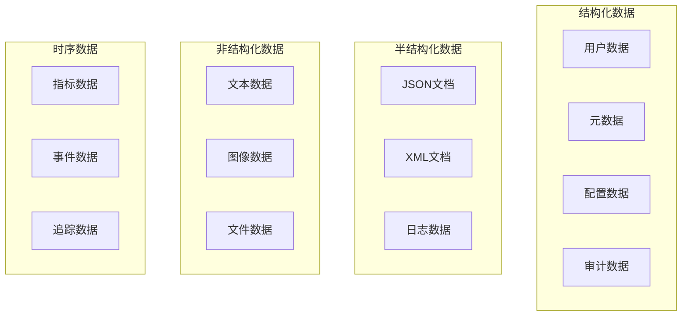
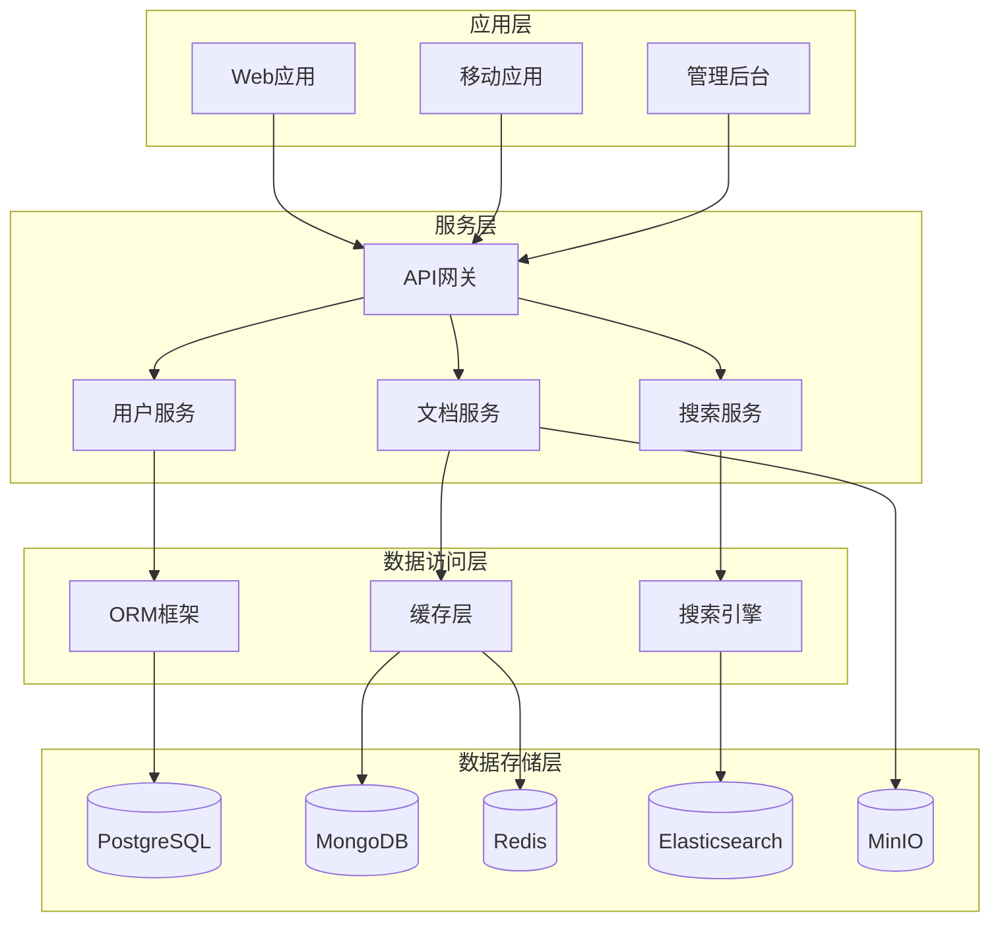
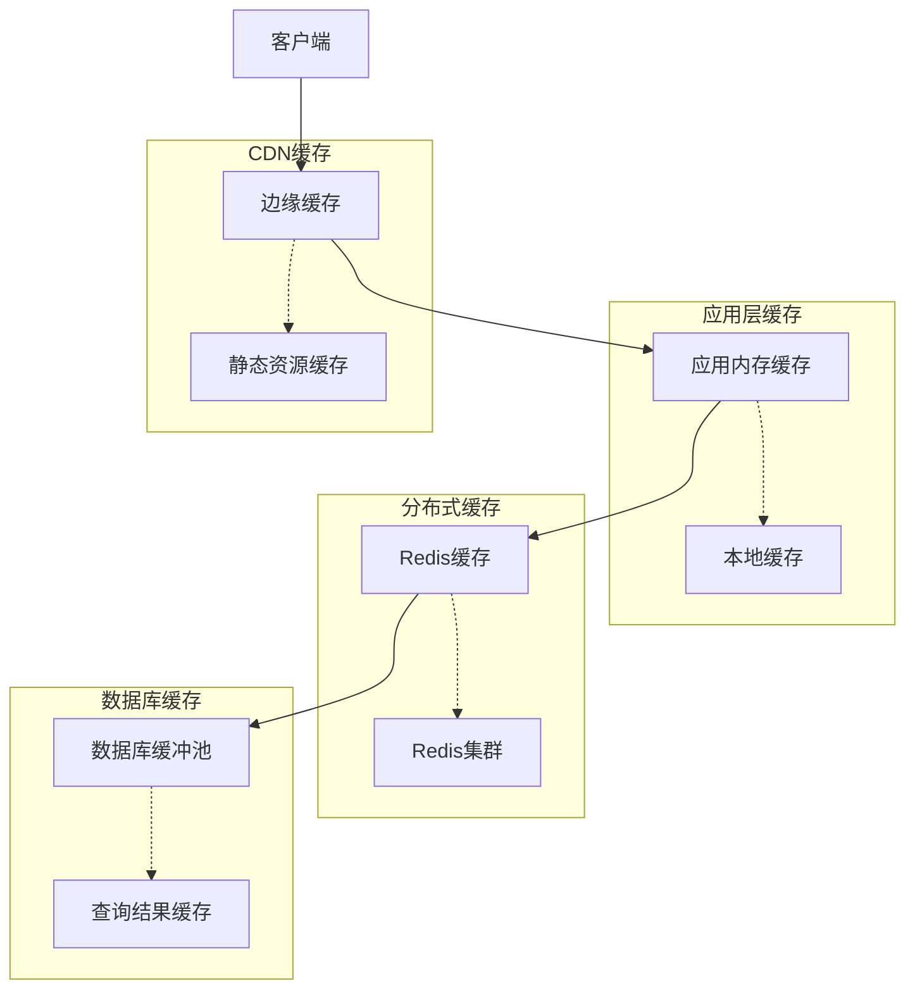
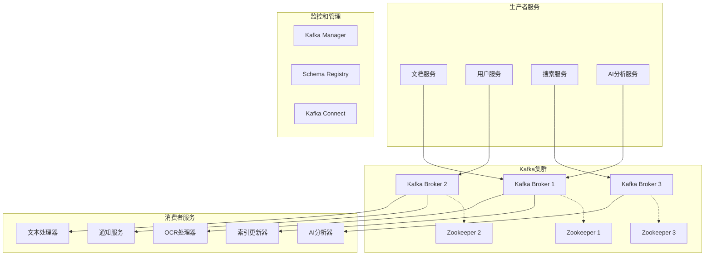
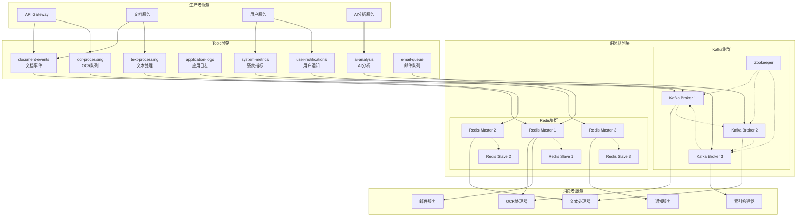
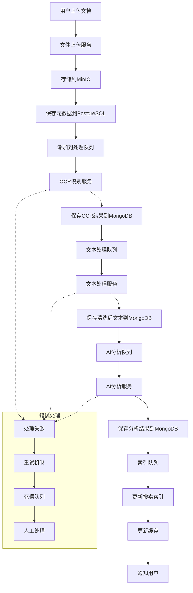

# 数据架构

## 1. 数据架构概述

历史文本漂洗项目的数据架构采用多层次、多存储的设计模式，支持结构化数据、非结构化数据和大数据的统一管理。通过合理的数据分层和存储选型，确保系统的高性能、高可用性和可扩展性。

### 1.1 设计原则

- **数据分层**: 按照数据的生命周期和访问模式进行分层存储
- **存储选型**: 根据数据特性选择最适合的存储技术
- **数据一致性**: 保证分布式环境下的数据一致性
- **数据安全**: 实施全面的数据安全和隐私保护
- **性能优化**: 通过索引、缓存等技术优化数据访问性能

### 1.2 数据分类



## 2. 数据存储架构

### 2.1 存储技术选型

| 数据类型 | 存储技术 | 使用场景 | 特点 |
|----------|----------|----------|------|
| 关系型数据 | PostgreSQL | 用户信息、权限管理、元数据 | ACID特性、复杂查询 |
| 文档数据 | MongoDB | 文本内容、处理结果、配置 | 灵活schema、水平扩展 |
| 缓存数据 | Redis | 会话、临时数据、计数器 | 高性能、内存存储 |
| 搜索数据 | Elasticsearch | 全文搜索、日志分析 | 全文检索、实时分析 |
| 对象存储 | MinIO | 文件、图像、备份 | 分布式、S3兼容 |
| 时序数据 | InfluxDB | 监控指标、性能数据 | 时序优化、压缩存储 |
| 图数据 | Neo4j | 关系分析、知识图谱 | 图查询、关系挖掘 |

### 2.2 数据分层架构



## 3. 核心数据模型

### 3.1 用户域数据模型

```sql
-- 用户表
CREATE TABLE users (
    id UUID PRIMARY KEY DEFAULT gen_random_uuid(),
    username VARCHAR(50) UNIQUE NOT NULL,
    email VARCHAR(100) UNIQUE NOT NULL,
    password_hash VARCHAR(255) NOT NULL,
    full_name VARCHAR(100),
    avatar_url VARCHAR(500),
    is_active BOOLEAN DEFAULT true,
    is_verified BOOLEAN DEFAULT false,
    last_login_at TIMESTAMP WITH TIME ZONE,
    created_at TIMESTAMP WITH TIME ZONE DEFAULT CURRENT_TIMESTAMP,
    updated_at TIMESTAMP WITH TIME ZONE DEFAULT CURRENT_TIMESTAMP
);

-- 角色表
CREATE TABLE roles (
    id UUID PRIMARY KEY DEFAULT gen_random_uuid(),
    name VARCHAR(50) UNIQUE NOT NULL,
    description TEXT,
    is_system BOOLEAN DEFAULT false,
    created_at TIMESTAMP WITH TIME ZONE DEFAULT CURRENT_TIMESTAMP
);

-- 权限表
CREATE TABLE permissions (
    id UUID PRIMARY KEY DEFAULT gen_random_uuid(),
    name VARCHAR(100) UNIQUE NOT NULL,
    resource VARCHAR(50) NOT NULL,
    action VARCHAR(50) NOT NULL,
    description TEXT,
    created_at TIMESTAMP WITH TIME ZONE DEFAULT CURRENT_TIMESTAMP
);

-- 用户角色关联表
CREATE TABLE user_roles (
    user_id UUID REFERENCES users(id) ON DELETE CASCADE,
    role_id UUID REFERENCES roles(id) ON DELETE CASCADE,
    assigned_at TIMESTAMP WITH TIME ZONE DEFAULT CURRENT_TIMESTAMP,
    assigned_by UUID REFERENCES users(id),
    PRIMARY KEY (user_id, role_id)
);

-- 角色权限关联表
CREATE TABLE role_permissions (
    role_id UUID REFERENCES roles(id) ON DELETE CASCADE,
    permission_id UUID REFERENCES permissions(id) ON DELETE CASCADE,
    PRIMARY KEY (role_id, permission_id)
);

-- 用户会话表
CREATE TABLE user_sessions (
    id UUID PRIMARY KEY DEFAULT gen_random_uuid(),
    user_id UUID REFERENCES users(id) ON DELETE CASCADE,
    access_token_hash VARCHAR(255) NOT NULL,
    refresh_token_hash VARCHAR(255),
    ip_address INET,
    user_agent TEXT,
    expires_at TIMESTAMP WITH TIME ZONE NOT NULL,
    created_at TIMESTAMP WITH TIME ZONE DEFAULT CURRENT_TIMESTAMP,
    last_accessed_at TIMESTAMP WITH TIME ZONE DEFAULT CURRENT_TIMESTAMP
);

-- 创建索引
CREATE INDEX idx_users_email ON users(email);
CREATE INDEX idx_users_username ON users(username);
CREATE INDEX idx_user_sessions_user_id ON user_sessions(user_id);
CREATE INDEX idx_user_sessions_expires_at ON user_sessions(expires_at);
```

### 3.2 文档域数据模型

```sql
-- 文档表
CREATE TABLE documents (
    id UUID PRIMARY KEY DEFAULT gen_random_uuid(),
    title VARCHAR(500) NOT NULL,
    description TEXT,
    original_filename VARCHAR(255),
    file_size BIGINT,
    file_type VARCHAR(50),
    file_path VARCHAR(1000),
    thumbnail_path VARCHAR(1000),
    owner_id UUID REFERENCES users(id) NOT NULL,
    status VARCHAR(20) DEFAULT 'uploaded', -- uploaded, processing, completed, failed
    language VARCHAR(10) DEFAULT 'zh-cn',
    created_at TIMESTAMP WITH TIME ZONE DEFAULT CURRENT_TIMESTAMP,
    updated_at TIMESTAMP WITH TIME ZONE DEFAULT CURRENT_TIMESTAMP,
    processed_at TIMESTAMP WITH TIME ZONE
);

-- 文档版本表
CREATE TABLE document_versions (
    id UUID PRIMARY KEY DEFAULT gen_random_uuid(),
    document_id UUID REFERENCES documents(id) ON DELETE CASCADE,
    version_number INTEGER NOT NULL,
    content_path VARCHAR(1000),
    processing_config JSONB,
    created_by UUID REFERENCES users(id),
    created_at TIMESTAMP WITH TIME ZONE DEFAULT CURRENT_TIMESTAMP,
    UNIQUE(document_id, version_number)
);

-- 文档标签表
CREATE TABLE tags (
    id UUID PRIMARY KEY DEFAULT gen_random_uuid(),
    name VARCHAR(100) UNIQUE NOT NULL,
    color VARCHAR(7), -- HEX color code
    description TEXT,
    created_by UUID REFERENCES users(id),
    created_at TIMESTAMP WITH TIME ZONE DEFAULT CURRENT_TIMESTAMP
);

-- 文档标签关联表
CREATE TABLE document_tags (
    document_id UUID REFERENCES documents(id) ON DELETE CASCADE,
    tag_id UUID REFERENCES tags(id) ON DELETE CASCADE,
    tagged_by UUID REFERENCES users(id),
    tagged_at TIMESTAMP WITH TIME ZONE DEFAULT CURRENT_TIMESTAMP,
    PRIMARY KEY (document_id, tag_id)
);

-- 文档分类表
CREATE TABLE categories (
    id UUID PRIMARY KEY DEFAULT gen_random_uuid(),
    name VARCHAR(100) NOT NULL,
    parent_id UUID REFERENCES categories(id),
    path VARCHAR(500), -- 分类路径，如 "/历史/明朝/政治"
    level INTEGER DEFAULT 0,
    sort_order INTEGER DEFAULT 0,
    description TEXT,
    created_at TIMESTAMP WITH TIME ZONE DEFAULT CURRENT_TIMESTAMP
);

-- 文档分类关联表
CREATE TABLE document_categories (
    document_id UUID REFERENCES documents(id) ON DELETE CASCADE,
    category_id UUID REFERENCES categories(id) ON DELETE CASCADE,
    confidence DECIMAL(3,2), -- AI分类的置信度
    assigned_by UUID REFERENCES users(id),
    assigned_at TIMESTAMP WITH TIME ZONE DEFAULT CURRENT_TIMESTAMP,
    PRIMARY KEY (document_id, category_id)
);

-- 创建索引
CREATE INDEX idx_documents_owner_id ON documents(owner_id);
CREATE INDEX idx_documents_status ON documents(status);
CREATE INDEX idx_documents_created_at ON documents(created_at);
CREATE INDEX idx_document_versions_document_id ON document_versions(document_id);
CREATE INDEX idx_categories_parent_id ON categories(parent_id);
CREATE INDEX idx_categories_path ON categories USING gin(path gin_trgm_ops);
```

### 3.3 处理任务数据模型

```sql
-- 处理任务表
CREATE TABLE processing_tasks (
    id UUID PRIMARY KEY DEFAULT gen_random_uuid(),
    document_id UUID REFERENCES documents(id) ON DELETE CASCADE,
    task_type VARCHAR(50) NOT NULL, -- ocr, text_processing, ai_analysis
    status VARCHAR(20) DEFAULT 'pending', -- pending, running, completed, failed, cancelled
    priority INTEGER DEFAULT 5, -- 1-10, 1为最高优先级
    config JSONB, -- 任务配置参数
    result JSONB, -- 任务结果
    error_message TEXT,
    progress INTEGER DEFAULT 0, -- 0-100
    started_at TIMESTAMP WITH TIME ZONE,
    completed_at TIMESTAMP WITH TIME ZONE,
    created_by UUID REFERENCES users(id),
    created_at TIMESTAMP WITH TIME ZONE DEFAULT CURRENT_TIMESTAMP,
    updated_at TIMESTAMP WITH TIME ZONE DEFAULT CURRENT_TIMESTAMP
);

-- 任务依赖关系表
CREATE TABLE task_dependencies (
    id UUID PRIMARY KEY DEFAULT gen_random_uuid(),
    task_id UUID REFERENCES processing_tasks(id) ON DELETE CASCADE,
    depends_on_task_id UUID REFERENCES processing_tasks(id) ON DELETE CASCADE,
    created_at TIMESTAMP WITH TIME ZONE DEFAULT CURRENT_TIMESTAMP,
    UNIQUE(task_id, depends_on_task_id)
);

-- 任务执行日志表
CREATE TABLE task_logs (
    id UUID PRIMARY KEY DEFAULT gen_random_uuid(),
    task_id UUID REFERENCES processing_tasks(id) ON DELETE CASCADE,
    level VARCHAR(10) NOT NULL, -- DEBUG, INFO, WARN, ERROR
    message TEXT NOT NULL,
    context JSONB,
    created_at TIMESTAMP WITH TIME ZONE DEFAULT CURRENT_TIMESTAMP
);

-- 创建索引
CREATE INDEX idx_processing_tasks_document_id ON processing_tasks(document_id);
CREATE INDEX idx_processing_tasks_status ON processing_tasks(status);
CREATE INDEX idx_processing_tasks_created_at ON processing_tasks(created_at);
CREATE INDEX idx_task_logs_task_id ON task_logs(task_id);
CREATE INDEX idx_task_logs_level ON task_logs(level);
```

## 4. MongoDB文档模型

### 4.1 文档内容存储

```javascript
// 文档内容集合
db.document_contents.createIndex({ "document_id": 1 })
db.document_contents.createIndex({ "version": 1 })
db.document_contents.createIndex({ "created_at": -1 })

// 文档内容结构
{
  "_id": ObjectId("..."),
  "document_id": "uuid-string",
  "version": 1,
  "content_type": "processed_text", // raw_text, processed_text, ocr_result
  "content": {
    "text": "处理后的文本内容...",
    "paragraphs": [
      {
        "id": 1,
        "text": "段落内容...",
        "confidence": 0.95,
        "bbox": {"x": 100, "y": 200, "width": 300, "height": 50}
      }
    ],
    "metadata": {
      "word_count": 1500,
      "character_count": 4500,
      "language": "zh-cn",
      "encoding": "utf-8"
    }
  },
  "processing_info": {
    "ocr_engine": "tesseract",
    "ocr_version": "5.0",
    "processing_time": 15.5,
    "quality_score": 0.92
  },
  "created_at": ISODate("2024-01-01T00:00:00Z"),
  "updated_at": ISODate("2024-01-01T00:00:00Z")
}
```

### 4.2 AI分析结果存储

```javascript
// AI分析结果集合
db.ai_analysis_results.createIndex({ "document_id": 1 })
db.ai_analysis_results.createIndex({ "analysis_type": 1 })
db.ai_analysis_results.createIndex({ "created_at": -1 })

// AI分析结果结构
{
  "_id": ObjectId("..."),
  "document_id": "uuid-string",
  "analysis_type": "ner", // ner, sentiment, classification, keyword_extraction
  "model_info": {
    "model_name": "bert-base-chinese",
    "model_version": "1.0.0",
    "confidence_threshold": 0.8
  },
  "results": {
    "entities": [
      {
        "text": "明朝",
        "label": "DYNASTY",
        "start": 10,
        "end": 12,
        "confidence": 0.95
      },
      {
        "text": "朱元璋",
        "label": "PERSON",
        "start": 20,
        "end": 23,
        "confidence": 0.98
      }
    ],
    "summary": {
      "total_entities": 25,
      "entity_types": {
        "PERSON": 8,
        "DYNASTY": 3,
        "LOCATION": 7,
        "DATE": 7
      }
    }
  },
  "processing_time": 2.3,
  "created_at": ISODate("2024-01-01T00:00:00Z")
}
```

### 4.3 用户行为数据

```javascript
// 用户行为集合
db.user_activities.createIndex({ "user_id": 1, "timestamp": -1 })
db.user_activities.createIndex({ "activity_type": 1 })
db.user_activities.createIndex({ "timestamp": -1 })

// 用户行为结构
{
  "_id": ObjectId("..."),
  "user_id": "uuid-string",
  "session_id": "session-uuid",
  "activity_type": "document_view", // login, logout, document_upload, document_view, search
  "resource_type": "document",
  "resource_id": "document-uuid",
  "details": {
    "document_title": "历史文档标题",
    "view_duration": 120, // 秒
    "scroll_depth": 0.8, // 滚动深度百分比
    "interactions": [
      {
        "type": "highlight",
        "text": "重要内容",
        "timestamp": ISODate("2024-01-01T00:05:00Z")
      }
    ]
  },
  "metadata": {
    "ip_address": "192.168.1.100",
    "user_agent": "Mozilla/5.0...",
    "referrer": "https://example.com/search"
  },
  "timestamp": ISODate("2024-01-01T00:00:00Z")
}
```

## 5. 缓存策略

### 5.1 Redis缓存设计

```python
# Redis缓存键设计规范
class CacheKeys:
    # 用户相关缓存
    USER_INFO = "user:info:{user_id}"  # 用户基本信息
    USER_PERMISSIONS = "user:permissions:{user_id}"  # 用户权限
    USER_SESSION = "session:{session_id}"  # 用户会话
    
    # 文档相关缓存
    DOCUMENT_INFO = "doc:info:{document_id}"  # 文档基本信息
    DOCUMENT_CONTENT = "doc:content:{document_id}:{version}"  # 文档内容
    DOCUMENT_SEARCH_RESULT = "search:doc:{query_hash}"  # 搜索结果
    
    # 处理任务缓存
    TASK_STATUS = "task:status:{task_id}"  # 任务状态
    TASK_QUEUE = "queue:tasks:{priority}"  # 任务队列
    
    # 统计数据缓存
    STATS_DAILY = "stats:daily:{date}"  # 日统计
    STATS_USER_ACTIVITY = "stats:user:{user_id}:{date}"  # 用户活动统计

# 缓存管理器
class CacheManager:
    def __init__(self, redis_client):
        self.redis = redis_client
        self.default_ttl = 3600  # 1小时
    
    async def get_user_info(self, user_id: str) -> Optional[dict]:
        """获取用户信息缓存"""
        key = CacheKeys.USER_INFO.format(user_id=user_id)
        data = await self.redis.get(key)
        if data:
            return json.loads(data)
        return None
    
    async def set_user_info(self, user_id: str, user_info: dict, ttl: int = None):
        """设置用户信息缓存"""
        key = CacheKeys.USER_INFO.format(user_id=user_id)
        ttl = ttl or self.default_ttl
        await self.redis.setex(key, ttl, json.dumps(user_info))
    
    async def invalidate_user_cache(self, user_id: str):
        """清除用户相关缓存"""
        patterns = [
            CacheKeys.USER_INFO.format(user_id=user_id),
            CacheKeys.USER_PERMISSIONS.format(user_id=user_id),
            f"stats:user:{user_id}:*"
        ]
        
        for pattern in patterns:
            if '*' in pattern:
                keys = await self.redis.keys(pattern)
                if keys:
                    await self.redis.delete(*keys)
            else:
                await self.redis.delete(pattern)
```

### 5.2 多级缓存架构



## 6. 搜索引擎设计

### 6.1 Elasticsearch索引设计

```json
{
  "mappings": {
    "properties": {
      "document_id": {
        "type": "keyword"
      },
      "title": {
        "type": "text",
        "analyzer": "ik_max_word",
        "search_analyzer": "ik_smart",
        "fields": {
          "keyword": {
            "type": "keyword",
            "ignore_above": 256
          }
        }
      },
      "content": {
        "type": "text",
        "analyzer": "ik_max_word",
        "search_analyzer": "ik_smart"
      },
      "summary": {
        "type": "text",
        "analyzer": "ik_max_word"
      },
      "tags": {
        "type": "keyword"
      },
      "categories": {
        "type": "nested",
        "properties": {
          "id": {"type": "keyword"},
          "name": {"type": "keyword"},
          "path": {"type": "keyword"}
        }
      },
      "entities": {
        "type": "nested",
        "properties": {
          "text": {"type": "keyword"},
          "type": {"type": "keyword"},
          "confidence": {"type": "float"}
        }
      },
      "language": {
        "type": "keyword"
      },
      "owner_id": {
        "type": "keyword"
      },
      "created_at": {
        "type": "date"
      },
      "updated_at": {
        "type": "date"
      },
      "file_type": {
        "type": "keyword"
      },
      "file_size": {
        "type": "long"
      },
      "quality_score": {
        "type": "float"
      },
      "vector_embedding": {
        "type": "dense_vector",
        "dims": 768
      }
    }
  },
  "settings": {
    "number_of_shards": 3,
    "number_of_replicas": 1,
    "analysis": {
      "analyzer": {
        "ik_max_word": {
          "type": "ik_max_word"
        },
        "ik_smart": {
          "type": "ik_smart"
        }
      }
    }
  }
}
```

### 6.2 搜索服务实现

```python
from elasticsearch import AsyncElasticsearch
from typing import List, Dict, Optional

class SearchService:
    def __init__(self, es_client: AsyncElasticsearch):
        self.es = es_client
        self.index_name = "historical_documents"
    
    async def search_documents(
        self,
        query: str,
        filters: Optional[Dict] = None,
        page: int = 1,
        size: int = 20,
        sort_by: str = "_score"
    ) -> Dict:
        """搜索文档"""
        
        # 构建查询
        search_query = {
            "bool": {
                "must": [
                    {
                        "multi_match": {
                            "query": query,
                            "fields": [
                                "title^3",
                                "content^2",
                                "summary^1.5",
                                "tags^2"
                            ],
                            "type": "best_fields",
                            "fuzziness": "AUTO"
                        }
                    }
                ],
                "filter": []
            }
        }
        
        # 添加过滤条件
        if filters:
            if "categories" in filters:
                search_query["bool"]["filter"].append({
                    "nested": {
                        "path": "categories",
                        "query": {
                            "terms": {"categories.id": filters["categories"]}
                        }
                    }
                })
            
            if "date_range" in filters:
                search_query["bool"]["filter"].append({
                    "range": {
                        "created_at": {
                            "gte": filters["date_range"]["start"],
                            "lte": filters["date_range"]["end"]
                        }
                    }
                })
            
            if "owner_id" in filters:
                search_query["bool"]["filter"].append({
                    "term": {"owner_id": filters["owner_id"]}
                })
        
        # 构建搜索请求
        search_body = {
            "query": search_query,
            "from": (page - 1) * size,
            "size": size,
            "sort": self._build_sort(sort_by),
            "highlight": {
                "fields": {
                    "title": {},
                    "content": {
                        "fragment_size": 150,
                        "number_of_fragments": 3
                    }
                }
            },
            "aggs": {
                "categories": {
                    "nested": {"path": "categories"},
                    "aggs": {
                        "category_names": {
                            "terms": {"field": "categories.name", "size": 10}
                        }
                    }
                },
                "file_types": {
                    "terms": {"field": "file_type", "size": 10}
                },
                "languages": {
                    "terms": {"field": "language", "size": 10}
                }
            }
        }
        
        # 执行搜索
        response = await self.es.search(
            index=self.index_name,
            body=search_body
        )
        
        return self._format_search_response(response)
    
    async def semantic_search(
        self,
        query_vector: List[float],
        filters: Optional[Dict] = None,
        size: int = 20
    ) -> Dict:
        """语义搜索"""
        
        search_body = {
            "query": {
                "bool": {
                    "must": [
                        {
                            "script_score": {
                                "query": {"match_all": {}},
                                "script": {
                                    "source": "cosineSimilarity(params.query_vector, 'vector_embedding') + 1.0",
                                    "params": {"query_vector": query_vector}
                                }
                            }
                        }
                    ],
                    "filter": []
                }
            },
            "size": size
        }
        
        # 添加过滤条件
        if filters:
            # 与普通搜索相同的过滤逻辑
            pass
        
        response = await self.es.search(
            index=self.index_name,
            body=search_body
        )
        
        return self._format_search_response(response)
    
    def _build_sort(self, sort_by: str) -> List[Dict]:
        """构建排序条件"""
        sort_options = {
            "_score": [{"_score": {"order": "desc"}}],
            "created_at": [{"created_at": {"order": "desc"}}],
            "updated_at": [{"updated_at": {"order": "desc"}}],
            "title": [{"title.keyword": {"order": "asc"}}],
            "file_size": [{"file_size": {"order": "desc"}}]
        }
        
        return sort_options.get(sort_by, sort_options["_score"])
    
    def _format_search_response(self, response: Dict) -> Dict:
        """格式化搜索响应"""
        hits = response["hits"]
        aggregations = response.get("aggregations", {})
        
        return {
            "total": hits["total"]["value"],
            "documents": [
                {
                    "id": hit["_source"]["document_id"],
                    "score": hit["_score"],
                    "title": hit["_source"]["title"],
                    "summary": hit["_source"].get("summary", ""),
                    "highlights": hit.get("highlight", {}),
                    "created_at": hit["_source"]["created_at"]
                }
                for hit in hits["hits"]
            ],
            "aggregations": {
                "categories": [
                    {"name": bucket["key"], "count": bucket["doc_count"]}
                    for bucket in aggregations.get("categories", {}).get("category_names", {}).get("buckets", [])
                ],
                "file_types": [
                    {"type": bucket["key"], "count": bucket["doc_count"]}
                    for bucket in aggregations.get("file_types", {}).get("buckets", [])
                ],
                "languages": [
                    {"language": bucket["key"], "count": bucket["doc_count"]}
                    for bucket in aggregations.get("languages", {}).get("buckets", [])
                ]
            }
        }
```

## 7. 消息队列和事件驱动架构

### 7.1 Kafka集群部署架构



### 7.2 Kafka部署配置

#### 7.2.1 Docker Compose配置

```yaml
# docker-compose.kafka.yml
version: '3.8'

services:
  zookeeper-1:
    image: confluentinc/cp-zookeeper:7.4.0
    hostname: zookeeper-1
    container_name: zookeeper-1
    environment:
      ZOOKEEPER_CLIENT_PORT: 2181
      ZOOKEEPER_TICK_TIME: 2000
      ZOOKEEPER_SERVER_ID: 1
      ZOOKEEPER_SERVERS: zookeeper-1:2888:3888;zookeeper-2:2888:3888;zookeeper-3:2888:3888
    volumes:
      - zookeeper-1-data:/var/lib/zookeeper/data
      - zookeeper-1-logs:/var/lib/zookeeper/log
    networks:
      - kafka-network

  zookeeper-2:
    image: confluentinc/cp-zookeeper:7.4.0
    hostname: zookeeper-2
    container_name: zookeeper-2
    environment:
      ZOOKEEPER_CLIENT_PORT: 2181
      ZOOKEEPER_TICK_TIME: 2000
      ZOOKEEPER_SERVER_ID: 2
      ZOOKEEPER_SERVERS: zookeeper-1:2888:3888;zookeeper-2:2888:3888;zookeeper-3:2888:3888
    volumes:
      - zookeeper-2-data:/var/lib/zookeeper/data
      - zookeeper-2-logs:/var/lib/zookeeper/log
    networks:
      - kafka-network

  zookeeper-3:
    image: confluentinc/cp-zookeeper:7.4.0
    hostname: zookeeper-3
    container_name: zookeeper-3
    environment:
      ZOOKEEPER_CLIENT_PORT: 2181
      ZOOKEEPER_TICK_TIME: 2000
      ZOOKEEPER_SERVER_ID: 3
      ZOOKEEPER_SERVERS: zookeeper-1:2888:3888;zookeeper-2:2888:3888;zookeeper-3:2888:3888
    volumes:
      - zookeeper-3-data:/var/lib/zookeeper/data
      - zookeeper-3-logs:/var/lib/zookeeper/log
    networks:
      - kafka-network

  kafka-1:
    image: confluentinc/cp-kafka:7.4.0
    hostname: kafka-1
    container_name: kafka-1
    depends_on:
      - zookeeper-1
      - zookeeper-2
      - zookeeper-3
    environment:
      KAFKA_BROKER_ID: 1
      KAFKA_ZOOKEEPER_CONNECT: zookeeper-1:2181,zookeeper-2:2181,zookeeper-3:2181
      KAFKA_LISTENER_SECURITY_PROTOCOL_MAP: PLAINTEXT:PLAINTEXT,PLAINTEXT_HOST:PLAINTEXT
      KAFKA_ADVERTISED_LISTENERS: PLAINTEXT://kafka-1:29092,PLAINTEXT_HOST://localhost:9092
      KAFKA_OFFSETS_TOPIC_REPLICATION_FACTOR: 3
      KAFKA_TRANSACTION_STATE_LOG_MIN_ISR: 2
      KAFKA_TRANSACTION_STATE_LOG_REPLICATION_FACTOR: 3
      KAFKA_GROUP_INITIAL_REBALANCE_DELAY_MS: 0
      KAFKA_AUTO_CREATE_TOPICS_ENABLE: false
      KAFKA_LOG_RETENTION_HOURS: 168
      KAFKA_LOG_SEGMENT_BYTES: 1073741824
      KAFKA_LOG_RETENTION_CHECK_INTERVAL_MS: 300000
    volumes:
      - kafka-1-data:/var/lib/kafka/data
    networks:
      - kafka-network
    ports:
      - "9092:9092"

  kafka-2:
    image: confluentinc/cp-kafka:7.4.0
    hostname: kafka-2
    container_name: kafka-2
    depends_on:
      - zookeeper-1
      - zookeeper-2
      - zookeeper-3
    environment:
      KAFKA_BROKER_ID: 2
      KAFKA_ZOOKEEPER_CONNECT: zookeeper-1:2181,zookeeper-2:2181,zookeeper-3:2181
      KAFKA_LISTENER_SECURITY_PROTOCOL_MAP: PLAINTEXT:PLAINTEXT,PLAINTEXT_HOST:PLAINTEXT
      KAFKA_ADVERTISED_LISTENERS: PLAINTEXT://kafka-2:29092,PLAINTEXT_HOST://localhost:9093
      KAFKA_OFFSETS_TOPIC_REPLICATION_FACTOR: 3
      KAFKA_TRANSACTION_STATE_LOG_MIN_ISR: 2
      KAFKA_TRANSACTION_STATE_LOG_REPLICATION_FACTOR: 3
      KAFKA_GROUP_INITIAL_REBALANCE_DELAY_MS: 0
      KAFKA_AUTO_CREATE_TOPICS_ENABLE: false
      KAFKA_LOG_RETENTION_HOURS: 168
      KAFKA_LOG_SEGMENT_BYTES: 1073741824
      KAFKA_LOG_RETENTION_CHECK_INTERVAL_MS: 300000
    volumes:
      - kafka-2-data:/var/lib/kafka/data
    networks:
      - kafka-network
    ports:
      - "9093:9093"

  kafka-3:
    image: confluentinc/cp-kafka:7.4.0
    hostname: kafka-3
    container_name: kafka-3
    depends_on:
      - zookeeper-1
      - zookeeper-2
      - zookeeper-3
    environment:
      KAFKA_BROKER_ID: 3
      KAFKA_ZOOKEEPER_CONNECT: zookeeper-1:2181,zookeeper-2:2181,zookeeper-3:2181
      KAFKA_LISTENER_SECURITY_PROTOCOL_MAP: PLAINTEXT:PLAINTEXT,PLAINTEXT_HOST:PLAINTEXT
      KAFKA_ADVERTISED_LISTENERS: PLAINTEXT://kafka-3:29092,PLAINTEXT_HOST://localhost:9094
      KAFKA_OFFSETS_TOPIC_REPLICATION_FACTOR: 3
      KAFKA_TRANSACTION_STATE_LOG_MIN_ISR: 2
      KAFKA_TRANSACTION_STATE_LOG_REPLICATION_FACTOR: 3
      KAFKA_GROUP_INITIAL_REBALANCE_DELAY_MS: 0
      KAFKA_AUTO_CREATE_TOPICS_ENABLE: false
      KAFKA_LOG_RETENTION_HOURS: 168
      KAFKA_LOG_SEGMENT_BYTES: 1073741824
      KAFKA_LOG_RETENTION_CHECK_INTERVAL_MS: 300000
    volumes:
      - kafka-3-data:/var/lib/kafka/data
    networks:
      - kafka-network
    ports:
      - "9094:9094"

  schema-registry:
    image: confluentinc/cp-schema-registry:7.4.0
    hostname: schema-registry
    container_name: schema-registry
    depends_on:
      - kafka-1
      - kafka-2
      - kafka-3
    environment:
      SCHEMA_REGISTRY_HOST_NAME: schema-registry
      SCHEMA_REGISTRY_KAFKASTORE_BOOTSTRAP_SERVERS: kafka-1:29092,kafka-2:29092,kafka-3:29092
      SCHEMA_REGISTRY_LISTENERS: http://0.0.0.0:8081
    networks:
      - kafka-network
    ports:
      - "8081:8081"

  kafka-manager:
    image: hlebalbau/kafka-manager:stable
    container_name: kafka-manager
    depends_on:
      - kafka-1
      - kafka-2
      - kafka-3
    environment:
      ZK_HOSTS: zookeeper-1:2181,zookeeper-2:2181,zookeeper-3:2181
      APPLICATION_SECRET: letmein
    networks:
      - kafka-network
    ports:
      - "9000:9000"

volumes:
  zookeeper-1-data:
  zookeeper-1-logs:
  zookeeper-2-data:
  zookeeper-2-logs:
  zookeeper-3-data:
  zookeeper-3-logs:
  kafka-1-data:
  kafka-2-data:
  kafka-3-data:

networks:
  kafka-network:
    driver: bridge
```

#### 7.2.2 Kubernetes部署配置

```yaml
# kafka-cluster.yaml
apiVersion: v1
kind: Namespace
metadata:
  name: kafka
---
apiVersion: apps/v1
kind: StatefulSet
metadata:
  name: zookeeper
  namespace: kafka
spec:
  serviceName: zookeeper-headless
  replicas: 3
  selector:
    matchLabels:
      app: zookeeper
  template:
    metadata:
      labels:
        app: zookeeper
    spec:
      containers:
      - name: zookeeper
        image: confluentinc/cp-zookeeper:7.4.0
        env:
        - name: ZOOKEEPER_CLIENT_PORT
          value: "2181"
        - name: ZOOKEEPER_TICK_TIME
          value: "2000"
        - name: ZOOKEEPER_SERVER_ID
          valueFrom:
            fieldRef:
              fieldPath: metadata.name
        - name: ZOOKEEPER_SERVERS
          value: "zookeeper-0.zookeeper-headless.kafka.svc.cluster.local:2888:3888;zookeeper-1.zookeeper-headless.kafka.svc.cluster.local:2888:3888;zookeeper-2.zookeeper-headless.kafka.svc.cluster.local:2888:3888"
        ports:
        - containerPort: 2181
        - containerPort: 2888
        - containerPort: 3888
        volumeMounts:
        - name: zookeeper-data
          mountPath: /var/lib/zookeeper/data
        - name: zookeeper-logs
          mountPath: /var/lib/zookeeper/log
        resources:
          requests:
            memory: "1Gi"
            cpu: "500m"
          limits:
            memory: "2Gi"
            cpu: "1000m"
  volumeClaimTemplates:
  - metadata:
      name: zookeeper-data
    spec:
      accessModes: ["ReadWriteOnce"]
      resources:
        requests:
          storage: 10Gi
  - metadata:
      name: zookeeper-logs
    spec:
      accessModes: ["ReadWriteOnce"]
      resources:
        requests:
          storage: 5Gi
---
apiVersion: v1
kind: Service
metadata:
  name: zookeeper-headless
  namespace: kafka
spec:
  clusterIP: None
  selector:
    app: zookeeper
  ports:
  - port: 2181
    name: client
  - port: 2888
    name: server
  - port: 3888
    name: leader-election
---
apiVersion: apps/v1
kind: StatefulSet
metadata:
  name: kafka
  namespace: kafka
spec:
  serviceName: kafka-headless
  replicas: 3
  selector:
    matchLabels:
      app: kafka
  template:
    metadata:
      labels:
        app: kafka
    spec:
      containers:
      - name: kafka
        image: confluentinc/cp-kafka:7.4.0
        env:
        - name: KAFKA_BROKER_ID
          valueFrom:
            fieldRef:
              fieldPath: metadata.name
        - name: KAFKA_ZOOKEEPER_CONNECT
          value: "zookeeper-0.zookeeper-headless.kafka.svc.cluster.local:2181,zookeeper-1.zookeeper-headless.kafka.svc.cluster.local:2181,zookeeper-2.zookeeper-headless.kafka.svc.cluster.local:2181"
        - name: KAFKA_LISTENER_SECURITY_PROTOCOL_MAP
          value: "PLAINTEXT:PLAINTEXT,PLAINTEXT_HOST:PLAINTEXT"
        - name: KAFKA_ADVERTISED_LISTENERS
          value: "PLAINTEXT://$(POD_NAME).kafka-headless.kafka.svc.cluster.local:9092"
        - name: POD_NAME
          valueFrom:
            fieldRef:
              fieldPath: metadata.name
        - name: KAFKA_OFFSETS_TOPIC_REPLICATION_FACTOR
          value: "3"
        - name: KAFKA_TRANSACTION_STATE_LOG_MIN_ISR
          value: "2"
        - name: KAFKA_TRANSACTION_STATE_LOG_REPLICATION_FACTOR
          value: "3"
        - name: KAFKA_AUTO_CREATE_TOPICS_ENABLE
          value: "false"
        - name: KAFKA_LOG_RETENTION_HOURS
          value: "168"
        ports:
        - containerPort: 9092
        volumeMounts:
        - name: kafka-data
          mountPath: /var/lib/kafka/data
        resources:
          requests:
            memory: "2Gi"
            cpu: "1000m"
          limits:
            memory: "4Gi"
            cpu: "2000m"
  volumeClaimTemplates:
  - metadata:
      name: kafka-data
    spec:
      accessModes: ["ReadWriteOnce"]
      resources:
        requests:
          storage: 50Gi
---
apiVersion: v1
kind: Service
metadata:
  name: kafka-headless
  namespace: kafka
spec:
  clusterIP: None
  selector:
    app: kafka
  ports:
  - port: 9092
    name: kafka
```

### 7.3 Topic配置和管理

#### 7.3.1 Topic创建脚本

```bash
#!/bin/bash
# create-topics.sh

KAFKA_BROKERS="kafka-1:29092,kafka-2:29092,kafka-3:29092"

# 创建主要业务Topic
echo "Creating business topics..."

# 文档相关事件
kafka-topics --create --bootstrap-server $KAFKA_BROKERS \
  --topic document-events \
  --partitions 6 \
  --replication-factor 3 \
  --config retention.ms=604800000 \
  --config segment.ms=86400000

# OCR处理队列
kafka-topics --create --bootstrap-server $KAFKA_BROKERS \
  --topic ocr-processing \
  --partitions 3 \
  --replication-factor 3 \
  --config retention.ms=259200000

# 文本处理队列
kafka-topics --create --bootstrap-server $KAFKA_BROKERS \
  --topic text-processing \
  --partitions 3 \
  --replication-factor 3 \
  --config retention.ms=259200000

# AI分析队列
kafka-topics --create --bootstrap-server $KAFKA_BROKERS \
  --topic ai-analysis \
  --partitions 6 \
  --replication-factor 3 \
  --config retention.ms=259200000

# 搜索索引更新
kafka-topics --create --bootstrap-server $KAFKA_BROKERS \
  --topic search-index-updates \
  --partitions 3 \
  --replication-factor 3 \
  --config retention.ms=86400000

# 用户通知
kafka-topics --create --bootstrap-server $KAFKA_BROKERS \
  --topic user-notifications \
  --partitions 3 \
  --replication-factor 3 \
  --config retention.ms=259200000

# 系统监控和日志
kafka-topics --create --bootstrap-server $KAFKA_BROKERS \
  --topic system-metrics \
  --partitions 6 \
  --replication-factor 3 \
  --config retention.ms=2592000000

kafka-topics --create --bootstrap-server $KAFKA_BROKERS \
  --topic application-logs \
  --partitions 6 \
  --replication-factor 3 \
  --config retention.ms=604800000

# 死信队列
kafka-topics --create --bootstrap-server $KAFKA_BROKERS \
  --topic dead-letter-queue \
  --partitions 3 \
  --replication-factor 3 \
  --config retention.ms=2592000000

echo "Topics created successfully!"

# 列出所有Topic
echo "\nCurrent topics:"
kafka-topics --list --bootstrap-server $KAFKA_BROKERS
```

#### 7.3.2 Topic配置管理

```python
# kafka_topic_manager.py
from kafka.admin import KafkaAdminClient, ConfigResource, ConfigResourceType
from kafka.admin.config_resource import ConfigResource
from kafka import TopicPartition
import logging

class KafkaTopicManager:
    def __init__(self, bootstrap_servers: str):
        self.admin_client = KafkaAdminClient(
            bootstrap_servers=bootstrap_servers,
            client_id='topic_manager'
        )
        self.logger = logging.getLogger(__name__)
    
    def create_topic_with_config(self, topic_name: str, num_partitions: int, 
                                replication_factor: int, topic_configs: dict):
        """创建带配置的Topic"""
        from kafka.admin import NewTopic
        
        topic = NewTopic(
            name=topic_name,
            num_partitions=num_partitions,
            replication_factor=replication_factor,
            topic_configs=topic_configs
        )
        
        try:
            result = self.admin_client.create_topics([topic])
            for topic_name, future in result.items():
                future.result()  # 等待创建完成
                self.logger.info(f"Topic {topic_name} created successfully")
        except Exception as e:
            self.logger.error(f"Failed to create topic {topic_name}: {e}")
    
    def update_topic_config(self, topic_name: str, configs: dict):
        """更新Topic配置"""
        resource = ConfigResource(ConfigResourceType.TOPIC, topic_name)
        configs_to_update = {resource: configs}
        
        try:
            result = self.admin_client.alter_configs(configs_to_update)
            for resource, future in result.items():
                future.result()
                self.logger.info(f"Topic {topic_name} config updated")
        except Exception as e:
            self.logger.error(f"Failed to update topic config: {e}")
    
    def get_topic_metadata(self, topic_name: str):
        """获取Topic元数据"""
        try:
            metadata = self.admin_client.describe_topics([topic_name])
            return metadata[topic_name].result()
        except Exception as e:
            self.logger.error(f"Failed to get topic metadata: {e}")
            return None
    
    def monitor_topic_health(self, topic_name: str):
        """监控Topic健康状态"""
        try:
            # 获取Topic分区信息
            metadata = self.get_topic_metadata(topic_name)
            if not metadata:
                return False
            
            # 检查分区状态
            for partition in metadata.partitions:
                if len(partition.replicas) < 3:  # 假设期望副本数为3
                    self.logger.warning(
                        f"Topic {topic_name} partition {partition.partition} "
                        f"has insufficient replicas: {len(partition.replicas)}"
                    )
                    return False
                
                if partition.leader not in partition.isr:
                    self.logger.warning(
                        f"Topic {topic_name} partition {partition.partition} "
                        f"leader not in ISR"
                    )
                    return False
            
            return True
        except Exception as e:
            self.logger.error(f"Failed to monitor topic health: {e}")
            return False

# 使用示例
if __name__ == "__main__":
    manager = KafkaTopicManager("kafka-1:29092,kafka-2:29092,kafka-3:29092")
    
    # 创建文档事件Topic
    manager.create_topic_with_config(
        topic_name="document-events",
        num_partitions=6,
        replication_factor=3,
        topic_configs={
            "retention.ms": "604800000",  # 7天
            "segment.ms": "86400000",     # 1天
            "compression.type": "lz4",
            "cleanup.policy": "delete"
        }
    )
```

### 7.4 消息队列监控

#### 7.4.1 Kafka监控配置

```yaml
# kafka-monitoring.yaml
apiVersion: v1
kind: ConfigMap
metadata:
  name: kafka-exporter-config
  namespace: kafka
data:
  kafka-exporter.yml: |
    kafka:
      brokers:
        - kafka-1:9092
        - kafka-2:9092
        - kafka-3:9092
      topics:
        - document-events
        - ocr-processing
        - text-processing
        - ai-analysis
        - search-index-updates
        - user-notifications
      consumer_groups:
        - document-processor
        - ocr-worker
        - text-worker
        - ai-worker
        - search-indexer
        - notification-service
---
apiVersion: apps/v1
kind: Deployment
metadata:
  name: kafka-exporter
  namespace: kafka
spec:
  replicas: 1
  selector:
    matchLabels:
      app: kafka-exporter
  template:
    metadata:
      labels:
        app: kafka-exporter
    spec:
      containers:
      - name: kafka-exporter
        image: danielqsj/kafka-exporter:v1.6.0
        args:
          - --kafka.server=kafka-1:9092
          - --kafka.server=kafka-2:9092
          - --kafka.server=kafka-3:9092
          - --web.listen-address=:9308
        ports:
        - containerPort: 9308
        resources:
          requests:
            memory: "128Mi"
            cpu: "100m"
          limits:
            memory: "256Mi"
            cpu: "200m"
---
apiVersion: v1
kind: Service
metadata:
  name: kafka-exporter
  namespace: kafka
spec:
  selector:
    app: kafka-exporter
  ports:
  - port: 9308
    targetPort: 9308
```

#### 7.4.2 Prometheus告警规则

```yaml
# kafka-alerts.yaml
groups:
- name: kafka.rules
  rules:
  - alert: KafkaBrokerDown
    expr: up{job="kafka"} == 0
    for: 1m
    labels:
      severity: critical
    annotations:
      summary: "Kafka broker is down"
      description: "Kafka broker {{ $labels.instance }} has been down for more than 1 minute."
  
  - alert: KafkaTopicPartitionOffline
    expr: kafka_topic_partition_leader == -1
    for: 1m
    labels:
      severity: critical
    annotations:
      summary: "Kafka topic partition is offline"
      description: "Kafka topic {{ $labels.topic }} partition {{ $labels.partition }} is offline."
  
  - alert: KafkaConsumerLag
    expr: kafka_consumer_lag_sum > 1000
    for: 5m
    labels:
      severity: warning
    annotations:
      summary: "Kafka consumer lag is high"
      description: "Consumer group {{ $labels.consumergroup }} has lag of {{ $value }} messages."
  
  - alert: KafkaTopicHighProduceRate
    expr: rate(kafka_topic_partition_current_offset[5m]) > 100
    for: 5m
    labels:
      severity: warning
    annotations:
      summary: "High message produce rate"
      description: "Topic {{ $labels.topic }} has high produce rate: {{ $value }} messages/sec."
```

### 7.5 Redis消息队列配置

#### 7.5.1 Redis集群部署

```yaml
# redis-cluster.yaml
apiVersion: v1
kind: ConfigMap
metadata:
  name: redis-cluster-config
  namespace: redis
data:
  redis.conf: |
    port 6379
    cluster-enabled yes
    cluster-config-file nodes.conf
    cluster-node-timeout 5000
    appendonly yes
    appendfsync everysec
    save 900 1
    save 300 10
    save 60 10000
    maxmemory 2gb
    maxmemory-policy allkeys-lru
    tcp-keepalive 60
    timeout 300
---
apiVersion: apps/v1
kind: StatefulSet
metadata:
  name: redis-cluster
  namespace: redis
spec:
  serviceName: redis-cluster-headless
  replicas: 6
  selector:
    matchLabels:
      app: redis-cluster
  template:
    metadata:
      labels:
        app: redis-cluster
    spec:
      containers:
      - name: redis
        image: redis:7-alpine
        command:
          - redis-server
          - /etc/redis/redis.conf
        ports:
        - containerPort: 6379
        - containerPort: 16379
        volumeMounts:
        - name: redis-config
          mountPath: /etc/redis
        - name: redis-data
          mountPath: /data
        resources:
          requests:
            memory: "1Gi"
            cpu: "500m"
          limits:
            memory: "2Gi"
            cpu: "1000m"
      volumes:
      - name: redis-config
        configMap:
          name: redis-cluster-config
  volumeClaimTemplates:
  - metadata:
      name: redis-data
    spec:
      accessModes: ["ReadWriteOnce"]
      resources:
        requests:
          storage: 10Gi
---
apiVersion: v1
kind: Service
metadata:
  name: redis-cluster-headless
  namespace: redis
spec:
  clusterIP: None
  selector:
    app: redis-cluster
  ports:
  - port: 6379
    targetPort: 6379
    name: redis
  - port: 16379
    targetPort: 16379
    name: cluster
```

#### 7.5.2 Redis队列管理

```python
# redis_queue_manager.py
import redis
import json
import logging
from typing import Dict, List, Any, Optional
from datetime import datetime, timedelta
import asyncio
import aioredis

class RedisQueueManager:
    def __init__(self, redis_config: Dict[str, Any]):
        self.redis_pool = redis.ConnectionPool(
            host=redis_config['host'],
            port=redis_config['port'],
            db=redis_config['db'],
            max_connections=redis_config.get('max_connections', 20)
        )
        self.redis_client = redis.Redis(connection_pool=self.redis_pool)
        self.logger = logging.getLogger(__name__)
    
    async def enqueue_task(self, queue_name: str, task_data: Dict[str, Any], 
                          priority: int = 5, delay: int = 0):
        """将任务加入队列"""
        task = {
            'id': task_data.get('id', self._generate_task_id()),
            'data': task_data,
            'priority': priority,
            'created_at': datetime.utcnow().isoformat(),
            'retry_count': 0,
            'max_retries': task_data.get('max_retries', 3)
        }
        
        if delay > 0:
            # 延迟任务
            execute_at = datetime.utcnow() + timedelta(seconds=delay)
            await self._schedule_delayed_task(queue_name, task, execute_at)
        else:
            # 立即执行任务
            await self._enqueue_immediate_task(queue_name, task)
    
    async def _enqueue_immediate_task(self, queue_name: str, task: Dict):
        """加入立即执行队列"""
        # 使用优先级队列
        priority_queue = f"{queue_name}:priority:{task['priority']}"
        
        self.redis_client.lpush(priority_queue, json.dumps(task))
        self.redis_client.sadd(f"{queue_name}:priorities", task['priority'])
        
        # 更新队列统计
        self.redis_client.hincrby(f"{queue_name}:stats", "total_enqueued", 1)
        self.redis_client.hincrby(f"{queue_name}:stats", "pending", 1)
        
        self.logger.info(f"Task {task['id']} enqueued to {queue_name}")
    
    async def _schedule_delayed_task(self, queue_name: str, task: Dict, execute_at: datetime):
        """调度延迟任务"""
        timestamp = execute_at.timestamp()
        delayed_queue = f"{queue_name}:delayed"
        
        self.redis_client.zadd(delayed_queue, {json.dumps(task): timestamp})
        self.logger.info(f"Task {task['id']} scheduled for {execute_at}")
    
    async def dequeue_task(self, queue_name: str, timeout: int = 10) -> Optional[Dict]:
        """从队列中取出任务"""
        # 首先处理延迟任务
        await self._process_delayed_tasks(queue_name)
        
        # 按优先级获取任务
        priorities = self.redis_client.smembers(f"{queue_name}:priorities")
        priorities = sorted([int(p) for p in priorities])
        
        for priority in priorities:
            priority_queue = f"{queue_name}:priority:{priority}"
            task_data = self.redis_client.brpop(priority_queue, timeout=timeout)
            
            if task_data:
                task = json.loads(task_data[1])
                
                # 更新统计
                self.redis_client.hincrby(f"{queue_name}:stats", "pending", -1)
                self.redis_client.hincrby(f"{queue_name}:stats", "processing", 1)
                
                # 添加到处理中队列
                processing_queue = f"{queue_name}:processing"
                self.redis_client.hset(processing_queue, task['id'], json.dumps(task))
                
                self.logger.info(f"Task {task['id']} dequeued from {queue_name}")
                return task
        
        return None
    
    async def _process_delayed_tasks(self, queue_name: str):
        """处理延迟任务"""
        delayed_queue = f"{queue_name}:delayed"
        current_time = datetime.utcnow().timestamp()
        
        # 获取到期的任务
        ready_tasks = self.redis_client.zrangebyscore(
            delayed_queue, 0, current_time, withscores=True
        )
        
        for task_data, score in ready_tasks:
            task = json.loads(task_data)
            
            # 移动到立即执行队列
            await self._enqueue_immediate_task(queue_name, task)
            
            # 从延迟队列中移除
            self.redis_client.zrem(delayed_queue, task_data)
    
    async def complete_task(self, queue_name: str, task_id: str, result: Dict = None):
        """标记任务完成"""
        processing_queue = f"{queue_name}:processing"
        completed_queue = f"{queue_name}:completed"
        
        # 从处理中队列移除
        task_data = self.redis_client.hget(processing_queue, task_id)
        if task_data:
            task = json.loads(task_data)
            task['completed_at'] = datetime.utcnow().isoformat()
            task['result'] = result
            
            # 添加到完成队列（保留一段时间用于审计）
            self.redis_client.hset(completed_queue, task_id, json.dumps(task))
            self.redis_client.expire(completed_queue, 86400)  # 24小时后过期
            
            # 从处理中队列移除
            self.redis_client.hdel(processing_queue, task_id)
            
            # 更新统计
            self.redis_client.hincrby(f"{queue_name}:stats", "processing", -1)
            self.redis_client.hincrby(f"{queue_name}:stats", "completed", 1)
            
            self.logger.info(f"Task {task_id} completed")
    
    async def fail_task(self, queue_name: str, task_id: str, error: str):
        """标记任务失败"""
        processing_queue = f"{queue_name}:processing"
        failed_queue = f"{queue_name}:failed"
        
        task_data = self.redis_client.hget(processing_queue, task_id)
        if task_data:
            task = json.loads(task_data)
            task['retry_count'] += 1
            task['last_error'] = error
            task['failed_at'] = datetime.utcnow().isoformat()
            
            if task['retry_count'] < task['max_retries']:
                # 重新入队，增加延迟
                delay = min(300, 30 * (2 ** task['retry_count']))  # 指数退避，最大5分钟
                await self.enqueue_task(queue_name, task['data'], 
                                       task['priority'], delay)
                self.logger.info(f"Task {task_id} requeued for retry {task['retry_count']}")
            else:
                # 移动到失败队列
                self.redis_client.hset(failed_queue, task_id, json.dumps(task))
                self.redis_client.hincrby(f"{queue_name}:stats", "failed", 1)
                self.logger.error(f"Task {task_id} failed permanently: {error}")
            
            # 从处理中队列移除
            self.redis_client.hdel(processing_queue, task_id)
            self.redis_client.hincrby(f"{queue_name}:stats", "processing", -1)
    
    def get_queue_stats(self, queue_name: str) -> Dict[str, int]:
        """获取队列统计信息"""
        stats = self.redis_client.hgetall(f"{queue_name}:stats")
        return {k.decode(): int(v) for k, v in stats.items()}
    
    def _generate_task_id(self) -> str:
        """生成任务ID"""
        import uuid
        return str(uuid.uuid4())

# 队列工作器基类
class QueueWorker:
    def __init__(self, queue_manager: RedisQueueManager, queue_name: str):
        self.queue_manager = queue_manager
        self.queue_name = queue_name
        self.logger = logging.getLogger(f"{__name__}.{queue_name}")
        self.running = False
    
    async def start(self):
        """启动工作器"""
        self.running = True
        self.logger.info(f"Starting worker for queue {self.queue_name}")
        
        while self.running:
            try:
                task = await self.queue_manager.dequeue_task(self.queue_name)
                if task:
                    await self.process_task(task)
            except Exception as e:
                self.logger.error(f"Worker error: {e}")
                await asyncio.sleep(5)  # 错误后等待5秒
    
    async def stop(self):
        """停止工作器"""
        self.running = False
        self.logger.info(f"Stopping worker for queue {self.queue_name}")
    
    async def process_task(self, task: Dict):
        """处理任务 - 子类需要实现"""
        raise NotImplementedError("Subclasses must implement process_task")

# OCR处理工作器示例
class OCRWorker(QueueWorker):
    def __init__(self, queue_manager: RedisQueueManager):
        super().__init__(queue_manager, "ocr-processing")
    
    async def process_task(self, task: Dict):
        """处理OCR任务"""
        try:
            task_data = task['data']
            document_id = task_data['document_id']
            file_path = task_data['file_path']
            
            self.logger.info(f"Processing OCR for document {document_id}")
            
            # 模拟OCR处理
            await asyncio.sleep(2)  # 模拟处理时间
            
            # OCR处理逻辑
            ocr_result = {
                'document_id': document_id,
                'text_content': 'Extracted text content...',
                'confidence': 0.95,
                'processing_time': 2.0
            }
            
            # 标记任务完成
            await self.queue_manager.complete_task(
                self.queue_name, task['id'], ocr_result
            )
            
            # 触发下一步处理
            await self.queue_manager.enqueue_task(
                "text-processing",
                {
                    'document_id': document_id,
                    'ocr_result_id': task['id']
                }
            )
            
        except Exception as e:
            await self.queue_manager.fail_task(
                self.queue_name, task['id'], str(e)
            )
```

#### 7.5.3 消息队列选择策略

```python
# queue_strategy.py
from enum import Enum
from typing import Dict, Any

class QueueType(Enum):
    KAFKA = "kafka"
    REDIS = "redis"

class QueueSelector:
    """消息队列选择策略"""
    
    def __init__(self):
        self.queue_configs = {
            # 高吞吐量、持久化要求高的场景使用Kafka
            "document-events": QueueType.KAFKA,
            "ai-analysis": QueueType.KAFKA,
            "system-metrics": QueueType.KAFKA,
            "application-logs": QueueType.KAFKA,
            
            # 低延迟、简单任务使用Redis
            "ocr-processing": QueueType.REDIS,
            "text-processing": QueueType.REDIS,
            "user-notifications": QueueType.REDIS,
            "search-index-updates": QueueType.REDIS,
            "email-queue": QueueType.REDIS,
            "cache-invalidation": QueueType.REDIS
        }
    
    def get_queue_type(self, queue_name: str) -> QueueType:
        """根据队列名称获取推荐的队列类型"""
        return self.queue_configs.get(queue_name, QueueType.REDIS)
    
    def should_use_kafka(self, task_characteristics: Dict[str, Any]) -> bool:
        """根据任务特征判断是否应该使用Kafka"""
        # 高吞吐量场景
        if task_characteristics.get('throughput', 0) > 1000:
            return True
        
        # 需要持久化保证
        if task_characteristics.get('durability_required', False):
            return True
        
        # 需要分区和顺序保证
        if task_characteristics.get('ordering_required', False):
            return True
        
        # 需要长期存储
        if task_characteristics.get('retention_hours', 0) > 24:
            return True
        
        return False
```

## 8. 数据流设计

### 8.1 消息队列架构图



### 8.2 文档处理数据流



### 8.3 实时数据流处理

```python
# enhanced_data_stream_processor.py
from kafka import KafkaProducer, KafkaConsumer
import json
import asyncio
import logging
from typing import Dict, Any, List
from datetime import datetime
from dataclasses import dataclass
from enum import Enum

class EventType(Enum):
    DOCUMENT_UPLOADED = "document_uploaded"
    OCR_REQUESTED = "ocr_requested"
    OCR_COMPLETED = "ocr_completed"
    TEXT_PROCESSING_REQUESTED = "text_processing_requested"
    TEXT_PROCESSED = "text_processed"
    AI_ANALYSIS_REQUESTED = "ai_analysis_requested"
    AI_ANALYSIS_COMPLETED = "ai_analysis_completed"
    INDEX_UPDATE_REQUESTED = "index_update_requested"
    INDEX_UPDATED = "index_updated"
    PROCESSING_FAILED = "processing_failed"

@dataclass
class ProcessingEvent:
    event_type: EventType
    document_id: str
    timestamp: str
    data: Dict[str, Any]
    correlation_id: str = None
    retry_count: int = 0
    max_retries: int = 3

class EnhancedDataStreamProcessor:
    def __init__(self, kafka_config: Dict[str, Any], redis_queue_manager):
        self.kafka_producer = KafkaProducer(
            bootstrap_servers=kafka_config['bootstrap_servers'],
            value_serializer=lambda v: json.dumps(v, default=str).encode('utf-8'),
            acks='all',  # 确保消息被所有副本确认
            retries=3,
            batch_size=16384,
            linger_ms=10
        )
        
        self.kafka_consumer = KafkaConsumer(
            bootstrap_servers=kafka_config['bootstrap_servers'],
            value_deserializer=lambda m: json.loads(m.decode('utf-8')),
            group_id='document-processor',
            auto_offset_reset='earliest',
            enable_auto_commit=False
        )
        
        self.redis_queue = redis_queue_manager
        self.logger = logging.getLogger(__name__)
        self.event_handlers = self._setup_event_handlers()
    
    def _setup_event_handlers(self) -> Dict[EventType, callable]:
        """设置事件处理器映射"""
        return {
            EventType.DOCUMENT_UPLOADED: self.handle_document_upload,
            EventType.OCR_COMPLETED: self.handle_ocr_completion,
            EventType.TEXT_PROCESSED: self.handle_text_processing,
            EventType.AI_ANALYSIS_COMPLETED: self.handle_ai_analysis_completion,
            EventType.INDEX_UPDATED: self.handle_index_update,
            EventType.PROCESSING_FAILED: self.handle_processing_failure
        }
    
    async def publish_event(self, event: ProcessingEvent, topic: str = "document-events"):
        """发布事件到Kafka"""
        try:
            event_data = {
                "event_type": event.event_type.value,
                "document_id": event.document_id,
                "timestamp": event.timestamp,
                "data": event.data,
                "correlation_id": event.correlation_id,
                "retry_count": event.retry_count
            }
            
            future = self.kafka_producer.send(topic, event_data)
            record_metadata = future.get(timeout=10)
            
            self.logger.info(
                f"Event {event.event_type.value} published to {topic} "
                f"(partition: {record_metadata.partition}, offset: {record_metadata.offset})"
            )
            
        except Exception as e:
            self.logger.error(f"Failed to publish event {event.event_type.value}: {e}")
            raise
    
    async def start_event_processing(self):
        """启动事件处理循环"""
        self.kafka_consumer.subscribe(['document-events', 'ai-analysis', 'system-metrics'])
        
        self.logger.info("Starting event processing loop")
        
        try:
            for message in self.kafka_consumer:
                try:
                    await self.process_message(message)
                    # 手动提交偏移量
                    self.kafka_consumer.commit()
                    
                except Exception as e:
                    self.logger.error(f"Error processing message: {e}")
                    # 可以选择跳过这条消息或重试
                    continue
                    
        except KeyboardInterrupt:
            self.logger.info("Shutting down event processor")
        finally:
            self.kafka_consumer.close()
    
    async def process_message(self, message):
        """处理单个消息"""
        event_data = message.value
        event_type = EventType(event_data['event_type'])
        
        event = ProcessingEvent(
            event_type=event_type,
            document_id=event_data['document_id'],
            timestamp=event_data['timestamp'],
            data=event_data['data'],
            correlation_id=event_data.get('correlation_id'),
            retry_count=event_data.get('retry_count', 0)
        )
        
        handler = self.event_handlers.get(event_type)
        if handler:
            await handler(event)
        else:
            self.logger.warning(f"No handler found for event type: {event_type}")
    
    async def handle_document_upload(self, event: ProcessingEvent):
        """处理文档上传事件"""
        self.logger.info(f"Processing document upload: {event.document_id}")
        
        # 将OCR任务加入Redis队列（低延迟处理）
        await self.redis_queue.enqueue_task(
            "ocr-processing",
            {
                "document_id": event.document_id,
                "file_path": event.data['file_path'],
                "file_type": event.data.get('file_type'),
                "correlation_id": event.correlation_id
            },
            priority=event.data.get('priority', 5)
        )
        
        # 发布OCR请求事件
        ocr_event = ProcessingEvent(
            event_type=EventType.OCR_REQUESTED,
            document_id=event.document_id,
            timestamp=datetime.utcnow().isoformat(),
            data=event.data,
            correlation_id=event.correlation_id
        )
        
        await self.publish_event(ocr_event)
    
    async def handle_ocr_completion(self, event: ProcessingEvent):
        """处理OCR完成事件"""
        self.logger.info(f"OCR completed for document: {event.document_id}")
        
        # 更新文档状态
        await self.update_document_status(event.document_id, "ocr_completed")
        
        # 将文本处理任务加入队列
        await self.redis_queue.enqueue_task(
            "text-processing",
            {
                "document_id": event.document_id,
                "ocr_result_id": event.data['ocr_result_id'],
                "correlation_id": event.correlation_id
            }
        )
        
        # 发布文本处理请求事件
        text_event = ProcessingEvent(
            event_type=EventType.TEXT_PROCESSING_REQUESTED,
            document_id=event.document_id,
            timestamp=datetime.utcnow().isoformat(),
            data=event.data,
            correlation_id=event.correlation_id
        )
        
        await self.publish_event(text_event)
    
    async def handle_text_processing(self, event: ProcessingEvent):
        """处理文本处理完成事件"""
        self.logger.info(f"Text processing completed for document: {event.document_id}")
        
        # 发布AI分析请求到Kafka（高吞吐量处理）
        ai_event = ProcessingEvent(
            event_type=EventType.AI_ANALYSIS_REQUESTED,
            document_id=event.document_id,
            timestamp=datetime.utcnow().isoformat(),
            data={
                "document_id": event.document_id,
                "text_content": event.data['processed_text'],
                "correlation_id": event.correlation_id
            },
            correlation_id=event.correlation_id
        )
        
        await self.publish_event(ai_event, "ai-analysis")
    
    async def handle_ai_analysis_completion(self, event: ProcessingEvent):
        """处理AI分析完成事件"""
        self.logger.info(f"AI analysis completed for document: {event.document_id}")
        
        # 更新文档状态
        await self.update_document_status(event.document_id, "ai_analysis_completed")
        
        # 触发索引更新
        await self.redis_queue.enqueue_task(
            "search-index-updates",
            {
                "document_id": event.document_id,
                "analysis_result": event.data['analysis_result'],
                "correlation_id": event.correlation_id
            }
        )
        
        # 发布索引更新事件
        index_event = ProcessingEvent(
            event_type=EventType.INDEX_UPDATE_REQUESTED,
            document_id=event.document_id,
            timestamp=datetime.utcnow().isoformat(),
            data=event.data,
            correlation_id=event.correlation_id
        )
        
        await self.publish_event(index_event)
    
    async def handle_index_update(self, event: ProcessingEvent):
        """处理索引更新完成事件"""
        self.logger.info(f"Index updated for document: {event.document_id}")
        
        # 更新文档状态为完成
        await self.update_document_status(event.document_id, "processing_completed")
        
        # 发送用户通知
        await self.redis_queue.enqueue_task(
            "user-notifications",
            {
                "user_id": event.data.get('user_id'),
                "document_id": event.document_id,
                "message": "文档处理完成",
                "type": "processing_completed"
            }
        )
    
    async def handle_processing_failure(self, event: ProcessingEvent):
        """处理处理失败事件"""
        self.logger.error(f"Processing failed for document: {event.document_id}")
        
        if event.retry_count < event.max_retries:
            # 重试处理
            retry_event = ProcessingEvent(
                event_type=event.event_type,
                document_id=event.document_id,
                timestamp=datetime.utcnow().isoformat(),
                data=event.data,
                correlation_id=event.correlation_id,
                retry_count=event.retry_count + 1
            )
            
            # 延迟重试
            delay = min(300, 30 * (2 ** event.retry_count))
            await asyncio.sleep(delay)
            await self.publish_event(retry_event)
            
        else:
            # 标记为永久失败
            await self.update_document_status(event.document_id, "processing_failed")
            
            # 发送失败通知
            await self.redis_queue.enqueue_task(
                "user-notifications",
                {
                    "user_id": event.data.get('user_id'),
                    "document_id": event.document_id,
                    "message": "文档处理失败",
                    "type": "processing_failed",
                    "error": event.data.get('error')
                }
            )
    
    async def update_document_status(self, document_id: str, status: str):
        """更新文档状态"""
        # 这里应该调用数据库服务更新文档状态
        self.logger.info(f"Document {document_id} status updated to: {status}")
```

### 8.4 消息队列监控配置

```yaml
# monitoring/queue-monitoring.yaml
apiVersion: v1
kind: ConfigMap
metadata:
  name: queue-monitoring-config
data:
  prometheus.yml: |
    global:
      scrape_interval: 15s
    
    scrape_configs:
    # Kafka监控
    - job_name: 'kafka'
      static_configs:
      - targets: ['kafka-1:9092', 'kafka-2:9092', 'kafka-3:9092']
      metrics_path: /metrics
      scrape_interval: 30s
    
    # Redis监控
    - job_name: 'redis'
      static_configs:
      - targets: ['redis-1:6379', 'redis-2:6379', 'redis-3:6379']
      metrics_path: /metrics
      scrape_interval: 15s
    
    # 队列处理器监控
    - job_name: 'queue-workers'
      static_configs:
      - targets: ['ocr-worker:8080', 'text-worker:8080', 'ai-worker:8080']
      metrics_path: /metrics
      scrape_interval: 10s
  
  alerting-rules.yml: |
    groups:
    - name: queue.rules
      rules:
      # Kafka告警
      - alert: KafkaHighLag
        expr: kafka_consumer_lag_sum > 1000
        for: 5m
        labels:
          severity: warning
        annotations:
          summary: "Kafka consumer lag is high"
          description: "Consumer lag is {{ $value }} for topic {{ $labels.topic }}"
      
      - alert: KafkaBrokerDown
        expr: up{job="kafka"} == 0
        for: 1m
        labels:
          severity: critical
        annotations:
          summary: "Kafka broker is down"
          description: "Kafka broker {{ $labels.instance }} is down"
      
      # Redis告警
      - alert: RedisHighMemoryUsage
        expr: redis_memory_used_bytes / redis_memory_max_bytes > 0.9
        for: 5m
        labels:
          severity: warning
        annotations:
          summary: "Redis memory usage is high"
          description: "Redis memory usage is {{ $value | humanizePercentage }}"
      
      - alert: RedisConnectionsHigh
        expr: redis_connected_clients > 100
        for: 5m
        labels:
          severity: warning
        annotations:
          summary: "Redis has too many connections"
          description: "Redis has {{ $value }} connections"
      
      # 队列处理告警
      - alert: QueueProcessingStalled
        expr: increase(queue_tasks_processed_total[5m]) == 0 and queue_tasks_pending > 0
        for: 10m
        labels:
          severity: critical
        annotations:
          summary: "Queue processing has stalled"
          description: "No tasks processed in 5 minutes but {{ $value }} tasks pending"
      
      - alert: HighTaskFailureRate
        expr: rate(queue_tasks_failed_total[5m]) / rate(queue_tasks_total[5m]) > 0.1
        for: 5m
        labels:
          severity: warning
        annotations:
          summary: "High task failure rate"
          description: "Task failure rate is {{ $value | humanizePercentage }}"
```

## 8. 数据安全和隐私

### 8.1 数据加密

```python
# 数据加密服务
from cryptography.fernet import Fernet
from cryptography.hazmat.primitives import hashes
from cryptography.hazmat.primitives.kdf.pbkdf2 import PBKDF2HMAC
import base64
import os

class DataEncryption:
    def __init__(self, master_key: str):
        self.master_key = master_key.encode()
        self.fernet = self._create_fernet()
    
    def _create_fernet(self) -> Fernet:
        """创建Fernet加密实例"""
        salt = os.urandom(16)
        kdf = PBKDF2HMAC(
            algorithm=hashes.SHA256(),
            length=32,
            salt=salt,
            iterations=100000,
        backend=default_backend()
    )
    key = base64.urlsafe_b64encode(kdf.derive(self.master_key))
    return Fernet(key)

def encrypt_sensitive_data(self, data: str) -> str:
    """加密敏感数据"""
    return self.fernet.encrypt(data.encode()).decode()

def decrypt_sensitive_data(self, encrypted_data: str) -> str:
    """解密敏感数据"""
    return self.fernet.decrypt(encrypted_data.encode()).decode()
```

### 8.5 数据脱敏

```python
# data_masking.py
import re
from typing import Dict, Any

class DataMasking:
    """数据脱敏服务"""
    
    def __init__(self):
        self.masking_rules = {
            'phone': r'(\d{3})\d{4}(\d{4})',
            'email': r'([^@]{1,3})[^@]*(@.*)',
            'id_card': r'(\d{6})\d{8}(\d{4})',
            'bank_card': r'(\d{4})\d{8,12}(\d{4})'
        }
    
    def mask_text(self, text: str, data_type: str) -> str:
        """根据数据类型进行脱敏"""
        if data_type in self.masking_rules:
            pattern = self.masking_rules[data_type]
            if data_type == 'phone':
                return re.sub(pattern, r'\1****\2', text)
            elif data_type == 'email':
                return re.sub(pattern, r'\1***\2', text)
            elif data_type == 'id_card':
                return re.sub(pattern, r'\1********\2', text)
            elif data_type == 'bank_card':
                return re.sub(pattern, r'\1****\2', text)
        return text
    
    def mask_document_content(self, content: str) -> str:
        """对文档内容进行脱敏"""
        # 手机号脱敏
        content = self.mask_text(content, 'phone')
        # 邮箱脱敏
        content = self.mask_text(content, 'email')
        # 身份证脱敏
        content = self.mask_text(content, 'id_card')
        # 银行卡脱敏
        content = self.mask_text(content, 'bank_card')
        
        return content
```

## 9. 数据备份和恢复

### 9.1 备份策略

```yaml
# backup/backup-strategy.yaml
apiVersion: batch/v1
kind: CronJob
metadata:
  name: database-backup
spec:
  schedule: "0 2 * * *"  # 每天凌晨2点执行
  jobTemplate:
    spec:
      template:
        spec:
          containers:
          - name: postgres-backup
            image: postgres:13
            command:
            - /bin/bash
            - -c
            - |
              pg_dump -h $POSTGRES_HOST -U $POSTGRES_USER -d $POSTGRES_DB > /backup/postgres_$(date +%Y%m%d_%H%M%S).sql
              # 上传到对象存储
              aws s3 cp /backup/postgres_$(date +%Y%m%d_%H%M%S).sql s3://backup-bucket/postgres/
            env:
            - name: POSTGRES_HOST
              value: "postgres-service"
            - name: POSTGRES_USER
              valueFrom:
                secretKeyRef:
                  name: postgres-secret
                  key: username
            - name: POSTGRES_PASSWORD
              valueFrom:
                secretKeyRef:
                  name: postgres-secret
                  key: password
            - name: POSTGRES_DB
              value: "historical_text_db"
            volumeMounts:
            - name: backup-storage
              mountPath: /backup
          volumes:
          - name: backup-storage
            persistentVolumeClaim:
              claimName: backup-pvc
          restartPolicy: OnFailure
---
apiVersion: batch/v1
kind: CronJob
metadata:
  name: mongodb-backup
spec:
  schedule: "0 3 * * *"  # 每天凌晨3点执行
  jobTemplate:
    spec:
      template:
        spec:
          containers:
          - name: mongo-backup
            image: mongo:5.0
            command:
            - /bin/bash
            - -c
            - |
              mongodump --host $MONGO_HOST --db $MONGO_DB --out /backup/mongo_$(date +%Y%m%d_%H%M%S)
              tar -czf /backup/mongo_$(date +%Y%m%d_%H%M%S).tar.gz /backup/mongo_$(date +%Y%m%d_%H%M%S)
              aws s3 cp /backup/mongo_$(date +%Y%m%d_%H%M%S).tar.gz s3://backup-bucket/mongodb/
            env:
            - name: MONGO_HOST
              value: "mongodb-service:27017"
            - name: MONGO_DB
              value: "historical_text_content"
            volumeMounts:
            - name: backup-storage
              mountPath: /backup
          volumes:
          - name: backup-storage
            persistentVolumeClaim:
              claimName: backup-pvc
          restartPolicy: OnFailure
```

### 9.2 恢复脚本

```bash
#!/bin/bash
# restore_database.sh

set -e

BACKUP_DATE=$1
RESTORE_TYPE=$2  # postgres or mongodb

if [ -z "$BACKUP_DATE" ] || [ -z "$RESTORE_TYPE" ]; then
    echo "Usage: $0 <backup_date> <restore_type>"
    echo "Example: $0 20240115_020000 postgres"
    exit 1
fi

case $RESTORE_TYPE in
    "postgres")
        echo "Restoring PostgreSQL database from backup $BACKUP_DATE"
        
        # 下载备份文件
        aws s3 cp s3://backup-bucket/postgres/postgres_${BACKUP_DATE}.sql /tmp/
        
        # 停止应用服务
        kubectl scale deployment api-gateway --replicas=0
        kubectl scale deployment document-service --replicas=0
        
        # 恢复数据库
        kubectl exec -it postgres-0 -- psql -U postgres -c "DROP DATABASE IF EXISTS historical_text_db;"
        kubectl exec -it postgres-0 -- psql -U postgres -c "CREATE DATABASE historical_text_db;"
        kubectl exec -i postgres-0 -- psql -U postgres -d historical_text_db < /tmp/postgres_${BACKUP_DATE}.sql
        
        # 重启应用服务
        kubectl scale deployment api-gateway --replicas=3
        kubectl scale deployment document-service --replicas=3
        
        echo "PostgreSQL restore completed"
        ;;
        
    "mongodb")
        echo "Restoring MongoDB database from backup $BACKUP_DATE"
        
        # 下载备份文件
        aws s3 cp s3://backup-bucket/mongodb/mongo_${BACKUP_DATE}.tar.gz /tmp/
        
        # 解压备份文件
        cd /tmp && tar -xzf mongo_${BACKUP_DATE}.tar.gz
        
        # 停止相关服务
        kubectl scale deployment text-processing-service --replicas=0
        kubectl scale deployment ai-analysis-service --replicas=0
        
        # 恢复MongoDB
        kubectl exec -it mongodb-0 -- mongo historical_text_content --eval "db.dropDatabase()"
        kubectl cp /tmp/mongo_${BACKUP_DATE}/historical_text_content mongodb-0:/tmp/restore/
        kubectl exec -it mongodb-0 -- mongorestore --db historical_text_content /tmp/restore/historical_text_content
        
        # 重启服务
        kubectl scale deployment text-processing-service --replicas=2
        kubectl scale deployment ai-analysis-service --replicas=2
        
        echo "MongoDB restore completed"
        ;;
        
    *)
        echo "Unknown restore type: $RESTORE_TYPE"
        echo "Supported types: postgres, mongodb"
        exit 1
        ;;
esac

echo "Database restore completed successfully"
```

---

## 文档信息

**版本**: 1.0  
**创建时间**: 2024年1月  
**最后更新**: 2024年1月  
**维护者**: 架构团队  

### 更新历史

- **v1.0** (2024-01): 初始版本，包含完整的数据架构设计
  - 数据存储架构设计
  - 核心数据模型定义
  - Kafka和Redis消息队列配置
  - 数据流处理设计
  - 数据安全和备份策略

### 相关文档

- [系统概览](./01-system-overview.md)
- [微服务架构](./02-microservices-architecture.md)
- [部署架构](./04-deployment-architecture.md)
- [API设计](./05-api-design.md)
        )
        key = base64.urlsafe_b64encode(kdf.derive(self.master_key))
        return Fernet(key)
    
    def encrypt_sensitive_data(self, data: str) -> str:
        """加密敏感数据"""
        encrypted_data = self.fernet.encrypt(data.encode())
        return base64.urlsafe_b64encode(encrypted_data).decode()
    
    def decrypt_sensitive_data(self, encrypted_data: str) -> str:
        """解密敏感数据"""
        encrypted_bytes = base64.urlsafe_b64decode(encrypted_data.encode())
        decrypted_data = self.fernet.decrypt(encrypted_bytes)
        return decrypted_data.decode()

# 数据库字段加密
class EncryptedField:
    def __init__(self, encryption_service: DataEncryption):
        self.encryption = encryption_service
    
    def encrypt_field(self, value: str) -> str:
        """加密字段值"""
        if not value:
            return value
        return self.encryption.encrypt_sensitive_data(value)
    
    def decrypt_field(self, encrypted_value: str) -> str:
        """解密字段值"""
        if not encrypted_value:
            return encrypted_value
        return self.encryption.decrypt_sensitive_data(encrypted_value)
```

### 8.2 数据脱敏

```python
# 数据脱敏服务
import re
from typing import Dict, List

class DataMasking:
    def __init__(self):
        self.patterns = {
            'phone': r'(\d{3})\d{4}(\d{4})',
            'email': r'([^@]+)@([^@]+)',
            'id_card': r'(\d{6})\d{8}(\d{4})',
            'bank_card': r'(\d{4})\d{8,12}(\d{4})'
        }
    
    def mask_phone(self, phone: str) -> str:
        """手机号脱敏"""
        return re.sub(self.patterns['phone'], r'\1****\2', phone)
    
    def mask_email(self, email: str) -> str:
        """邮箱脱敏"""
        return re.sub(self.patterns['email'], r'***@\2', email)
    
    def mask_id_card(self, id_card: str) -> str:
        """身份证脱敏"""
        return re.sub(self.patterns['id_card'], r'\1********\2', id_card)
    
    def mask_text_content(self, content: str, mask_rules: List[str]) -> str:
        """文本内容脱敏"""
        masked_content = content
        
        for rule in mask_rules:
            if rule == 'phone':
                masked_content = re.sub(
                    r'1[3-9]\d{9}',
                    lambda m: self.mask_phone(m.group()),
                    masked_content
                )
            elif rule == 'email':
                masked_content = re.sub(
                    r'[a-zA-Z0-9._%+-]+@[a-zA-Z0-9.-]+\.[a-zA-Z]{2,}',
                    lambda m: self.mask_email(m.group()),
                    masked_content
                )
        
        return masked_content
```

## 9. 数据备份和恢复

### 9.1 备份策略

```yaml
# 备份配置
backup_config:
  postgresql:
    full_backup:
      schedule: "0 2 * * 0"  # 每周日凌晨2点
      retention: 30  # 保留30天
    incremental_backup:
      schedule: "0 2 * * 1-6"  # 周一到周六凌晨2点
      retention: 7  # 保留7天
    
  mongodb:
    full_backup:
      schedule: "0 3 * * 0"  # 每周日凌晨3点
      retention: 30
    incremental_backup:
      schedule: "0 3 * * 1-6"
      retention: 7
  
  minio:
    sync_backup:
      schedule: "0 4 * * *"  # 每天凌晨4点
      retention: 90  # 保留90天
  
  elasticsearch:
    snapshot:
      schedule: "0 5 * * *"  # 每天凌晨5点
      retention: 14  # 保留14天
```

### 9.2 备份脚本

```bash
#!/bin/bash
# PostgreSQL备份脚本

BACKUP_DIR="/backup/postgresql"
DATE=$(date +%Y%m%d_%H%M%S)
DB_NAME="historical_text_db"

# 创建备份目录
mkdir -p $BACKUP_DIR

# 全量备份
if [ "$(date +%u)" = "7" ]; then
    echo "Performing full backup..."
    pg_dump -h $DB_HOST -U $DB_USER -d $DB_NAME | gzip > $BACKUP_DIR/full_backup_$DATE.sql.gz
else
    echo "Performing incremental backup..."
    # 使用WAL-E或类似工具进行增量备份
    wal-e backup-push $BACKUP_DIR/incremental_$DATE
fi

# 清理过期备份
find $BACKUP_DIR -name "*.sql.gz" -mtime +30 -delete
find $BACKUP_DIR -name "incremental_*" -mtime +7 -delete

echo "Backup completed: $DATE"
```

---

**文档版本**: v1.0  
**最后更新**: 2024年1月  
**负责人**: 数据架构师  
**审核人**: 技术总监