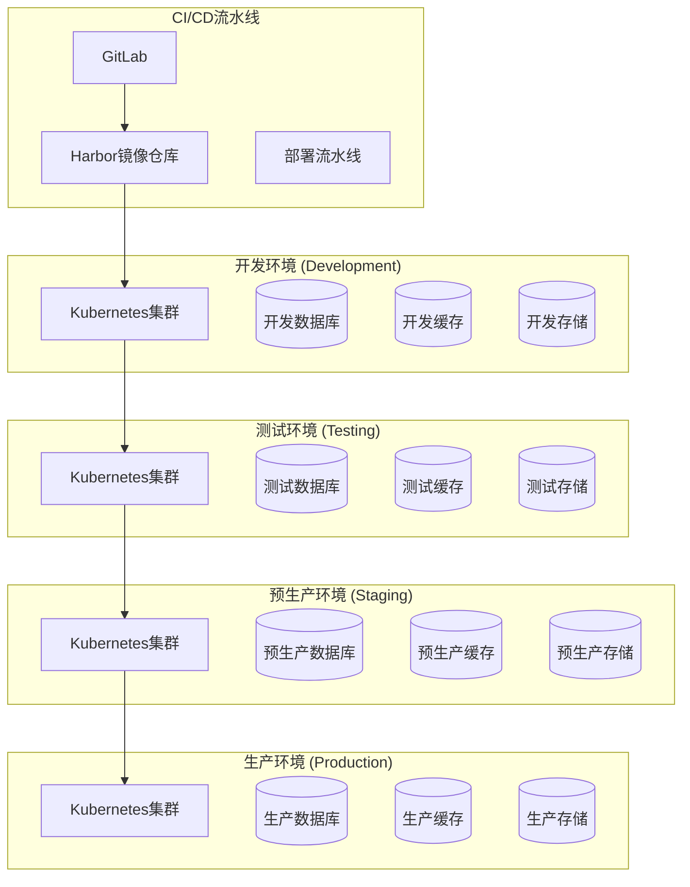
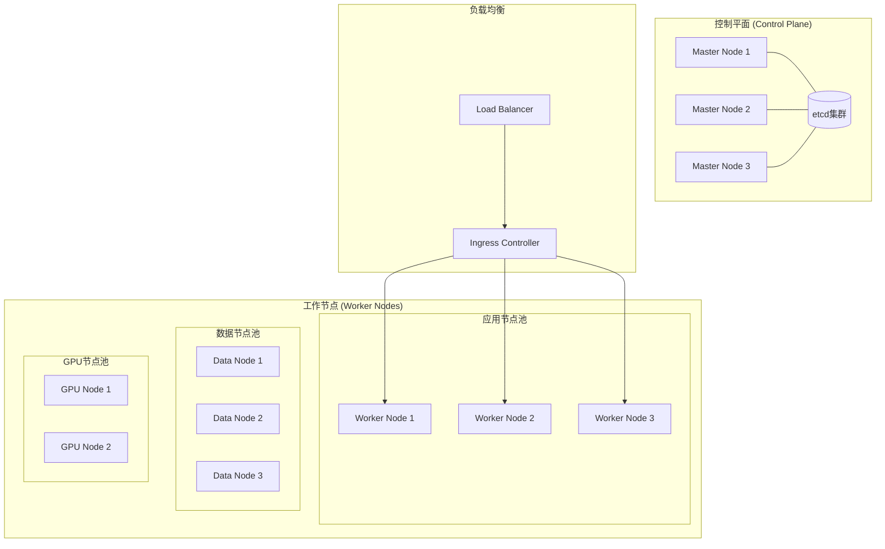
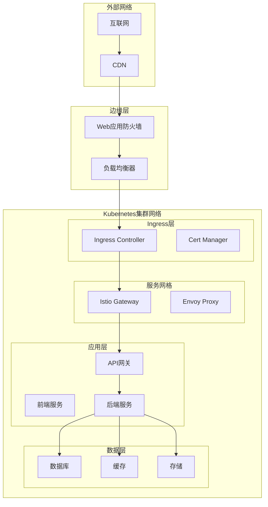

# 部署架构

## 1. 部署架构概述

历史文本漂洗项目采用云原生部署架构，基于Kubernetes容器编排平台，实现微服务的自动化部署、扩缩容和管理。通过多环境部署策略，确保系统的稳定性、可靠性和可维护性。

### 1.1 设计原则

- **云原生**: 基于容器和Kubernetes的现代化部署
- **环境隔离**: 开发、测试、预生产、生产环境完全隔离
- **自动化**: CI/CD流水线实现自动化部署
- **高可用**: 多副本、多可用区部署
- **可观测**: 全面的监控、日志和追踪
- **安全性**: 网络隔离、访问控制、数据加密

### 1.2 技术栈

| 组件类型 | 技术选型 | 版本 | 用途 |
|----------|----------|------|------|
| 容器运行时 | Docker | 24.0+ | 容器化应用 |
| 编排平台 | Kubernetes | 1.28+ | 容器编排管理 |
| 服务网格 | Istio | 1.19+ | 服务治理 |
| 入口控制器 | Nginx Ingress | 1.9+ | 流量入口 |
| 证书管理 | Cert-Manager | 1.13+ | TLS证书自动化 |
| 监控系统 | Prometheus + Grafana | 2.47+ / 10.2+ | 监控告警 |
| 日志系统 | ELK Stack | 8.11+ | 日志收集分析 |
| CI/CD | GitLab CI | 16.5+ | 持续集成部署 |
| 镜像仓库 | Harbor | 2.9+ | 容器镜像管理 |
| 配置管理 | Helm | 3.13+ | 应用包管理 |

## 2. 环境规划

### 2.1 环境架构



### 2.2 环境配置

#### 2.2.1 开发环境 (Development)

```yaml
# 开发环境配置
environment: development
namespace: historical-text-dev

resources:
  limits:
    cpu: "1"
    memory: "2Gi"
  requests:
    cpu: "0.5"
    memory: "1Gi"

replicas:
  min: 1
  max: 2

database:
  postgresql:
    host: "postgres-dev.internal"
    database: "historical_text_dev"
    pool_size: 5
  
  mongodb:
    host: "mongo-dev.internal"
    database: "historical_text_dev"
    
  redis:
    host: "redis-dev.internal"
    database: 0

storage:
  minio:
    endpoint: "minio-dev.internal"
    bucket: "historical-text-dev"

logging:
  level: DEBUG
  format: json

monitoring:
  enabled: true
  metrics_port: 9090
```

#### 2.2.2 生产环境 (Production)

```yaml
# 生产环境配置
environment: production
namespace: historical-text-prod

resources:
  limits:
    cpu: "4"
    memory: "8Gi"
  requests:
    cpu: "2"
    memory: "4Gi"

replicas:
  min: 3
  max: 10

database:
  postgresql:
    host: "postgres-prod-cluster.internal"
    database: "historical_text_prod"
    pool_size: 20
    read_replicas:
      - "postgres-read-1.internal"
      - "postgres-read-2.internal"
  
  mongodb:
    hosts:
      - "mongo-1.internal"
      - "mongo-2.internal"
      - "mongo-3.internal"
    replica_set: "rs0"
    database: "historical_text_prod"
    
  redis:
    cluster:
      - "redis-1.internal"
      - "redis-2.internal"
      - "redis-3.internal"

storage:
  minio:
    endpoints:
      - "minio-1.internal"
      - "minio-2.internal"
      - "minio-3.internal"
    bucket: "historical-text-prod"

logging:
  level: INFO
  format: json
  aggregation: true

monitoring:
  enabled: true
  metrics_port: 9090
  alerting: true

security:
  tls_enabled: true
  network_policies: true
  pod_security_standards: restricted
```

## 3. Kubernetes集群架构

### 3.1 集群拓扑



### 3.2 节点配置

#### 3.2.1 控制平面节点

```yaml
# 控制平面节点规格
master_nodes:
  count: 3
  instance_type: "c5.xlarge"  # 4 vCPU, 8GB RAM
  disk:
    root: 100GB  # SSD
    etcd: 200GB  # 高性能SSD
  
  taints:
    - key: "node-role.kubernetes.io/control-plane"
      effect: "NoSchedule"
  
  labels:
    node-role.kubernetes.io/control-plane: ""
    node.kubernetes.io/instance-type: "c5.xlarge"
```

#### 3.2.2 工作节点

```yaml
# 应用节点池
app_node_pool:
  count: 6
  instance_type: "c5.2xlarge"  # 8 vCPU, 16GB RAM
  disk:
    root: 100GB
    container: 200GB
  
  labels:
    node-pool: "application"
    workload-type: "general"
  
  taints: []

# 数据节点池
data_node_pool:
  count: 3
  instance_type: "r5.2xlarge"  # 8 vCPU, 64GB RAM
  disk:
    root: 100GB
    data: 1TB  # 高性能SSD
  
  labels:
    node-pool: "data"
    workload-type: "database"
  
  taints:
    - key: "workload-type"
      value: "database"
      effect: "NoSchedule"

# GPU节点池
gpu_node_pool:
  count: 2
  instance_type: "p3.2xlarge"  # 8 vCPU, 61GB RAM, 1x V100
  disk:
    root: 100GB
    container: 500GB
  
  labels:
    node-pool: "gpu"
    workload-type: "ai"
    accelerator: "nvidia-tesla-v100"
  
  taints:
    - key: "workload-type"
      value: "ai"
      effect: "NoSchedule"
```

### 3.3 命名空间设计

```yaml
# 命名空间配置
apiVersion: v1
kind: Namespace
metadata:
  name: historical-text-prod
  labels:
    environment: production
    project: historical-text
    istio-injection: enabled
  annotations:
    scheduler.alpha.kubernetes.io/node-selector: "node-pool=application"
---
apiVersion: v1
kind: ResourceQuota
metadata:
  name: compute-quota
  namespace: historical-text-prod
spec:
  hard:
    requests.cpu: "20"
    requests.memory: 40Gi
    limits.cpu: "40"
    limits.memory: 80Gi
    persistentvolumeclaims: "10"
    services: "20"
    secrets: "50"
    configmaps: "50"
---
apiVersion: v1
kind: LimitRange
metadata:
  name: mem-limit-range
  namespace: historical-text-prod
spec:
  limits:
  - default:
      memory: "2Gi"
      cpu: "1"
    defaultRequest:
      memory: "1Gi"
      cpu: "0.5"
    type: Container
```

## 4. 微服务部署配置

### 4.1 应用部署模板

```yaml
# 微服务部署模板
apiVersion: apps/v1
kind: Deployment
metadata:
  name: {{ .Values.service.name }}
  namespace: {{ .Values.namespace }}
  labels:
    app: {{ .Values.service.name }}
    version: {{ .Values.image.tag }}
    component: microservice
spec:
  replicas: {{ .Values.replicas.min }}
  strategy:
    type: RollingUpdate
    rollingUpdate:
      maxSurge: 1
      maxUnavailable: 0
  selector:
    matchLabels:
      app: {{ .Values.service.name }}
  template:
    metadata:
      labels:
        app: {{ .Values.service.name }}
        version: {{ .Values.image.tag }}
      annotations:
        prometheus.io/scrape: "true"
        prometheus.io/port: "{{ .Values.monitoring.port }}"
        prometheus.io/path: "/metrics"
    spec:
      serviceAccountName: {{ .Values.service.name }}
      securityContext:
        runAsNonRoot: true
        runAsUser: 1000
        fsGroup: 2000
      containers:
      - name: {{ .Values.service.name }}
        image: {{ .Values.image.repository }}:{{ .Values.image.tag }}
        imagePullPolicy: {{ .Values.image.pullPolicy }}
        ports:
        - containerPort: {{ .Values.service.port }}
          name: http
        - containerPort: {{ .Values.monitoring.port }}
          name: metrics
        env:
        - name: ENVIRONMENT
          value: {{ .Values.environment }}
        - name: LOG_LEVEL
          value: {{ .Values.logging.level }}
        - name: DATABASE_URL
          valueFrom:
            secretKeyRef:
              name: {{ .Values.service.name }}-secrets
              key: database-url
        resources:
          requests:
            cpu: {{ .Values.resources.requests.cpu }}
            memory: {{ .Values.resources.requests.memory }}
          limits:
            cpu: {{ .Values.resources.limits.cpu }}
            memory: {{ .Values.resources.limits.memory }}
        livenessProbe:
          httpGet:
            path: /health
            port: http
          initialDelaySeconds: 30
          periodSeconds: 10
          timeoutSeconds: 5
          failureThreshold: 3
        readinessProbe:
          httpGet:
            path: /ready
            port: http
          initialDelaySeconds: 5
          periodSeconds: 5
          timeoutSeconds: 3
          failureThreshold: 3
        volumeMounts:
        - name: config
          mountPath: /app/config
          readOnly: true
        - name: logs
          mountPath: /app/logs
      volumes:
      - name: config
        configMap:
          name: {{ .Values.service.name }}-config
      - name: logs
        emptyDir: {}
      nodeSelector:
        node-pool: application
      tolerations:
      - key: "workload-type"
        operator: "Equal"
        value: "general"
        effect: "NoSchedule"
---
apiVersion: v1
kind: Service
metadata:
  name: {{ .Values.service.name }}
  namespace: {{ .Values.namespace }}
  labels:
    app: {{ .Values.service.name }}
spec:
  selector:
    app: {{ .Values.service.name }}
  ports:
  - port: {{ .Values.service.port }}
    targetPort: http
    protocol: TCP
    name: http
  - port: {{ .Values.monitoring.port }}
    targetPort: metrics
    protocol: TCP
    name: metrics
  type: ClusterIP
```

### 4.2 水平自动扩缩容 (HPA)

```yaml
# HPA配置
apiVersion: autoscaling/v2
kind: HorizontalPodAutoscaler
metadata:
  name: {{ .Values.service.name }}-hpa
  namespace: {{ .Values.namespace }}
spec:
  scaleTargetRef:
    apiVersion: apps/v1
    kind: Deployment
    name: {{ .Values.service.name }}
  minReplicas: {{ .Values.replicas.min }}
  maxReplicas: {{ .Values.replicas.max }}
  metrics:
  - type: Resource
    resource:
      name: cpu
      target:
        type: Utilization
        averageUtilization: 70
  - type: Resource
    resource:
      name: memory
      target:
        type: Utilization
        averageUtilization: 80
  - type: Pods
    pods:
      metric:
        name: http_requests_per_second
      target:
        type: AverageValue
        averageValue: "100"
  behavior:
    scaleDown:
      stabilizationWindowSeconds: 300
      policies:
      - type: Percent
        value: 10
        periodSeconds: 60
    scaleUp:
      stabilizationWindowSeconds: 60
      policies:
      - type: Percent
        value: 50
        periodSeconds: 60
      - type: Pods
        value: 2
        periodSeconds: 60
      selectPolicy: Max
```

### 4.3 垂直自动扩缩容 (VPA)

```yaml
# VPA配置
apiVersion: autoscaling.k8s.io/v1
kind: VerticalPodAutoscaler
metadata:
  name: {{ .Values.service.name }}-vpa
  namespace: {{ .Values.namespace }}
spec:
  targetRef:
    apiVersion: apps/v1
    kind: Deployment
    name: {{ .Values.service.name }}
  updatePolicy:
    updateMode: "Auto"
  resourcePolicy:
    containerPolicies:
    - containerName: {{ .Values.service.name }}
      minAllowed:
        cpu: 100m
        memory: 128Mi
      maxAllowed:
        cpu: 2
        memory: 4Gi
      controlledResources: ["cpu", "memory"]
      controlledValues: RequestsAndLimits
```

## 5. 数据层部署

### 5.1 PostgreSQL高可用集群

```yaml
# PostgreSQL主从集群
apiVersion: postgresql.cnpg.io/v1
kind: Cluster
metadata:
  name: postgres-cluster
  namespace: historical-text-prod
spec:
  instances: 3
  
  postgresql:
    parameters:
      max_connections: "200"
      shared_buffers: "256MB"
      effective_cache_size: "1GB"
      maintenance_work_mem: "64MB"
      checkpoint_completion_target: "0.9"
      wal_buffers: "16MB"
      default_statistics_target: "100"
      random_page_cost: "1.1"
      effective_io_concurrency: "200"
      work_mem: "4MB"
      min_wal_size: "1GB"
      max_wal_size: "4GB"
  
  bootstrap:
    initdb:
      database: historical_text_prod
      owner: app_user
      secret:
        name: postgres-credentials
  
  storage:
    size: 500Gi
    storageClass: fast-ssd
  
  resources:
    requests:
      memory: "2Gi"
      cpu: "1"
    limits:
      memory: "4Gi"
      cpu: "2"
  
  monitoring:
    enabled: true
    prometheusRule:
      enabled: true
  
  backup:
    retentionPolicy: "30d"
    barmanObjectStore:
      destinationPath: "s3://backup-bucket/postgres"
      s3Credentials:
        accessKeyId:
          name: backup-credentials
          key: ACCESS_KEY_ID
        secretAccessKey:
          name: backup-credentials
          key: SECRET_ACCESS_KEY
      wal:
        retention: "7d"
      data:
        retention: "30d"
  
  nodeSelector:
    node-pool: data
  
  tolerations:
  - key: "workload-type"
    value: "database"
    effect: "NoSchedule"
```

### 5.2 MongoDB副本集

```yaml
# MongoDB副本集
apiVersion: mongodbcommunity.mongodb.com/v1
kind: MongoDBCommunity
metadata:
  name: mongodb-replica-set
  namespace: historical-text-prod
spec:
  members: 3
  type: ReplicaSet
  version: "6.0.5"
  
  security:
    authentication:
      modes: ["SCRAM"]
  
  users:
  - name: app_user
    db: historical_text_prod
    passwordSecretRef:
      name: mongodb-credentials
    roles:
    - name: readWrite
      db: historical_text_prod
    - name: clusterMonitor
      db: admin
  
  additionalMongodConfig:
    storage.wiredTiger.engineConfig.journalCompressor: zlib
    storage.wiredTiger.collectionConfig.blockCompressor: snappy
    storage.wiredTiger.indexConfig.prefixCompression: true
    net.maxIncomingConnections: 200
    operationProfiling.mode: slowOp
    operationProfiling.slowOpThresholdMs: 100
  
  statefulSet:
    spec:
      template:
        spec:
          containers:
          - name: mongod
            resources:
              requests:
                cpu: "1"
                memory: "2Gi"
              limits:
                cpu: "2"
                memory: "4Gi"
          nodeSelector:
            node-pool: data
          tolerations:
          - key: "workload-type"
            value: "database"
            effect: "NoSchedule"
      volumeClaimTemplates:
      - metadata:
          name: data-volume
        spec:
          accessModes: ["ReadWriteOnce"]
          resources:
            requests:
              storage: 500Gi
          storageClassName: fast-ssd
```

### 5.3 Redis集群

```yaml
# Redis集群
apiVersion: redis.redis.opstreelabs.in/v1beta1
kind: RedisCluster
metadata:
  name: redis-cluster
  namespace: historical-text-prod
spec:
  clusterSize: 6
  
  redisExporter:
    enabled: true
    image: oliver006/redis_exporter:latest
  
  storage:
    volumeClaimTemplate:
      spec:
        accessModes: ["ReadWriteOnce"]
        resources:
          requests:
            storage: 100Gi
        storageClassName: fast-ssd
  
  resources:
    requests:
      cpu: "500m"
      memory: "1Gi"
    limits:
      cpu: "1"
      memory: "2Gi"
  
  redisConfig:
    maxmemory: "1gb"
    maxmemory-policy: "allkeys-lru"
    save: "900 1 300 10 60 10000"
    tcp-keepalive: "60"
    timeout: "300"
  
  nodeSelector:
    node-pool: data
  
  tolerations:
  - key: "workload-type"
    value: "database"
    effect: "NoSchedule"
```

### 5.4 MinIO对象存储

```yaml
# MinIO集群
apiVersion: minio.min.io/v2
kind: Tenant
metadata:
  name: minio-cluster
  namespace: historical-text-prod
spec:
  image: minio/minio:RELEASE.2023-12-07T04-16-00Z
  credsSecret:
    name: minio-credentials
  
  pools:
  - servers: 4
    volumesPerServer: 2
    volumeClaimTemplate:
      metadata:
        name: data
      spec:
        accessModes:
        - ReadWriteOnce
        resources:
          requests:
            storage: 1Ti
        storageClassName: fast-ssd
    
    resources:
      requests:
        cpu: "1"
        memory: "2Gi"
      limits:
        cpu: "2"
        memory: "4Gi"
    
    nodeSelector:
      node-pool: data
    
    tolerations:
    - key: "workload-type"
      value: "database"
      effect: "NoSchedule"
  
  mountPath: /export
  requestAutoCert: false
  
  s3:
    bucketDNS: false
  
  console:
    image: minio/console:v0.22.5
    replicas: 2
    consoleSecret:
      name: minio-console-secret
  
  prometheusOperator: true
  
  logging:
    anonymous: false
    json: true
    quiet: false
```

## 6. 网络架构

### 6.1 网络拓扑



### 6.2 网络策略

```yaml
# 网络策略配置
apiVersion: networking.k8s.io/v1
kind: NetworkPolicy
metadata:
  name: frontend-network-policy
  namespace: historical-text-prod
spec:
  podSelector:
    matchLabels:
      component: frontend
  policyTypes:
  - Ingress
  - Egress
  ingress:
  - from:
    - namespaceSelector:
        matchLabels:
          name: istio-system
    - podSelector:
        matchLabels:
          app: istio-proxy
    ports:
    - protocol: TCP
      port: 3000
  egress:
  - to:
    - podSelector:
        matchLabels:
          component: backend
    ports:
    - protocol: TCP
      port: 8000
  - to: []
    ports:
    - protocol: TCP
      port: 53
    - protocol: UDP
      port: 53
---
apiVersion: networking.k8s.io/v1
kind: NetworkPolicy
metadata:
  name: backend-network-policy
  namespace: historical-text-prod
spec:
  podSelector:
    matchLabels:
      component: backend
  policyTypes:
  - Ingress
  - Egress
  ingress:
  - from:
    - podSelector:
        matchLabels:
          component: frontend
    - podSelector:
        matchLabels:
          component: backend
    ports:
    - protocol: TCP
      port: 8000
  egress:
  - to:
    - podSelector:
        matchLabels:
          component: database
    ports:
    - protocol: TCP
      port: 5432
  - to:
    - podSelector:
        matchLabels:
          component: cache
    ports:
    - protocol: TCP
      port: 6379
```

### 6.3 Istio服务网格配置

```yaml
# Istio Gateway
apiVersion: networking.istio.io/v1beta1
kind: Gateway
metadata:
  name: historical-text-gateway
  namespace: historical-text-prod
spec:
  selector:
    istio: ingressgateway
  servers:
  - port:
      number: 443
      name: https
      protocol: HTTPS
    tls:
      mode: SIMPLE
      credentialName: historical-text-tls
    hosts:
    - api.historical-text.com
    - app.historical-text.com
  - port:
      number: 80
      name: http
      protocol: HTTP
    hosts:
    - api.historical-text.com
    - app.historical-text.com
    tls:
      httpsRedirect: true
---
# Virtual Service
apiVersion: networking.istio.io/v1beta1
kind: VirtualService
metadata:
  name: historical-text-vs
  namespace: historical-text-prod
spec:
  hosts:
  - api.historical-text.com
  - app.historical-text.com
  gateways:
  - historical-text-gateway
  http:
  - match:
    - uri:
        prefix: /api/
    route:
    - destination:
        host: api-gateway
        port:
          number: 8000
    fault:
      delay:
        percentage:
          value: 0.1
        fixedDelay: 5s
    retries:
      attempts: 3
      perTryTimeout: 10s
  - match:
    - uri:
        prefix: /
    route:
    - destination:
        host: frontend-service
        port:
          number: 3000
---
# Destination Rule
apiVersion: networking.istio.io/v1beta1
kind: DestinationRule
metadata:
  name: api-gateway-dr
  namespace: historical-text-prod
spec:
  host: api-gateway
  trafficPolicy:
    loadBalancer:
      simple: LEAST_CONN
    connectionPool:
      tcp:
        maxConnections: 100
      http:
        http1MaxPendingRequests: 50
        maxRequestsPerConnection: 10
    circuitBreaker:
      consecutiveErrors: 5
      interval: 30s
      baseEjectionTime: 30s
      maxEjectionPercent: 50
  subsets:
  - name: v1
    labels:
      version: v1
  - name: v2
    labels:
      version: v2
```

## 7. 监控和可观测性

### 7.1 Prometheus监控配置

```yaml
# Prometheus配置
apiVersion: monitoring.coreos.com/v1
kind: Prometheus
metadata:
  name: prometheus
  namespace: monitoring
spec:
  serviceAccountName: prometheus
  serviceMonitorSelector:
    matchLabels:
      team: historical-text
  ruleSelector:
    matchLabels:
      team: historical-text
  resources:
    requests:
      memory: 400Mi
      cpu: 100m
    limits:
      memory: 2Gi
      cpu: 1
  retention: 30d
  storage:
    volumeClaimTemplate:
      spec:
        storageClassName: fast-ssd
        resources:
          requests:
            storage: 100Gi
  alerting:
    alertmanagers:
    - namespace: monitoring
      name: alertmanager-main
      port: web
---
# ServiceMonitor for microservices
apiVersion: monitoring.coreos.com/v1
kind: ServiceMonitor
metadata:
  name: historical-text-services
  namespace: monitoring
  labels:
    team: historical-text
spec:
  selector:
    matchLabels:
      monitoring: enabled
  endpoints:
  - port: metrics
    interval: 30s
    path: /metrics
  namespaceSelector:
    matchNames:
    - historical-text-prod
    - historical-text-staging
```

### 7.2 Grafana仪表板

```yaml
# Grafana配置
apiVersion: integreatly.org/v1alpha1
kind: GrafanaDashboard
metadata:
  name: historical-text-overview
  namespace: monitoring
spec:
  json: |
    {
      "dashboard": {
        "id": null,
        "title": "Historical Text - System Overview",
        "tags": ["historical-text"],
        "timezone": "browser",
        "panels": [
          {
            "id": 1,
            "title": "Request Rate",
            "type": "graph",
            "targets": [
              {
                "expr": "sum(rate(http_requests_total{job=\"historical-text-services\"}[5m])) by (service)",
                "legendFormat": "{{service}}"
              }
            ]
          },
          {
            "id": 2,
            "title": "Response Time",
            "type": "graph",
            "targets": [
              {
                "expr": "histogram_quantile(0.95, sum(rate(http_request_duration_seconds_bucket{job=\"historical-text-services\"}[5m])) by (le, service))",
                "legendFormat": "{{service}} 95th percentile"
              }
            ]
          },
          {
            "id": 3,
            "title": "Error Rate",
            "type": "graph",
            "targets": [
              {
                "expr": "sum(rate(http_requests_total{job=\"historical-text-services\",status=~\"5..\"}[5m])) by (service) / sum(rate(http_requests_total{job=\"historical-text-services\"}[5m])) by (service)",
                "legendFormat": "{{service}} error rate"
              }
            ]
          }
        ]
      }
    }
```

### 7.3 告警规则

```yaml
# PrometheusRule
apiVersion: monitoring.coreos.com/v1
kind: PrometheusRule
metadata:
  name: historical-text-alerts
  namespace: monitoring
  labels:
    team: historical-text
spec:
  groups:
  - name: historical-text.rules
    rules:
    - alert: HighErrorRate
      expr: |
        (
          sum(rate(http_requests_total{job="historical-text-services",status=~"5.."}[5m]))
          /
          sum(rate(http_requests_total{job="historical-text-services"}[5m]))
        ) > 0.05
      for: 5m
      labels:
        severity: warning
      annotations:
        summary: "High error rate detected"
        description: "Error rate is {{ $value | humanizePercentage }} for the last 5 minutes."
    
    - alert: HighResponseTime
      expr: |
        histogram_quantile(0.95,
          sum(rate(http_request_duration_seconds_bucket{job="historical-text-services"}[5m]))
          by (le, service)
        ) > 2
      for: 5m
      labels:
        severity: warning
      annotations:
        summary: "High response time detected"
        description: "95th percentile response time is {{ $value }}s for service {{ $labels.service }}."
    
    - alert: PodCrashLooping
      expr: |
        rate(kube_pod_container_status_restarts_total{namespace="historical-text-prod"}[15m]) > 0
      for: 5m
      labels:
        severity: critical
      annotations:
        summary: "Pod is crash looping"
        description: "Pod {{ $labels.pod }} in namespace {{ $labels.namespace }} is crash looping."
    
    - alert: DatabaseConnectionHigh
      expr: |
        (
          sum(pg_stat_activity_count{datname="historical_text_prod"})
          /
          sum(pg_settings_max_connections)
        ) > 0.8
      for: 5m
      labels:
        severity: warning
      annotations:
        summary: "Database connection usage is high"
        description: "Database connection usage is {{ $value | humanizePercentage }}."
```

## 8. 日志管理

### 8.1 ELK Stack部署

```yaml
# Elasticsearch集群
apiVersion: elasticsearch.k8s.elastic.co/v1
kind: Elasticsearch
metadata:
  name: elasticsearch
  namespace: logging
spec:
  version: 8.11.0
  nodeSets:
  - name: master
    count: 3
    config:
      node.roles: ["master"]
      xpack.security.enabled: true
    volumeClaimTemplates:
    - metadata:
        name: elasticsearch-data
      spec:
        accessModes:
        - ReadWriteOnce
        resources:
          requests:
            storage: 100Gi
        storageClassName: fast-ssd
    podTemplate:
      spec:
        containers:
        - name: elasticsearch
          resources:
            requests:
              memory: 2Gi
              cpu: 1
            limits:
              memory: 4Gi
              cpu: 2
        nodeSelector:
          node-pool: data
  - name: data
    count: 3
    config:
      node.roles: ["data", "ingest"]
      xpack.security.enabled: true
    volumeClaimTemplates:
    - metadata:
        name: elasticsearch-data
      spec:
        accessModes:
        - ReadWriteOnce
        resources:
          requests:
            storage: 500Gi
        storageClassName: fast-ssd
    podTemplate:
      spec:
        containers:
        - name: elasticsearch
          resources:
            requests:
              memory: 4Gi
              cpu: 2
            limits:
              memory: 8Gi
              cpu: 4
        nodeSelector:
          node-pool: data
---
# Kibana
apiVersion: kibana.k8s.elastic.co/v1
kind: Kibana
metadata:
  name: kibana
  namespace: logging
spec:
  version: 8.11.0
  count: 2
  elasticsearchRef:
    name: elasticsearch
  config:
    server.publicBaseUrl: "https://kibana.historical-text.com"
  podTemplate:
    spec:
      containers:
      - name: kibana
        resources:
          requests:
            memory: 1Gi
            cpu: 500m
          limits:
            memory: 2Gi
            cpu: 1
```

### 8.2 Filebeat日志收集

```yaml
# Filebeat DaemonSet
apiVersion: beat.k8s.elastic.co/v1beta1
kind: Beat
metadata:
  name: filebeat
  namespace: logging
spec:
  type: filebeat
  version: 8.11.0
  elasticsearchRef:
    name: elasticsearch
  config:
    filebeat.autodiscover.providers:
    - type: kubernetes
      node: ${NODE_NAME}
      hints.enabled: true
      hints.default_config:
        type: container
        paths:
        - /var/log/containers/*${data.kubernetes.container.id}.log
    processors:
    - add_kubernetes_metadata:
        host: ${NODE_NAME}
        matchers:
        - logs_path:
            logs_path: "/var/log/containers/"
    - drop_event:
        when:
          not:
            kubernetes.namespace: ["historical-text-prod", "historical-text-staging"]
    output.elasticsearch:
      hosts: ["elasticsearch-es-http:9200"]
      index: "filebeat-%{[agent.version]}-%{+yyyy.MM.dd}"
  daemonSet:
    podTemplate:
      spec:
        serviceAccountName: filebeat
        terminationGracePeriodSeconds: 30
        hostNetwork: true
        dnsPolicy: ClusterFirstWithHostNet
        containers:
        - name: filebeat
          securityContext:
            runAsUser: 0
          volumeMounts:
          - name: varlogcontainers
            mountPath: /var/log/containers
            readOnly: true
          - name: varlogpods
            mountPath: /var/log/pods
            readOnly: true
          - name: varlibdockercontainers
            mountPath: /var/lib/docker/containers
            readOnly: true
          env:
          - name: NODE_NAME
            valueFrom:
              fieldRef:
                fieldPath: spec.nodeName
        volumes:
        - name: varlogcontainers
          hostPath:
            path: /var/log/containers
        - name: varlogpods
          hostPath:
            path: /var/log/pods
        - name: varlibdockercontainers
          hostPath:
            path: /var/lib/docker/containers
```

## 9. CI/CD流水线

### 9.1 GitLab CI配置

```yaml
# .gitlab-ci.yml
stages:
  - test
  - build
  - security
  - deploy-dev
  - deploy-staging
  - deploy-prod

variables:
  DOCKER_DRIVER: overlay2
  DOCKER_TLS_CERTDIR: "/certs"
  REGISTRY: harbor.historical-text.com
  PROJECT_NAME: historical-text

before_script:
  - echo $CI_REGISTRY_PASSWORD | docker login -u $CI_REGISTRY_USER --password-stdin $REGISTRY

# 测试阶段
unit-test:
  stage: test
  image: python:3.11
  script:
    - pip install -r requirements-dev.txt
    - pytest tests/unit --cov=src --cov-report=xml
  artifacts:
    reports:
      coverage_report:
        coverage_format: cobertura
        path: coverage.xml
  only:
    - merge_requests
    - main
    - develop

integration-test:
  stage: test
  image: docker/compose:latest
  services:
    - docker:dind
  script:
    - docker-compose -f docker-compose.test.yml up --build --abort-on-container-exit
    - docker-compose -f docker-compose.test.yml down
  only:
    - merge_requests
    - main
    - develop

# 构建阶段
build-image:
  stage: build
  image: docker:latest
  services:
    - docker:dind
  script:
    - docker build -t $REGISTRY/$PROJECT_NAME/$CI_COMMIT_REF_SLUG:$CI_COMMIT_SHA .
    - docker push $REGISTRY/$PROJECT_NAME/$CI_COMMIT_REF_SLUG:$CI_COMMIT_SHA
    - docker tag $REGISTRY/$PROJECT_NAME/$CI_COMMIT_REF_SLUG:$CI_COMMIT_SHA $REGISTRY/$PROJECT_NAME/$CI_COMMIT_REF_SLUG:latest
    - docker push $REGISTRY/$PROJECT_NAME/$CI_COMMIT_REF_SLUG:latest
  only:
    - main
    - develop
    - tags

# 安全扫描
security-scan:
  stage: security
  image: aquasec/trivy:latest
  script:
    - trivy image --exit-code 0 --severity HIGH,CRITICAL $REGISTRY/$PROJECT_NAME/$CI_COMMIT_REF_SLUG:$CI_COMMIT_SHA
  allow_failure: true
  only:
    - main
    - develop
    - tags

# 部署到开发环境
deploy-dev:
  stage: deploy-dev
  image: bitnami/kubectl:latest
  script:
    - kubectl config use-context dev-cluster
    - helm upgrade --install historical-text-dev ./helm/historical-text \
        --namespace historical-text-dev \
        --set image.tag=$CI_COMMIT_SHA \
        --set environment=development \
        --values ./helm/values-dev.yaml
  environment:
    name: development
    url: https://dev.historical-text.com
  only:
    - develop

# 部署到预生产环境
deploy-staging:
  stage: deploy-staging
  image: bitnami/kubectl:latest
  script:
    - kubectl config use-context staging-cluster
    - helm upgrade --install historical-text-staging ./helm/historical-text \
        --namespace historical-text-staging \
        --set image.tag=$CI_COMMIT_SHA \
        --set environment=staging \
        --values ./helm/values-staging.yaml
  environment:
    name: staging
    url: https://staging.historical-text.com
  when: manual
  only:
    - main

# 部署到生产环境
deploy-prod:
  stage: deploy-prod
  image: bitnami/kubectl:latest
  script:
    - kubectl config use-context prod-cluster
    - helm upgrade --install historical-text-prod ./helm/historical-text \
        --namespace historical-text-prod \
        --set image.tag=$CI_COMMIT_SHA \
        --set environment=production \
        --values ./helm/values-prod.yaml
  environment:
    name: production
    url: https://app.historical-text.com
  when: manual
  only:
    - tags
```

### 9.2 Helm Chart结构

```
helm/historical-text/
├── Chart.yaml
├── values.yaml
├── values-dev.yaml
├── values-staging.yaml
├── values-prod.yaml
├── templates/
│   ├── deployment.yaml
│   ├── service.yaml
│   ├── ingress.yaml
│   ├── configmap.yaml
│   ├── secret.yaml
│   ├── hpa.yaml
│   ├── vpa.yaml
│   ├── servicemonitor.yaml
│   ├── networkpolicy.yaml
│   └── tests/
│       └── test-connection.yaml
└── charts/
    ├── postgresql/
    ├── mongodb/
    ├── redis/
    └── minio/
```

## 10. 安全配置

### 10.1 Pod安全策略

```yaml
# Pod Security Standards
apiVersion: v1
kind: Namespace
metadata:
  name: historical-text-prod
  labels:
    pod-security.kubernetes.io/enforce: restricted
    pod-security.kubernetes.io/audit: restricted
    pod-security.kubernetes.io/warn: restricted
---
# Security Context Constraints
apiVersion: security.openshift.io/v1
kind: SecurityContextConstraints
metadata:
  name: historical-text-scc
allowHostDirVolumePlugin: false
allowHostIPC: false
allowHostNetwork: false
allowHostPID: false
allowHostPorts: false
allowPrivilegedContainer: false
allowedCapabilities: null
defaultAddCapabilities: null
fsGroup:
  type: MustRunAs
  ranges:
  - min: 1000
    max: 65535
readOnlyRootFilesystem: true
requiredDropCapabilities:
- ALL
runAsUser:
  type: MustRunAsNonRoot
seLinuxContext:
  type: MustRunAs
supplementalGroups:
  type: MustRunAs
  ranges:
  - min: 1000
    max: 65535
volumes:
- configMap
- downwardAPI
- emptyDir
- persistentVolumeClaim
- projected
- secret
```

### 10.2 RBAC配置

```yaml
# Service Account
apiVersion: v1
kind: ServiceAccount
metadata:
  name: historical-text-sa
  namespace: historical-text-prod
automountServiceAccountToken: false
---
# Role
apiVersion: rbac.authorization.k8s.io/v1
kind: Role
metadata:
  namespace: historical-text-prod
  name: historical-text-role
rules:
- apiGroups: [""]
  resources: ["configmaps", "secrets"]
  verbs: ["get", "list"]
- apiGroups: [""]
  resources: ["pods"]
  verbs: ["get", "list"]
---
# RoleBinding
apiVersion: rbac.authorization.k8s.io/v1
kind: RoleBinding
metadata:
  name: historical-text-rolebinding
  namespace: historical-text-prod
subjects:
- kind: ServiceAccount
  name: historical-text-sa
  namespace: historical-text-prod
roleRef:
  kind: Role
  name: historical-text-role
  apiGroup: rbac.authorization.k8s.io
```

---

**文档版本**: v1.0  
**最后更新**: 2024年1月  
**负责人**: DevOps团队  
**审核人**: 技术总监