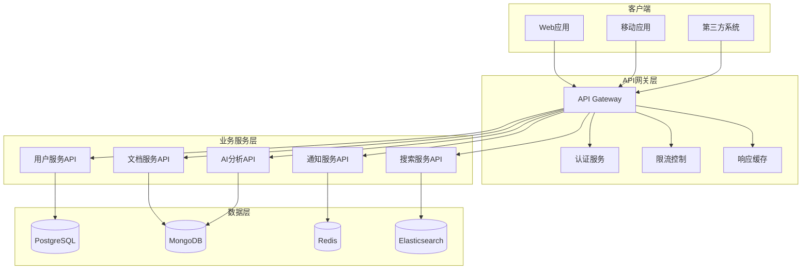

# API设计文档

## 1. API设计概述

历史文本漂洗项目采用RESTful API设计风格，结合GraphQL查询语言，为前端应用和第三方系统提供统一的接口服务。API设计遵循OpenAPI 3.0规范，支持版本管理、认证授权、限流控制等企业级特性。

### 1.1 设计原则

- **RESTful风格**: 遵循REST架构原则，资源导向设计
- **统一规范**: 统一的请求/响应格式、错误处理机制
- **版本管理**: 支持API版本演进和向后兼容
- **安全优先**: 完善的认证授权和数据保护机制
- **性能优化**: 支持分页、过滤、缓存等性能优化特性
- **文档完善**: 自动生成API文档，支持在线测试

### 1.2 技术规范

| 规范类型 | 技术选型 | 版本 | 说明 |
|----------|----------|------|------|
| API规范 | OpenAPI | 3.0.3 | API文档标准 |
| 认证方式 | JWT | - | 无状态认证 |
| 数据格式 | JSON | - | 主要数据交换格式 |
| 查询语言 | GraphQL | 16.8+ | 复杂查询支持 |
| 文档工具 | Swagger UI | 5.9+ | API文档界面 |
| 测试工具 | Postman | - | API测试集合 |

## 2. API架构设计

### 2.1 API网关架构



### 2.2 API版本策略

```yaml
# API版本管理策略
versioning:
  strategy: "url_path"  # URL路径版本控制
  format: "/api/v{version}/"
  
  versions:
    v1:
      status: "stable"
      release_date: "2024-01-01"
      deprecation_date: null
      sunset_date: null
    
    v2:
      status: "beta"
      release_date: "2024-06-01"
      deprecation_date: null
      sunset_date: null
  
  compatibility:
    backward_compatible: true
    migration_guide: "/docs/api/migration"
    
  headers:
    version_header: "API-Version"
    deprecation_header: "Sunset"
    
# 示例URL结构
url_examples:
  - "/api/v1/users"
  - "/api/v1/documents"
  - "/api/v2/search/advanced"
```

## 3. 认证和授权

### 3.1 JWT认证机制

```yaml
# JWT配置
jwt_config:
  algorithm: "RS256"
  issuer: "historical-text-api"
  audience: "historical-text-clients"
  
  access_token:
    expiration: 3600  # 1小时
    claims:
      - "sub"  # 用户ID
      - "iat"  # 签发时间
      - "exp"  # 过期时间
      - "aud"  # 受众
      - "iss"  # 签发者
      - "roles"  # 用户角色
      - "permissions"  # 用户权限
  
  refresh_token:
    expiration: 604800  # 7天
    rotation: true  # 刷新时轮换
    
  public_key_endpoint: "/api/v1/auth/jwks"
```

### 3.2 认证API

```yaml
# 认证相关API
paths:
  /api/v1/auth/login:
    post:
      summary: 用户登录
      tags: ["Authentication"]
      requestBody:
        required: true
        content:
          application/json:
            schema:
              type: object
              required: ["username", "password"]
              properties:
                username:
                  type: string
                  example: "user@example.com"
                password:
                  type: string
                  format: password
                  example: "SecurePassword123!"
                remember_me:
                  type: boolean
                  default: false
                captcha:
                  type: string
                  description: "验证码（可选）"
      responses:
        200:
          description: 登录成功
          content:
            application/json:
              schema:
                type: object
                properties:
                  access_token:
                    type: string
                    description: "访问令牌"
                  refresh_token:
                    type: string
                    description: "刷新令牌"
                  token_type:
                    type: string
                    example: "Bearer"
                  expires_in:
                    type: integer
                    example: 3600
                  user:
                    $ref: "#/components/schemas/User"
        401:
          $ref: "#/components/responses/Unauthorized"
        429:
          $ref: "#/components/responses/TooManyRequests"
  
  /api/v1/auth/refresh:
    post:
      summary: 刷新访问令牌
      tags: ["Authentication"]
      requestBody:
        required: true
        content:
          application/json:
            schema:
              type: object
              required: ["refresh_token"]
              properties:
                refresh_token:
                  type: string
      responses:
        200:
          description: 刷新成功
          content:
            application/json:
              schema:
                type: object
                properties:
                  access_token:
                    type: string
                  refresh_token:
                    type: string
                  expires_in:
                    type: integer
        401:
          $ref: "#/components/responses/Unauthorized"
  
  /api/v1/auth/logout:
    post:
      summary: 用户登出
      tags: ["Authentication"]
      security:
        - BearerAuth: []
      responses:
        200:
          description: 登出成功
          content:
            application/json:
              schema:
                $ref: "#/components/schemas/SuccessResponse"
        401:
          $ref: "#/components/responses/Unauthorized"
  
  /api/v1/auth/me:
    get:
      summary: 获取当前用户信息
      tags: ["Authentication"]
      security:
        - BearerAuth: []
      responses:
        200:
          description: 用户信息
          content:
            application/json:
              schema:
                $ref: "#/components/schemas/User"
        401:
          $ref: "#/components/responses/Unauthorized"
```

### 3.3 权限控制

```python
# 权限装饰器示例
from functools import wraps
from flask import request, jsonify
from jose import jwt, JWTError

def require_permission(permission: str):
    """权限检查装饰器"""
    def decorator(f):
        @wraps(f)
        def decorated_function(*args, **kwargs):
            token = extract_token_from_header()
            if not token:
                return jsonify({"error": "Missing authorization token"}), 401
            
            try:
                payload = jwt.decode(token, PUBLIC_KEY, algorithms=["RS256"])
                user_permissions = payload.get("permissions", [])
                
                if permission not in user_permissions:
                    return jsonify({"error": "Insufficient permissions"}), 403
                
                # 将用户信息添加到请求上下文
                request.current_user = payload
                return f(*args, **kwargs)
                
            except JWTError:
                return jsonify({"error": "Invalid token"}), 401
        
        return decorated_function
    return decorator

# 使用示例
@app.route('/api/v1/documents', methods=['POST'])
@require_permission('document:create')
def create_document():
    # 创建文档的业务逻辑
    pass
```

## 4. 核心业务API

### 4.1 用户管理API

```yaml
# 用户管理API
paths:
  /api/v1/users:
    get:
      summary: 获取用户列表
      tags: ["Users"]
      security:
        - BearerAuth: []
      parameters:
        - name: page
          in: query
          schema:
            type: integer
            minimum: 1
            default: 1
        - name: limit
          in: query
          schema:
            type: integer
            minimum: 1
            maximum: 100
            default: 20
        - name: search
          in: query
          schema:
            type: string
          description: "搜索用户名或邮箱"
        - name: role
          in: query
          schema:
            type: string
            enum: ["admin", "editor", "viewer"]
        - name: status
          in: query
          schema:
            type: string
            enum: ["active", "inactive", "pending"]
      responses:
        200:
          description: 用户列表
          content:
            application/json:
              schema:
                type: object
                properties:
                  data:
                    type: array
                    items:
                      $ref: "#/components/schemas/User"
                  pagination:
                    $ref: "#/components/schemas/Pagination"
    
    post:
      summary: 创建新用户
      tags: ["Users"]
      security:
        - BearerAuth: []
      requestBody:
        required: true
        content:
          application/json:
            schema:
              $ref: "#/components/schemas/CreateUserRequest"
      responses:
        201:
          description: 用户创建成功
          content:
            application/json:
              schema:
                $ref: "#/components/schemas/User"
        400:
          $ref: "#/components/responses/BadRequest"
        409:
          $ref: "#/components/responses/Conflict"
  
  /api/v1/users/{userId}:
    get:
      summary: 获取用户详情
      tags: ["Users"]
      security:
        - BearerAuth: []
      parameters:
        - name: userId
          in: path
          required: true
          schema:
            type: string
            format: uuid
      responses:
        200:
          description: 用户详情
          content:
            application/json:
              schema:
                $ref: "#/components/schemas/User"
        404:
          $ref: "#/components/responses/NotFound"
    
    put:
      summary: 更新用户信息
      tags: ["Users"]
      security:
        - BearerAuth: []
      parameters:
        - name: userId
          in: path
          required: true
          schema:
            type: string
            format: uuid
      requestBody:
        required: true
        content:
          application/json:
            schema:
              $ref: "#/components/schemas/UpdateUserRequest"
      responses:
        200:
          description: 更新成功
          content:
            application/json:
              schema:
                $ref: "#/components/schemas/User"
        400:
          $ref: "#/components/responses/BadRequest"
        404:
          $ref: "#/components/responses/NotFound"
    
    delete:
      summary: 删除用户
      tags: ["Users"]
      security:
        - BearerAuth: []
      parameters:
        - name: userId
          in: path
          required: true
          schema:
            type: string
            format: uuid
      responses:
        204:
          description: 删除成功
        404:
          $ref: "#/components/responses/NotFound"
```

### 4.2 文档管理API

```yaml
# 文档管理API
paths:
  /api/v1/documents:
    get:
      summary: 获取文档列表
      tags: ["Documents"]
      security:
        - BearerAuth: []
      parameters:
        - name: page
          in: query
          schema:
            type: integer
            minimum: 1
            default: 1
        - name: limit
          in: query
          schema:
            type: integer
            minimum: 1
            maximum: 100
            default: 20
        - name: search
          in: query
          schema:
            type: string
          description: "搜索文档标题或内容"
        - name: category
          in: query
          schema:
            type: string
          description: "文档分类ID"
        - name: tags
          in: query
          schema:
            type: array
            items:
              type: string
          style: form
          explode: false
          description: "标签列表"
        - name: status
          in: query
          schema:
            type: string
            enum: ["uploaded", "processing", "completed", "failed"]
        - name: owner_id
          in: query
          schema:
            type: string
            format: uuid
        - name: created_after
          in: query
          schema:
            type: string
            format: date-time
        - name: created_before
          in: query
          schema:
            type: string
            format: date-time
        - name: sort_by
          in: query
          schema:
            type: string
            enum: ["created_at", "updated_at", "title", "file_size"]
            default: "created_at"
        - name: sort_order
          in: query
          schema:
            type: string
            enum: ["asc", "desc"]
            default: "desc"
      responses:
        200:
          description: 文档列表
          content:
            application/json:
              schema:
                type: object
                properties:
                  data:
                    type: array
                    items:
                      $ref: "#/components/schemas/Document"
                  pagination:
                    $ref: "#/components/schemas/Pagination"
                  filters:
                    type: object
                    properties:
                      categories:
                        type: array
                        items:
                          $ref: "#/components/schemas/Category"
                      tags:
                        type: array
                        items:
                          $ref: "#/components/schemas/Tag"
    
    post:
      summary: 上传新文档
      tags: ["Documents"]
      security:
        - BearerAuth: []
      requestBody:
        required: true
        content:
          multipart/form-data:
            schema:
              type: object
              required: ["file"]
              properties:
                file:
                  type: string
                  format: binary
                  description: "文档文件"
                title:
                  type: string
                  description: "文档标题（可选）"
                description:
                  type: string
                  description: "文档描述（可选）"
                category_id:
                  type: string
                  format: uuid
                  description: "分类ID（可选）"
                tags:
                  type: array
                  items:
                    type: string
                  description: "标签列表（可选）"
                processing_options:
                  type: object
                  description: "处理选项"
                  properties:
                    auto_ocr:
                      type: boolean
                      default: true
                    auto_analysis:
                      type: boolean
                      default: true
                    language:
                      type: string
                      default: "zh-cn"
      responses:
        201:
          description: 文档上传成功
          content:
            application/json:
              schema:
                $ref: "#/components/schemas/Document"
        400:
          $ref: "#/components/responses/BadRequest"
        413:
          description: 文件过大
          content:
            application/json:
              schema:
                $ref: "#/components/schemas/ErrorResponse"
  
  /api/v1/documents/{documentId}:
    get:
      summary: 获取文档详情
      tags: ["Documents"]
      security:
        - BearerAuth: []
      parameters:
        - name: documentId
          in: path
          required: true
          schema:
            type: string
            format: uuid
        - name: include_content
          in: query
          schema:
            type: boolean
            default: false
          description: "是否包含文档内容"
        - name: version
          in: query
          schema:
            type: integer
          description: "文档版本号"
      responses:
        200:
          description: 文档详情
          content:
            application/json:
              schema:
                $ref: "#/components/schemas/DocumentDetail"
        404:
          $ref: "#/components/responses/NotFound"
    
    put:
      summary: 更新文档信息
      tags: ["Documents"]
      security:
        - BearerAuth: []
      parameters:
        - name: documentId
          in: path
          required: true
          schema:
            type: string
            format: uuid
      requestBody:
        required: true
        content:
          application/json:
            schema:
              $ref: "#/components/schemas/UpdateDocumentRequest"
      responses:
        200:
          description: 更新成功
          content:
            application/json:
              schema:
                $ref: "#/components/schemas/Document"
        400:
          $ref: "#/components/responses/BadRequest"
        404:
          $ref: "#/components/responses/NotFound"
    
    delete:
      summary: 删除文档
      tags: ["Documents"]
      security:
        - BearerAuth: []
      parameters:
        - name: documentId
          in: path
          required: true
          schema:
            type: string
            format: uuid
      responses:
        204:
          description: 删除成功
        404:
          $ref: "#/components/responses/NotFound"
  
  /api/v1/documents/{documentId}/content:
    get:
      summary: 获取文档内容
      tags: ["Documents"]
      security:
        - BearerAuth: []
      parameters:
        - name: documentId
          in: path
          required: true
          schema:
            type: string
            format: uuid
        - name: version
          in: query
          schema:
            type: integer
          description: "内容版本号"
        - name: format
          in: query
          schema:
            type: string
            enum: ["json", "text", "html"]
            default: "json"
      responses:
        200:
          description: 文档内容
          content:
            application/json:
              schema:
                $ref: "#/components/schemas/DocumentContent"
            text/plain:
              schema:
                type: string
            text/html:
              schema:
                type: string
        404:
          $ref: "#/components/responses/NotFound"
  
  /api/v1/documents/{documentId}/download:
    get:
      summary: 下载原始文档
      tags: ["Documents"]
      security:
        - BearerAuth: []
      parameters:
        - name: documentId
          in: path
          required: true
          schema:
            type: string
            format: uuid
      responses:
        200:
          description: 文档文件
          content:
            application/octet-stream:
              schema:
                type: string
                format: binary
        404:
          $ref: "#/components/responses/NotFound"
```

### 4.3 搜索API

```yaml
# 搜索API
paths:
  /api/v1/search:
    get:
      summary: 搜索文档
      tags: ["Search"]
      security:
        - BearerAuth: []
      parameters:
        - name: q
          in: query
          required: true
          schema:
            type: string
          description: "搜索关键词"
        - name: type
          in: query
          schema:
            type: string
            enum: ["fulltext", "semantic", "hybrid"]
            default: "fulltext"
          description: "搜索类型"
        - name: page
          in: query
          schema:
            type: integer
            minimum: 1
            default: 1
        - name: limit
          in: query
          schema:
            type: integer
            minimum: 1
            maximum: 100
            default: 20
        - name: filters
          in: query
          schema:
            type: object
            properties:
              categories:
                type: array
                items:
                  type: string
              tags:
                type: array
                items:
                  type: string
              date_range:
                type: object
                properties:
                  start:
                    type: string
                    format: date
                  end:
                    type: string
                    format: date
              file_types:
                type: array
                items:
                  type: string
              languages:
                type: array
                items:
                  type: string
        - name: sort_by
          in: query
          schema:
            type: string
            enum: ["relevance", "date", "title"]
            default: "relevance"
        - name: highlight
          in: query
          schema:
            type: boolean
            default: true
          description: "是否高亮显示匹配内容"
      responses:
        200:
          description: 搜索结果
          content:
            application/json:
              schema:
                type: object
                properties:
                  query:
                    type: string
                  total:
                    type: integer
                  took:
                    type: integer
                    description: "搜索耗时（毫秒）"
                  results:
                    type: array
                    items:
                      $ref: "#/components/schemas/SearchResult"
                  aggregations:
                    type: object
                    properties:
                      categories:
                        type: array
                        items:
                          type: object
                          properties:
                            name:
                              type: string
                            count:
                              type: integer
                      file_types:
                        type: array
                        items:
                          type: object
                          properties:
                            type:
                              type: string
                            count:
                              type: integer
                  pagination:
                    $ref: "#/components/schemas/Pagination"
        400:
          $ref: "#/components/responses/BadRequest"
  
  /api/v1/search/suggestions:
    get:
      summary: 搜索建议
      tags: ["Search"]
      security:
        - BearerAuth: []
      parameters:
        - name: q
          in: query
          required: true
          schema:
            type: string
          description: "搜索前缀"
        - name: limit
          in: query
          schema:
            type: integer
            minimum: 1
            maximum: 20
            default: 10
      responses:
        200:
          description: 搜索建议
          content:
            application/json:
              schema:
                type: object
                properties:
                  suggestions:
                    type: array
                    items:
                      type: object
                      properties:
                        text:
                          type: string
                        score:
                          type: number
                        type:
                          type: string
                          enum: ["keyword", "phrase", "entity"]
```

### 4.4 AI分析API

```yaml
# AI分析API
paths:
  /api/v1/ai/analyze:
    post:
      summary: 提交AI分析任务
      tags: ["AI Analysis"]
      security:
        - BearerAuth: []
      requestBody:
        required: true
        content:
          application/json:
            schema:
              type: object
              required: ["document_id", "analysis_types"]
              properties:
                document_id:
                  type: string
                  format: uuid
                analysis_types:
                  type: array
                  items:
                    type: string
                    enum: ["ner", "sentiment", "classification", "keyword_extraction", "summarization"]
                options:
                  type: object
                  properties:
                    language:
                      type: string
                      default: "zh-cn"
                    confidence_threshold:
                      type: number
                      minimum: 0
                      maximum: 1
                      default: 0.8
                    max_keywords:
                      type: integer
                      minimum: 1
                      maximum: 100
                      default: 20
                callback_url:
                  type: string
                  format: uri
                  description: "分析完成后的回调URL"
      responses:
        202:
          description: 分析任务已提交
          content:
            application/json:
              schema:
                type: object
                properties:
                  task_id:
                    type: string
                    format: uuid
                  status:
                    type: string
                    enum: ["pending", "running"]
                  estimated_completion:
                    type: string
                    format: date-time
        400:
          $ref: "#/components/responses/BadRequest"
        404:
          $ref: "#/components/responses/NotFound"
  
  /api/v1/ai/tasks/{taskId}:
    get:
      summary: 获取AI分析任务状态
      tags: ["AI Analysis"]
      security:
        - BearerAuth: []
      parameters:
        - name: taskId
          in: path
          required: true
          schema:
            type: string
            format: uuid
      responses:
        200:
          description: 任务状态
          content:
            application/json:
              schema:
                $ref: "#/components/schemas/AITask"
        404:
          $ref: "#/components/responses/NotFound"
  
  /api/v1/ai/results/{documentId}:
    get:
      summary: 获取文档的AI分析结果
      tags: ["AI Analysis"]
      security:
        - BearerAuth: []
      parameters:
        - name: documentId
          in: path
          required: true
          schema:
            type: string
            format: uuid
        - name: analysis_type
          in: query
          schema:
            type: string
            enum: ["ner", "sentiment", "classification", "keyword_extraction", "summarization"]
          description: "指定分析类型，不指定则返回所有结果"
      responses:
        200:
          description: AI分析结果
          content:
            application/json:
              schema:
                type: object
                properties:
                  document_id:
                    type: string
                    format: uuid
                  results:
                    type: object
                    properties:
                      ner:
                        $ref: "#/components/schemas/NERResult"
                      sentiment:
                        $ref: "#/components/schemas/SentimentResult"
                      classification:
                        $ref: "#/components/schemas/ClassificationResult"
                      keywords:
                        $ref: "#/components/schemas/KeywordResult"
                      summary:
                        $ref: "#/components/schemas/SummaryResult"
        404:
          $ref: "#/components/responses/NotFound"
```

## 5. 数据模型定义

### 5.1 核心数据模型

```yaml
components:
  schemas:
    User:
      type: object
      properties:
        id:
          type: string
          format: uuid
          readOnly: true
        username:
          type: string
          minLength: 3
          maxLength: 50
        email:
          type: string
          format: email
        full_name:
          type: string
          maxLength: 100
        avatar_url:
          type: string
          format: uri
        roles:
          type: array
          items:
            $ref: "#/components/schemas/Role"
        is_active:
          type: boolean
        is_verified:
          type: boolean
        last_login_at:
          type: string
          format: date-time
          readOnly: true
        created_at:
          type: string
          format: date-time
          readOnly: true
        updated_at:
          type: string
          format: date-time
          readOnly: true
      required:
        - username
        - email
    
    Role:
      type: object
      properties:
        id:
          type: string
          format: uuid
        name:
          type: string
        description:
          type: string
        permissions:
          type: array
          items:
            $ref: "#/components/schemas/Permission"
    
    Permission:
      type: object
      properties:
        id:
          type: string
          format: uuid
        name:
          type: string
        resource:
          type: string
        action:
          type: string
        description:
          type: string
    
    Document:
      type: object
      properties:
        id:
          type: string
          format: uuid
          readOnly: true
        title:
          type: string
          maxLength: 500
        description:
          type: string
        original_filename:
          type: string
          readOnly: true
        file_size:
          type: integer
          format: int64
          readOnly: true
        file_type:
          type: string
          readOnly: true
        thumbnail_url:
          type: string
          format: uri
          readOnly: true
        owner:
          $ref: "#/components/schemas/User"
          readOnly: true
        category:
          $ref: "#/components/schemas/Category"
        tags:
          type: array
          items:
            $ref: "#/components/schemas/Tag"
        status:
          type: string
          enum: ["uploaded", "processing", "completed", "failed"]
          readOnly: true
        language:
          type: string
          default: "zh-cn"
        quality_score:
          type: number
          minimum: 0
          maximum: 1
          readOnly: true
        created_at:
          type: string
          format: date-time
          readOnly: true
        updated_at:
          type: string
          format: date-time
          readOnly: true
        processed_at:
          type: string
          format: date-time
          readOnly: true
      required:
        - title
    
    DocumentDetail:
      allOf:
        - $ref: "#/components/schemas/Document"
        - type: object
          properties:
            content:
              $ref: "#/components/schemas/DocumentContent"
            versions:
              type: array
              items:
                $ref: "#/components/schemas/DocumentVersion"
            processing_history:
              type: array
              items:
                $ref: "#/components/schemas/ProcessingTask"
    
    DocumentContent:
      type: object
      properties:
        text:
          type: string
        paragraphs:
          type: array
          items:
            type: object
            properties:
              id:
                type: integer
              text:
                type: string
              confidence:
                type: number
              bbox:
                type: object
                properties:
                  x:
                    type: number
                  y:
                    type: number
                  width:
                    type: number
                  height:
                    type: number
        metadata:
          type: object
          properties:
            word_count:
              type: integer
            character_count:
              type: integer
            language:
              type: string
            encoding:
              type: string
    
    Category:
      type: object
      properties:
        id:
          type: string
          format: uuid
        name:
          type: string
        parent_id:
          type: string
          format: uuid
        path:
          type: string
          readOnly: true
        level:
          type: integer
          readOnly: true
        description:
          type: string
        children:
          type: array
          items:
            $ref: "#/components/schemas/Category"
          readOnly: true
    
    Tag:
      type: object
      properties:
        id:
          type: string
          format: uuid
        name:
          type: string
        color:
          type: string
          pattern: "^#[0-9A-Fa-f]{6}$"
        description:
          type: string
        usage_count:
          type: integer
          readOnly: true
    
    SearchResult:
      type: object
      properties:
        document:
          $ref: "#/components/schemas/Document"
        score:
          type: number
        highlights:
          type: object
          properties:
            title:
              type: array
              items:
                type: string
            content:
              type: array
              items:
                type: string
        snippet:
          type: string
    
    AITask:
      type: object
      properties:
        id:
          type: string
          format: uuid
        document_id:
          type: string
          format: uuid
        analysis_types:
          type: array
          items:
            type: string
        status:
          type: string
          enum: ["pending", "running", "completed", "failed"]
        progress:
          type: integer
          minimum: 0
          maximum: 100
        result:
          type: object
        error_message:
          type: string
        created_at:
          type: string
          format: date-time
        started_at:
          type: string
          format: date-time
        completed_at:
          type: string
          format: date-time
    
    NERResult:
      type: object
      properties:
        entities:
          type: array
          items:
            type: object
            properties:
              text:
                type: string
              label:
                type: string
              start:
                type: integer
              end:
                type: integer
              confidence:
                type: number
        summary:
          type: object
          properties:
            total_entities:
              type: integer
            entity_types:
              type: object
              additionalProperties:
                type: integer
    
    SentimentResult:
      type: object
      properties:
        sentiment:
          type: string
          enum: ["positive", "negative", "neutral"]
        confidence:
          type: number
        scores:
          type: object
          properties:
            positive:
              type: number
            negative:
              type: number
            neutral:
              type: number
    
    Pagination:
      type: object
      properties:
        page:
          type: integer
          minimum: 1
        limit:
          type: integer
          minimum: 1
        total:
          type: integer
          minimum: 0
        pages:
          type: integer
          minimum: 0
        has_next:
          type: boolean
        has_prev:
          type: boolean
    
    SuccessResponse:
      type: object
      properties:
        message:
          type: string
        timestamp:
          type: string
          format: date-time
    
    ErrorResponse:
      type: object
      properties:
        error:
          type: string
        message:
          type: string
        code:
          type: string
        details:
          type: object
        timestamp:
          type: string
          format: date-time
        request_id:
          type: string
          format: uuid
      required:
        - error
        - message
```

## 6. 错误处理

### 6.1 标准错误响应

```yaml
components:
  responses:
    BadRequest:
      description: 请求参数错误
      content:
        application/json:
          schema:
            $ref: "#/components/schemas/ErrorResponse"
          example:
            error: "Bad Request"
            message: "Invalid request parameters"
            code: "INVALID_PARAMETERS"
            details:
              field_errors:
                email: ["Invalid email format"]
                password: ["Password too short"]
            timestamp: "2024-01-01T00:00:00Z"
            request_id: "123e4567-e89b-12d3-a456-426614174000"
    
    Unauthorized:
      description: 未授权访问
      content:
        application/json:
          schema:
            $ref: "#/components/schemas/ErrorResponse"
          example:
            error: "Unauthorized"
            message: "Authentication required"
            code: "AUTH_REQUIRED"
            timestamp: "2024-01-01T00:00:00Z"
            request_id: "123e4567-e89b-12d3-a456-426614174000"
    
    Forbidden:
      description: 权限不足
      content:
        application/json:
          schema:
            $ref: "#/components/schemas/ErrorResponse"
          example:
            error: "Forbidden"
            message: "Insufficient permissions"
            code: "INSUFFICIENT_PERMISSIONS"
            timestamp: "2024-01-01T00:00:00Z"
            request_id: "123e4567-e89b-12d3-a456-426614174000"
    
    NotFound:
      description: 资源不存在
      content:
        application/json:
          schema:
            $ref: "#/components/schemas/ErrorResponse"
          example:
            error: "Not Found"
            message: "Resource not found"
            code: "RESOURCE_NOT_FOUND"
            timestamp: "2024-01-01T00:00:00Z"
            request_id: "123e4567-e89b-12d3-a456-426614174000"
    
    Conflict:
      description: 资源冲突
      content:
        application/json:
          schema:
            $ref: "#/components/schemas/ErrorResponse"
          example:
            error: "Conflict"
            message: "Resource already exists"
            code: "RESOURCE_CONFLICT"
            timestamp: "2024-01-01T00:00:00Z"
            request_id: "123e4567-e89b-12d3-a456-426614174000"
    
    TooManyRequests:
      description: 请求过于频繁
      headers:
        Retry-After:
          schema:
            type: integer
          description: "重试等待时间（秒）"
        X-RateLimit-Limit:
          schema:
            type: integer
          description: "速率限制"
        X-RateLimit-Remaining:
          schema:
            type: integer
          description: "剩余请求次数"
        X-RateLimit-Reset:
          schema:
            type: integer
          description: "限制重置时间戳"
      content:
        application/json:
          schema:
            $ref: "#/components/schemas/ErrorResponse"
          example:
            error: "Too Many Requests"
            message: "Rate limit exceeded"
            code: "RATE_LIMIT_EXCEEDED"
            timestamp: "2024-01-01T00:00:00Z"
            request_id: "123e4567-e89b-12d3-a456-426614174000"
    
    InternalServerError:
      description: 服务器内部错误
      content:
        application/json:
          schema:
            $ref: "#/components/schemas/ErrorResponse"
          example:
            error: "Internal Server Error"
            message: "An unexpected error occurred"
            code: "INTERNAL_ERROR"
            timestamp: "2024-01-01T00:00:00Z"
            request_id: "123e4567-e89b-12d3-a456-426614174000"
```

### 6.2 错误代码规范

```python
# 错误代码定义
class ErrorCodes:
    # 认证相关错误 (1000-1099)
    AUTH_REQUIRED = "AUTH_1000"
    INVALID_CREDENTIALS = "AUTH_1001"
    TOKEN_EXPIRED = "AUTH_1002"
    TOKEN_INVALID = "AUTH_1003"
    INSUFFICIENT_PERMISSIONS = "AUTH_1004"
    
    # 参数验证错误 (2000-2099)
    INVALID_PARAMETERS = "PARAM_2000"
    MISSING_REQUIRED_FIELD = "PARAM_2001"
    INVALID_FORMAT = "PARAM_2002"
    VALUE_OUT_OF_RANGE = "PARAM_2003"
    
    # 资源相关错误 (3000-3099)
    RESOURCE_NOT_FOUND = "RESOURCE_3000"
    RESOURCE_CONFLICT = "RESOURCE_3001"
    RESOURCE_LOCKED = "RESOURCE_3002"
    RESOURCE_EXPIRED = "RESOURCE_3003"
    
    # 业务逻辑错误 (4000-4099)
    DOCUMENT_PROCESSING_FAILED = "BUSINESS_4000"
    UNSUPPORTED_FILE_TYPE = "BUSINESS_4001"
    FILE_TOO_LARGE = "BUSINESS_4002"
    QUOTA_EXCEEDED = "BUSINESS_4003"
    
    # 系统错误 (5000-5099)
    INTERNAL_ERROR = "SYSTEM_5000"
    DATABASE_ERROR = "SYSTEM_5001"
    EXTERNAL_SERVICE_ERROR = "SYSTEM_5002"
    RATE_LIMIT_EXCEEDED = "SYSTEM_5003"
```

## 7. GraphQL API

### 7.1 GraphQL Schema

```graphql
# GraphQL Schema定义
type Query {
  # 用户查询
  user(id: ID!): User
  users(filter: UserFilter, pagination: PaginationInput): UserConnection
  me: User
  
  # 文档查询
  document(id: ID!): Document
  documents(filter: DocumentFilter, pagination: PaginationInput): DocumentConnection
  
  # 搜索查询
  search(query: String!, filter: SearchFilter, pagination: PaginationInput): SearchResult
  
  # 分类和标签
  categories(parentId: ID): [Category!]!
  tags(search: String): [Tag!]!
}

type Mutation {
  # 认证相关
  login(input: LoginInput!): AuthPayload!
  logout: Boolean!
  refreshToken(refreshToken: String!): AuthPayload!
  
  # 用户管理
  createUser(input: CreateUserInput!): User!
  updateUser(id: ID!, input: UpdateUserInput!): User!
  deleteUser(id: ID!): Boolean!
  
  # 文档管理
  uploadDocument(input: UploadDocumentInput!): Document!
  updateDocument(id: ID!, input: UpdateDocumentInput!): Document!
  deleteDocument(id: ID!): Boolean!
  
  # AI分析
  analyzeDocument(input: AnalyzeDocumentInput!): AITask!
}

type Subscription {
  # 文档处理状态更新
  documentProcessingStatus(documentId: ID!): ProcessingStatus!
  
  # AI分析任务状态
  aiTaskStatus(taskId: ID!): AITaskStatus!
  
  # 用户通知
  userNotifications(userId: ID!): Notification!
}

# 用户类型
type User {
  id: ID!
  username: String!
  email: String!
  fullName: String
  avatarUrl: String
  roles: [Role!]!
  isActive: Boolean!
  isVerified: Boolean!
  lastLoginAt: DateTime
  createdAt: DateTime!
  updatedAt: DateTime!
  
  # 关联查询
  documents(filter: DocumentFilter, pagination: PaginationInput): DocumentConnection
  activities(pagination: PaginationInput): ActivityConnection
}

# 文档类型
type Document {
  id: ID!
  title: String!
  description: String
  originalFilename: String!
  fileSize: Int!
  fileType: String!
  thumbnailUrl: String
  owner: User!
  category: Category
  tags: [Tag!]!
  status: DocumentStatus!
  language: String!
  qualityScore: Float
  createdAt: DateTime!
  updatedAt: DateTime!
  processedAt: DateTime
  
  # 内容查询
  content(version: Int): DocumentContent
  versions: [DocumentVersion!]!
  
  # AI分析结果
  aiResults: AIResults
  
  # 处理历史
  processingHistory: [ProcessingTask!]!
}

# 搜索结果类型
type SearchResult {
  query: String!
  total: Int!
  took: Int!
  results: [SearchResultItem!]!
  aggregations: SearchAggregations!
  pagination: Pagination!
}

type SearchResultItem {
  document: Document!
  score: Float!
  highlights: SearchHighlights
  snippet: String
}

# 输入类型
input LoginInput {
  username: String!
  password: String!
  rememberMe: Boolean = false
  captcha: String
}

input CreateUserInput {
  username: String!
  email: String!
  password: String!
  fullName: String
  roleIds: [ID!]!
}

input DocumentFilter {
  search: String
  categoryId: ID
  tagIds: [ID!]
  status: DocumentStatus
  ownerId: ID
  createdAfter: DateTime
  createdBefore: DateTime
  fileTypes: [String!]
  languages: [String!]
}

input SearchFilter {
  categories: [ID!]
  tags: [ID!]
  dateRange: DateRangeInput
  fileTypes: [String!]
  languages: [String!]
}

# 枚举类型
enum DocumentStatus {
  UPLOADED
  PROCESSING
  COMPLETED
  FAILED
}

enum AnalysisType {
  NER
  SENTIMENT
  CLASSIFICATION
  KEYWORD_EXTRACTION
  SUMMARIZATION
}

# 标量类型
scalar DateTime
scalar Upload
```

### 7.2 GraphQL Resolver示例

```python
# GraphQL Resolver实现
import graphene
from graphene import relay
from graphene_sqlalchemy import SQLAlchemyObjectType, SQLAlchemyConnectionField
from models import User as UserModel, Document as DocumentModel

class User(SQLAlchemyObjectType):
    class Meta:
        model = UserModel
        interfaces = (relay.Node,)
    
    documents = graphene.List(
        lambda: Document,
        filter=graphene.Argument(DocumentFilter),
        pagination=graphene.Argument(PaginationInput)
    )
    
    def resolve_documents(self, info, filter=None, pagination=None):
        query = DocumentModel.query.filter_by(owner_id=self.id)
        
        if filter:
            if filter.search:
                query = query.filter(
                    DocumentModel.title.contains(filter.search)
                )
            if filter.category_id:
                query = query.filter_by(category_id=filter.category_id)
        
        if pagination:
            query = query.offset(pagination.offset).limit(pagination.limit)
        
        return query.all()

class Document(SQLAlchemyObjectType):
    class Meta:
        model = DocumentModel
        interfaces = (relay.Node,)
    
    content = graphene.Field(
        lambda: DocumentContent,
        version=graphene.Int()
    )
    
    ai_results = graphene.Field(lambda: AIResults)
    
    def resolve_content(self, info, version=None):
        # 从MongoDB获取文档内容
        content_service = info.context['content_service']
        return content_service.get_document_content(self.id, version)
    
    def resolve_ai_results(self, info):
        # 获取AI分析结果
        ai_service = info.context['ai_service']
        return ai_service.get_analysis_results(self.id)

class Query(graphene.ObjectType):
    node = relay.Node.Field()
    
    user = graphene.Field(User, id=graphene.ID(required=True))
    users = SQLAlchemyConnectionField(User.connection)
    me = graphene.Field(User)
    
    document = graphene.Field(Document, id=graphene.ID(required=True))
    documents = SQLAlchemyConnectionField(Document.connection)
    
    search = graphene.Field(
        SearchResult,
        query=graphene.String(required=True),
        filter=graphene.Argument(SearchFilter),
        pagination=graphene.Argument(PaginationInput)
    )
    
    def resolve_user(self, info, id):
        return UserModel.query.get(id)
    
    def resolve_me(self, info):
        current_user = info.context['current_user']
        return current_user
    
    def resolve_document(self, info, id):
        return DocumentModel.query.get(id)
    
    def resolve_search(self, info, query, filter=None, pagination=None):
        search_service = info.context['search_service']
        return search_service.search_documents(
            query=query,
            filters=filter,
            pagination=pagination
        )

class CreateUser(graphene.Mutation):
    class Arguments:
        input = CreateUserInput(required=True)
    
    user = graphene.Field(User)
    
    def mutate(self, info, input):
        user_service = info.context['user_service']
        user = user_service.create_user(input)
        return CreateUser(user=user)

class Mutation(graphene.ObjectType):
    create_user = CreateUser.Field()
    # 其他mutation...

schema = graphene.Schema(query=Query, mutation=Mutation)
```

## 8. API安全

### 8.1 输入验证

```python
# 输入验证中间件
from marshmallow import Schema, fields, validate, ValidationError
from functools import wraps
from flask import request, jsonify

class DocumentUploadSchema(Schema):
    title = fields.Str(required=True, validate=validate.Length(min=1, max=500))
    description = fields.Str(validate=validate.Length(max=2000))
    category_id = fields.UUID()
    tags = fields.List(fields.Str(validate=validate.Length(max=50)))
    processing_options = fields.Dict()

def validate_json(schema_class):
    """JSON数据验证装饰器"""
    def decorator(f):
        @wraps(f)
        def decorated_function(*args, **kwargs):
            schema = schema_class()
            try:
                validated_data = schema.load(request.json)
                request.validated_data = validated_data
                return f(*args, **kwargs)
            except ValidationError as err:
                return jsonify({
                    "error": "Validation Error",
                    "message": "Invalid request data",
                    "details": {"field_errors": err.messages}
                }), 400
        return decorated_function
    return decorator

# 使用示例
@app.route('/api/v1/documents', methods=['POST'])
@require_permission('document:create')
@validate_json(DocumentUploadSchema)
def create_document():
    data = request.validated_data
    # 处理业务逻辑
    pass
```

### 8.2 SQL注入防护

```python
# 使用参数化查询防止SQL注入
from sqlalchemy import text
from sqlalchemy.orm import sessionmaker

class DocumentRepository:
    def __init__(self, session):
        self.session = session
    
    def search_documents(self, user_id: str, search_term: str, category_id: str = None):
        """安全的文档搜索"""
        query = """
        SELECT d.* FROM documents d
        WHERE d.owner_id = :user_id
        AND (:search_term IS NULL OR d.title ILIKE :search_pattern)
        AND (:category_id IS NULL OR d.category_id = :category_id)
        ORDER BY d.created_at DESC
        """
        
        params = {
            'user_id': user_id,
            'search_term': search_term,
            'search_pattern': f'%{search_term}%' if search_term else None,
            'category_id': category_id
        }
        
        result = self.session.execute(text(query), params)
        return result.fetchall()
    
    def get_user_documents(self, user_id: str, limit: int = 20, offset: int = 0):
        """使用ORM查询"""
        return self.session.query(Document)\
            .filter(Document.owner_id == user_id)\
            .offset(offset)\
            .limit(limit)\
            .all()
```

### 8.3 XSS防护

```python
# XSS防护
from markupsafe import escape
from bleach import clean, linkify
import bleach

class ContentSanitizer:
    ALLOWED_TAGS = [
        'p', 'br', 'strong', 'em', 'u', 'ol', 'ul', 'li',
        'h1', 'h2', 'h3', 'h4', 'h5', 'h6', 'blockquote'
    ]
    
    ALLOWED_ATTRIBUTES = {
        '*': ['class'],
        'a': ['href', 'title'],
        'img': ['src', 'alt', 'width', 'height']
    }
    
    @classmethod
    def sanitize_html(cls, content: str) -> str:
        """清理HTML内容"""
        cleaned = clean(
            content,
            tags=cls.ALLOWED_TAGS,
            attributes=cls.ALLOWED_ATTRIBUTES,
            strip=True
        )
        return linkify(cleaned)
    
    @classmethod
    def escape_user_input(cls, content: str) -> str:
        """转义用户输入"""
        return escape(content)

# 在API响应中使用
@app.route('/api/v1/documents/<document_id>/content')
def get_document_content(document_id):
    document = get_document_by_id(document_id)
    
    # 清理内容
    safe_content = ContentSanitizer.sanitize_html(document.content)
    
    return jsonify({
        'id': document.id,
        'content': safe_content
    })
```

### 8.4 CSRF防护

```python
# CSRF防护
from flask_wtf.csrf import CSRFProtect
from flask import request, jsonify
import secrets

class CSRFProtection:
    def __init__(self, app=None):
        self.app = app
        if app is not None:
            self.init_app(app)
    
    def init_app(self, app):
        csrf = CSRFProtect(app)
        
        @csrf.error_handler
        def csrf_error(reason):
            return jsonify({
                "error": "CSRF Token Error",
                "message": "CSRF token missing or invalid",
                "code": "CSRF_ERROR"
            }), 400
    
    @staticmethod
    def generate_csrf_token():
        """生成CSRF令牌"""
        return secrets.token_urlsafe(32)
    
    @staticmethod
    def validate_csrf_token(token: str, session_token: str) -> bool:
        """验证CSRF令牌"""
        return secrets.compare_digest(token, session_token)

# API端点CSRF保护
@app.route('/api/v1/csrf-token', methods=['GET'])
@require_auth
def get_csrf_token():
    token = CSRFProtection.generate_csrf_token()
    session['csrf_token'] = token
    return jsonify({'csrf_token': token})
```

## 9. API限流和配额

### 9.1 限流策略

```python
# 限流实现
from flask_limiter import Limiter
from flask_limiter.util import get_remote_address
from redis import Redis
import time

class RateLimiter:
    def __init__(self, redis_client):
        self.redis = redis_client
    
    def is_allowed(self, key: str, limit: int, window: int) -> tuple[bool, dict]:
        """滑动窗口限流算法"""
        now = time.time()
        pipeline = self.redis.pipeline()
        
        # 清理过期记录
        pipeline.zremrangebyscore(key, 0, now - window)
        
        # 获取当前窗口内的请求数
        pipeline.zcard(key)
        
        # 添加当前请求
        pipeline.zadd(key, {str(now): now})
        
        # 设置过期时间
        pipeline.expire(key, window)
        
        results = pipeline.execute()
        current_requests = results[1]
        
        if current_requests >= limit:
            return False, {
                'limit': limit,
                'remaining': 0,
                'reset_time': int(now + window)
            }
        
        return True, {
            'limit': limit,
            'remaining': limit - current_requests - 1,
            'reset_time': int(now + window)
        }

# Flask-Limiter配置
limiter = Limiter(
    app,
    key_func=lambda: get_jwt_identity() or get_remote_address(),
    storage_uri="redis://localhost:6379",
    default_limits=["1000 per hour", "100 per minute"]
)

# 不同端点的限流配置
@app.route('/api/v1/auth/login', methods=['POST'])
@limiter.limit("5 per minute")
def login():
    pass

@app.route('/api/v1/documents', methods=['POST'])
@limiter.limit("10 per minute")
@require_auth
def upload_document():
    pass

@app.route('/api/v1/search', methods=['GET'])
@limiter.limit("100 per minute")
@require_auth
def search_documents():
    pass
```

### 9.2 配额管理

```python
# 用户配额管理
class QuotaManager:
    def __init__(self, redis_client):
        self.redis = redis_client
    
    def check_quota(self, user_id: str, resource_type: str) -> dict:
        """检查用户配额"""
        quota_key = f"quota:{user_id}:{resource_type}"
        usage_key = f"usage:{user_id}:{resource_type}"
        
        # 获取配额限制
        quota_limit = self.get_user_quota_limit(user_id, resource_type)
        
        # 获取当前使用量
        current_usage = int(self.redis.get(usage_key) or 0)
        
        return {
            'limit': quota_limit,
            'used': current_usage,
            'remaining': max(0, quota_limit - current_usage),
            'reset_date': self.get_quota_reset_date(user_id)
        }
    
    def consume_quota(self, user_id: str, resource_type: str, amount: int = 1) -> bool:
        """消费配额"""
        quota_info = self.check_quota(user_id, resource_type)
        
        if quota_info['remaining'] < amount:
            return False
        
        usage_key = f"usage:{user_id}:{resource_type}"
        self.redis.incrby(usage_key, amount)
        
        # 设置过期时间到月底
        self.redis.expireat(usage_key, self.get_month_end_timestamp())
        
        return True
    
    def get_user_quota_limit(self, user_id: str, resource_type: str) -> int:
        """获取用户配额限制"""
        user = User.query.get(user_id)
        plan = user.subscription_plan
        
        quota_limits = {
            'free': {
                'document_upload': 10,
                'ai_analysis': 5,
                'api_requests': 1000
            },
            'pro': {
                'document_upload': 100,
                'ai_analysis': 50,
                'api_requests': 10000
            },
            'enterprise': {
                'document_upload': -1,  # 无限制
                'ai_analysis': -1,
                'api_requests': -1
            }
        }
        
        return quota_limits.get(plan, {}).get(resource_type, 0)

# 配额检查装饰器
def require_quota(resource_type: str, amount: int = 1):
    def decorator(f):
        @wraps(f)
        def decorated_function(*args, **kwargs):
            user_id = get_jwt_identity()
            quota_manager = current_app.quota_manager
            
            if not quota_manager.consume_quota(user_id, resource_type, amount):
                quota_info = quota_manager.check_quota(user_id, resource_type)
                return jsonify({
                    "error": "Quota Exceeded",
                    "message": f"Monthly {resource_type} quota exceeded",
                    "code": "QUOTA_EXCEEDED",
                    "quota_info": quota_info
                }), 429
            
            return f(*args, **kwargs)
        return decorated_function
    return decorator

# 使用示例
@app.route('/api/v1/documents', methods=['POST'])
@require_auth
@require_quota('document_upload')
def upload_document():
    pass
```

## 10. API监控和指标

### 10.1 性能监控

```python
# API性能监控
from prometheus_client import Counter, Histogram, generate_latest
from flask import request, g
import time

# Prometheus指标定义
api_requests_total = Counter(
    'api_requests_total',
    'Total API requests',
    ['method', 'endpoint', 'status_code']
)

api_request_duration = Histogram(
    'api_request_duration_seconds',
    'API request duration',
    ['method', 'endpoint']
)

api_errors_total = Counter(
    'api_errors_total',
    'Total API errors',
    ['method', 'endpoint', 'error_type']
)

class APIMonitoring:
    @staticmethod
    def before_request():
        """请求开始时记录"""
        g.start_time = time.time()
    
    @staticmethod
    def after_request(response):
        """请求结束时记录指标"""
        if hasattr(g, 'start_time'):
            duration = time.time() - g.start_time
            
            # 记录请求指标
            api_requests_total.labels(
                method=request.method,
                endpoint=request.endpoint or 'unknown',
                status_code=response.status_code
            ).inc()
            
            api_request_duration.labels(
                method=request.method,
                endpoint=request.endpoint or 'unknown'
            ).observe(duration)
            
            # 记录错误指标
            if response.status_code >= 400:
                error_type = 'client_error' if response.status_code < 500 else 'server_error'
                api_errors_total.labels(
                    method=request.method,
                    endpoint=request.endpoint or 'unknown',
                    error_type=error_type
                ).inc()
        
        return response
    
    @staticmethod
    def record_business_metric(metric_name: str, value: float, labels: dict = None):
        """记录业务指标"""
        # 实现业务指标记录逻辑
        pass

# 注册监控中间件
app.before_request(APIMonitoring.before_request)
app.after_request(APIMonitoring.after_request)

# 指标端点
@app.route('/metrics')
def metrics():
    return generate_latest()
```

### 10.2 健康检查

```python
# 健康检查端点
from sqlalchemy import text
from redis.exceptions import ConnectionError as RedisConnectionError

class HealthChecker:
    def __init__(self, db, redis_client, elasticsearch_client):
        self.db = db
        self.redis = redis_client
        self.es = elasticsearch_client
    
    def check_database(self) -> dict:
        """检查数据库连接"""
        try:
            result = self.db.session.execute(text('SELECT 1'))
            return {'status': 'healthy', 'response_time': 0.001}
        except Exception as e:
            return {'status': 'unhealthy', 'error': str(e)}
    
    def check_redis(self) -> dict:
        """检查Redis连接"""
        try:
            start_time = time.time()
            self.redis.ping()
            response_time = time.time() - start_time
            return {'status': 'healthy', 'response_time': response_time}
        except RedisConnectionError as e:
            return {'status': 'unhealthy', 'error': str(e)}
    
    def check_elasticsearch(self) -> dict:
        """检查Elasticsearch连接"""
        try:
            start_time = time.time()
            health = self.es.cluster.health()
            response_time = time.time() - start_time
            return {
                'status': 'healthy' if health['status'] in ['green', 'yellow'] else 'unhealthy',
                'cluster_status': health['status'],
                'response_time': response_time
            }
        except Exception as e:
            return {'status': 'unhealthy', 'error': str(e)}
    
    def get_overall_health(self) -> dict:
        """获取整体健康状态"""
        checks = {
            'database': self.check_database(),
            'redis': self.check_redis(),
            'elasticsearch': self.check_elasticsearch()
        }
        
        overall_status = 'healthy'
        for service, check in checks.items():
            if check['status'] != 'healthy':
                overall_status = 'unhealthy'
                break
        
        return {
            'status': overall_status,
            'timestamp': datetime.utcnow().isoformat(),
            'version': app.config.get('VERSION', '1.0.0'),
            'checks': checks
        }

@app.route('/health')
def health_check():
    health_checker = current_app.health_checker
    health_status = health_checker.get_overall_health()
    
    status_code = 200 if health_status['status'] == 'healthy' else 503
    return jsonify(health_status), status_code

@app.route('/health/ready')
def readiness_check():
    """就绪检查 - 用于Kubernetes"""
    # 检查应用是否准备好接收流量
    return jsonify({'status': 'ready'}), 200

@app.route('/health/live')
def liveness_check():
    """存活检查 - 用于Kubernetes"""
    # 检查应用是否还活着
    return jsonify({'status': 'alive'}), 200
```

## 11. API文档生成

### 11.1 OpenAPI文档配置

```yaml
# openapi.yaml - API文档配置
openapi: 3.0.3
info:
  title: 历史文本漂洗系统 API
  description: |
    历史文本漂洗系统的RESTful API文档。
    
    ## 认证方式
    
    本API使用JWT Bearer Token进行认证。获取token后，在请求头中添加：
    ```
    Authorization: Bearer <your-token>
    ```
    
    ## 限流说明
    
    - 默认限制：每小时1000次请求，每分钟100次请求
    - 登录接口：每分钟5次请求
    - 文档上传：每分钟10次请求
    - 搜索接口：每分钟100次请求
    
    ## 错误处理
    
    所有错误响应都遵循统一格式，包含错误代码、消息和详细信息。
    
  version: 1.0.0
  contact:
    name: API Support
    email: api-support@example.com
    url: https://example.com/support
  license:
    name: MIT
    url: https://opensource.org/licenses/MIT

servers:
  - url: https://api.historical-text.com/api/v1
    description: 生产环境
  - url: https://staging-api.historical-text.com/api/v1
    description: 测试环境
  - url: http://localhost:8000/api/v1
    description: 开发环境

security:
  - BearerAuth: []

components:
  securitySchemes:
    BearerAuth:
      type: http
      scheme: bearer
      bearerFormat: JWT
      description: |
        JWT认证token。格式：Bearer <token>
        
        获取token请调用 `/auth/login` 接口。

tags:
  - name: Authentication
    description: 认证相关接口
  - name: Users
    description: 用户管理接口
  - name: Documents
    description: 文档管理接口
  - name: Search
    description: 搜索相关接口
  - name: AI Analysis
    description: AI分析接口
  - name: System
    description: 系统接口

# 全局参数
parameters:
  PageParam:
    name: page
    in: query
    description: 页码，从1开始
    schema:
      type: integer
      minimum: 1
      default: 1
  
  LimitParam:
    name: limit
    in: query
    description: 每页数量，最大100
    schema:
      type: integer
      minimum: 1
      maximum: 100
      default: 20
```

### 11.2 自动文档生成

```python
# 自动生成API文档
from flask import Flask
from flask_restx import Api, Resource, fields
from flask_restx.namespace import Namespace

# Flask-RESTX配置
api = Api(
    app,
    version='1.0',
    title='历史文本漂洗系统 API',
    description='历史文本处理和分析系统的RESTful API',
    doc='/docs/',
    prefix='/api/v1'
)

# 命名空间定义
auth_ns = Namespace('auth', description='认证相关接口')
users_ns = Namespace('users', description='用户管理接口')
docs_ns = Namespace('documents', description='文档管理接口')
search_ns = Namespace('search', description='搜索相关接口')
ai_ns = Namespace('ai', description='AI分析接口')

api.add_namespace(auth_ns)
api.add_namespace(users_ns)
api.add_namespace(docs_ns)
api.add_namespace(search_ns)
api.add_namespace(ai_ns)

# 数据模型定义
login_model = api.model('LoginRequest', {
    'username': fields.String(required=True, description='用户名或邮箱'),
    'password': fields.String(required=True, description='密码'),
    'remember_me': fields.Boolean(default=False, description='记住登录状态'),
    'captcha': fields.String(description='验证码')
})

auth_response_model = api.model('AuthResponse', {
    'access_token': fields.String(description='访问令牌'),
    'refresh_token': fields.String(description='刷新令牌'),
    'token_type': fields.String(default='Bearer'),
    'expires_in': fields.Integer(description='过期时间（秒）'),
    'user': fields.Nested('User')
})

user_model = api.model('User', {
    'id': fields.String(description='用户ID'),
    'username': fields.String(description='用户名'),
    'email': fields.String(description='邮箱'),
    'full_name': fields.String(description='全名'),
    'avatar_url': fields.String(description='头像URL'),
    'is_active': fields.Boolean(description='是否激活'),
    'created_at': fields.DateTime(description='创建时间')
})

# API端点定义
@auth_ns.route('/login')
class Login(Resource):
    @auth_ns.expect(login_model)
    @auth_ns.marshal_with(auth_response_model)
    @auth_ns.response(200, 'Success')
    @auth_ns.response(401, 'Invalid credentials')
    @auth_ns.response(429, 'Too many requests')
    def post(self):
        """用户登录
        
        使用用户名/邮箱和密码进行登录认证。
        成功后返回JWT访问令牌和刷新令牌。
        """
        # 实现登录逻辑
        pass

@users_ns.route('')
class UserList(Resource):
    @users_ns.marshal_list_with(user_model)
    @users_ns.response(200, 'Success')
    @users_ns.response(401, 'Unauthorized')
    @users_ns.param('page', '页码', type=int, default=1)
    @users_ns.param('limit', '每页数量', type=int, default=20)
    @users_ns.param('search', '搜索关键词')
    def get(self):
        """获取用户列表
        
        支持分页和搜索功能。
        需要管理员权限。
        """
        # 实现用户列表获取逻辑
        pass
```

---

**文档版本**: v1.0  
**最后更新**: 2024-01-01  
**维护者**: 架构团队