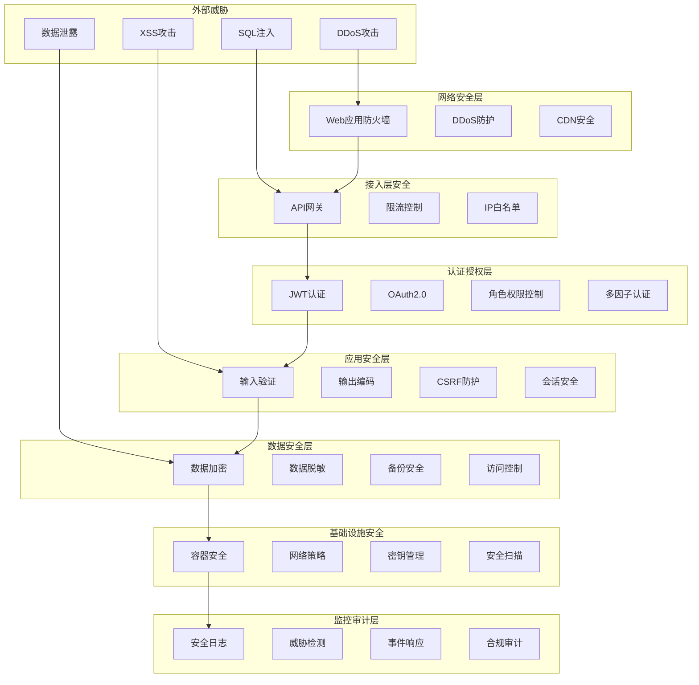

# 安全设计文档

## 1. 安全架构概述

历史文本漂洗项目采用多层次的安全防护体系，从网络层到应用层、从数据传输到数据存储，全方位保障系统和用户数据的安全。安全设计遵循零信任架构原则，确保每个组件都经过身份验证和授权。

### 1.1 安全设计原则

- **最小权限原则**: 用户和服务只获得完成任务所需的最小权限
- **深度防御**: 多层安全控制，单点失效不会导致整体安全失效
- **零信任架构**: 不信任网络内的任何实体，所有访问都需要验证
- **数据保护**: 敏感数据加密存储和传输
- **安全审计**: 完整的安全日志和审计跟踪
- **持续监控**: 实时安全监控和威胁检测

### 1.2 安全架构图



## 2. 身份认证与授权

### 2.1 JWT认证实现

```python
# auth.py - JWT认证服务
import jwt
import bcrypt
from datetime import datetime, timedelta
from typing import Optional, Dict, Any
from cryptography.hazmat.primitives import hashes
from cryptography.hazmat.primitives.kdf.pbkdf2 import PBKDF2HMAC
from cryptography.hazmat.backends import default_backend
import secrets
import base64

class JWTAuthService:
    def __init__(self, secret_key: str, algorithm: str = 'HS256'):
        self.secret_key = secret_key
        self.algorithm = algorithm
        self.access_token_expire = timedelta(hours=1)
        self.refresh_token_expire = timedelta(days=7)
    
    def hash_password(self, password: str) -> str:
        """密码哈希"""
        salt = bcrypt.gensalt(rounds=12)
        hashed = bcrypt.hashpw(password.encode('utf-8'), salt)
        return hashed.decode('utf-8')
    
    def verify_password(self, password: str, hashed: str) -> bool:
        """验证密码"""
        return bcrypt.checkpw(password.encode('utf-8'), hashed.encode('utf-8'))
    
    def generate_tokens(self, user_id: str, user_data: Dict[str, Any]) -> Dict[str, str]:
        """生成访问令牌和刷新令牌"""
        now = datetime.utcnow()
        
        # 访问令牌载荷
        access_payload = {
            'user_id': user_id,
            'username': user_data.get('username'),
            'email': user_data.get('email'),
            'roles': user_data.get('roles', []),
            'permissions': user_data.get('permissions', []),
            'iat': now,
            'exp': now + self.access_token_expire,
            'type': 'access'
        }
        
        # 刷新令牌载荷
        refresh_payload = {
            'user_id': user_id,
            'iat': now,
            'exp': now + self.refresh_token_expire,
            'type': 'refresh',
            'jti': secrets.token_urlsafe(32)  # JWT ID用于令牌撤销
        }
        
        access_token = jwt.encode(access_payload, self.secret_key, algorithm=self.algorithm)
        refresh_token = jwt.encode(refresh_payload, self.secret_key, algorithm=self.algorithm)
        
        return {
            'access_token': access_token,
            'refresh_token': refresh_token,
            'token_type': 'Bearer',
            'expires_in': int(self.access_token_expire.total_seconds())
        }
    
    def verify_token(self, token: str) -> Optional[Dict[str, Any]]:
        """验证令牌"""
        try:
            payload = jwt.decode(token, self.secret_key, algorithms=[self.algorithm])
            
            # 检查令牌类型
            if payload.get('type') != 'access':
                return None
            
            # 检查过期时间
            if datetime.utcnow() > datetime.fromtimestamp(payload['exp']):
                return None
            
            return payload
            
        except jwt.InvalidTokenError:
            return None
    
    def refresh_access_token(self, refresh_token: str) -> Optional[Dict[str, str]]:
        """刷新访问令牌"""
        try:
            payload = jwt.decode(refresh_token, self.secret_key, algorithms=[self.algorithm])
            
            # 检查令牌类型
            if payload.get('type') != 'refresh':
                return None
            
            # 检查是否在黑名单中
            if self.is_token_blacklisted(payload.get('jti')):
                return None
            
            # 获取用户信息并生成新令牌
            user_id = payload['user_id']
            user_data = self.get_user_data(user_id)
            
            if not user_data:
                return None
            
            return self.generate_tokens(user_id, user_data)
            
        except jwt.InvalidTokenError:
            return None
    
    def revoke_token(self, token: str) -> bool:
        """撤销令牌"""
        try:
            payload = jwt.decode(token, self.secret_key, algorithms=[self.algorithm])
            jti = payload.get('jti')
            
            if jti:
                # 将JTI添加到黑名单
                self.add_to_blacklist(jti, payload['exp'])
                return True
            
            return False
            
        except jwt.InvalidTokenError:
            return False
    
    def is_token_blacklisted(self, jti: str) -> bool:
        """检查令牌是否在黑名单中"""
        # 从Redis或数据库检查黑名单
        # 实现具体的黑名单检查逻辑
        pass
    
    def add_to_blacklist(self, jti: str, exp: int):
        """添加到黑名单"""
        # 将JTI添加到Redis黑名单，设置过期时间
        # 实现具体的黑名单添加逻辑
        pass
    
    def get_user_data(self, user_id: str) -> Optional[Dict[str, Any]]:
        """获取用户数据"""
        # 从数据库获取用户信息
        # 实现具体的用户数据获取逻辑
        pass

# 多因子认证
class MFAService:
    def __init__(self):
        self.totp_issuer = "Historical Text Project"
    
    def generate_secret(self) -> str:
        """生成TOTP密钥"""
        return base64.b32encode(secrets.token_bytes(20)).decode('utf-8')
    
    def generate_qr_code_url(self, user_email: str, secret: str) -> str:
        """生成二维码URL"""
        import urllib.parse
        
        totp_uri = f"otpauth://totp/{self.totp_issuer}:{user_email}?secret={secret}&issuer={self.totp_issuer}"
        return f"https://api.qrserver.com/v1/create-qr-code/?size=200x200&data={urllib.parse.quote(totp_uri)}"
    
    def verify_totp(self, secret: str, token: str, window: int = 1) -> bool:
        """验证TOTP令牌"""
        import pyotp
        
        totp = pyotp.TOTP(secret)
        return totp.verify(token, valid_window=window)
    
    def generate_backup_codes(self, count: int = 10) -> list:
        """生成备用代码"""
        codes = []
        for _ in range(count):
            code = '-'.join([secrets.token_hex(4) for _ in range(2)])
            codes.append(code)
        return codes
    
    def verify_backup_code(self, user_id: str, code: str) -> bool:
        """验证备用代码"""
        # 从数据库检查备用代码
        # 使用后标记为已使用
        pass

# 认证中间件
class AuthMiddleware:
    def __init__(self, auth_service: JWTAuthService):
        self.auth_service = auth_service
    
    def __call__(self, request, call_next):
        # 提取Authorization头
        auth_header = request.headers.get('Authorization')
        
        if not auth_header or not auth_header.startswith('Bearer '):
            return self.unauthorized_response()
        
        token = auth_header[7:]  # 移除'Bearer '前缀
        
        # 验证令牌
        payload = self.auth_service.verify_token(token)
        
        if not payload:
            return self.unauthorized_response()
        
        # 将用户信息添加到请求上下文
        request.state.user = {
            'id': payload['user_id'],
            'username': payload['username'],
            'email': payload['email'],
            'roles': payload['roles'],
            'permissions': payload['permissions']
        }
        
        return call_next(request)
    
    def unauthorized_response(self):
        from fastapi import HTTPException
        raise HTTPException(status_code=401, detail="Unauthorized")
```

### 2.2 RBAC权限控制

```python
# rbac.py - 基于角色的访问控制
from typing import List, Dict, Set, Optional
from enum import Enum
from dataclasses import dataclass
from functools import wraps

class Permission(Enum):
    # 用户管理权限
    USER_CREATE = "user:create"
    USER_READ = "user:read"
    USER_UPDATE = "user:update"
    USER_DELETE = "user:delete"
    
    # 文档管理权限
    DOCUMENT_CREATE = "document:create"
    DOCUMENT_READ = "document:read"
    DOCUMENT_UPDATE = "document:update"
    DOCUMENT_DELETE = "document:delete"
    DOCUMENT_SHARE = "document:share"
    
    # 系统管理权限
    SYSTEM_CONFIG = "system:config"
    SYSTEM_MONITOR = "system:monitor"
    SYSTEM_BACKUP = "system:backup"
    
    # AI服务权限
    AI_ANALYZE = "ai:analyze"
    AI_TRAIN = "ai:train"
    AI_DEPLOY = "ai:deploy"

@dataclass
class Role:
    name: str
    description: str
    permissions: Set[Permission]
    is_system_role: bool = False

class RBACService:
    def __init__(self):
        self.roles: Dict[str, Role] = {}
        self.user_roles: Dict[str, Set[str]] = {}
        self.role_hierarchy: Dict[str, Set[str]] = {}
        
        # 初始化系统角色
        self._init_system_roles()
    
    def _init_system_roles(self):
        """初始化系统角色"""
        # 超级管理员
        admin_permissions = set(Permission)
        self.create_role("admin", "超级管理员", admin_permissions, is_system_role=True)
        
        # 文档管理员
        doc_admin_permissions = {
            Permission.DOCUMENT_CREATE,
            Permission.DOCUMENT_READ,
            Permission.DOCUMENT_UPDATE,
            Permission.DOCUMENT_DELETE,
            Permission.DOCUMENT_SHARE,
            Permission.USER_READ,
            Permission.AI_ANALYZE
        }
        self.create_role("doc_admin", "文档管理员", doc_admin_permissions, is_system_role=True)
        
        # 普通用户
        user_permissions = {
            Permission.DOCUMENT_CREATE,
            Permission.DOCUMENT_READ,
            Permission.DOCUMENT_UPDATE,
            Permission.DOCUMENT_DELETE,
            Permission.AI_ANALYZE
        }
        self.create_role("user", "普通用户", user_permissions, is_system_role=True)
        
        # 访客
        guest_permissions = {
            Permission.DOCUMENT_READ
        }
        self.create_role("guest", "访客", guest_permissions, is_system_role=True)
        
        # 设置角色层次
        self.role_hierarchy = {
            "admin": {"doc_admin", "user", "guest"},
            "doc_admin": {"user", "guest"},
            "user": {"guest"},
            "guest": set()
        }
    
    def create_role(self, name: str, description: str, permissions: Set[Permission], is_system_role: bool = False) -> bool:
        """创建角色"""
        if name in self.roles:
            return False
        
        self.roles[name] = Role(name, description, permissions, is_system_role)
        return True
    
    def assign_role_to_user(self, user_id: str, role_name: str) -> bool:
        """为用户分配角色"""
        if role_name not in self.roles:
            return False
        
        if user_id not in self.user_roles:
            self.user_roles[user_id] = set()
        
        self.user_roles[user_id].add(role_name)
        return True
    
    def remove_role_from_user(self, user_id: str, role_name: str) -> bool:
        """移除用户角色"""
        if user_id not in self.user_roles:
            return False
        
        self.user_roles[user_id].discard(role_name)
        return True
    
    def get_user_permissions(self, user_id: str) -> Set[Permission]:
        """获取用户所有权限"""
        permissions = set()
        user_roles = self.user_roles.get(user_id, set())
        
        for role_name in user_roles:
            role = self.roles.get(role_name)
            if role:
                permissions.update(role.permissions)
                
                # 添加继承的权限
                inherited_roles = self._get_inherited_roles(role_name)
                for inherited_role in inherited_roles:
                    inherited_role_obj = self.roles.get(inherited_role)
                    if inherited_role_obj:
                        permissions.update(inherited_role_obj.permissions)
        
        return permissions
    
    def _get_inherited_roles(self, role_name: str) -> Set[str]:
        """获取继承的角色"""
        inherited = set()
        
        def collect_inherited(current_role):
            if current_role in self.role_hierarchy:
                for child_role in self.role_hierarchy[current_role]:
                    inherited.add(child_role)
                    collect_inherited(child_role)
        
        collect_inherited(role_name)
        return inherited
    
    def has_permission(self, user_id: str, permission: Permission) -> bool:
        """检查用户是否有特定权限"""
        user_permissions = self.get_user_permissions(user_id)
        return permission in user_permissions
    
    def has_any_permission(self, user_id: str, permissions: List[Permission]) -> bool:
        """检查用户是否有任一权限"""
        user_permissions = self.get_user_permissions(user_id)
        return any(perm in user_permissions for perm in permissions)
    
    def has_all_permissions(self, user_id: str, permissions: List[Permission]) -> bool:
        """检查用户是否有所有权限"""
        user_permissions = self.get_user_permissions(user_id)
        return all(perm in user_permissions for perm in permissions)
    
    def check_resource_access(self, user_id: str, resource_type: str, resource_id: str, action: str) -> bool:
        """检查资源访问权限"""
        # 构造权限字符串
        permission_str = f"{resource_type}:{action}"
        
        try:
            permission = Permission(permission_str)
            
            # 检查基本权限
            if not self.has_permission(user_id, permission):
                return False
            
            # 检查资源所有权（如果是文档）
            if resource_type == "document":
                return self._check_document_ownership(user_id, resource_id, action)
            
            return True
            
        except ValueError:
            # 未知权限
            return False
    
    def _check_document_ownership(self, user_id: str, document_id: str, action: str) -> bool:
        """检查文档所有权"""
        # 如果是管理员，允许所有操作
        if self.has_permission(user_id, Permission.SYSTEM_CONFIG):
            return True
        
        # 获取文档信息
        document = self._get_document(document_id)
        if not document:
            return False
        
        # 检查所有权
        if document['owner_id'] == user_id:
            return True
        
        # 检查共享权限
        if action == "read" and self._is_document_shared_with_user(document_id, user_id):
            return True
        
        return False
    
    def _get_document(self, document_id: str) -> Optional[Dict]:
        """获取文档信息"""
        # 从数据库获取文档信息
        pass
    
    def _is_document_shared_with_user(self, document_id: str, user_id: str) -> bool:
        """检查文档是否与用户共享"""
        # 检查文档共享设置
        pass

# 权限装饰器
def require_permission(permission: Permission):
    """权限检查装饰器"""
    def decorator(func):
        @wraps(func)
        def wrapper(*args, **kwargs):
            # 从请求上下文获取用户信息
            user_id = get_current_user_id()
            
            if not rbac_service.has_permission(user_id, permission):
                raise PermissionError(f"Permission denied: {permission.value}")
            
            return func(*args, **kwargs)
        return wrapper
    return decorator

def require_any_permission(*permissions: Permission):
    """任一权限检查装饰器"""
    def decorator(func):
        @wraps(func)
        def wrapper(*args, **kwargs):
            user_id = get_current_user_id()
            
            if not rbac_service.has_any_permission(user_id, list(permissions)):
                perm_names = [p.value for p in permissions]
                raise PermissionError(f"Permission denied. Required any of: {perm_names}")
            
            return func(*args, **kwargs)
        return wrapper
    return decorator

def require_resource_access(resource_type: str, action: str):
    """资源访问权限装饰器"""
    def decorator(func):
        @wraps(func)
        def wrapper(*args, **kwargs):
            user_id = get_current_user_id()
            resource_id = kwargs.get('resource_id') or kwargs.get('id')
            
            if not rbac_service.check_resource_access(user_id, resource_type, resource_id, action):
                raise PermissionError(f"Access denied to {resource_type}:{resource_id}")
            
            return func(*args, **kwargs)
        return wrapper
    return decorator

# 全局RBAC服务实例
rbac_service = RBACService()

# 使用示例
@require_permission(Permission.DOCUMENT_CREATE)
def create_document(title: str, content: str):
    # 创建文档逻辑
    pass

@require_resource_access("document", "update")
def update_document(document_id: str, title: str, content: str):
    # 更新文档逻辑
    pass

@require_any_permission(Permission.SYSTEM_CONFIG, Permission.SYSTEM_MONITOR)
def get_system_stats():
    # 获取系统统计信息
    pass
```

## 3. 数据安全

### 3.1 数据加密

```python
# encryption.py - 数据加密服务
from cryptography.fernet import Fernet
from cryptography.hazmat.primitives import hashes, serialization
from cryptography.hazmat.primitives.asymmetric import rsa, padding
from cryptography.hazmat.primitives.kdf.pbkdf2 import PBKDF2HMAC
from cryptography.hazmat.backends import default_backend
import base64
import os
import secrets
from typing import Union, Tuple

class EncryptionService:
    def __init__(self, master_key: str = None):
        self.backend = default_backend()
        
        if master_key:
            self.master_key = master_key.encode()
        else:
            self.master_key = self._generate_master_key()
        
        # 初始化对称加密
        self.fernet = self._create_fernet_cipher()
        
        # 生成RSA密钥对
        self.private_key, self.public_key = self._generate_rsa_keypair()
    
    def _generate_master_key(self) -> bytes:
        """生成主密钥"""
        return secrets.token_bytes(32)
    
    def _create_fernet_cipher(self) -> Fernet:
        """创建Fernet加密器"""
        # 使用PBKDF2从主密钥派生Fernet密钥
        salt = b'historical_text_salt'  # 在生产环境中应该使用随机盐
        kdf = PBKDF2HMAC(
            algorithm=hashes.SHA256(),
            length=32,
            salt=salt,
            iterations=100000,
            backend=self.backend
        )
        key = base64.urlsafe_b64encode(kdf.derive(self.master_key))
        return Fernet(key)
    
    def _generate_rsa_keypair(self) -> Tuple[rsa.RSAPrivateKey, rsa.RSAPublicKey]:
        """生成RSA密钥对"""
        private_key = rsa.generate_private_key(
            public_exponent=65537,
            key_size=2048,
            backend=self.backend
        )
        public_key = private_key.public_key()
        return private_key, public_key
    
    def encrypt_symmetric(self, data: Union[str, bytes]) -> str:
        """对称加密"""
        if isinstance(data, str):
            data = data.encode('utf-8')
        
        encrypted = self.fernet.encrypt(data)
        return base64.urlsafe_b64encode(encrypted).decode('utf-8')
    
    def decrypt_symmetric(self, encrypted_data: str) -> str:
        """对称解密"""
        encrypted_bytes = base64.urlsafe_b64decode(encrypted_data.encode('utf-8'))
        decrypted = self.fernet.decrypt(encrypted_bytes)
        return decrypted.decode('utf-8')
    
    def encrypt_asymmetric(self, data: Union[str, bytes], public_key: rsa.RSAPublicKey = None) -> str:
        """非对称加密"""
        if isinstance(data, str):
            data = data.encode('utf-8')
        
        key = public_key or self.public_key
        
        encrypted = key.encrypt(
            data,
            padding.OAEP(
                mgf=padding.MGF1(algorithm=hashes.SHA256()),
                algorithm=hashes.SHA256(),
                label=None
            )
        )
        
        return base64.urlsafe_b64encode(encrypted).decode('utf-8')
    
    def decrypt_asymmetric(self, encrypted_data: str) -> str:
        """非对称解密"""
        encrypted_bytes = base64.urlsafe_b64decode(encrypted_data.encode('utf-8'))
        
        decrypted = self.private_key.decrypt(
            encrypted_bytes,
            padding.OAEP(
                mgf=padding.MGF1(algorithm=hashes.SHA256()),
                algorithm=hashes.SHA256(),
                label=None
            )
        )
        
        return decrypted.decode('utf-8')
    
    def hash_data(self, data: Union[str, bytes], salt: bytes = None) -> Tuple[str, str]:
        """数据哈希"""
        if isinstance(data, str):
            data = data.encode('utf-8')
        
        if salt is None:
            salt = secrets.token_bytes(32)
        
        digest = hashes.Hash(hashes.SHA256(), backend=self.backend)
        digest.update(salt + data)
        hash_value = digest.finalize()
        
        return (
            base64.urlsafe_b64encode(hash_value).decode('utf-8'),
            base64.urlsafe_b64encode(salt).decode('utf-8')
        )
    
    def verify_hash(self, data: Union[str, bytes], hash_value: str, salt: str) -> bool:
        """验证哈希"""
        if isinstance(data, str):
            data = data.encode('utf-8')
        
        salt_bytes = base64.urlsafe_b64decode(salt.encode('utf-8'))
        expected_hash, _ = self.hash_data(data, salt_bytes)
        
        return hash_value == expected_hash
    
    def export_public_key(self) -> str:
        """导出公钥"""
        pem = self.public_key.public_bytes(
            encoding=serialization.Encoding.PEM,
            format=serialization.PublicFormat.SubjectPublicKeyInfo
        )
        return pem.decode('utf-8')
    
    def import_public_key(self, pem_data: str) -> rsa.RSAPublicKey:
        """导入公钥"""
        return serialization.load_pem_public_key(
            pem_data.encode('utf-8'),
            backend=self.backend
        )

# 数据脱敏服务
class DataMaskingService:
    def __init__(self):
        self.masking_rules = {
            'email': self._mask_email,
            'phone': self._mask_phone,
            'id_card': self._mask_id_card,
            'bank_card': self._mask_bank_card,
            'name': self._mask_name,
            'address': self._mask_address
        }
    
    def mask_data(self, data: str, data_type: str) -> str:
        """数据脱敏"""
        if data_type in self.masking_rules:
            return self.masking_rules[data_type](data)
        return data
    
    def _mask_email(self, email: str) -> str:
        """邮箱脱敏"""
        if '@' not in email:
            return email
        
        local, domain = email.split('@', 1)
        if len(local) <= 2:
            masked_local = '*' * len(local)
        else:
            masked_local = local[0] + '*' * (len(local) - 2) + local[-1]
        
        return f"{masked_local}@{domain}"
    
    def _mask_phone(self, phone: str) -> str:
        """手机号脱敏"""
        if len(phone) != 11:
            return phone
        
        return phone[:3] + '****' + phone[7:]
    
    def _mask_id_card(self, id_card: str) -> str:
        """身份证脱敏"""
        if len(id_card) not in [15, 18]:
            return id_card
        
        return id_card[:6] + '*' * (len(id_card) - 10) + id_card[-4:]
    
    def _mask_bank_card(self, bank_card: str) -> str:
        """银行卡脱敏"""
        if len(bank_card) < 8:
            return bank_card
        
        return bank_card[:4] + '*' * (len(bank_card) - 8) + bank_card[-4:]
    
    def _mask_name(self, name: str) -> str:
        """姓名脱敏"""
        if len(name) <= 1:
            return name
        elif len(name) == 2:
            return name[0] + '*'
        else:
            return name[0] + '*' * (len(name) - 2) + name[-1]
    
    def _mask_address(self, address: str) -> str:
        """地址脱敏"""
        if len(address) <= 6:
            return '*' * len(address)
        
        return address[:6] + '*' * (len(address) - 6)
    
    def mask_json_data(self, data: dict, fields_to_mask: dict) -> dict:
        """JSON数据脱敏"""
        masked_data = data.copy()
        
        for field, data_type in fields_to_mask.items():
            if field in masked_data:
                masked_data[field] = self.mask_data(str(masked_data[field]), data_type)
        
        return masked_data

# 全局加密服务实例
encryption_service = EncryptionService()
masking_service = DataMaskingService()

# 数据库字段加密装饰器
def encrypted_field(field_name: str):
    """数据库字段加密装饰器"""
    def decorator(cls):
        original_setattr = cls.__setattr__
        original_getattribute = cls.__getattribute__
        
        def new_setattr(self, name, value):
            if name == field_name and isinstance(value, str):
                value = encryption_service.encrypt_symmetric(value)
            original_setattr(self, name, value)
        
        def new_getattribute(self, name):
            value = original_getattribute(self, name)
            if name == field_name and isinstance(value, str):
                try:
                    value = encryption_service.decrypt_symmetric(value)
                except:
                    pass  # 如果解密失败，返回原值
            return value
        
        cls.__setattr__ = new_setattr
        cls.__getattribute__ = new_getattribute
        
        return cls
    return decorator

# 使用示例
@encrypted_field('content')
class Document:
    def __init__(self, title: str, content: str):
        self.title = title
        self.content = content  # 自动加密
    
    def get_content(self):
        return self.content  # 自动解密
```

### 3.2 安全配置

```yaml
# kubernetes/security-policies.yaml - Kubernetes安全策略
apiVersion: policy/v1beta1
kind: PodSecurityPolicy
metadata:
  name: historical-text-psp
  namespace: historical-text
spec:
  privileged: false
  allowPrivilegeEscalation: false
  
  # 用户和组设置
  runAsUser:
    rule: 'MustRunAsNonRoot'
  runAsGroup:
    rule: 'MustRunAs'
    ranges:
      - min: 1000
        max: 65535
  
  # 文件系统
  fsGroup:
    rule: 'RunAsAny'
  readOnlyRootFilesystem: true
  
  # 卷类型限制
  volumes:
    - 'configMap'
    - 'emptyDir'
    - 'projected'
    - 'secret'
    - 'downwardAPI'
    - 'persistentVolumeClaim'
  
  # 网络策略
  hostNetwork: false
  hostIPC: false
  hostPID: false
  
  # SELinux
  seLinux:
    rule: 'RunAsAny'
  
  # 补充组
  supplementalGroups:
    rule: 'MustRunAs'
    ranges:
      - min: 1000
        max: 65535

---
# 网络策略
apiVersion: networking.k8s.io/v1
kind: NetworkPolicy
metadata:
  name: historical-text-network-policy
  namespace: historical-text
spec:
  podSelector: {}
  policyTypes:
  - Ingress
  - Egress
  
  ingress:
  # 允许来自同命名空间的流量
  - from:
    - namespaceSelector:
        matchLabels:
          name: historical-text
  
  # 允许来自Ingress控制器的流量
  - from:
    - namespaceSelector:
        matchLabels:
          name: ingress-nginx
    ports:
    - protocol: TCP
      port: 8080
  
  egress:
  # 允许DNS查询
  - to: []
    ports:
    - protocol: UDP
      port: 53
  
  # 允许访问数据库
  - to:
    - namespaceSelector:
        matchLabels:
          name: database
    ports:
    - protocol: TCP
      port: 5432
    - protocol: TCP
      port: 6379
    - protocol: TCP
      port: 27017
  
  # 允许HTTPS出站流量
  - to: []
    ports:
    - protocol: TCP
      port: 443

---
# RBAC配置
apiVersion: rbac.authorization.k8s.io/v1
kind: Role
metadata:
  namespace: historical-text
  name: historical-text-role
rules:
- apiGroups: [""]
  resources: ["pods", "services", "configmaps", "secrets"]
  verbs: ["get", "list", "watch"]
- apiGroups: ["apps"]
  resources: ["deployments", "replicasets"]
  verbs: ["get", "list", "watch"]

---
apiVersion: rbac.authorization.k8s.io/v1
kind: RoleBinding
metadata:
  name: historical-text-rolebinding
  namespace: historical-text
subjects:
- kind: ServiceAccount
  name: historical-text-sa
  namespace: historical-text
roleRef:
  kind: Role
  name: historical-text-role
  apiGroup: rbac.authorization.k8s.io

---
apiVersion: v1
kind: ServiceAccount
metadata:
  name: historical-text-sa
  namespace: historical-text
automountServiceAccountToken: false
```

---

**文档版本**: v1.0  
**最后更新**: 2024-01-01  
**维护者**: 安全团队