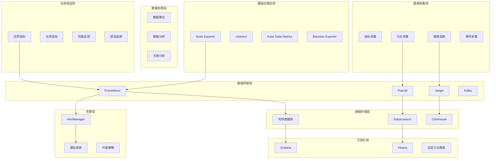

# 监控与运维设计文档

## 1. 监控体系概述

历史文本漂洗项目采用全方位的监控体系，涵盖基础设施监控、应用性能监控、业务指标监控和安全监控。通过多层次的监控策略，确保系统的稳定性、可用性和性能。

### 1.1 监控架构图



### 1.2 监控指标体系

| 监控类型 | 关键指标 | 阈值 | 说明 |
|----------|----------|------|------|
| **基础设施** | CPU使用率 | >80% | 服务器CPU负载 |
| | 内存使用率 | >85% | 服务器内存使用 |
| | 磁盘使用率 | >90% | 磁盘空间使用 |
| | 网络I/O | >100MB/s | 网络带宽使用 |
| **应用性能** | 响应时间 | >500ms | API响应延迟 |
| | 吞吐量 | <100 QPS | 请求处理能力 |
| | 错误率 | >1% | 应用错误比例 |
| | 可用性 | <99.9% | 服务可用性 |
| **业务指标** | 用户活跃度 | 日活<1000 | 用户使用情况 |
| | 文档处理量 | 日处理<100 | 业务处理能力 |
| | 转换成功率 | <95% | 文档转换质量 |
| **数据库** | 连接数 | >80% | 数据库连接池 |
| | 查询延迟 | >100ms | 数据库性能 |
| | 锁等待 | >10s | 数据库锁竞争 |

## 2. Prometheus监控配置

### 2.1 Prometheus配置

```yaml
# prometheus.yml - Prometheus主配置
global:
  scrape_interval: 15s
  evaluation_interval: 15s
  external_labels:
    cluster: 'historical-text-prod'
    region: 'us-west-2'

rule_files:
  - "rules/*.yml"

alerting:
  alertmanagers:
    - static_configs:
        - targets:
          - alertmanager:9093

scrape_configs:
  # Kubernetes API Server
  - job_name: 'kubernetes-apiservers'
    kubernetes_sd_configs:
    - role: endpoints
    scheme: https
    tls_config:
      ca_file: /var/run/secrets/kubernetes.io/serviceaccount/ca.crt
    bearer_token_file: /var/run/secrets/kubernetes.io/serviceaccount/token
    relabel_configs:
    - source_labels: [__meta_kubernetes_namespace, __meta_kubernetes_service_name, __meta_kubernetes_endpoint_port_name]
      action: keep
      regex: default;kubernetes;https

  # Node Exporter
  - job_name: 'kubernetes-nodes'
    kubernetes_sd_configs:
    - role: node
    relabel_configs:
    - action: labelmap
      regex: __meta_kubernetes_node_label_(.+)
    - target_label: __address__
      replacement: kubernetes.default.svc:443
    - source_labels: [__meta_kubernetes_node_name]
      regex: (.+)
      target_label: __metrics_path__
      replacement: /api/v1/nodes/${1}/proxy/metrics

  # Kubelet cAdvisor
  - job_name: 'kubernetes-cadvisor'
    kubernetes_sd_configs:
    - role: node
    scheme: https
    tls_config:
      ca_file: /var/run/secrets/kubernetes.io/serviceaccount/ca.crt
    bearer_token_file: /var/run/secrets/kubernetes.io/serviceaccount/token
    relabel_configs:
    - action: labelmap
      regex: __meta_kubernetes_node_label_(.+)
    - target_label: __address__
      replacement: kubernetes.default.svc:443
    - source_labels: [__meta_kubernetes_node_name]
      regex: (.+)
      target_label: __metrics_path__
      replacement: /api/v1/nodes/${1}/proxy/metrics/cadvisor

  # 应用服务监控
  - job_name: 'historical-text-services'
    kubernetes_sd_configs:
    - role: endpoints
      namespaces:
        names:
        - historical-text
    relabel_configs:
    - source_labels: [__meta_kubernetes_service_annotation_prometheus_io_scrape]
      action: keep
      regex: true
    - source_labels: [__meta_kubernetes_service_annotation_prometheus_io_path]
      action: replace
      target_label: __metrics_path__
      regex: (.+)
    - source_labels: [__address__, __meta_kubernetes_service_annotation_prometheus_io_port]
      action: replace
      regex: ([^:]+)(?::\d+)?;(\d+)
      replacement: $1:$2
      target_label: __address__
    - action: labelmap
      regex: __meta_kubernetes_service_label_(.+)
    - source_labels: [__meta_kubernetes_namespace]
      action: replace
      target_label: kubernetes_namespace
    - source_labels: [__meta_kubernetes_service_name]
      action: replace
      target_label: kubernetes_name

  # PostgreSQL监控
  - job_name: 'postgresql'
    static_configs:
    - targets: ['postgres-exporter:9187']
    scrape_interval: 30s

  # Redis监控
  - job_name: 'redis'
    static_configs:
    - targets: ['redis-exporter:9121']
    scrape_interval: 30s

  # Elasticsearch监控
  - job_name: 'elasticsearch'
    static_configs:
    - targets: ['elasticsearch-exporter:9114']
    scrape_interval: 30s

  # 黑盒监控
  - job_name: 'blackbox'
    metrics_path: /probe
    params:
      module: [http_2xx]
    static_configs:
    - targets:
      - https://api.historical-text.com/health
      - https://app.historical-text.com
    relabel_configs:
    - source_labels: [__address__]
      target_label: __param_target
    - source_labels: [__param_target]
      target_label: instance
    - target_label: __address__
      replacement: blackbox-exporter:9115

# 存储配置
storage:
  tsdb:
    path: /prometheus/data
    retention.time: 30d
    retention.size: 100GB
    wal-compression: true
```

### 2.2 告警规则配置

```yaml
# rules/infrastructure.yml - 基础设施告警规则
groups:
- name: infrastructure
  rules:
  # 节点宕机
  - alert: NodeDown
    expr: up{job="kubernetes-nodes"} == 0
    for: 1m
    labels:
      severity: critical
    annotations:
      summary: "Node {{ $labels.instance }} is down"
      description: "Node {{ $labels.instance }} has been down for more than 1 minute."

  # CPU使用率过高
  - alert: HighCPUUsage
    expr: 100 - (avg by(instance) (irate(node_cpu_seconds_total{mode="idle"}[5m])) * 100) > 80
    for: 5m
    labels:
      severity: warning
    annotations:
      summary: "High CPU usage on {{ $labels.instance }}"
      description: "CPU usage is above 80% for more than 5 minutes on {{ $labels.instance }}."

  # 内存使用率过高
  - alert: HighMemoryUsage
    expr: (1 - (node_memory_MemAvailable_bytes / node_memory_MemTotal_bytes)) * 100 > 85
    for: 5m
    labels:
      severity: warning
    annotations:
      summary: "High memory usage on {{ $labels.instance }}"
      description: "Memory usage is above 85% for more than 5 minutes on {{ $labels.instance }}."

  # 磁盘空间不足
  - alert: DiskSpaceLow
    expr: (1 - (node_filesystem_avail_bytes{fstype!="tmpfs"} / node_filesystem_size_bytes{fstype!="tmpfs"})) * 100 > 90
    for: 5m
    labels:
      severity: critical
    annotations:
      summary: "Disk space low on {{ $labels.instance }}"
      description: "Disk usage is above 90% on {{ $labels.instance }} {{ $labels.mountpoint }}."

  # 磁盘I/O过高
  - alert: HighDiskIO
    expr: irate(node_disk_io_time_seconds_total[5m]) * 100 > 80
    for: 5m
    labels:
      severity: warning
    annotations:
      summary: "High disk I/O on {{ $labels.instance }}"
      description: "Disk I/O usage is above 80% for more than 5 minutes on {{ $labels.instance }}."

---
# rules/application.yml - 应用告警规则
groups:
- name: application
  rules:
  # 应用服务宕机
  - alert: ServiceDown
    expr: up{job="historical-text-services"} == 0
    for: 1m
    labels:
      severity: critical
    annotations:
      summary: "Service {{ $labels.kubernetes_name }} is down"
      description: "Service {{ $labels.kubernetes_name }} in namespace {{ $labels.kubernetes_namespace }} has been down for more than 1 minute."

  # API响应时间过长
  - alert: HighAPILatency
    expr: histogram_quantile(0.95, rate(http_request_duration_seconds_bucket[5m])) > 0.5
    for: 5m
    labels:
      severity: warning
    annotations:
      summary: "High API latency on {{ $labels.service }}"
      description: "95th percentile latency is above 500ms for more than 5 minutes on {{ $labels.service }}."

  # API错误率过高
  - alert: HighErrorRate
    expr: rate(http_requests_total{status=~"5.."}[5m]) / rate(http_requests_total[5m]) * 100 > 1
    for: 5m
    labels:
      severity: warning
    annotations:
      summary: "High error rate on {{ $labels.service }}"
      description: "Error rate is above 1% for more than 5 minutes on {{ $labels.service }}."

  # Pod重启频繁
  - alert: PodCrashLooping
    expr: rate(kube_pod_container_status_restarts_total[15m]) * 60 * 15 > 0
    for: 5m
    labels:
      severity: warning
    annotations:
      summary: "Pod {{ $labels.pod }} is crash looping"
      description: "Pod {{ $labels.pod }} in namespace {{ $labels.namespace }} is restarting frequently."

  # 容器内存使用率过高
  - alert: ContainerHighMemoryUsage
    expr: (container_memory_working_set_bytes{name!=""} / container_spec_memory_limit_bytes{name!=""}) * 100 > 80
    for: 5m
    labels:
      severity: warning
    annotations:
      summary: "Container {{ $labels.name }} high memory usage"
      description: "Container {{ $labels.name }} memory usage is above 80% for more than 5 minutes."

---
# rules/database.yml - 数据库告警规则
groups:
- name: database
  rules:
  # PostgreSQL连接数过多
  - alert: PostgreSQLTooManyConnections
    expr: pg_stat_database_numbackends / pg_settings_max_connections * 100 > 80
    for: 5m
    labels:
      severity: warning
    annotations:
      summary: "PostgreSQL too many connections"
      description: "PostgreSQL connection usage is above 80% for more than 5 minutes."

  # PostgreSQL查询时间过长
  - alert: PostgreSQLSlowQueries
    expr: pg_stat_activity_max_tx_duration > 300
    for: 5m
    labels:
      severity: warning
    annotations:
      summary: "PostgreSQL slow queries detected"
      description: "PostgreSQL has queries running for more than 5 minutes."

  # Redis内存使用率过高
  - alert: RedisHighMemoryUsage
    expr: redis_memory_used_bytes / redis_memory_max_bytes * 100 > 80
    for: 5m
    labels:
      severity: warning
    annotations:
      summary: "Redis high memory usage"
      description: "Redis memory usage is above 80% for more than 5 minutes."

  # Redis连接数过多
  - alert: RedisTooManyConnections
    expr: redis_connected_clients > 100
    for: 5m
    labels:
      severity: warning
    annotations:
      summary: "Redis too many connections"
      description: "Redis has more than 100 connected clients for more than 5 minutes."
```

### 2.3 应用指标采集

```python
# metrics.py - 应用指标采集
from prometheus_client import Counter, Histogram, Gauge, Summary, CollectorRegistry, generate_latest
from prometheus_client.multiprocess import MultiProcessCollector
from functools import wraps
import time
import psutil
import threading
from typing import Dict, Any

class MetricsCollector:
    def __init__(self):
        # 创建指标注册表
        self.registry = CollectorRegistry()
        
        # HTTP请求指标
        self.http_requests_total = Counter(
            'http_requests_total',
            'Total HTTP requests',
            ['method', 'endpoint', 'status'],
            registry=self.registry
        )
        
        self.http_request_duration = Histogram(
            'http_request_duration_seconds',
            'HTTP request duration in seconds',
            ['method', 'endpoint'],
            buckets=[0.01, 0.05, 0.1, 0.25, 0.5, 1.0, 2.5, 5.0, 10.0],
            registry=self.registry
        )
        
        # 业务指标
        self.document_processing_total = Counter(
            'document_processing_total',
            'Total documents processed',
            ['status', 'type'],
            registry=self.registry
        )
        
        self.document_processing_duration = Histogram(
            'document_processing_duration_seconds',
            'Document processing duration in seconds',
            ['type'],
            buckets=[1, 5, 10, 30, 60, 300, 600],
            registry=self.registry
        )
        
        self.active_users = Gauge(
            'active_users_total',
            'Number of active users',
            registry=self.registry
        )
        
        self.queue_size = Gauge(
            'queue_size',
            'Size of processing queue',
            ['queue_name'],
            registry=self.registry
        )
        
        # 系统资源指标
        self.cpu_usage = Gauge(
            'cpu_usage_percent',
            'CPU usage percentage',
            registry=self.registry
        )
        
        self.memory_usage = Gauge(
            'memory_usage_bytes',
            'Memory usage in bytes',
            ['type'],
            registry=self.registry
        )
        
        self.database_connections = Gauge(
            'database_connections_active',
            'Active database connections',
            ['database'],
            registry=self.registry
        )
        
        # 启动系统指标收集
        self._start_system_metrics_collection()
    
    def _start_system_metrics_collection(self):
        """启动系统指标收集线程"""
        def collect_system_metrics():
            while True:
                try:
                    # CPU使用率
                    cpu_percent = psutil.cpu_percent(interval=1)
                    self.cpu_usage.set(cpu_percent)
                    
                    # 内存使用情况
                    memory = psutil.virtual_memory()
                    self.memory_usage.labels(type='used').set(memory.used)
                    self.memory_usage.labels(type='available').set(memory.available)
                    self.memory_usage.labels(type='total').set(memory.total)
                    
                    time.sleep(30)  # 每30秒收集一次
                except Exception as e:
                    print(f"Error collecting system metrics: {e}")
                    time.sleep(30)
        
        thread = threading.Thread(target=collect_system_metrics, daemon=True)
        thread.start()
    
    def track_http_request(self, method: str, endpoint: str):
        """HTTP请求跟踪装饰器"""
        def decorator(func):
            @wraps(func)
            def wrapper(*args, **kwargs):
                start_time = time.time()
                status = '200'
                
                try:
                    result = func(*args, **kwargs)
                    return result
                except Exception as e:
                    status = '500'
                    raise
                finally:
                    duration = time.time() - start_time
                    
                    # 记录指标
                    self.http_requests_total.labels(
                        method=method,
                        endpoint=endpoint,
                        status=status
                    ).inc()
                    
                    self.http_request_duration.labels(
                        method=method,
                        endpoint=endpoint
                    ).observe(duration)
            
            return wrapper
        return decorator
    
    def track_document_processing(self, doc_type: str):
        """文档处理跟踪装饰器"""
        def decorator(func):
            @wraps(func)
            def wrapper(*args, **kwargs):
                start_time = time.time()
                status = 'success'
                
                try:
                    result = func(*args, **kwargs)
                    return result
                except Exception as e:
                    status = 'failed'
                    raise
                finally:
                    duration = time.time() - start_time
                    
                    # 记录指标
                    self.document_processing_total.labels(
                        status=status,
                        type=doc_type
                    ).inc()
                    
                    self.document_processing_duration.labels(
                        type=doc_type
                    ).observe(duration)
            
            return wrapper
        return decorator
    
    def update_active_users(self, count: int):
        """更新活跃用户数"""
        self.active_users.set(count)
    
    def update_queue_size(self, queue_name: str, size: int):
        """更新队列大小"""
        self.queue_size.labels(queue_name=queue_name).set(size)
    
    def update_database_connections(self, database: str, count: int):
        """更新数据库连接数"""
        self.database_connections.labels(database=database).set(count)
    
    def get_metrics(self) -> str:
        """获取Prometheus格式的指标"""
        return generate_latest(self.registry)

# 全局指标收集器
metrics_collector = MetricsCollector()

# FastAPI集成
from fastapi import FastAPI, Response
from fastapi.middleware.base import BaseHTTPMiddleware

class MetricsMiddleware(BaseHTTPMiddleware):
    async def dispatch(self, request, call_next):
        start_time = time.time()
        
        response = await call_next(request)
        
        duration = time.time() - start_time
        
        # 记录HTTP指标
        metrics_collector.http_requests_total.labels(
            method=request.method,
            endpoint=request.url.path,
            status=str(response.status_code)
        ).inc()
        
        metrics_collector.http_request_duration.labels(
            method=request.method,
            endpoint=request.url.path
        ).observe(duration)
        
        return response

# 指标端点
def create_metrics_endpoint(app: FastAPI):
    @app.get("/metrics")
    async def metrics():
        return Response(
            content=metrics_collector.get_metrics(),
            media_type="text/plain"
        )

# 使用示例
app = FastAPI()
app.add_middleware(MetricsMiddleware)
create_metrics_endpoint(app)

@metrics_collector.track_http_request('POST', '/documents')
@metrics_collector.track_document_processing('pdf')
async def process_document(document_data: dict):
    # 文档处理逻辑
    pass
```

## 3. 日志管理

### 3.1 ELK Stack配置

```yaml
# elasticsearch.yml - Elasticsearch配置
cluster.name: historical-text-logs
node.name: ${HOSTNAME}
network.host: 0.0.0.0
http.port: 9200
transport.port: 9300

# 集群发现
discovery.seed_hosts: ["elasticsearch-0", "elasticsearch-1", "elasticsearch-2"]
cluster.initial_master_nodes: ["elasticsearch-0", "elasticsearch-1", "elasticsearch-2"]

# 内存设置
bootstrap.memory_lock: true

# 数据路径
path.data: /usr/share/elasticsearch/data
path.logs: /usr/share/elasticsearch/logs

# 安全设置
xpack.security.enabled: true
xpack.security.transport.ssl.enabled: true
xpack.security.transport.ssl.verification_mode: certificate
xpack.security.transport.ssl.keystore.path: elastic-certificates.p12
xpack.security.transport.ssl.truststore.path: elastic-certificates.p12

# 索引设置
action.auto_create_index: true
indices.query.bool.max_clause_count: 10000

---
# logstash.conf - Logstash配置
input {
  beats {
    port => 5044
  }
  
  kafka {
    bootstrap_servers => "kafka:9092"
    topics => ["application-logs", "access-logs", "error-logs"]
    codec => json
  }
}

filter {
  # 解析应用日志
  if [fields][log_type] == "application" {
    grok {
      match => { 
        "message" => "%{TIMESTAMP_ISO8601:timestamp} %{LOGLEVEL:level} %{DATA:logger} - %{GREEDYDATA:message}"
      }
    }
    
    date {
      match => [ "timestamp", "ISO8601" ]
    }
    
    # 提取错误堆栈
    if [level] == "ERROR" {
      mutate {
        add_tag => [ "error" ]
      }
    }
  }
  
  # 解析访问日志
  if [fields][log_type] == "access" {
    grok {
      match => {
        "message" => '%{IPORHOST:client_ip} - - \[%{HTTPDATE:timestamp}\] "%{WORD:method} %{URIPATHPARAM:request} HTTP/%{NUMBER:http_version}" %{NUMBER:status_code} %{NUMBER:bytes_sent} "%{DATA:referrer}" "%{DATA:user_agent}" %{NUMBER:request_time}'
      }
    }
    
    date {
      match => [ "timestamp", "dd/MMM/yyyy:HH:mm:ss Z" ]
    }
    
    # 转换数据类型
    mutate {
      convert => {
        "status_code" => "integer"
        "bytes_sent" => "integer"
        "request_time" => "float"
      }
    }
    
    # 地理位置解析
    geoip {
      source => "client_ip"
      target => "geoip"
    }
  }
  
  # 添加环境标签
  mutate {
    add_field => {
      "environment" => "${ENVIRONMENT:production}"
      "service" => "${SERVICE_NAME:unknown}"
    }
  }
  
  # 移除不需要的字段
  mutate {
    remove_field => [ "@version", "host", "agent" ]
  }
}

output {
  elasticsearch {
    hosts => ["elasticsearch:9200"]
    index => "logs-%{[fields][log_type]}-%{+YYYY.MM.dd}"
    template_name => "historical-text-logs"
    template => "/usr/share/logstash/templates/historical-text-template.json"
    template_overwrite => true
    
    # 认证
    user => "${ELASTICSEARCH_USER}"
    password => "${ELASTICSEARCH_PASSWORD}"
  }
  
  # 错误日志发送到告警系统
  if "error" in [tags] {
    http {
      url => "http://alertmanager:9093/api/v1/alerts"
      http_method => "post"
      format => "json"
      mapping => {
        "alerts" => [{
          "labels" => {
            "alertname" => "ApplicationError"
            "severity" => "warning"
            "service" => "%{service}"
            "environment" => "%{environment}"
          }
          "annotations" => {
            "summary" => "Application error detected"
            "description" => "%{message}"
          }
        }]
      }
    }
  }
}

---
# filebeat.yml - Filebeat配置
filebeat.inputs:
- type: log
  enabled: true
  paths:
    - /var/log/application/*.log
  fields:
    log_type: application
    service: historical-text
  fields_under_root: false
  multiline.pattern: '^\d{4}-\d{2}-\d{2}'
  multiline.negate: true
  multiline.match: after

- type: log
  enabled: true
  paths:
    - /var/log/nginx/access.log
  fields:
    log_type: access
    service: nginx
  fields_under_root: false

- type: log
  enabled: true
  paths:
    - /var/log/nginx/error.log
  fields:
    log_type: error
    service: nginx
  fields_under_root: false

# Kubernetes日志收集
- type: container
  paths:
    - /var/log/containers/*historical-text*.log
  processors:
  - add_kubernetes_metadata:
      host: ${NODE_NAME}
      matchers:
      - logs_path:
          logs_path: "/var/log/containers/"

output.logstash:
  hosts: ["logstash:5044"]

# 或者直接输出到Elasticsearch
# output.elasticsearch:
#   hosts: ["elasticsearch:9200"]
#   username: "${ELASTICSEARCH_USER}"
#   password: "${ELASTICSEARCH_PASSWORD}"
#   index: "filebeat-%{+yyyy.MM.dd}"

processors:
- add_host_metadata:
    when.not.contains.tags: forwarded
- add_docker_metadata: ~
- add_kubernetes_metadata: ~

logging.level: info
logging.to_files: true
logging.files:
  path: /var/log/filebeat
  name: filebeat
  keepfiles: 7
  permissions: 0644
```

### 3.2 结构化日志实现

```python
# logging_config.py - 结构化日志配置
import logging
import json
import traceback
from datetime import datetime
from typing import Dict, Any, Optional
from contextvars import ContextVar
import uuid

# 请求上下文
request_id_var: ContextVar[str] = ContextVar('request_id', default='')
user_id_var: ContextVar[str] = ContextVar('user_id', default='')

class StructuredFormatter(logging.Formatter):
    """结构化日志格式化器"""
    
    def format(self, record: logging.LogRecord) -> str:
        # 基础日志信息
        log_entry = {
            'timestamp': datetime.utcnow().isoformat() + 'Z',
            'level': record.levelname,
            'logger': record.name,
            'message': record.getMessage(),
            'module': record.module,
            'function': record.funcName,
            'line': record.lineno,
        }
        
        # 添加请求上下文
        request_id = request_id_var.get()
        user_id = user_id_var.get()
        
        if request_id:
            log_entry['request_id'] = request_id
        if user_id:
            log_entry['user_id'] = user_id
        
        # 添加异常信息
        if record.exc_info:
            log_entry['exception'] = {
                'type': record.exc_info[0].__name__,
                'message': str(record.exc_info[1]),
                'traceback': traceback.format_exception(*record.exc_info)
            }
        
        # 添加额外字段
        if hasattr(record, 'extra_fields'):
            log_entry.update(record.extra_fields)
        
        return json.dumps(log_entry, ensure_ascii=False)

class ContextualLogger:
    """上下文日志记录器"""
    
    def __init__(self, name: str):
        self.logger = logging.getLogger(name)
        
        # 配置处理器
        if not self.logger.handlers:
            handler = logging.StreamHandler()
            handler.setFormatter(StructuredFormatter())
            self.logger.addHandler(handler)
            self.logger.setLevel(logging.INFO)
    
    def _log(self, level: int, message: str, **kwargs):
        """记录日志"""
        extra_fields = kwargs.copy()
        
        # 创建日志记录
        record = self.logger.makeRecord(
            name=self.logger.name,
            level=level,
            fn='',
            lno=0,
            msg=message,
            args=(),
            exc_info=None
        )
        
        # 添加额外字段
        record.extra_fields = extra_fields
        
        self.logger.handle(record)
    
    def info(self, message: str, **kwargs):
        self._log(logging.INFO, message, **kwargs)
    
    def warning(self, message: str, **kwargs):
        self._log(logging.WARNING, message, **kwargs)
    
    def error(self, message: str, **kwargs):
        self._log(logging.ERROR, message, **kwargs)
    
    def debug(self, message: str, **kwargs):
        self._log(logging.DEBUG, message, **kwargs)
    
    def critical(self, message: str, **kwargs):
        self._log(logging.CRITICAL, message, **kwargs)

# 日志中间件
class LoggingMiddleware:
    def __init__(self, app):
        self.app = app
        self.logger = ContextualLogger('http')
    
    async def __call__(self, scope, receive, send):
        if scope['type'] == 'http':
            # 生成请求ID
            request_id = str(uuid.uuid4())
            request_id_var.set(request_id)
            
            start_time = datetime.utcnow()
            
            # 记录请求开始
            self.logger.info(
                "Request started",
                method=scope['method'],
                path=scope['path'],
                query_string=scope['query_string'].decode(),
                client_ip=scope.get('client', ['unknown'])[0]
            )
            
            # 包装send函数以捕获响应
            async def send_wrapper(message):
                if message['type'] == 'http.response.start':
                    status_code = message['status']
                    duration = (datetime.utcnow() - start_time).total_seconds()
                    
                    # 记录请求完成
                    self.logger.info(
                        "Request completed",
                        status_code=status_code,
                        duration_ms=round(duration * 1000, 2),
                        method=scope['method'],
                        path=scope['path']
                    )
                
                await send(message)
            
            await self.app(scope, receive, send_wrapper)
        else:
            await self.app(scope, receive, send)

# 业务日志记录器
class BusinessLogger:
    def __init__(self):
        self.logger = ContextualLogger('business')
    
    def log_user_action(self, action: str, user_id: str, **kwargs):
        """记录用户行为"""
        self.logger.info(
            f"User action: {action}",
            action=action,
            user_id=user_id,
            **kwargs
        )
    
    def log_document_processing(self, document_id: str, status: str, **kwargs):
        """记录文档处理"""
        self.logger.info(
            f"Document processing: {status}",
            document_id=document_id,
            status=status,
            **kwargs
        )
    
    def log_system_event(self, event: str, **kwargs):
        """记录系统事件"""
        self.logger.info(
            f"System event: {event}",
            event=event,
            **kwargs
        )
    
    def log_security_event(self, event: str, severity: str = 'info', **kwargs):
        """记录安全事件"""
        log_method = getattr(self.logger, severity.lower(), self.logger.info)
        log_method(
            f"Security event: {event}",
            event=event,
            event_type='security',
            **kwargs
        )

# 全局日志实例
business_logger = BusinessLogger()

# 使用示例
def process_document(document_id: str, user_id: str):
    logger = ContextualLogger('document_processor')
    
    try:
        # 设置用户上下文
        user_id_var.set(user_id)
        
        logger.info(
            "Starting document processing",
            document_id=document_id,
            user_id=user_id
        )
        
        # 处理逻辑...
        
        business_logger.log_document_processing(
            document_id=document_id,
            status='completed',
            processing_time=123.45
        )
        
        logger.info(
            "Document processing completed",
            document_id=document_id
        )
        
    except Exception as e:
        logger.error(
            "Document processing failed",
            document_id=document_id,
            error=str(e)
        )
        
        business_logger.log_document_processing(
            document_id=document_id,
            status='failed',
            error=str(e)
        )
        
        raise
```

---

**文档版本**: v1.0  
**最后更新**: 2024-01-01  
**维护者**: 运维团队