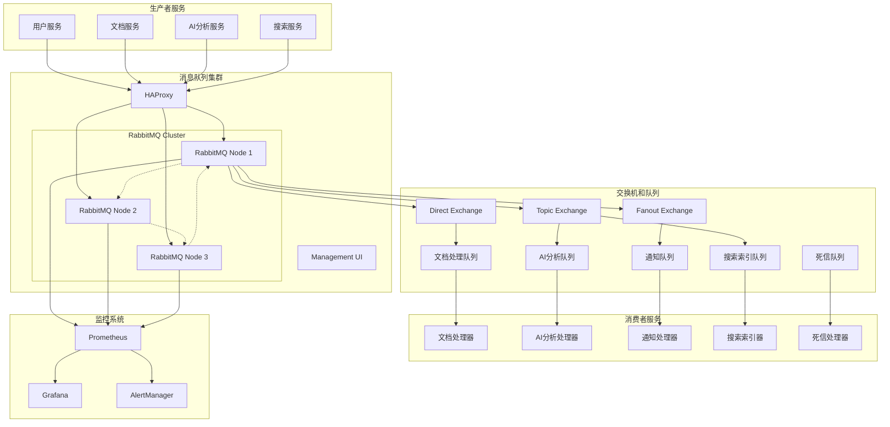
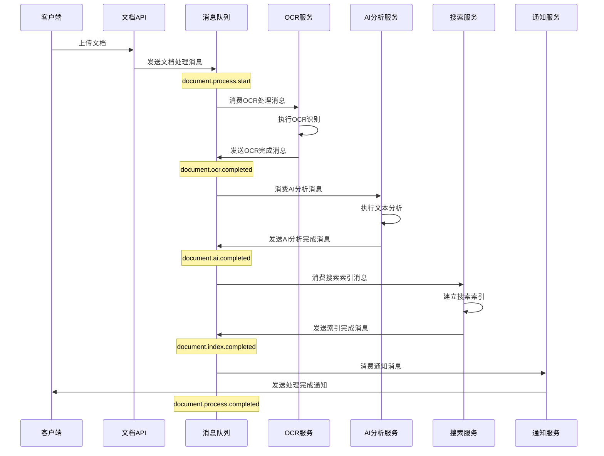

# 消息队列架构设计文档

## 1. 消息队列概述

历史文本漂洗项目采用基于RabbitMQ的消息队列架构，实现微服务间的异步通信、事件驱动处理和系统解耦。消息队列系统支持高可用、高性能的消息传递，确保系统的可扩展性和可靠性。

### 1.1 设计原则

- **异步解耦**: 通过消息队列实现服务间的异步通信，降低系统耦合度
- **可靠传递**: 确保消息的可靠传递，支持消息持久化和确认机制
- **高可用性**: 支持集群部署和故障转移，保证消息系统的高可用
- **可扩展性**: 支持水平扩展，满足不同业务场景的性能需求
- **监控可观测**: 完善的监控和日志记录，便于问题排查和性能优化
- **事件驱动**: 基于事件驱动架构，支持复杂的业务流程编排

### 1.2 技术选型

| 组件 | 技术选型 | 版本 | 说明 |
|------|----------|------|------|
| 消息代理 | RabbitMQ | 3.12+ | 主要消息队列系统 |
| 管理界面 | RabbitMQ Management | 3.12+ | Web管理控制台 |
| 客户端库 | amqplib (Node.js) | 0.10+ | Node.js AMQP客户端 |
| 客户端库 | pika (Python) | 1.3+ | Python AMQP客户端 |
| 监控工具 | Prometheus + Grafana | - | 性能监控 |
| 负载均衡 | HAProxy | 2.8+ | 集群负载均衡 |

## 2. 消息队列架构

### 2.1 整体架构图



### 2.2 消息流设计

#### 2.2.1 文档处理流程



## 3. 交换机和队列设计

### 3.1 交换机配置

```yaml
# 交换机配置
exchanges:
  # 直连交换机 - 用于点对点消息
  direct_exchange:
    name: "historical.direct"
    type: "direct"
    durable: true
    auto_delete: false
    arguments: {}
  
  # 主题交换机 - 用于基于路由键的消息分发
  topic_exchange:
    name: "historical.topic"
    type: "topic"
    durable: true
    auto_delete: false
    arguments: {}
  
  # 扇出交换机 - 用于广播消息
  fanout_exchange:
    name: "historical.fanout"
    type: "fanout"
    durable: true
    auto_delete: false
    arguments: {}
  
  # 延迟交换机 - 用于延迟消息处理
  delay_exchange:
    name: "historical.delay"
    type: "x-delayed-message"
    durable: true
    auto_delete: false
    arguments:
      x-delayed-type: "direct"
```

### 3.2 队列配置

```yaml
# 队列配置
queues:
  # 文档处理队列
  document_processing:
    name: "document.processing"
    durable: true
    exclusive: false
    auto_delete: false
    arguments:
      x-message-ttl: 3600000  # 1小时TTL
      x-max-length: 10000     # 最大消息数
      x-dead-letter-exchange: "historical.dlx"
      x-dead-letter-routing-key: "document.failed"
  
  # OCR处理队列
  ocr_processing:
    name: "ocr.processing"
    durable: true
    exclusive: false
    auto_delete: false
    arguments:
      x-message-ttl: 1800000  # 30分钟TTL
      x-max-length: 5000
      x-dead-letter-exchange: "historical.dlx"
      x-dead-letter-routing-key: "ocr.failed"
  
  # AI分析队列
  ai_analysis:
    name: "ai.analysis"
    durable: true
    exclusive: false
    auto_delete: false
    arguments:
      x-message-ttl: 7200000  # 2小时TTL
      x-max-length: 3000
      x-dead-letter-exchange: "historical.dlx"
      x-dead-letter-routing-key: "ai.failed"
  
  # 搜索索引队列
  search_indexing:
    name: "search.indexing"
    durable: true
    exclusive: false
    auto_delete: false
    arguments:
      x-message-ttl: 900000   # 15分钟TTL
      x-max-length: 8000
      x-dead-letter-exchange: "historical.dlx"
      x-dead-letter-routing-key: "search.failed"
  
  # 通知队列
  notification:
    name: "notification.send"
    durable: true
    exclusive: false
    auto_delete: false
    arguments:
      x-message-ttl: 300000   # 5分钟TTL
      x-max-length: 15000
      x-dead-letter-exchange: "historical.dlx"
      x-dead-letter-routing-key: "notification.failed"
  
  # 死信队列
  dead_letter:
    name: "dead.letter"
    durable: true
    exclusive: false
    auto_delete: false
    arguments:
      x-message-ttl: 86400000 # 24小时TTL
```

### 3.3 路由键设计

```yaml
# 路由键规范
routing_keys:
  # 文档相关
  document:
    upload: "document.upload"
    process: "document.process"
    ocr: "document.ocr"
    analyze: "document.analyze"
    complete: "document.complete"
    failed: "document.failed"
  
  # AI分析相关
  ai:
    analyze: "ai.analyze.{type}"  # type: text, image, structure
    complete: "ai.complete.{type}"
    failed: "ai.failed.{type}"
  
  # 搜索相关
  search:
    index: "search.index.{action}"  # action: create, update, delete
    complete: "search.complete.{action}"
    failed: "search.failed.{action}"
  
  # 通知相关
  notification:
    email: "notification.email"
    sms: "notification.sms"
    push: "notification.push"
    webhook: "notification.webhook"
  
  # 系统事件
  system:
    health: "system.health"
    metrics: "system.metrics"
    alert: "system.alert"
```

## 4. 消息格式规范

### 4.1 消息结构

```typescript
// 标准消息格式
interface Message {
  // 消息头
  headers: {
    messageId: string;          // 消息唯一ID
    correlationId: string;      // 关联ID，用于追踪
    timestamp: number;          // 时间戳
    version: string;            // 消息版本
    source: string;             // 消息来源服务
    eventType: string;          // 事件类型
    priority: 'low' | 'normal' | 'high' | 'urgent';
    retryCount?: number;        // 重试次数
    maxRetries?: number;        // 最大重试次数
  };
  
  // 消息体
  payload: {
    [key: string]: any;         // 业务数据
  };
  
  // 元数据
  metadata?: {
    userId?: string;            // 用户ID
    sessionId?: string;         // 会话ID
    traceId?: string;           // 链路追踪ID
    tags?: string[];            // 标签
  };
}
```

### 4.2 具体消息示例

```json
{
  "headers": {
    "messageId": "msg_20240122_001",
    "correlationId": "corr_doc_12345",
    "timestamp": 1705900800000,
    "version": "1.0",
    "source": "document-service",
    "eventType": "document.upload.completed",
    "priority": "normal"
  },
  "payload": {
    "documentId": "doc_12345",
    "fileName": "historical_text_001.pdf",
    "fileSize": 2048576,
    "mimeType": "application/pdf",
    "uploadPath": "/uploads/2024/01/22/doc_12345.pdf",
    "checksum": "sha256:abc123...",
    "metadata": {
      "pages": 10,
      "language": "zh-CN",
      "category": "historical"
    }
  },
  "metadata": {
    "userId": "user_789",
    "sessionId": "session_456",
    "traceId": "trace_123",
    "tags": ["document", "upload", "pdf"]
  }
}
```

## 5. 生产者实现

### 5.1 Node.js生产者

```javascript
// message-producer.js
const amqp = require('amqplib');
const { v4: uuidv4 } = require('uuid');

class MessageProducer {
  constructor(connectionUrl) {
    this.connectionUrl = connectionUrl;
    this.connection = null;
    this.channel = null;
  }
  
  async connect() {
    try {
      this.connection = await amqp.connect(this.connectionUrl);
      this.channel = await this.connection.createChannel();
      
      // 设置通道预取数量
      await this.channel.prefetch(10);
      
      console.log('消息生产者连接成功');
    } catch (error) {
      console.error('连接失败:', error);
      throw error;
    }
  }
  
  async publishMessage(exchange, routingKey, message, options = {}) {
    try {
      if (!this.channel) {
        await this.connect();
      }
      
      // 构建标准消息格式
      const standardMessage = {
        headers: {
          messageId: uuidv4(),
          correlationId: options.correlationId || uuidv4(),
          timestamp: Date.now(),
          version: '1.0',
          source: options.source || 'unknown',
          eventType: options.eventType || routingKey,
          priority: options.priority || 'normal'
        },
        payload: message,
        metadata: options.metadata || {}
      };
      
      // 发布消息
      const published = this.channel.publish(
        exchange,
        routingKey,
        Buffer.from(JSON.stringify(standardMessage)),
        {
          persistent: true,
          messageId: standardMessage.headers.messageId,
          correlationId: standardMessage.headers.correlationId,
          timestamp: standardMessage.headers.timestamp,
          priority: this.getPriorityValue(standardMessage.headers.priority),
          ...options.publishOptions
        }
      );
      
      if (published) {
        console.log(`消息发布成功: ${standardMessage.headers.messageId}`);
        return standardMessage.headers.messageId;
      } else {
        throw new Error('消息发布失败');
      }
    } catch (error) {
      console.error('发布消息失败:', error);
      throw error;
    }
  }
  
  getPriorityValue(priority) {
    const priorityMap = {
      'low': 1,
      'normal': 5,
      'high': 8,
      'urgent': 10
    };
    return priorityMap[priority] || 5;
  }
  
  async publishDocumentEvent(eventType, documentData, options = {}) {
    return this.publishMessage(
      'historical.topic',
      `document.${eventType}`,
      documentData,
      {
        ...options,
        source: 'document-service',
        eventType: `document.${eventType}`
      }
    );
  }
  
  async publishAIEvent(eventType, aiData, options = {}) {
    return this.publishMessage(
      'historical.topic',
      `ai.${eventType}`,
      aiData,
      {
        ...options,
        source: 'ai-service',
        eventType: `ai.${eventType}`
      }
    );
  }
  
  async close() {
    try {
      if (this.channel) {
        await this.channel.close();
      }
      if (this.connection) {
        await this.connection.close();
      }
      console.log('消息生产者连接已关闭');
    } catch (error) {
      console.error('关闭连接失败:', error);
    }
  }
}

module.exports = MessageProducer;
```

### 5.2 使用示例

```javascript
// 使用示例
const MessageProducer = require('./message-producer');

async function example() {
  const producer = new MessageProducer('amqp://localhost:5672');
  
  try {
    await producer.connect();
    
    // 发布文档上传事件
    await producer.publishDocumentEvent('upload.completed', {
      documentId: 'doc_12345',
      fileName: 'test.pdf',
      fileSize: 1024000
    }, {
      correlationId: 'upload_session_123',
      priority: 'high',
      metadata: {
        userId: 'user_789'
      }
    });
    
  } catch (error) {
    console.error('发布失败:', error);
  } finally {
    await producer.close();
  }
}
```

## 6. 消费者实现

### 6.1 Node.js消费者

```javascript
// message-consumer.js
const amqp = require('amqplib');

class MessageConsumer {
  constructor(connectionUrl) {
    this.connectionUrl = connectionUrl;
    this.connection = null;
    this.channel = null;
    this.handlers = new Map();
  }
  
  async connect() {
    try {
      this.connection = await amqp.connect(this.connectionUrl);
      this.channel = await this.connection.createChannel();
      
      // 设置通道预取数量
      await this.channel.prefetch(5);
      
      console.log('消息消费者连接成功');
    } catch (error) {
      console.error('连接失败:', error);
      throw error;
    }
  }
  
  registerHandler(eventType, handler) {
    this.handlers.set(eventType, handler);
  }
  
  async consumeQueue(queueName, options = {}) {
    try {
      if (!this.channel) {
        await this.connect();
      }
      
      await this.channel.consume(queueName, async (msg) => {
        if (msg) {
          try {
            const message = JSON.parse(msg.content.toString());
            const eventType = message.headers.eventType;
            
            console.log(`收到消息: ${message.headers.messageId}, 事件类型: ${eventType}`);
            
            // 查找处理器
            const handler = this.handlers.get(eventType);
            if (handler) {
              await handler(message, msg);
              this.channel.ack(msg);
              console.log(`消息处理成功: ${message.headers.messageId}`);
            } else {
              console.warn(`未找到处理器: ${eventType}`);
              this.channel.nack(msg, false, false); // 拒绝消息，不重新入队
            }
            
          } catch (error) {
            console.error('处理消息失败:', error);
            
            // 检查重试次数
            const retryCount = (msg.properties.headers?.retryCount || 0) + 1;
            const maxRetries = msg.properties.headers?.maxRetries || 3;
            
            if (retryCount <= maxRetries) {
              // 重新发布到延迟队列
              await this.retryMessage(msg, retryCount);
              this.channel.ack(msg);
            } else {
              // 发送到死信队列
              this.channel.nack(msg, false, false);
            }
          }
        }
      }, {
        noAck: false,
        ...options
      });
      
      console.log(`开始消费队列: ${queueName}`);
    } catch (error) {
      console.error('消费队列失败:', error);
      throw error;
    }
  }
  
  async retryMessage(originalMsg, retryCount) {
    try {
      const message = JSON.parse(originalMsg.content.toString());
      message.headers.retryCount = retryCount;
      
      // 计算延迟时间（指数退避）
      const delay = Math.min(1000 * Math.pow(2, retryCount - 1), 60000);
      
      await this.channel.publish(
        'historical.delay',
        originalMsg.fields.routingKey,
        Buffer.from(JSON.stringify(message)),
        {
          ...originalMsg.properties,
          headers: {
            ...originalMsg.properties.headers,
            'x-delay': delay,
            retryCount: retryCount
          }
        }
      );
      
      console.log(`消息重试调度: ${message.headers.messageId}, 重试次数: ${retryCount}, 延迟: ${delay}ms`);
    } catch (error) {
      console.error('重试消息失败:', error);
    }
  }
  
  async close() {
    try {
      if (this.channel) {
        await this.channel.close();
      }
      if (this.connection) {
        await this.connection.close();
      }
      console.log('消息消费者连接已关闭');
    } catch (error) {
      console.error('关闭连接失败:', error);
    }
  }
}

module.exports = MessageConsumer;
```

### 6.2 消费者使用示例

```javascript
// document-processor.js
const MessageConsumer = require('./message-consumer');

class DocumentProcessor {
  constructor() {
    this.consumer = new MessageConsumer('amqp://localhost:5672');
    this.setupHandlers();
  }
  
  setupHandlers() {
    // 注册文档上传处理器
    this.consumer.registerHandler('document.upload.completed', async (message, rawMsg) => {
      await this.handleDocumentUpload(message.payload);
    });
    
    // 注册OCR处理器
    this.consumer.registerHandler('document.ocr.start', async (message, rawMsg) => {
      await this.handleOCRProcessing(message.payload);
    });
    
    // 注册AI分析处理器
    this.consumer.registerHandler('document.ai.analyze', async (message, rawMsg) => {
      await this.handleAIAnalysis(message.payload);
    });
  }
  
  async handleDocumentUpload(payload) {
    console.log('处理文档上传:', payload.documentId);
    
    // 执行文档预处理
    await this.preprocessDocument(payload);
    
    // 发送OCR处理消息
    await this.sendOCRMessage(payload);
  }
  
  async handleOCRProcessing(payload) {
    console.log('执行OCR处理:', payload.documentId);
    
    // 执行OCR识别
    const ocrResult = await this.performOCR(payload);
    
    // 发送AI分析消息
    await this.sendAIAnalysisMessage({
      ...payload,
      ocrResult
    });
  }
  
  async handleAIAnalysis(payload) {
    console.log('执行AI分析:', payload.documentId);
    
    // 执行AI文本分析
    const analysisResult = await this.performAIAnalysis(payload);
    
    // 发送处理完成消息
    await this.sendCompletionMessage({
      ...payload,
      analysisResult
    });
  }
  
  async start() {
    await this.consumer.connect();
    await this.consumer.consumeQueue('document.processing');
    console.log('文档处理器已启动');
  }
  
  async stop() {
    await this.consumer.close();
    console.log('文档处理器已停止');
  }
  
  // 具体业务方法实现
  async preprocessDocument(payload) {
    // 文档预处理逻辑
  }
  
  async performOCR(payload) {
    // OCR处理逻辑
  }
  
  async performAIAnalysis(payload) {
    // AI分析逻辑
  }
  
  async sendOCRMessage(payload) {
    // 发送OCR消息逻辑
  }
  
  async sendAIAnalysisMessage(payload) {
    // 发送AI分析消息逻辑
  }
  
  async sendCompletionMessage(payload) {
    // 发送完成消息逻辑
  }
}

// 启动处理器
const processor = new DocumentProcessor();
processor.start().catch(console.error);

// 优雅关闭
process.on('SIGINT', async () => {
  console.log('收到关闭信号，正在优雅关闭...');
  await processor.stop();
  process.exit(0);
});
```

## 7. 集群部署配置

### 7.1 RabbitMQ集群配置

```yaml
# rabbitmq-cluster.yaml
apiVersion: v1
kind: ConfigMap
metadata:
  name: rabbitmq-config
  namespace: historical-text
data:
  enabled_plugins: |
    [rabbitmq_management,rabbitmq_peer_discovery_k8s,rabbitmq_prometheus].
  
  rabbitmq.conf: |
    # 集群配置
    cluster_formation.peer_discovery_backend = rabbit_peer_discovery_k8s
    cluster_formation.k8s.host = kubernetes.default.svc.cluster.local
    cluster_formation.k8s.address_type = hostname
    cluster_formation.node_cleanup.interval = 30
    cluster_formation.node_cleanup.only_log_warning = true
    cluster_partition_handling = autoheal
    
    # 内存和磁盘配置
    vm_memory_high_watermark.relative = 0.6
    disk_free_limit.relative = 2.0
    
    # 网络配置
    heartbeat = 60
    frame_max = 131072
    channel_max = 2047
    
    # 日志配置
    log.console = true
    log.console.level = info
    log.file = false
    
    # 管理界面配置
    management.tcp.port = 15672
    management.tcp.ip = 0.0.0.0
    
    # Prometheus监控
    prometheus.tcp.port = 15692
    prometheus.tcp.ip = 0.0.0.0

---
apiVersion: apps/v1
kind: StatefulSet
metadata:
  name: rabbitmq
  namespace: historical-text
spec:
  serviceName: rabbitmq-headless
  replicas: 3
  selector:
    matchLabels:
      app: rabbitmq
  template:
    metadata:
      labels:
        app: rabbitmq
    spec:
      serviceAccountName: rabbitmq
      containers:
      - name: rabbitmq
        image: rabbitmq:3.12-management
        ports:
        - containerPort: 5672
          name: amqp
        - containerPort: 15672
          name: management
        - containerPort: 15692
          name: prometheus
        env:
        - name: RABBITMQ_DEFAULT_USER
          valueFrom:
            secretKeyRef:
              name: rabbitmq-secret
              key: username
        - name: RABBITMQ_DEFAULT_PASS
          valueFrom:
            secretKeyRef:
              name: rabbitmq-secret
              key: password
        - name: RABBITMQ_ERLANG_COOKIE
          valueFrom:
            secretKeyRef:
              name: rabbitmq-secret
              key: erlang-cookie
        - name: K8S_SERVICE_NAME
          value: rabbitmq-headless
        - name: POD_IP
          valueFrom:
            fieldRef:
              fieldPath: status.podIP
        - name: POD_NAME
          valueFrom:
            fieldRef:
              fieldPath: metadata.name
        - name: POD_NAMESPACE
          valueFrom:
            fieldRef:
              fieldPath: metadata.namespace
        - name: RABBITMQ_USE_LONGNAME
          value: "true"
        - name: RABBITMQ_NODENAME
          value: rabbit@$(POD_NAME).$(K8S_SERVICE_NAME).$(POD_NAMESPACE).svc.cluster.local
        - name: RABBITMQ_CONFIG_FILE
          value: /etc/rabbitmq/rabbitmq.conf
        volumeMounts:
        - name: config
          mountPath: /etc/rabbitmq
        - name: data
          mountPath: /var/lib/rabbitmq
        livenessProbe:
          exec:
            command:
            - rabbitmq-diagnostics
            - status
          initialDelaySeconds: 60
          periodSeconds: 60
          timeoutSeconds: 15
        readinessProbe:
          exec:
            command:
            - rabbitmq-diagnostics
            - ping
          initialDelaySeconds: 20
          periodSeconds: 60
          timeoutSeconds: 10
        resources:
          requests:
            memory: "1Gi"
            cpu: "500m"
          limits:
            memory: "2Gi"
            cpu: "1000m"
      volumes:
      - name: config
        configMap:
          name: rabbitmq-config
  volumeClaimTemplates:
  - metadata:
      name: data
    spec:
      accessModes: ["ReadWriteOnce"]
      resources:
        requests:
          storage: 10Gi
```

### 7.2 HAProxy负载均衡配置

```yaml
# haproxy-config.yaml
apiVersion: v1
kind: ConfigMap
metadata:
  name: haproxy-config
  namespace: historical-text
data:
  haproxy.cfg: |
    global
        daemon
        log stdout local0 info
        maxconn 4096
        tune.ssl.default-dh-param 2048
    
    defaults
        mode tcp
        log global
        option tcplog
        option dontlognull
        retries 3
        timeout connect 5000ms
        timeout client 50000ms
        timeout server 50000ms
    
    # RabbitMQ AMQP负载均衡
    listen rabbitmq_amqp
        bind *:5672
        mode tcp
        balance roundrobin
        option tcp-check
        tcp-check connect port 5672
        server rabbit1 rabbitmq-0.rabbitmq-headless.historical-text.svc.cluster.local:5672 check inter 5s rise 2 fall 3
        server rabbit2 rabbitmq-1.rabbitmq-headless.historical-text.svc.cluster.local:5672 check inter 5s rise 2 fall 3
        server rabbit3 rabbitmq-2.rabbitmq-headless.historical-text.svc.cluster.local:5672 check inter 5s rise 2 fall 3
    
    # RabbitMQ Management负载均衡
    listen rabbitmq_management
        bind *:15672
        mode http
        balance roundrobin
        option httpchk GET /api/health/checks/virtual-hosts
        http-check expect status 200
        server rabbit1 rabbitmq-0.rabbitmq-headless.historical-text.svc.cluster.local:15672 check inter 5s rise 2 fall 3
        server rabbit2 rabbitmq-1.rabbitmq-headless.historical-text.svc.cluster.local:15672 check inter 5s rise 2 fall 3
        server rabbit3 rabbitmq-2.rabbitmq-headless.historical-text.svc.cluster.local:15672 check inter 5s rise 2 fall 3
    
    # 统计页面
    listen stats
        bind *:8404
        mode http
        stats enable
        stats uri /stats
        stats refresh 30s
        stats admin if TRUE

---
apiVersion: apps/v1
kind: Deployment
metadata:
  name: haproxy
  namespace: historical-text
spec:
  replicas: 2
  selector:
    matchLabels:
      app: haproxy
  template:
    metadata:
      labels:
        app: haproxy
    spec:
      containers:
      - name: haproxy
        image: haproxy:2.8
        ports:
        - containerPort: 5672
          name: amqp
        - containerPort: 15672
          name: management
        - containerPort: 8404
          name: stats
        volumeMounts:
        - name: config
          mountPath: /usr/local/etc/haproxy
        livenessProbe:
          httpGet:
            path: /stats
            port: 8404
          initialDelaySeconds: 30
          periodSeconds: 30
        readinessProbe:
          httpGet:
            path: /stats
            port: 8404
          initialDelaySeconds: 5
          periodSeconds: 10
        resources:
          requests:
            memory: "128Mi"
            cpu: "100m"
          limits:
            memory: "256Mi"
            cpu: "200m"
      volumes:
      - name: config
        configMap:
          name: haproxy-config
```

## 8. 监控和告警

### 8.1 Prometheus监控配置

```yaml
# prometheus-rabbitmq.yaml
apiVersion: v1
kind: ServiceMonitor
metadata:
  name: rabbitmq-metrics
  namespace: historical-text
  labels:
    app: rabbitmq
spec:
  selector:
    matchLabels:
      app: rabbitmq
  endpoints:
  - port: prometheus
    interval: 30s
    path: /metrics
    scheme: http

---
apiVersion: monitoring.coreos.com/v1
kind: PrometheusRule
metadata:
  name: rabbitmq-alerts
  namespace: historical-text
spec:
  groups:
  - name: rabbitmq.rules
    rules:
    # 队列消息积压告警
    - alert: RabbitMQQueueBacklog
      expr: rabbitmq_queue_messages > 1000
      for: 5m
      labels:
        severity: warning
      annotations:
        summary: "RabbitMQ队列消息积压"
        description: "队列 {{ $labels.queue }} 消息数量超过1000，当前值: {{ $value }}"
    
    # 消费者数量告警
    - alert: RabbitMQNoConsumers
      expr: rabbitmq_queue_consumers == 0 and rabbitmq_queue_messages > 0
      for: 2m
      labels:
        severity: critical
      annotations:
        summary: "RabbitMQ队列无消费者"
        description: "队列 {{ $labels.queue }} 有消息但无消费者"
    
    # 节点内存使用告警
    - alert: RabbitMQHighMemoryUsage
      expr: rabbitmq_node_mem_used / rabbitmq_node_mem_limit > 0.8
      for: 5m
      labels:
        severity: warning
      annotations:
        summary: "RabbitMQ节点内存使用过高"
        description: "节点 {{ $labels.node }} 内存使用率超过80%，当前值: {{ $value | humanizePercentage }}"
    
    # 磁盘空间告警
    - alert: RabbitMQLowDiskSpace
      expr: rabbitmq_node_disk_free < 1073741824  # 1GB
      for: 5m
      labels:
        severity: critical
      annotations:
        summary: "RabbitMQ节点磁盘空间不足"
        description: "节点 {{ $labels.node }} 可用磁盘空间低于1GB，当前值: {{ $value | humanizeBytes }}"
    
    # 连接数告警
    - alert: RabbitMQHighConnectionCount
      expr: rabbitmq_connections > 500
      for: 5m
      labels:
        severity: warning
      annotations:
        summary: "RabbitMQ连接数过高"
        description: "当前连接数超过500，当前值: {{ $value }}"
    
    # 节点不可用告警
    - alert: RabbitMQNodeDown
      expr: up{job="rabbitmq"} == 0
      for: 1m
      labels:
        severity: critical
      annotations:
        summary: "RabbitMQ节点不可用"
        description: "节点 {{ $labels.instance }} 不可用"
```

### 8.2 Grafana仪表板

```json
{
  "dashboard": {
    "title": "RabbitMQ监控仪表板",
    "panels": [
      {
        "title": "队列消息数量",
        "type": "graph",
        "targets": [
          {
            "expr": "rabbitmq_queue_messages",
            "legendFormat": "{{ queue }}"
          }
        ]
      },
      {
        "title": "消息发布速率",
        "type": "graph",
        "targets": [
          {
            "expr": "rate(rabbitmq_queue_messages_published_total[5m])",
            "legendFormat": "发布速率"
          }
        ]
      },
      {
        "title": "消息消费速率",
        "type": "graph",
        "targets": [
          {
            "expr": "rate(rabbitmq_queue_messages_delivered_total[5m])",
            "legendFormat": "消费速率"
          }
        ]
      },
      {
        "title": "节点内存使用",
        "type": "graph",
        "targets": [
          {
            "expr": "rabbitmq_node_mem_used / rabbitmq_node_mem_limit * 100",
            "legendFormat": "{{ node }}"
          }
        ]
      },
      {
        "title": "连接数",
        "type": "singlestat",
        "targets": [
          {
            "expr": "rabbitmq_connections",
            "legendFormat": "连接数"
          }
        ]
      },
      {
        "title": "通道数",
        "type": "singlestat",
        "targets": [
          {
            "expr": "rabbitmq_channels",
            "legendFormat": "通道数"
          }
        ]
      }
    ]
  }
}
```

## 9. 最佳实践

### 9.1 消息设计最佳实践

1. **消息幂等性**: 确保消息处理的幂等性，避免重复处理导致的问题
2. **消息版本控制**: 使用版本字段支持消息格式的演进
3. **关联ID**: 使用correlationId追踪相关的消息流
4. **消息大小**: 控制消息大小，避免传输大文件内容
5. **错误处理**: 设计完善的错误处理和重试机制

### 9.2 性能优化最佳实践

1. **预取设置**: 合理设置消费者预取数量
2. **连接复用**: 复用连接和通道，减少连接开销
3. **批量处理**: 支持批量消息发布和消费
4. **消息持久化**: 根据业务需求选择消息持久化策略
5. **队列分片**: 使用多个队列分散负载

### 9.3 可靠性最佳实践

1. **消息确认**: 使用发布确认和消费确认机制
2. **死信队列**: 配置死信队列处理失败消息
3. **集群部署**: 使用集群提高可用性
4. **监控告警**: 建立完善的监控和告警机制
5. **备份恢复**: 定期备份队列配置和重要消息

### 9.4 安全最佳实践

1. **访问控制**: 使用用户权限控制访问
2. **TLS加密**: 启用TLS加密传输
3. **网络隔离**: 使用网络策略隔离队列服务
4. **密钥管理**: 安全管理认证密钥
5. **审计日志**: 记录重要操作的审计日志

---

**文档版本**: v1.0  
**最后更新**: 2024年1月22日  
**维护团队**: 架构组  
**联系方式**: architecture@historical-text.com