# 第三方集成架构文档

## 1. 第三方集成概述

历史文本漂洗项目需要与多个第三方服务进行集成，包括AI服务提供商、内容发布平台、云存储服务、支付系统等。本文档定义了统一的第三方集成架构，确保系统的可扩展性、可维护性和安全性。

### 1.1 集成原则

- **统一接口**: 为不同类型的第三方服务定义统一的集成接口
- **适配器模式**: 使用适配器模式屏蔽第三方服务的差异
- **故障隔离**: 第三方服务故障不影响核心业务功能
- **配置驱动**: 通过配置文件管理第三方服务的接入
- **监控可观测**: 完善的集成监控和日志记录
- **安全合规**: 确保数据传输和存储的安全性

### 1.2 集成分类

| 集成类型 | 服务提供商 | 集成方式 | 用途 |
|----------|------------|----------|------|
| **AI服务** | OpenAI, Claude, 文心一言, 通义千问 | REST API | 文本分析、内容生成 |
| **发布平台** | 微信公众号, 知乎, 简书, 头条号 | API/SDK | 内容自动发布 |
| **云存储** | 阿里云OSS, 腾讯云COS, AWS S3 | SDK | 文件存储和CDN |
| **OCR服务** | 百度OCR, 腾讯OCR, 阿里OCR | REST API | 图像文字识别 |
| **支付服务** | 支付宝, 微信支付, 银联 | SDK/API | 在线支付处理 |
| **短信服务** | 阿里云短信, 腾讯云短信 | REST API | 验证码和通知 |
| **邮件服务** | SendGrid, 阿里云邮件 | SMTP/API | 邮件通知 |
| **监控服务** | Sentry, DataDog | SDK | 错误追踪和性能监控 |

## 2. 集成架构设计

### 2.1 整体架构图

```mermaid
graph TB
    subgraph "业务服务层"
        USER_SERVICE[用户服务]
        DOC_SERVICE[文档服务]
        AI_SERVICE[AI分析服务]
        PUBLISH_SERVICE[发布服务]
    end
    
    subgraph "集成服务层"
        INTEGRATION_GATEWAY[集成网关]
        
        subgraph "适配器层"
            AI_ADAPTER[AI服务适配器]
            PUBLISH_ADAPTER[发布平台适配器]
            STORAGE_ADAPTER[存储服务适配器]
            OCR_ADAPTER[OCR服务适配器]
            PAYMENT_ADAPTER[支付服务适配器]
            NOTIFICATION_ADAPTER[通知服务适配器]
        end
        
        subgraph "连接器层"
            HTTP_CONNECTOR[HTTP连接器]
            SDK_CONNECTOR[SDK连接器]
            WEBHOOK_CONNECTOR[Webhook连接器]
        end
    end
    
    subgraph "配置管理"
        CONFIG_CENTER[配置中心]
        SECRET_MANAGER[密钥管理]
        RATE_LIMITER[限流控制]
    end
    
    subgraph "监控审计"
        METRICS_COLLECTOR[指标收集]
        LOG_AGGREGATOR[日志聚合]
        ALERT_MANAGER[告警管理]
    end
    
    subgraph "第三方服务"
        subgraph "AI服务"
            OPENAI[OpenAI]
            CLAUDE[Claude]
            BAIDU_AI[百度文心]
            ALI_AI[阿里通义]
        end
        
        subgraph "发布平台"
            WECHAT[微信公众号]
            ZHIHU[知乎]
            JIANSHU[简书]
            TOUTIAO[头条号]
        end
        
        subgraph "云服务"
            ALI_OSS[阿里云OSS]
            TENCENT_COS[腾讯云COS]
            AWS_S3[AWS S3]
        end
        
        subgraph "其他服务"
            BAIDU_OCR[百度OCR]
            ALIPAY[支付宝]
            WECHAT_PAY[微信支付]
            ALI_SMS[阿里云短信]
        end
    end
    
    USER_SERVICE --> INTEGRATION_GATEWAY
    DOC_SERVICE --> INTEGRATION_GATEWAY
    AI_SERVICE --> INTEGRATION_GATEWAY
    PUBLISH_SERVICE --> INTEGRATION_GATEWAY
    
    INTEGRATION_GATEWAY --> AI_ADAPTER
    INTEGRATION_GATEWAY --> PUBLISH_ADAPTER
    INTEGRATION_GATEWAY --> STORAGE_ADAPTER
    INTEGRATION_GATEWAY --> OCR_ADAPTER
    INTEGRATION_GATEWAY --> PAYMENT_ADAPTER
    INTEGRATION_GATEWAY --> NOTIFICATION_ADAPTER
    
    AI_ADAPTER --> HTTP_CONNECTOR
    PUBLISH_ADAPTER --> SDK_CONNECTOR
    STORAGE_ADAPTER --> SDK_CONNECTOR
    OCR_ADAPTER --> HTTP_CONNECTOR
    PAYMENT_ADAPTER --> SDK_CONNECTOR
    NOTIFICATION_ADAPTER --> WEBHOOK_CONNECTOR
    
    HTTP_CONNECTOR --> OPENAI
    HTTP_CONNECTOR --> CLAUDE
    HTTP_CONNECTOR --> BAIDU_AI
    HTTP_CONNECTOR --> ALI_AI
    
    SDK_CONNECTOR --> WECHAT
    SDK_CONNECTOR --> ZHIHU
    SDK_CONNECTOR --> JIANSHU
    SDK_CONNECTOR --> TOUTIAO
    
    SDK_CONNECTOR --> ALI_OSS
    SDK_CONNECTOR --> TENCENT_COS
    SDK_CONNECTOR --> AWS_S3
    
    HTTP_CONNECTOR --> BAIDU_OCR
    SDK_CONNECTOR --> ALIPAY
    SDK_CONNECTOR --> WECHAT_PAY
    HTTP_CONNECTOR --> ALI_SMS
    
    INTEGRATION_GATEWAY --> CONFIG_CENTER
    INTEGRATION_GATEWAY --> SECRET_MANAGER
    INTEGRATION_GATEWAY --> RATE_LIMITER
    
    INTEGRATION_GATEWAY --> METRICS_COLLECTOR
    INTEGRATION_GATEWAY --> LOG_AGGREGATOR
    INTEGRATION_GATEWAY --> ALERT_MANAGER
```



### 2.2 集成网关设计

```typescript
// integration-gateway.ts
import { Injectable } from '@nestjs/common';
import { ConfigService } from '@nestjs/config';
import { Logger } from '@nestjs/common';

@Injectable()
export class IntegrationGateway {
  private readonly logger = new Logger(IntegrationGateway.name);
  private adapters: Map<string, any> = new Map();
  
  constructor(
    private configService: ConfigService,
    private aiAdapter: AIServiceAdapter,
    private publishAdapter: PublishPlatformAdapter,
    private storageAdapter: StorageServiceAdapter,
    private ocrAdapter: OCRServiceAdapter,
    private paymentAdapter: PaymentServiceAdapter,
    private notificationAdapter: NotificationServiceAdapter
  ) {
    this.initializeAdapters();
  }
  
  private initializeAdapters() {
    this.adapters.set('ai', this.aiAdapter);
    this.adapters.set('publish', this.publishAdapter);
    this.adapters.set('storage', this.storageAdapter);
    this.adapters.set('ocr', this.ocrAdapter);
    this.adapters.set('payment', this.paymentAdapter);
    this.adapters.set('notification', this.notificationAdapter);
  }
  
  async callService(
    serviceType: string,
    provider: string,
    method: string,
    params: any,
    options?: IntegrationOptions
  ): Promise<any> {
    try {
      const adapter = this.adapters.get(serviceType);
      if (!adapter) {
        throw new Error(`未找到服务类型适配器: ${serviceType}`);
      }
      
      // 记录调用日志
      this.logger.log(`调用第三方服务: ${serviceType}.${provider}.${method}`);
      
      // 执行调用
      const result = await adapter.call(provider, method, params, options);
      
      // 记录成功日志
      this.logger.log(`第三方服务调用成功: ${serviceType}.${provider}.${method}`);
      
      return result;
    } catch (error) {
      // 记录错误日志
      this.logger.error(`第三方服务调用失败: ${serviceType}.${provider}.${method}`, error.stack);
      
      // 根据配置决定是否抛出异常或返回默认值
      if (options?.fallbackOnError) {
        return options.fallbackValue;
      }
      
      throw error;
    }
  }
  
  async batchCall(
    calls: BatchCallRequest[]
  ): Promise<BatchCallResponse[]> {
    const promises = calls.map(async (call) => {
      try {
        const result = await this.callService(
          call.serviceType,
          call.provider,
          call.method,
          call.params,
          call.options
        );
        return {
          id: call.id,
          success: true,
          result
        };
      } catch (error) {
        return {
          id: call.id,
          success: false,
          error: error.message
        };
      }
    });
    
    return Promise.all(promises);
  }
}

// 集成选项接口
interface IntegrationOptions {
  timeout?: number;
  retries?: number;
  fallbackOnError?: boolean;
  fallbackValue?: any;
  priority?: 'low' | 'normal' | 'high';
  metadata?: Record<string, any>;
}

// 批量调用请求接口
interface BatchCallRequest {
  id: string;
  serviceType: string;
  provider: string;
  method: string;
  params: any;
  options?: IntegrationOptions;
}

// 批量调用响应接口
interface BatchCallResponse {
  id: string;
  success: boolean;
  result?: any;
  error?: string;
}
```

## 3. AI服务集成

### 3.1 AI服务适配器

```typescript
// ai-service-adapter.ts
import { Injectable } from '@nestjs/common';
import { ConfigService } from '@nestjs/config';
import { HttpService } from '@nestjs/axios';
import { firstValueFrom } from 'rxjs';

@Injectable()
export class AIServiceAdapter {
  private providers: Map<string, AIProvider> = new Map();
  
  constructor(
    private configService: ConfigService,
    private httpService: HttpService
  ) {
    this.initializeProviders();
  }
  
  private initializeProviders() {
    // OpenAI
    this.providers.set('openai', new OpenAIProvider(
      this.configService.get('ai.openai.apiKey'),
      this.configService.get('ai.openai.baseUrl'),
      this.httpService
    ));
    
    // Claude
    this.providers.set('claude', new ClaudeProvider(
      this.configService.get('ai.claude.apiKey'),
      this.configService.get('ai.claude.baseUrl'),
      this.httpService
    ));
    
    // 百度文心一言
    this.providers.set('baidu', new BaiduAIProvider(
      this.configService.get('ai.baidu.apiKey'),
      this.configService.get('ai.baidu.secretKey'),
      this.httpService
    ));
    
    // 阿里通义千问
    this.providers.set('ali', new AliAIProvider(
      this.configService.get('ai.ali.apiKey'),
      this.configService.get('ai.ali.baseUrl'),
      this.httpService
    ));
  }
  
  async call(
    provider: string,
    method: string,
    params: any,
    options?: IntegrationOptions
  ): Promise<any> {
    const aiProvider = this.providers.get(provider);
    if (!aiProvider) {
      throw new Error(`未找到AI服务提供商: ${provider}`);
    }
    
    return aiProvider.call(method, params, options);
  }
  
  async analyzeText(
    text: string,
    analysisType: 'summary' | 'keywords' | 'sentiment' | 'classification',
    preferredProvider?: string
  ): Promise<AIAnalysisResult> {
    const providers = preferredProvider 
      ? [preferredProvider] 
      : this.getAvailableProviders();
    
    for (const provider of providers) {
      try {
        const result = await this.call(provider, 'analyzeText', {
          text,
          analysisType
        });
        
        return {
          provider,
          analysisType,
          result,
          timestamp: new Date()
        };
      } catch (error) {
        console.warn(`AI服务 ${provider} 调用失败:`, error.message);
        continue;
      }
    }
    
    throw new Error('所有AI服务提供商都不可用');
  }
  
  async generateContent(
    prompt: string,
    contentType: 'article' | 'summary' | 'title' | 'description',
    preferredProvider?: string
  ): Promise<AIGenerationResult> {
    const providers = preferredProvider 
      ? [preferredProvider] 
      : this.getAvailableProviders();
    
    for (const provider of providers) {
      try {
        const result = await this.call(provider, 'generateContent', {
          prompt,
          contentType
        });
        
        return {
          provider,
          contentType,
          content: result.content,
          metadata: result.metadata,
          timestamp: new Date()
        };
      } catch (error) {
        console.warn(`AI服务 ${provider} 调用失败:`, error.message);
        continue;
      }
    }
    
    throw new Error('所有AI服务提供商都不可用');
  }
  
  private getAvailableProviders(): string[] {
    return Array.from(this.providers.keys())
      .filter(provider => this.isProviderAvailable(provider))
      .sort((a, b) => this.getProviderPriority(a) - this.getProviderPriority(b));
  }
  
  private isProviderAvailable(provider: string): boolean {
    // 检查提供商是否可用（配置、配额、健康状态等）
    return this.configService.get(`ai.${provider}.enabled`, true);
  }
  
  private getProviderPriority(provider: string): number {
    return this.configService.get(`ai.${provider}.priority`, 5);
  }
}

// AI提供商基类
abstract class AIProvider {
  constructor(
    protected apiKey: string,
    protected baseUrl: string,
    protected httpService: HttpService
  ) {}
  
  abstract call(method: string, params: any, options?: IntegrationOptions): Promise<any>;
  
  protected async makeRequest(
    url: string,
    data: any,
    headers: Record<string, string> = {},
    options?: IntegrationOptions
  ): Promise<any> {
    const timeout = options?.timeout || 30000;
    
    try {
      const response = await firstValueFrom(
        this.httpService.post(url, data, {
          headers: {
            'Content-Type': 'application/json',
            ...headers
          },
          timeout
        })
      );
      
      return response.data;
    } catch (error) {
      if (error.response) {
        throw new Error(`API调用失败: ${error.response.status} - ${error.response.data?.message || error.response.statusText}`);
      } else if (error.code === 'ECONNABORTED') {
        throw new Error('请求超时');
      } else {
        throw new Error(`网络错误: ${error.message}`);
      }
    }
  }
}

// OpenAI提供商实现
class OpenAIProvider extends AIProvider {
  async call(method: string, params: any, options?: IntegrationOptions): Promise<any> {
    const url = `${this.baseUrl}/v1/chat/completions`;
    
    const data = {
      model: 'gpt-3.5-turbo',
      messages: this.buildMessages(method, params),
      max_tokens: 2000,
      temperature: 0.7
    };
    
    const headers = {
      'Authorization': `Bearer ${this.apiKey}`
    };
    
    const response = await this.makeRequest(url, data, headers, options);
    
    return {
      content: response.choices[0].message.content,
      usage: response.usage,
      model: response.model
    };
  }
  
  private buildMessages(method: string, params: any): any[] {
    switch (method) {
      case 'analyzeText':
        return [
          {
            role: 'system',
            content: `你是一个专业的文本分析助手，请对以下文本进行${params.analysisType}分析。`
          },
          {
            role: 'user',
            content: params.text
          }
        ];
      
      case 'generateContent':
        return [
          {
            role: 'system',
            content: `你是一个专业的内容创作助手，请根据以下要求生成${params.contentType}。`
          },
          {
            role: 'user',
            content: params.prompt
          }
        ];
      
      default:
        throw new Error(`不支持的方法: ${method}`);
    }
  }
}

// Claude提供商实现
class ClaudeProvider extends AIProvider {
  async call(method: string, params: any, options?: IntegrationOptions): Promise<any> {
    const url = `${this.baseUrl}/v1/messages`;
    
    const data = {
      model: 'claude-3-sonnet-20240229',
      max_tokens: 2000,
      messages: this.buildMessages(method, params)
    };
    
    const headers = {
      'x-api-key': this.apiKey,
      'anthropic-version': '2023-06-01'
    };
    
    const response = await this.makeRequest(url, data, headers, options);
    
    return {
      content: response.content[0].text,
      usage: response.usage,
      model: response.model
    };
  }
  
  private buildMessages(method: string, params: any): any[] {
    switch (method) {
      case 'analyzeText':
        return [
          {
            role: 'user',
            content: `请对以下文本进行${params.analysisType}分析：\n\n${params.text}`
          }
        ];
      
      case 'generateContent':
        return [
          {
            role: 'user',
            content: `请根据以下要求生成${params.contentType}：\n\n${params.prompt}`
          }
        ];
      
      default:
        throw new Error(`不支持的方法: ${method}`);
    }
  }
}

// 百度AI提供商实现
class BaiduAIProvider extends AIProvider {
  private accessToken: string;
  private tokenExpiry: Date;
  
  constructor(
    private apiKey: string,
    private secretKey: string,
    httpService: HttpService
  ) {
    super(apiKey, 'https://aip.baidubce.com', httpService);
  }
  
  async call(method: string, params: any, options?: IntegrationOptions): Promise<any> {
    await this.ensureAccessToken();
    
    const url = `${this.baseUrl}/rpc/2.0/ai_custom/v1/wenxinworkshop/chat/completions?access_token=${this.accessToken}`;
    
    const data = {
      messages: this.buildMessages(method, params),
      temperature: 0.7,
      top_p: 0.8,
      penalty_score: 1.0
    };
    
    const response = await this.makeRequest(url, data, {}, options);
    
    return {
      content: response.result,
      usage: response.usage,
      model: 'ERNIE-Bot'
    };
  }
  
  private async ensureAccessToken(): Promise<void> {
    if (this.accessToken && this.tokenExpiry && new Date() < this.tokenExpiry) {
      return;
    }
    
    const url = `https://aip.baidubce.com/oauth/2.0/token?grant_type=client_credentials&client_id=${this.apiKey}&client_secret=${this.secretKey}`;
    
    const response = await this.makeRequest(url, {}, {});
    
    this.accessToken = response.access_token;
    this.tokenExpiry = new Date(Date.now() + response.expires_in * 1000);
  }
  
  private buildMessages(method: string, params: any): any[] {
    switch (method) {
      case 'analyzeText':
        return [
          {
            role: 'user',
            content: `请对以下文本进行${params.analysisType}分析：\n\n${params.text}`
          }
        ];
      
      case 'generateContent':
        return [
          {
            role: 'user',
            content: `请根据以下要求生成${params.contentType}：\n\n${params.prompt}`
          }
        ];
      
      default:
        throw new Error(`不支持的方法: ${method}`);
    }
  }
}

// 阿里AI提供商实现
class AliAIProvider extends AIProvider {
  async call(method: string, params: any, options?: IntegrationOptions): Promise<any> {
    const url = `${this.baseUrl}/api/v1/services/aigc/text-generation/generation`;
    
    const data = {
      model: 'qwen-turbo',
      input: {
        messages: this.buildMessages(method, params)
      },
      parameters: {
        temperature: 0.7,
        top_p: 0.8,
        max_tokens: 2000
      }
    };
    
    const headers = {
      'Authorization': `Bearer ${this.apiKey}`
    };
    
    const response = await this.makeRequest(url, data, headers, options);
    
    return {
      content: response.output.text,
      usage: response.usage,
      model: response.model
    };
  }
  
  private buildMessages(method: string, params: any): any[] {
    switch (method) {
      case 'analyzeText':
        return [
          {
            role: 'user',
            content: `请对以下文本进行${params.analysisType}分析：\n\n${params.text}`
          }
        ];
      
      case 'generateContent':
        return [
          {
            role: 'user',
            content: `请根据以下要求生成${params.contentType}：\n\n${params.prompt}`
          }
        ];
      
      default:
        throw new Error(`不支持的方法: ${method}`);
    }
  }
}

// AI分析结果接口
interface AIAnalysisResult {
  provider: string;
  analysisType: string;
  result: any;
  timestamp: Date;
}

// AI生成结果接口
interface AIGenerationResult {
  provider: string;
  contentType: string;
  content: string;
  metadata?: any;
  timestamp: Date;
}
```

## 4. 发布平台集成

### 4.1 发布平台适配器

```typescript
// publish-platform-adapter.ts
import { Injectable } from '@nestjs/common';
import { ConfigService } from '@nestjs/config';
import { HttpService } from '@nestjs/axios';

@Injectable()
export class PublishPlatformAdapter {
  private platforms: Map<string, PublishPlatform> = new Map();
  
  constructor(
    private configService: ConfigService,
    private httpService: HttpService
  ) {
    this.initializePlatforms();
  }
  
  private initializePlatforms() {
    // 微信公众号
    this.platforms.set('wechat', new WeChatPlatform(
      this.configService.get('publish.wechat.appId'),
      this.configService.get('publish.wechat.appSecret'),
      this.httpService
    ));
    
    // 知乎
    this.platforms.set('zhihu', new ZhihuPlatform(
      this.configService.get('publish.zhihu.accessToken'),
      this.httpService
    ));
    
    // 简书
    this.platforms.set('jianshu', new JianshuPlatform(
      this.configService.get('publish.jianshu.token'),
      this.httpService
    ));
    
    // 头条号
    this.platforms.set('toutiao', new ToutiaoPlatform(
      this.configService.get('publish.toutiao.accessToken'),
      this.httpService
    ));
  }
  
  async call(
    platform: string,
    method: string,
    params: any,
    options?: IntegrationOptions
  ): Promise<any> {
    const publishPlatform = this.platforms.get(platform);
    if (!publishPlatform) {
      throw new Error(`未找到发布平台: ${platform}`);
    }
    
    return publishPlatform.call(method, params, options);
  }
  
  async publishArticle(
    platforms: string[],
    article: ArticleContent
  ): Promise<PublishResult[]> {
    const results: PublishResult[] = [];
    
    for (const platform of platforms) {
      try {
        const result = await this.call(platform, 'publishArticle', article);
        
        results.push({
          platform,
          success: true,
          articleId: result.articleId,
          url: result.url,
          publishTime: new Date()
        });
      } catch (error) {
        results.push({
          platform,
          success: false,
          error: error.message,
          publishTime: new Date()
        });
      }
    }
    
    return results;
  }
  
  async schedulePublish(
    platforms: string[],
    article: ArticleContent,
    publishTime: Date
  ): Promise<ScheduleResult[]> {
    const results: ScheduleResult[] = [];
    
    for (const platform of platforms) {
      try {
        const result = await this.call(platform, 'schedulePublish', {
          ...article,
          publishTime
        });
        
        results.push({
          platform,
          success: true,
          scheduleId: result.scheduleId,
          scheduledTime: publishTime
        });
      } catch (error) {
        results.push({
          platform,
          success: false,
          error: error.message
        });
      }
    }
    
    return results;
  }
  
  async getPublishStatus(
    platform: string,
    articleId: string
  ): Promise<PublishStatus> {
    return this.call(platform, 'getStatus', { articleId });
  }
}

// 发布平台基类
abstract class PublishPlatform {
  constructor(
    protected credentials: any,
    protected httpService: HttpService
  ) {}
  
  abstract call(method: string, params: any, options?: IntegrationOptions): Promise<any>;
  
  protected async makeRequest(
    url: string,
    data: any,
    headers: Record<string, string> = {},
    method: 'GET' | 'POST' | 'PUT' | 'DELETE' = 'POST',
    options?: IntegrationOptions
  ): Promise<any> {
    const timeout = options?.timeout || 30000;
    
    try {
      const response = await firstValueFrom(
        this.httpService.request({
          method,
          url,
          data: method !== 'GET' ? data : undefined,
          params: method === 'GET' ? data : undefined,
          headers: {
            'Content-Type': 'application/json',
            ...headers
          },
          timeout
        })
      );
      
      return response.data;
    } catch (error) {
      if (error.response) {
        throw new Error(`发布平台API调用失败: ${error.response.status} - ${error.response.data?.message || error.response.statusText}`);
      } else if (error.code === 'ECONNABORTED') {
        throw new Error('请求超时');
      } else {
        throw new Error(`网络错误: ${error.message}`);
      }
    }
  }
}

// 微信公众号平台实现
class WeChatPlatform extends PublishPlatform {
  private accessToken: string;
  private tokenExpiry: Date;
  
  constructor(
    private appId: string,
    private appSecret: string,
    httpService: HttpService
  ) {
    super({ appId, appSecret }, httpService);
  }
  
  async call(method: string, params: any, options?: IntegrationOptions): Promise<any> {
    await this.ensureAccessToken();
    
    switch (method) {
      case 'publishArticle':
        return this.publishArticle(params);
      case 'uploadMedia':
        return this.uploadMedia(params);
      case 'getStatus':
        return this.getArticleStatus(params.articleId);
      default:
        throw new Error(`不支持的方法: ${method}`);
    }
  }
  
  private async ensureAccessToken(): Promise<void> {
    if (this.accessToken && this.tokenExpiry && new Date() < this.tokenExpiry) {
      return;
    }
    
    const url = `https://api.weixin.qq.com/cgi-bin/token?grant_type=client_credential&appid=${this.appId}&secret=${this.appSecret}`;
    
    const response = await this.makeRequest(url, {}, {}, 'GET');
    
    if (response.errcode) {
      throw new Error(`获取微信访问令牌失败: ${response.errmsg}`);
    }
    
    this.accessToken = response.access_token;
    this.tokenExpiry = new Date(Date.now() + response.expires_in * 1000);
  }
  
  private async publishArticle(article: ArticleContent): Promise<any> {
    const url = `https://api.weixin.qq.com/cgi-bin/draft/add?access_token=${this.accessToken}`;
    
    const data = {
      articles: [
        {
          title: article.title,
          author: article.author || '历史文本项目',
          digest: article.summary || article.title,
          content: this.formatContentForWeChat(article.content),
          content_source_url: article.sourceUrl || '',
          thumb_media_id: article.thumbMediaId || '',
          show_cover_pic: 1,
          need_open_comment: 0,
          only_fans_can_comment: 0
        }
      ]
    };
    
    const response = await this.makeRequest(url, data);
    
    if (response.errcode !== 0) {
      throw new Error(`微信公众号发布失败: ${response.errmsg}`);
    }
    
    return {
      articleId: response.media_id,
      url: `https://mp.weixin.qq.com/s/${response.media_id}`
    };
  }
  
  private async uploadMedia(params: any): Promise<any> {
    const url = `https://api.weixin.qq.com/cgi-bin/media/upload?access_token=${this.accessToken}&type=${params.type}`;
    
    // 实现文件上传逻辑
    // ...
  }
  
  private async getArticleStatus(articleId: string): Promise<any> {
    const url = `https://api.weixin.qq.com/cgi-bin/draft/get?access_token=${this.accessToken}`;
    
    const data = {
      media_id: articleId
    };
    
    const response = await this.makeRequest(url, data);
    
    return {
      status: response.errcode === 0 ? 'published' : 'failed',
      data: response
    };
  }
  
  private formatContentForWeChat(content: string): string {
    // 格式化内容以适应微信公众号
    return content
      .replace(/<h1>/g, '<h2>')
      .replace(/<\/h1>/g, '</h2>')
      .replace(/<h2>/g, '<p style="font-size: 18px; font-weight: bold;">')
      .replace(/<\/h2>/g, '</p>');
  }
}

// 知乎平台实现
class ZhihuPlatform extends PublishPlatform {
  constructor(
    private accessToken: string,
    httpService: HttpService
  ) {
    super({ accessToken }, httpService);
  }
  
  async call(method: string, params: any, options?: IntegrationOptions): Promise<any> {
    switch (method) {
      case 'publishArticle':
        return this.publishArticle(params);
      case 'getStatus':
        return this.getArticleStatus(params.articleId);
      default:
        throw new Error(`不支持的方法: ${method}`);
    }
  }
  
  private async publishArticle(article: ArticleContent): Promise<any> {
    const url = 'https://www.zhihu.com/api/v4/articles';
    
    const data = {
      title: article.title,
      content: this.formatContentForZhihu(article.content),
      delta_time: 0,
      topics: article.tags?.map(tag => ({ id: tag })) || []
    };
    
    const headers = {
      'Authorization': `Bearer ${this.accessToken}`
    };
    
    const response = await this.makeRequest(url, data, headers);
    
    return {
      articleId: response.id,
      url: response.url
    };
  }
  
  private async getArticleStatus(articleId: string): Promise<any> {
    const url = `https://www.zhihu.com/api/v4/articles/${articleId}`;
    
    const headers = {
      'Authorization': `Bearer ${this.accessToken}`
    };
    
    const response = await this.makeRequest(url, {}, headers, 'GET');
    
    return {
      status: response.state,
      data: response
    };
  }
  
  private formatContentForZhihu(content: string): string {
    // 格式化内容以适应知乎
    return content;
  }
}

// 简书平台实现
class JianshuPlatform extends PublishPlatform {
  constructor(
    private token: string,
    httpService: HttpService
  ) {
    super({ token }, httpService);
  }
  
  async call(method: string, params: any, options?: IntegrationOptions): Promise<any> {
    switch (method) {
      case 'publishArticle':
        return this.publishArticle(params);
      case 'getStatus':
        return this.getArticleStatus(params.articleId);
      default:
        throw new Error(`不支持的方法: ${method}`);
    }
  }
  
  private async publishArticle(article: ArticleContent): Promise<any> {
    const url = 'https://www.jianshu.com/api/v1/articles';
    
    const data = {
      title: article.title,
      content: this.formatContentForJianshu(article.content),
      notebook_id: article.notebookId || 1,
      autosave_control: 1
    };
    
    const headers = {
      'Authorization': `Token ${this.token}`
    };
    
    const response = await this.makeRequest(url, data, headers);
    
    return {
      articleId: response.id,
      url: `https://www.jianshu.com/p/${response.slug}`
    };
  }
  
  private async getArticleStatus(articleId: string): Promise<any> {
    const url = `https://www.jianshu.com/api/v1/articles/${articleId}`;
    
    const headers = {
      'Authorization': `Token ${this.token}`
    };
    
    const response = await this.makeRequest(url, {}, headers, 'GET');
    
    return {
      status: response.public ? 'published' : 'draft',
      data: response
    };
  }
  
  private formatContentForJianshu(content: string): string {
    // 格式化内容以适应简书
    return content;
  }
}

// 头条号平台实现
class ToutiaoPlatform extends PublishPlatform {
  constructor(
    private accessToken: string,
    httpService: HttpService
  ) {
    super({ accessToken }, httpService);
  }
  
  async call(method: string, params: any, options?: IntegrationOptions): Promise<any> {
    switch (method) {
      case 'publishArticle':
        return this.publishArticle(params);
      case 'getStatus':
        return this.getArticleStatus(params.articleId);
      default:
        throw new Error(`不支持的方法: ${method}`);
    }
  }
  
  private async publishArticle(article: ArticleContent): Promise<any> {
    const url = 'https://mp.toutiao.com/api/v2/article/create/';
    
    const data = {
      title: article.title,
      content: this.formatContentForToutiao(article.content),
      category: article.category || 'news_history',
      tag: article.tags?.join(',') || '',
      cover: article.coverImage || '',
      is_original: 1,
      article_type: 0
    };
    
    const headers = {
      'Authorization': `Bearer ${this.accessToken}`
    };
    
    const response = await this.makeRequest(url, data, headers);
    
    if (response.err_no !== 0) {
      throw new Error(`头条号发布失败: ${response.err_tips}`);
    }
    
    return {
      articleId: response.data.article_id,
      url: response.data.article_url
    };
  }
  
  private async getArticleStatus(articleId: string): Promise<any> {
    const url = `https://mp.toutiao.com/api/v2/article/detail/?article_id=${articleId}`;
    
    const headers = {
      'Authorization': `Bearer ${this.accessToken}`
    };
    
    const response = await this.makeRequest(url, {}, headers, 'GET');
    
    return {
      status: response.data.status,
      data: response.data
    };
  }
  
  private formatContentForToutiao(content: string): string {
    // 格式化内容以适应头条号
    return content;
  }
}

// 文章内容接口
interface ArticleContent {
  title: string;
  content: string;
  summary?: string;
  author?: string;
  tags?: string[];
  category?: string;
  coverImage?: string;
  sourceUrl?: string;
  thumbMediaId?: string;
  notebookId?: number;
}

// 发布结果接口
interface PublishResult {
  platform: string;
  success: boolean;
  articleId?: string;
  url?: string;
  error?: string;
  publishTime: Date;
}

// 调度结果接口
interface ScheduleResult {
  platform: string;
  success: boolean;
  scheduleId?: string;
  scheduledTime?: Date;
  error?: string;
}

// 发布状态接口
interface PublishStatus {
  status: 'draft' | 'published' | 'failed' | 'reviewing';
  data?: any;
}
```

## 5. 配置管理

### 5.1 集成配置文件

```yaml
# integration-config.yaml
integration:
  # AI服务配置
  ai:
    openai:
      enabled: true
      apiKey: ${OPENAI_API_KEY}
      baseUrl: "https://api.openai.com"
      priority: 1
      timeout: 30000
      retries: 3
      rateLimit:
        requests: 100
        window: 3600  # 1小时
    
    claude:
      enabled: true
      apiKey: ${CLAUDE_API_KEY}
      baseUrl: "https://api.anthropic.com"
      priority: 2
      timeout: 30000
      retries: 3
      rateLimit:
        requests: 50
        window: 3600
    
    baidu:
      enabled: true
      apiKey: ${BAIDU_API_KEY}
      secretKey: ${BAIDU_SECRET_KEY}
      priority: 3
      timeout: 30000
      retries: 3
      rateLimit:
        requests: 200
        window: 3600
    
    ali:
      enabled: true
      apiKey: ${ALI_API_KEY}
      baseUrl: "https://dashscope.aliyuncs.com"
      priority: 4
      timeout: 30000
      retries: 3
      rateLimit:
        requests: 150
        window: 3600
  
  # 发布平台配置
  publish:
    wechat:
      enabled: true
      appId: ${WECHAT_APP_ID}
      appSecret: ${WECHAT_APP_SECRET}
      timeout: 30000
      retries: 2
    
    zhihu:
      enabled: true
      accessToken: ${ZHIHU_ACCESS_TOKEN}
      timeout: 30000
      retries: 2
    
    jianshu:
      enabled: true
      token: ${JIANSHU_TOKEN}
      timeout: 30000
      retries: 2
    
    toutiao:
      enabled: true
      accessToken: ${TOUTIAO_ACCESS_TOKEN}
      timeout: 30000
      retries: 2
  
  # 云存储配置
  storage:
    alioss:
      enabled: true
      accessKeyId: ${ALI_OSS_ACCESS_KEY_ID}
      accessKeySecret: ${ALI_OSS_ACCESS_KEY_SECRET}
      bucket: ${ALI_OSS_BUCKET}
      region: ${ALI_OSS_REGION}
      endpoint: ${ALI_OSS_ENDPOINT}
    
    tencentcos:
      enabled: false
      secretId: ${TENCENT_COS_SECRET_ID}
      secretKey: ${TENCENT_COS_SECRET_KEY}
      bucket: ${TENCENT_COS_BUCKET}
      region: ${TENCENT_COS_REGION}
    
    awss3:
      enabled: false
      accessKeyId: ${AWS_S3_ACCESS_KEY_ID}
      secretAccessKey: ${AWS_S3_SECRET_ACCESS_KEY}
      bucket: ${AWS_S3_BUCKET}
      region: ${AWS_S3_REGION}
  
  # OCR服务配置
  ocr:
    baidu:
      enabled: true
      apiKey: ${BAIDU_OCR_API_KEY}
      secretKey: ${BAIDU_OCR_SECRET_KEY}
      priority: 1
    
    tencent:
      enabled: false
      secretId: ${TENCENT_OCR_SECRET_ID}
      secretKey: ${TENCENT_OCR_SECRET_KEY}
      priority: 2
    
    ali:
      enabled: false
      accessKeyId: ${ALI_OCR_ACCESS_KEY_ID}
      accessKeySecret: ${ALI_OCR_ACCESS_KEY_SECRET}
      priority: 3
  
  # 支付服务配置
  payment:
    alipay:
      enabled: true
      appId: ${ALIPAY_APP_ID}
      privateKey: ${ALIPAY_PRIVATE_KEY}
      publicKey: ${ALIPAY_PUBLIC_KEY}
      gateway: "https://openapi.alipay.com/gateway.do"
    
    wechatpay:
      enabled: true
      mchId: ${WECHAT_PAY_MCH_ID}
      apiKey: ${WECHAT_PAY_API_KEY}
      certPath: ${WECHAT_PAY_CERT_PATH}
      keyPath: ${WECHAT_PAY_KEY_PATH}
  
  # 通知服务配置
  notification:
    sms:
      ali:
        enabled: true
        accessKeyId: ${ALI_SMS_ACCESS_KEY_ID}
        accessKeySecret: ${ALI_SMS_ACCESS_KEY_SECRET}
        signName: ${ALI_SMS_SIGN_NAME}
    
    email:
      sendgrid:
        enabled: true
        apiKey: ${SENDGRID_API_KEY}
        fromEmail: ${SENDGRID_FROM_EMAIL}
      
      smtp:
        enabled: false
        host: ${SMTP_HOST}
        port: ${SMTP_PORT}
        username: ${SMTP_USERNAME}
        password: ${SMTP_PASSWORD}
  
  # 全局配置
  global:
    timeout: 30000
    retries: 3
    circuitBreaker:
      enabled: true
      failureThreshold: 5
      timeout: 60000
      resetTimeout: 30000
    
    rateLimit:
      enabled: true
      defaultLimit: 100
      defaultWindow: 3600
    
    monitoring:
      enabled: true
      metricsInterval: 30
      healthCheckInterval: 60
```

### 5.2 密钥管理

```typescript
// secret-manager.ts
import { Injectable } from '@nestjs/common';
import { ConfigService } from '@nestjs/config';
import * as crypto from 'crypto';

@Injectable()
export class SecretManager {
  private secrets: Map<string, string> = new Map();
  private encryptionKey: string;
  
  constructor(private configService: ConfigService) {
    this.encryptionKey = this.configService.get('SECRET_ENCRYPTION_KEY') || 'default-key';
    this.loadSecrets();
  }
  
  private loadSecrets() {
    // 从环境变量或密钥存储服务加载密钥
    const secretKeys = [
      'OPENAI_API_KEY',
      'CLAUDE_API_KEY',
      'BAIDU_API_KEY',
      'BAIDU_SECRET_KEY',
      'WECHAT_APP_ID',
      'WECHAT_APP_SECRET',
      'ZHIHU_ACCESS_TOKEN',
      'JIANSHU_TOKEN',
      'TOUTIAO_ACCESS_TOKEN'
    ];
    
    for (const key of secretKeys) {
      const value = this.configService.get(key);
      if (value) {
        this.secrets.set(key, value);
      }
    }
  }
  
  getSecret(key: string): string | undefined {
    return this.secrets.get(key);
  }
  
  setSecret(key: string, value: string): void {
    this.secrets.set(key, value);
  }
  
  encryptSecret(value: string): string {
    const cipher = crypto.createCipher('aes-256-cbc', this.encryptionKey);
    let encrypted = cipher.update(value, 'utf8', 'hex');
    encrypted += cipher.final('hex');
    return encrypted;
  }
  
  decryptSecret(encryptedValue: string): string {
    const decipher = crypto.createDecipher('aes-256-cbc', this.encryptionKey);
    let decrypted = decipher.update(encryptedValue, 'hex', 'utf8');
    decrypted += decipher.final('utf8');
    return decrypted;
  }
  
  rotateSecret(key: string, newValue: string): void {
    // 实现密钥轮换逻辑
    this.setSecret(key, newValue);
    
    // 通知相关服务更新密钥
    this.notifySecretRotation(key);
  }
  
  private notifySecretRotation(key: string): void {
    // 发送密钥轮换通知
    console.log(`密钥已轮换: ${key}`);
  }
}
```

## 6. 监控和告警

### 6.1 集成监控配置

```yaml
# integration-monitoring.yaml
apiVersion: monitoring.coreos.com/v1
kind: PrometheusRule
metadata:
  name: integration-alerts
  namespace: historical-text
spec:
  groups:
  - name: integration.rules
    rules:
    # 第三方服务调用失败率告警
    - alert: ThirdPartyServiceHighFailureRate
      expr: |
        (
          rate(integration_service_calls_total{status="error"}[5m]) /
          rate(integration_service_calls_total[5m])
        ) > 0.1
      for: 2m
      labels:
        severity: warning
      annotations:
        summary: "第三方服务调用失败率过高"
        description: "服务 {{ $labels.service }} 的失败率超过10%，当前值: {{ $value | humanizePercentage }}"
    
    # 第三方服务响应时间告警
    - alert: ThirdPartyServiceHighLatency
      expr: |
        histogram_quantile(0.95, rate(integration_service_duration_seconds_bucket[5m])) > 10
      for: 5m
      labels:
        severity: warning
      annotations:
        summary: "第三方服务响应时间过长"
        description: "服务 {{ $labels.service }} 的95%响应时间超过10秒，当前值: {{ $value }}s"
    
    # API配额耗尽告警
    - alert: APIQuotaExhausted
      expr: integration_api_quota_remaining < 100
      for: 1m
      labels:
        severity: critical
      annotations:
        summary: "API配额即将耗尽"
        description: "服务 {{ $labels.service }} 的API配额剩余不足100次"
    
    # 集成服务不可用告警
    - alert: IntegrationServiceDown
      expr: up{job="integration-service"} == 0
      for: 1m
      labels:
        severity: critical
      annotations:
        summary: "集成服务不可用"
        description: "集成服务实例 {{ $labels.instance }} 不可用"
```

### 6.2 性能指标收集

```typescript
// metrics-collector.ts
import { Injectable } from '@nestjs/common';
import { Counter, Histogram, Gauge, register } from 'prom-client';

@Injectable()
export class MetricsCollector {
  private serviceCallsTotal: Counter<string>;
  private serviceDuration: Histogram<string>;
  private apiQuotaRemaining: Gauge<string>;
  private activeConnections: Gauge<string>;
  
  constructor() {
    this.initializeMetrics();
  }
  
  private initializeMetrics() {
    this.serviceCallsTotal = new Counter({
      name: 'integration_service_calls_total',
      help: '第三方服务调用总数',
      labelNames: ['service', 'provider', 'method', 'status']
    });
    
    this.serviceDuration = new Histogram({
      name: 'integration_service_duration_seconds',
      help: '第三方服务调用耗时',
      labelNames: ['service', 'provider', 'method'],
      buckets: [0.1, 0.5, 1, 2, 5, 10, 30, 60]
    });
    
    this.apiQuotaRemaining = new Gauge({
      name: 'integration_api_quota_remaining',
      help: 'API配额剩余数量',
      labelNames: ['service', 'provider']
    });
    
    this.activeConnections = new Gauge({
      name: 'integration_active_connections',
      help: '活跃连接数',
      labelNames: ['service', 'provider']
    });
    
    register.registerMetric(this.serviceCallsTotal);
    register.registerMetric(this.serviceDuration);
    register.registerMetric(this.apiQuotaRemaining);
    register.registerMetric(this.activeConnections);
  }
  
  recordServiceCall(
    service: string,
    provider: string,
    method: string,
    status: 'success' | 'error',
    duration: number
  ) {
    this.serviceCallsTotal.inc({
      service,
      provider,
      method,
      status
    });
    
    this.serviceDuration.observe({
      service,
      provider,
      method
    }, duration / 1000); // 转换为秒
  }
  
  updateQuotaRemaining(service: string, provider: string, remaining: number) {
    this.apiQuotaRemaining.set({
      service,
      provider
    }, remaining);
  }
  
  updateActiveConnections(service: string, provider: string, count: number) {
    this.activeConnections.set({
      service,
      provider
    }, count);
  }
}
```

## 7. 最佳实践

### 7.1 集成设计最佳实践

1. **统一接口**: 为同类型的第三方服务定义统一的接口规范
2. **适配器模式**: 使用适配器模式屏蔽不同服务商的API差异
3. **配置驱动**: 通过配置文件管理第三方服务的接入和切换
4. **故障隔离**: 确保第三方服务故障不影响核心业务功能
5. **优雅降级**: 在服务不可用时提供备选方案或降级服务

### 7.2 安全最佳实践

1. **密钥管理**: 使用专门的密钥管理服务存储和轮换API密钥
2. **传输加密**: 所有与第三方服务的通信都使用HTTPS
3. **访问控制**: 限制对第三方服务的访问权限
4. **审计日志**: 记录所有第三方服务的调用日志
5. **数据脱敏**: 在日志中脱敏敏感信息

### 7.3 性能最佳实践

1. **连接池管理**: 使用连接池复用HTTP连接，减少连接开销
2. **请求批处理**: 将多个请求合并为批量请求，提高效率
3. **缓存策略**: 对频繁访问的数据进行缓存，减少API调用
4. **异步处理**: 使用异步方式调用第三方服务，避免阻塞
5. **超时控制**: 设置合理的超时时间，避免长时间等待

### 7.4 可靠性最佳实践

1. **重试机制**: 实现指数退避的重试策略
2. **熔断器**: 使用熔断器模式防止级联故障
3. **限流控制**: 实现请求限流，避免超出API配额
4. **健康检查**: 定期检查第三方服务的健康状态
5. **监控告警**: 建立完善的监控和告警机制

## 8. 部署配置

### 8.1 Kubernetes部署

```yaml
# integration-service-deployment.yaml
apiVersion: apps/v1
kind: Deployment
metadata:
  name: integration-service
  namespace: historical-text
spec:
  replicas: 3
  selector:
    matchLabels:
      app: integration-service
  template:
    metadata:
      labels:
        app: integration-service
    spec:
      containers:
      - name: integration-service
        image: historical-text/integration-service:latest
        ports:
        - containerPort: 3000
        env:
        - name: NODE_ENV
          value: "production"
        - name: OPENAI_API_KEY
          valueFrom:
            secretKeyRef:
              name: integration-secrets
              key: openai-api-key
        - name: CLAUDE_API_KEY
          valueFrom:
            secretKeyRef:
              name: integration-secrets
              key: claude-api-key
        - name: BAIDU_API_KEY
          valueFrom:
            secretKeyRef:
              name: integration-secrets
              key: baidu-api-key
        - name: BAIDU_SECRET_KEY
          valueFrom:
            secretKeyRef:
              name: integration-secrets
              key: baidu-secret-key
        resources:
          requests:
            memory: "512Mi"
            cpu: "250m"
          limits:
            memory: "1Gi"
            cpu: "500m"
        livenessProbe:
          httpGet:
            path: /health
            port: 3000
          initialDelaySeconds: 30
          periodSeconds: 10
        readinessProbe:
          httpGet:
            path: /ready
            port: 3000
          initialDelaySeconds: 5
          periodSeconds: 5
---
apiVersion: v1
kind: Service
metadata:
  name: integration-service
  namespace: historical-text
spec:
  selector:
    app: integration-service
  ports:
  - port: 80
    targetPort: 3000
  type: ClusterIP
---
apiVersion: v1
kind: Secret
metadata:
  name: integration-secrets
  namespace: historical-text
type: Opaque
data:
  openai-api-key: <base64-encoded-key>
  claude-api-key: <base64-encoded-key>
  baidu-api-key: <base64-encoded-key>
  baidu-secret-key: <base64-encoded-key>
  wechat-app-id: <base64-encoded-id>
  wechat-app-secret: <base64-encoded-secret>
  zhihu-access-token: <base64-encoded-token>
  jianshu-token: <base64-encoded-token>
  toutiao-access-token: <base64-encoded-token>
```

### 8.2 配置映射

```yaml
# integration-configmap.yaml
apiVersion: v1
kind: ConfigMap
metadata:
  name: integration-config
  namespace: historical-text
data:
  config.yaml: |
    integration:
      ai:
        openai:
          enabled: true
          baseUrl: "https://api.openai.com"
          priority: 1
          timeout: 30000
          retries: 3
        claude:
          enabled: true
          baseUrl: "https://api.anthropic.com"
          priority: 2
          timeout: 30000
          retries: 3
        baidu:
          enabled: true
          priority: 3
          timeout: 30000
          retries: 3
        ali:
          enabled: true
          baseUrl: "https://dashscope.aliyuncs.com"
          priority: 4
          timeout: 30000
          retries: 3
      
      publish:
        wechat:
          enabled: true
          timeout: 30000
          retries: 2
        zhihu:
          enabled: true
          timeout: 30000
          retries: 2
        jianshu:
          enabled: true
          timeout: 30000
          retries: 2
        toutiao:
          enabled: true
          timeout: 30000
          retries: 2
      
      global:
        timeout: 30000
        retries: 3
        circuitBreaker:
          enabled: true
          failureThreshold: 5
          timeout: 60000
          resetTimeout: 30000
        rateLimit:
          enabled: true
          defaultLimit: 100
          defaultWindow: 3600
```

## 9. 测试策略

### 9.1 单元测试

```typescript
// integration-gateway.spec.ts
import { Test, TestingModule } from '@nestjs/testing';
import { IntegrationGateway } from './integration-gateway';
import { AIServiceAdapter } from './ai-service-adapter';
import { PublishPlatformAdapter } from './publish-platform-adapter';

describe('IntegrationGateway', () => {
  let gateway: IntegrationGateway;
  let aiAdapter: jest.Mocked<AIServiceAdapter>;
  let publishAdapter: jest.Mocked<PublishPlatformAdapter>;
  
  beforeEach(async () => {
    const mockAIAdapter = {
      call: jest.fn()
    };
    
    const mockPublishAdapter = {
      call: jest.fn()
    };
    
    const module: TestingModule = await Test.createTestingModule({
      providers: [
        IntegrationGateway,
        {
          provide: AIServiceAdapter,
          useValue: mockAIAdapter
        },
        {
          provide: PublishPlatformAdapter,
          useValue: mockPublishAdapter
        }
      ]
    }).compile();
    
    gateway = module.get<IntegrationGateway>(IntegrationGateway);
    aiAdapter = module.get(AIServiceAdapter);
    publishAdapter = module.get(PublishPlatformAdapter);
  });
  
  describe('callService', () => {
    it('应该成功调用AI服务', async () => {
      const mockResult = { content: '测试结果' };
      aiAdapter.call.mockResolvedValue(mockResult);
      
      const result = await gateway.callService('ai', 'openai', 'analyzeText', {
        text: '测试文本',
        analysisType: 'summary'
      });
      
      expect(result).toEqual(mockResult);
      expect(aiAdapter.call).toHaveBeenCalledWith(
        'openai',
        'analyzeText',
        { text: '测试文本', analysisType: 'summary' },
        undefined
      );
    });
    
    it('应该处理服务调用失败', async () => {
      const error = new Error('服务不可用');
      aiAdapter.call.mockRejectedValue(error);
      
      await expect(
        gateway.callService('ai', 'openai', 'analyzeText', {
          text: '测试文本',
          analysisType: 'summary'
        })
      ).rejects.toThrow('服务不可用');
    });
    
    it('应该支持故障回退', async () => {
      const error = new Error('服务不可用');
      const fallbackValue = { content: '默认结果' };
      aiAdapter.call.mockRejectedValue(error);
      
      const result = await gateway.callService('ai', 'openai', 'analyzeText', {
        text: '测试文本',
        analysisType: 'summary'
      }, {
        fallbackOnError: true,
        fallbackValue
      });
      
      expect(result).toEqual(fallbackValue);
    });
  });
  
  describe('batchCall', () => {
    it('应该支持批量调用', async () => {
      aiAdapter.call.mockResolvedValue({ content: 'AI结果' });
      publishAdapter.call.mockResolvedValue({ articleId: '123' });
      
      const calls = [
        {
          id: '1',
          serviceType: 'ai',
          provider: 'openai',
          method: 'analyzeText',
          params: { text: '测试文本' }
        },
        {
          id: '2',
          serviceType: 'publish',
          provider: 'wechat',
          method: 'publishArticle',
          params: { title: '测试文章' }
        }
      ];
      
      const results = await gateway.batchCall(calls);
      
      expect(results).toHaveLength(2);
      expect(results[0]).toEqual({
        id: '1',
        success: true,
        result: { content: 'AI结果' }
      });
      expect(results[1]).toEqual({
        id: '2',
        success: true,
        result: { articleId: '123' }
      });
    });
  });
});
```

### 9.2 集成测试

```typescript
// integration.e2e-spec.ts
import { Test, TestingModule } from '@nestjs/testing';
import { INestApplication } from '@nestjs/common';
import * as request from 'supertest';
import { IntegrationModule } from './integration.module';

describe('Integration (e2e)', () => {
  let app: INestApplication;
  
  beforeEach(async () => {
    const moduleFixture: TestingModule = await Test.createTestingModule({
      imports: [IntegrationModule]
    }).compile();
    
    app = moduleFixture.createNestApplication();
    await app.init();
  });
  
  afterEach(async () => {
    await app.close();
  });
  
  describe('/integration/ai/analyze (POST)', () => {
    it('应该成功分析文本', () => {
      return request(app.getHttpServer())
        .post('/integration/ai/analyze')
        .send({
          text: '这是一段测试文本，用于验证AI分析功能。',
          analysisType: 'summary',
          provider: 'openai'
        })
        .expect(200)
        .expect((res) => {
          expect(res.body).toHaveProperty('provider');
          expect(res.body).toHaveProperty('result');
          expect(res.body).toHaveProperty('timestamp');
        });
    });
  });
  
  describe('/integration/publish/article (POST)', () => {
    it('应该成功发布文章', () => {
      return request(app.getHttpServer())
        .post('/integration/publish/article')
        .send({
          platforms: ['wechat'],
          article: {
            title: '测试文章标题',
            content: '这是测试文章的内容...',
            summary: '文章摘要',
            tags: ['测试', '历史']
          }
        })
        .expect(200)
        .expect((res) => {
          expect(res.body).toBeInstanceOf(Array);
          expect(res.body[0]).toHaveProperty('platform');
          expect(res.body[0]).toHaveProperty('success');
        });
    });
  });
});
```

## 10. 版本信息

- **文档版本**: 1.0.0
- **创建日期**: 2024-01-15
- **最后更新**: 2024-01-15
- **维护人员**: 历史文本项目团队
- **审核状态**: 待审核