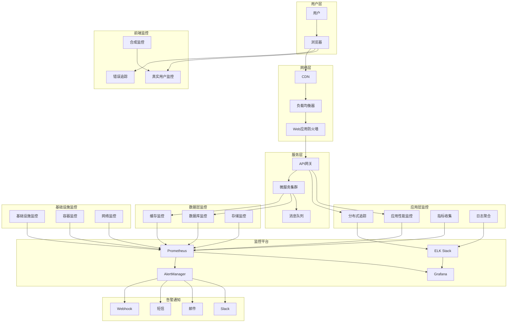
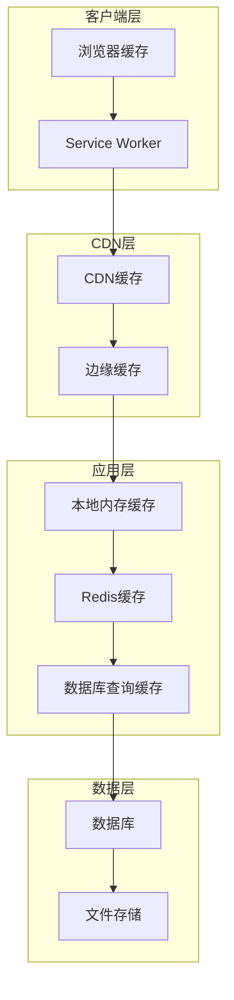

# 性能优化架构文档

## 1. 性能优化概述

历史文本漂洗项目作为一个处理大量文本数据和AI分析的系统，性能优化是确保用户体验和系统稳定性的关键因素。本文档定义了全面的性能优化策略，涵盖前端、后端、数据库、缓存、网络等各个层面。

### 1.1 性能目标

| 性能指标 | 目标值 | 监控方式 | 优化策略 |
|----------|--------|----------|----------|
| **页面加载时间** | < 2秒 | 前端监控 | 代码分割、懒加载、CDN |
| **API响应时间** | < 500ms | APM监控 | 缓存、索引优化、连接池 |
| **数据库查询** | < 100ms | 慢查询日志 | 索引优化、查询优化 |
| **文件上传** | > 10MB/s | 网络监控 | 分片上传、压缩 |
| **AI分析处理** | < 30秒 | 业务监控 | 异步处理、队列优化 |
| **并发用户数** | > 1000 | 负载测试 | 水平扩展、负载均衡 |
| **系统可用性** | > 99.9% | 健康检查 | 容错设计、故障转移 |
| **内存使用率** | < 80% | 系统监控 | 内存优化、垃圾回收 |
| **CPU使用率** | < 70% | 系统监控 | 算法优化、异步处理 |
| **磁盘I/O** | < 80% | 系统监控 | 缓存策略、存储优化 |

### 1.2 性能优化原则

- **分层优化**: 从前端到后端，从应用到基础设施的全栈优化
- **数据驱动**: 基于监控数据和性能指标进行优化决策
- **渐进式优化**: 优先解决影响最大的性能瓶颈
- **可测量性**: 所有优化措施都要有明确的性能指标
- **可维护性**: 优化不能以牺牲代码可维护性为代价
- **成本效益**: 平衡性能提升与资源成本

## 2. 性能监控架构

### 2.1 监控架构图



### 2.2 性能监控指标

```typescript
// performance-metrics.ts
import { Injectable } from '@nestjs/common';
import { Counter, Histogram, Gauge, register } from 'prom-client';

@Injectable()
export class PerformanceMetrics {
  // HTTP请求指标
  private httpRequestsTotal: Counter<string>;
  private httpRequestDuration: Histogram<string>;
  private httpRequestSize: Histogram<string>;
  private httpResponseSize: Histogram<string>;
  
  // 数据库指标
  private dbConnectionsActive: Gauge<string>;
  private dbQueryDuration: Histogram<string>;
  private dbTransactionsTotal: Counter<string>;
  
  // 缓存指标
  private cacheHitRate: Gauge<string>;
  private cacheOperationDuration: Histogram<string>;
  private cacheSize: Gauge<string>;
  
  // 业务指标
  private documentProcessingDuration: Histogram<string>;
  private aiAnalysisDuration: Histogram<string>;
  private publishOperationsTotal: Counter<string>;
  
  // 系统资源指标
  private memoryUsage: Gauge<string>;
  private cpuUsage: Gauge<string>;
  private diskUsage: Gauge<string>;
  
  constructor() {
    this.initializeMetrics();
  }
  
  private initializeMetrics() {
    // HTTP请求指标
    this.httpRequestsTotal = new Counter({
      name: 'http_requests_total',
      help: 'HTTP请求总数',
      labelNames: ['method', 'route', 'status_code']
    });
    
    this.httpRequestDuration = new Histogram({
      name: 'http_request_duration_seconds',
      help: 'HTTP请求耗时',
      labelNames: ['method', 'route'],
      buckets: [0.1, 0.3, 0.5, 0.7, 1, 3, 5, 7, 10]
    });
    
    this.httpRequestSize = new Histogram({
      name: 'http_request_size_bytes',
      help: 'HTTP请求大小',
      labelNames: ['method', 'route'],
      buckets: [100, 1000, 10000, 100000, 1000000]
    });
    
    this.httpResponseSize = new Histogram({
      name: 'http_response_size_bytes',
      help: 'HTTP响应大小',
      labelNames: ['method', 'route'],
      buckets: [100, 1000, 10000, 100000, 1000000]
    });
    
    // 数据库指标
    this.dbConnectionsActive = new Gauge({
      name: 'db_connections_active',
      help: '活跃数据库连接数',
      labelNames: ['database']
    });
    
    this.dbQueryDuration = new Histogram({
      name: 'db_query_duration_seconds',
      help: '数据库查询耗时',
      labelNames: ['database', 'operation'],
      buckets: [0.01, 0.05, 0.1, 0.3, 0.5, 1, 3, 5]
    });
    
    this.dbTransactionsTotal = new Counter({
      name: 'db_transactions_total',
      help: '数据库事务总数',
      labelNames: ['database', 'status']
    });
    
    // 缓存指标
    this.cacheHitRate = new Gauge({
      name: 'cache_hit_rate',
      help: '缓存命中率',
      labelNames: ['cache_type']
    });
    
    this.cacheOperationDuration = new Histogram({
      name: 'cache_operation_duration_seconds',
      help: '缓存操作耗时',
      labelNames: ['cache_type', 'operation'],
      buckets: [0.001, 0.005, 0.01, 0.05, 0.1, 0.5, 1]
    });
    
    this.cacheSize = new Gauge({
      name: 'cache_size_bytes',
      help: '缓存大小',
      labelNames: ['cache_type']
    });
    
    // 业务指标
    this.documentProcessingDuration = new Histogram({
      name: 'document_processing_duration_seconds',
      help: '文档处理耗时',
      labelNames: ['document_type', 'processing_stage'],
      buckets: [1, 5, 10, 30, 60, 120, 300, 600]
    });
    
    this.aiAnalysisDuration = new Histogram({
      name: 'ai_analysis_duration_seconds',
      help: 'AI分析耗时',
      labelNames: ['ai_provider', 'analysis_type'],
      buckets: [1, 5, 10, 30, 60, 120, 300]
    });
    
    this.publishOperationsTotal = new Counter({
      name: 'publish_operations_total',
      help: '发布操作总数',
      labelNames: ['platform', 'status']
    });
    
    // 系统资源指标
    this.memoryUsage = new Gauge({
      name: 'memory_usage_bytes',
      help: '内存使用量',
      labelNames: ['type']
    });
    
    this.cpuUsage = new Gauge({
      name: 'cpu_usage_percent',
      help: 'CPU使用率',
      labelNames: ['core']
    });
    
    this.diskUsage = new Gauge({
      name: 'disk_usage_bytes',
      help: '磁盘使用量',
      labelNames: ['mount_point']
    });
    
    // 注册所有指标
    register.registerMetric(this.httpRequestsTotal);
    register.registerMetric(this.httpRequestDuration);
    register.registerMetric(this.httpRequestSize);
    register.registerMetric(this.httpResponseSize);
    register.registerMetric(this.dbConnectionsActive);
    register.registerMetric(this.dbQueryDuration);
    register.registerMetric(this.dbTransactionsTotal);
    register.registerMetric(this.cacheHitRate);
    register.registerMetric(this.cacheOperationDuration);
    register.registerMetric(this.cacheSize);
    register.registerMetric(this.documentProcessingDuration);
    register.registerMetric(this.aiAnalysisDuration);
    register.registerMetric(this.publishOperationsTotal);
    register.registerMetric(this.memoryUsage);
    register.registerMetric(this.cpuUsage);
    register.registerMetric(this.diskUsage);
  }
  
  // HTTP请求指标记录方法
  recordHttpRequest(
    method: string,
    route: string,
    statusCode: number,
    duration: number,
    requestSize: number,
    responseSize: number
  ) {
    this.httpRequestsTotal.inc({
      method,
      route,
      status_code: statusCode.toString()
    });
    
    this.httpRequestDuration.observe({
      method,
      route
    }, duration / 1000);
    
    this.httpRequestSize.observe({
      method,
      route
    }, requestSize);
    
    this.httpResponseSize.observe({
      method,
      route
    }, responseSize);
  }
  
  // 数据库指标记录方法
  recordDbQuery(
    database: string,
    operation: string,
    duration: number,
    status: 'success' | 'error'
  ) {
    this.dbQueryDuration.observe({
      database,
      operation
    }, duration / 1000);
    
    this.dbTransactionsTotal.inc({
      database,
      status
    });
  }
  
  updateDbConnections(database: string, count: number) {
    this.dbConnectionsActive.set({ database }, count);
  }
  
  // 缓存指标记录方法
  recordCacheOperation(
    cacheType: string,
    operation: 'get' | 'set' | 'delete',
    duration: number,
    hit: boolean
  ) {
    this.cacheOperationDuration.observe({
      cache_type: cacheType,
      operation
    }, duration / 1000);
    
    // 更新缓存命中率（这里需要维护一个滑动窗口）
    // 实际实现中可能需要更复杂的逻辑
  }
  
  updateCacheHitRate(cacheType: string, hitRate: number) {
    this.cacheHitRate.set({ cache_type: cacheType }, hitRate);
  }
  
  updateCacheSize(cacheType: string, size: number) {
    this.cacheSize.set({ cache_type: cacheType }, size);
  }
  
  // 业务指标记录方法
  recordDocumentProcessing(
    documentType: string,
    processingStage: string,
    duration: number
  ) {
    this.documentProcessingDuration.observe({
      document_type: documentType,
      processing_stage: processingStage
    }, duration / 1000);
  }
  
  recordAIAnalysis(
    aiProvider: string,
    analysisType: string,
    duration: number
  ) {
    this.aiAnalysisDuration.observe({
      ai_provider: aiProvider,
      analysis_type: analysisType
    }, duration / 1000);
  }
  
  recordPublishOperation(
    platform: string,
    status: 'success' | 'error'
  ) {
    this.publishOperationsTotal.inc({
      platform,
      status
    });
  }
  
  // 系统资源指标更新方法
  updateMemoryUsage(type: 'heap' | 'rss' | 'external', usage: number) {
    this.memoryUsage.set({ type }, usage);
  }
  
  updateCpuUsage(core: string, usage: number) {
    this.cpuUsage.set({ core }, usage);
  }
  
  updateDiskUsage(mountPoint: string, usage: number) {
    this.diskUsage.set({ mount_point: mountPoint }, usage);
  }
}
```

## 3. 前端性能优化

### 3.1 代码分割和懒加载

```typescript
// route-config.ts
import { lazy } from 'react';
import { RouteObject } from 'react-router-dom';

// 懒加载组件
const Dashboard = lazy(() => import('../pages/Dashboard'));
const DocumentList = lazy(() => import('../pages/DocumentList'));
const DocumentEditor = lazy(() => import('../pages/DocumentEditor'));
const AIAnalysis = lazy(() => import('../pages/AIAnalysis'));
const PublishCenter = lazy(() => import('../pages/PublishCenter'));
const UserProfile = lazy(() => import('../pages/UserProfile'));
const Settings = lazy(() => import('../pages/Settings'));

// 路由配置
export const routes: RouteObject[] = [
  {
    path: '/',
    element: <Dashboard />,
    // 预加载关键路由
    loader: async () => {
      // 预加载用户可能访问的页面
      import('../pages/DocumentList');
      return null;
    }
  },
  {
    path: '/documents',
    element: <DocumentList />,
    children: [
      {
        path: ':id/edit',
        element: <DocumentEditor />
      }
    ]
  },
  {
    path: '/ai-analysis',
    element: <AIAnalysis />
  },
  {
    path: '/publish',
    element: <PublishCenter />
  },
  {
    path: '/profile',
    element: <UserProfile />
  },
  {
    path: '/settings',
    element: <Settings />
  }
];

// 路由预加载工具
export class RoutePreloader {
  private static preloadedRoutes = new Set<string>();
  
  static preloadRoute(routePath: string) {
    if (this.preloadedRoutes.has(routePath)) {
      return;
    }
    
    this.preloadedRoutes.add(routePath);
    
    // 根据路由路径动态导入对应组件
    switch (routePath) {
      case '/documents':
        import('../pages/DocumentList');
        break;
      case '/ai-analysis':
        import('../pages/AIAnalysis');
        break;
      case '/publish':
        import('../pages/PublishCenter');
        break;
      case '/profile':
        import('../pages/UserProfile');
        break;
      case '/settings':
        import('../pages/Settings');
        break;
    }
  }
  
  static preloadOnHover(routePath: string) {
    // 鼠标悬停时预加载
    setTimeout(() => {
      this.preloadRoute(routePath);
    }, 100);
  }
  
  static preloadOnIdle() {
    // 浏览器空闲时预加载
    if ('requestIdleCallback' in window) {
      requestIdleCallback(() => {
        this.preloadRoute('/documents');
        this.preloadRoute('/ai-analysis');
      });
    }
  }
}
```

### 3.2 资源优化和缓存策略

```typescript
// resource-optimizer.ts
export class ResourceOptimizer {
  // 图片懒加载
  static setupImageLazyLoading() {
    const imageObserver = new IntersectionObserver((entries) => {
      entries.forEach((entry) => {
        if (entry.isIntersecting) {
          const img = entry.target as HTMLImageElement;
          const src = img.dataset.src;
          
          if (src) {
            img.src = src;
            img.removeAttribute('data-src');
            imageObserver.unobserve(img);
          }
        }
      });
    });
    
    document.querySelectorAll('img[data-src]').forEach((img) => {
      imageObserver.observe(img);
    });
  }
  
  // 预加载关键资源
  static preloadCriticalResources() {
    const criticalResources = [
      '/api/user/profile',
      '/api/documents/recent',
      '/fonts/main.woff2',
      '/images/logo.svg'
    ];
    
    criticalResources.forEach((resource) => {
      const link = document.createElement('link');
      link.rel = 'preload';
      link.href = resource;
      
      if (resource.endsWith('.woff2')) {
        link.as = 'font';
        link.type = 'font/woff2';
        link.crossOrigin = 'anonymous';
      } else if (resource.startsWith('/api/')) {
        link.as = 'fetch';
        link.crossOrigin = 'anonymous';
      } else if (resource.endsWith('.svg')) {
        link.as = 'image';
      }
      
      document.head.appendChild(link);
    });
  }
  
  // Service Worker缓存策略
  static registerServiceWorker() {
    if ('serviceWorker' in navigator) {
      navigator.serviceWorker.register('/sw.js')
        .then((registration) => {
          console.log('Service Worker注册成功:', registration);
        })
        .catch((error) => {
          console.log('Service Worker注册失败:', error);
        });
    }
  }
  
  // 资源压缩和优化
  static optimizeBundle() {
    // Webpack配置优化
    return {
      optimization: {
        splitChunks: {
          chunks: 'all',
          cacheGroups: {
            vendor: {
              test: /[\\/]node_modules[\\/]/,
              name: 'vendors',
              chunks: 'all',
              priority: 10
            },
            common: {
              name: 'common',
              minChunks: 2,
              chunks: 'all',
              priority: 5
            }
          }
        },
        runtimeChunk: 'single',
        usedExports: true,
        sideEffects: false
      },
      resolve: {
        alias: {
          // 使用轻量级替代品
          'moment': 'dayjs',
          'lodash': 'lodash-es'
        }
      }
    };
  }
}
```

### 3.3 虚拟滚动和分页优化

```typescript
// virtual-list.tsx
import React, { useState, useEffect, useRef, useMemo } from 'react';

interface VirtualListProps<T> {
  items: T[];
  itemHeight: number;
  containerHeight: number;
  renderItem: (item: T, index: number) => React.ReactNode;
  overscan?: number;
}

export function VirtualList<T>({
  items,
  itemHeight,
  containerHeight,
  renderItem,
  overscan = 5
}: VirtualListProps<T>) {
  const [scrollTop, setScrollTop] = useState(0);
  const containerRef = useRef<HTMLDivElement>(null);
  
  // 计算可见范围
  const visibleRange = useMemo(() => {
    const startIndex = Math.max(0, Math.floor(scrollTop / itemHeight) - overscan);
    const endIndex = Math.min(
      items.length - 1,
      Math.ceil((scrollTop + containerHeight) / itemHeight) + overscan
    );
    
    return { startIndex, endIndex };
  }, [scrollTop, itemHeight, containerHeight, items.length, overscan]);
  
  // 可见项目
  const visibleItems = useMemo(() => {
    return items.slice(visibleRange.startIndex, visibleRange.endIndex + 1);
  }, [items, visibleRange]);
  
  // 滚动处理
  const handleScroll = (e: React.UIEvent<HTMLDivElement>) => {
    setScrollTop(e.currentTarget.scrollTop);
  };
  
  // 总高度
  const totalHeight = items.length * itemHeight;
  
  // 偏移量
  const offsetY = visibleRange.startIndex * itemHeight;
  
  return (
    <div
      ref={containerRef}
      style={{
        height: containerHeight,
        overflow: 'auto'
      }}
      onScroll={handleScroll}
    >
      <div style={{ height: totalHeight, position: 'relative' }}>
        <div
          style={{
            transform: `translateY(${offsetY}px)`,
            position: 'absolute',
            top: 0,
            left: 0,
            right: 0
          }}
        >
          {visibleItems.map((item, index) => (
            <div
              key={visibleRange.startIndex + index}
              style={{ height: itemHeight }}
            >
              {renderItem(item, visibleRange.startIndex + index)}
            </div>
          ))}
        </div>
      </div>
    </div>
  );
}

// 使用示例：文档列表组件
interface Document {
  id: string;
  title: string;
  content: string;
  createdAt: Date;
}

export function DocumentListOptimized() {
  const [documents, setDocuments] = useState<Document[]>([]);
  const [loading, setLoading] = useState(false);
  const [hasMore, setHasMore] = useState(true);
  
  // 无限滚动加载
  const loadMoreDocuments = async () => {
    if (loading || !hasMore) return;
    
    setLoading(true);
    try {
      const response = await fetch(`/api/documents?offset=${documents.length}&limit=50`);
      const newDocuments = await response.json();
      
      if (newDocuments.length === 0) {
        setHasMore(false);
      } else {
        setDocuments(prev => [...prev, ...newDocuments]);
      }
    } catch (error) {
      console.error('加载文档失败:', error);
    } finally {
      setLoading(false);
    }
  };
  
  // 初始加载
  useEffect(() => {
    loadMoreDocuments();
  }, []);
  
  // 渲染文档项
  const renderDocumentItem = (document: Document, index: number) => (
    <div className="document-item">
      <h3>{document.title}</h3>
      <p>{document.content.substring(0, 100)}...</p>
      <span>{document.createdAt.toLocaleDateString()}</span>
    </div>
  );
  
  return (
    <div className="document-list-container">
      <VirtualList
        items={documents}
        itemHeight={120}
        containerHeight={600}
        renderItem={renderDocumentItem}
        overscan={10}
      />
      
      {hasMore && (
        <div className="load-more">
          <button onClick={loadMoreDocuments} disabled={loading}>
            {loading ? '加载中...' : '加载更多'}
          </button>
        </div>
      )}
    </div>
  );
}
```

## 4. 后端性能优化

### 4.1 数据库优化

```typescript
// database-optimizer.ts
import { Injectable } from '@nestjs/common';
import { InjectRepository } from '@nestjs/typeorm';
import { Repository, SelectQueryBuilder } from 'typeorm';
import { Document } from '../entities/document.entity';
import { User } from '../entities/user.entity';

@Injectable()
export class DatabaseOptimizer {
  constructor(
    @InjectRepository(Document)
    private documentRepository: Repository<Document>,
    @InjectRepository(User)
    private userRepository: Repository<User>
  ) {}
  
  // 查询优化：使用索引和分页
  async getDocumentsPaginated(
    userId: string,
    page: number = 1,
    limit: number = 20,
    sortBy: string = 'createdAt',
    sortOrder: 'ASC' | 'DESC' = 'DESC'
  ) {
    const queryBuilder = this.documentRepository
      .createQueryBuilder('document')
      .leftJoinAndSelect('document.user', 'user')
      .where('document.userId = :userId', { userId })
      .orderBy(`document.${sortBy}`, sortOrder)
      .skip((page - 1) * limit)
      .take(limit);
    
    // 添加索引提示（如果数据库支持）
    if (sortBy === 'createdAt') {
      queryBuilder.addSelect('document.createdAt');
    }
    
    const [documents, total] = await queryBuilder.getManyAndCount();
    
    return {
      documents,
      total,
      page,
      limit,
      totalPages: Math.ceil(total / limit)
    };
  }
  
  // 批量操作优化
  async batchUpdateDocuments(
    documentIds: string[],
    updateData: Partial<Document>
  ) {
    // 使用批量更新而不是循环单个更新
    return this.documentRepository
      .createQueryBuilder()
      .update(Document)
      .set(updateData)
      .where('id IN (:...ids)', { ids: documentIds })
      .execute();
  }
  
  // 复杂查询优化
  async getDocumentStatistics(userId: string) {
    const result = await this.documentRepository
      .createQueryBuilder('document')
      .select([
        'COUNT(*) as totalDocuments',
        'COUNT(CASE WHEN document.status = \'published\' THEN 1 END) as publishedDocuments',
        'COUNT(CASE WHEN document.status = \'draft\' THEN 1 END) as draftDocuments',
        'AVG(document.wordCount) as avgWordCount',
        'SUM(document.wordCount) as totalWordCount'
      ])
      .where('document.userId = :userId', { userId })
      .getRawOne();
    
    return {
      totalDocuments: parseInt(result.totalDocuments),
      publishedDocuments: parseInt(result.publishedDocuments),
      draftDocuments: parseInt(result.draftDocuments),
      avgWordCount: parseFloat(result.avgWordCount) || 0,
      totalWordCount: parseInt(result.totalWordCount) || 0
    };
  }
  
  // 连接池优化
  optimizeConnectionPool() {
    return {
      type: 'postgres',
      host: process.env.DB_HOST,
      port: parseInt(process.env.DB_PORT || '5432'),
      username: process.env.DB_USERNAME,
      password: process.env.DB_PASSWORD,
      database: process.env.DB_NAME,
      
      // 连接池配置
      extra: {
        // 最大连接数
        max: 20,
        // 最小连接数
        min: 5,
        // 连接空闲超时时间（毫秒）
        idleTimeoutMillis: 30000,
        // 连接超时时间（毫秒）
        connectionTimeoutMillis: 2000,
        // 语句超时时间（毫秒）
        statement_timeout: 30000,
        // 查询超时时间（毫秒）
        query_timeout: 30000
      },
      
      // 启用查询日志（开发环境）
      logging: process.env.NODE_ENV === 'development' ? ['query', 'error'] : ['error'],
      
      // 慢查询日志
      maxQueryExecutionTime: 1000,
      
      // 缓存配置
      cache: {
        type: 'redis',
        options: {
          host: process.env.REDIS_HOST,
          port: parseInt(process.env.REDIS_PORT || '6379'),
          password: process.env.REDIS_PASSWORD
        },
        duration: 30000 // 30秒缓存
      }
    };
  }
  
  // 索引建议
  async analyzeQueryPerformance() {
    const slowQueries = await this.documentRepository.query(`
      SELECT 
        query,
        calls,
        total_time,
        mean_time,
        rows
      FROM pg_stat_statements 
      WHERE mean_time > 100
      ORDER BY mean_time DESC
      LIMIT 10
    `);
    
    return slowQueries;
  }
  
  // 数据库维护
  async performMaintenance() {
    // 更新表统计信息
    await this.documentRepository.query('ANALYZE documents');
    await this.userRepository.query('ANALYZE users');
    
    // 重建索引（如果需要）
    await this.documentRepository.query('REINDEX INDEX CONCURRENTLY idx_documents_user_id');
    await this.documentRepository.query('REINDEX INDEX CONCURRENTLY idx_documents_created_at');
    
    console.log('数据库维护完成');
  }
}
```

### 4.2 缓存策略实现

```typescript
// cache-manager.ts
import { Injectable } from '@nestjs/common';
import { ConfigService } from '@nestjs/config';
import Redis from 'ioredis';
import { LRUCache } from 'lru-cache';

@Injectable()
export class CacheManager {
  private redisClient: Redis;
  private localCache: LRUCache<string, any>;
  
  constructor(private configService: ConfigService) {
    this.initializeRedis();
    this.initializeLocalCache();
  }
  
  private initializeRedis() {
    this.redisClient = new Redis({
      host: this.configService.get('REDIS_HOST'),
      port: this.configService.get('REDIS_PORT'),
      password: this.configService.get('REDIS_PASSWORD'),
      retryDelayOnFailover: 100,
      maxRetriesPerRequest: 3,
      lazyConnect: true,
      keepAlive: 30000,
      
      // 连接池配置
      family: 4,
      db: 0,
      
      // 性能优化
      enableReadyCheck: false,
      maxLoadingTimeout: 5000
    });
    
    this.redisClient.on('error', (error) => {
      console.error('Redis连接错误:', error);
    });
    
    this.redisClient.on('connect', () => {
      console.log('Redis连接成功');
    });
  }
  
  private initializeLocalCache() {
    this.localCache = new LRUCache({
      max: 1000, // 最大缓存项数
      ttl: 5 * 60 * 1000, // 5分钟TTL
      updateAgeOnGet: true,
      allowStale: false
    });
  }
  
  // 多层缓存策略
  async get<T>(key: string): Promise<T | null> {
    try {
      // 1. 先检查本地缓存
      const localValue = this.localCache.get(key);
      if (localValue !== undefined) {
        return localValue;
      }
      
      // 2. 检查Redis缓存
      const redisValue = await this.redisClient.get(key);
      if (redisValue) {
        const parsedValue = JSON.parse(redisValue);
        // 回填本地缓存
        this.localCache.set(key, parsedValue);
        return parsedValue;
      }
      
      return null;
    } catch (error) {
      console.error(`缓存获取失败 [${key}]:`, error);
      return null;
    }
  }
  
  async set<T>(
    key: string,
    value: T,
    ttl: number = 300 // 默认5分钟
  ): Promise<void> {
    try {
      // 1. 设置本地缓存
      this.localCache.set(key, value);
      
      // 2. 设置Redis缓存
      await this.redisClient.setex(key, ttl, JSON.stringify(value));
    } catch (error) {
      console.error(`缓存设置失败 [${key}]:`, error);
    }
  }
  
  async delete(key: string): Promise<void> {
    try {
      // 1. 删除本地缓存
      this.localCache.delete(key);
      
      // 2. 删除Redis缓存
      await this.redisClient.del(key);
    } catch (error) {
      console.error(`缓存删除失败 [${key}]:`, error);
    }
  }
  
  // 批量操作
  async mget<T>(keys: string[]): Promise<(T | null)[]> {
    try {
      const results: (T | null)[] = [];
      const redisKeys: string[] = [];
      const redisIndexes: number[] = [];
      
      // 先检查本地缓存
      for (let i = 0; i < keys.length; i++) {
        const localValue = this.localCache.get(keys[i]);
        if (localValue !== undefined) {
          results[i] = localValue;
        } else {
          results[i] = null;
          redisKeys.push(keys[i]);
          redisIndexes.push(i);
        }
      }
      
      // 批量获取Redis中的值
      if (redisKeys.length > 0) {
        const redisValues = await this.redisClient.mget(...redisKeys);
        
        for (let i = 0; i < redisValues.length; i++) {
          const redisValue = redisValues[i];
          const originalIndex = redisIndexes[i];
          
          if (redisValue) {
            const parsedValue = JSON.parse(redisValue);
            results[originalIndex] = parsedValue;
            // 回填本地缓存
            this.localCache.set(keys[originalIndex], parsedValue);
          }
        }
      }
      
      return results;
    } catch (error) {
      console.error('批量缓存获取失败:', error);
      return keys.map(() => null);
    }
  }
  
  async mset<T>(
    keyValuePairs: Array<{ key: string; value: T; ttl?: number }>
  ): Promise<void> {
    try {
      const pipeline = this.redisClient.pipeline();
      
      for (const { key, value, ttl = 300 } of keyValuePairs) {
        // 设置本地缓存
        this.localCache.set(key, value);
        
        // 添加到Redis管道
        pipeline.setex(key, ttl, JSON.stringify(value));
      }
      
      await pipeline.exec();
    } catch (error) {
      console.error('批量缓存设置失败:', error);
    }
  }
  
  // 缓存预热
  async warmupCache(warmupData: Array<{ key: string; loader: () => Promise<any> }>) {
    const promises = warmupData.map(async ({ key, loader }) => {
      try {
        const existingValue = await this.get(key);
        if (existingValue === null) {
          const value = await loader();
          await this.set(key, value, 3600); // 1小时TTL
        }
      } catch (error) {
        console.error(`缓存预热失败 [${key}]:`, error);
      }
    });
    
    await Promise.allSettled(promises);
    console.log('缓存预热完成');
  }
  
  // 缓存统计
  async getCacheStats() {
    try {
      const redisInfo = await this.redisClient.info('memory');
      const redisMemory = this.parseRedisInfo(redisInfo);
      
      return {
        local: {
          size: this.localCache.size,
          max: this.localCache.max,
          calculatedSize: this.localCache.calculatedSize
        },
        redis: {
          usedMemory: redisMemory.used_memory,
          usedMemoryHuman: redisMemory.used_memory_human,
          usedMemoryPeak: redisMemory.used_memory_peak,
          usedMemoryPeakHuman: redisMemory.used_memory_peak_human
        }
      };
    } catch (error) {
      console.error('获取缓存统计失败:', error);
      return null;
    }
  }
  
  private parseRedisInfo(info: string): Record<string, string> {
    const result: Record<string, string> = {};
    const lines = info.split('\r\n');
    
    for (const line of lines) {
      if (line.includes(':')) {
        const [key, value] = line.split(':');
        result[key] = value;
      }
    }
    
    return result;
  }
  
  // 清理过期缓存
  async cleanup() {
    try {
      // 本地缓存自动清理
      this.localCache.purgeStale();
      
      // Redis缓存清理（可选）
      // await this.redisClient.flushdb();
      
      console.log('缓存清理完成');
    } catch (error) {
      console.error('缓存清理失败:', error);
    }
  }
}
```

### 4.3 异步处理和队列优化

```typescript
// queue-optimizer.ts
import { Injectable } from '@nestjs/common';
import { InjectQueue } from '@nestjs/bull';
import { Queue, Job } from 'bull';
import { ConfigService } from '@nestjs/config';

@Injectable()
export class QueueOptimizer {
  constructor(
    @InjectQueue('document-processing') private documentQueue: Queue,
    @InjectQueue('ai-analysis') private aiQueue: Queue,
    @InjectQueue('publish') private publishQueue: Queue,
    private configService: ConfigService
  ) {
    this.setupQueueOptimization();
  }
  
  private setupQueueOptimization() {
    // 文档处理队列优化
    this.documentQueue.process('ocr', 5, this.processOCR.bind(this));
    this.documentQueue.process('text-extraction', 10, this.processTextExtraction.bind(this));
    this.documentQueue.process('format-conversion', 8, this.processFormatConversion.bind(this));
    
    // AI分析队列优化
    this.aiQueue.process('text-analysis', 3, this.processTextAnalysis.bind(this));
    this.aiQueue.process('content-generation', 2, this.processContentGeneration.bind(this));
    
    // 发布队列优化
    this.publishQueue.process('article-publish', 5, this.processArticlePublish.bind(this));
    this.publishQueue.process('social-media-post', 10, this.processSocialMediaPost.bind(this));
    
    // 设置队列事件监听
    this.setupQueueEventListeners();
  }
  
  private setupQueueEventListeners() {
    // 文档处理队列事件
    this.documentQueue.on('completed', (job: Job) => {
      console.log(`文档处理任务完成: ${job.id}`);
      this.updateJobMetrics('document-processing', 'completed');
    });
    
    this.documentQueue.on('failed', (job: Job, err: Error) => {
      console.error(`文档处理任务失败: ${job.id}`, err);
      this.updateJobMetrics('document-processing', 'failed');
      this.handleJobFailure(job, err);
    });
    
    this.documentQueue.on('stalled', (job: Job) => {
      console.warn(`文档处理任务停滞: ${job.id}`);
      this.updateJobMetrics('document-processing', 'stalled');
    });
    
    // AI分析队列事件
    this.aiQueue.on('completed', (job: Job) => {
      console.log(`AI分析任务完成: ${job.id}`);
      this.updateJobMetrics('ai-analysis', 'completed');
    });
    
    this.aiQueue.on('failed', (job: Job, err: Error) => {
      console.error(`AI分析任务失败: ${job.id}`, err);
      this.updateJobMetrics('ai-analysis', 'failed');
      this.handleJobFailure(job, err);
    });
    
    // 发布队列事件
    this.publishQueue.on('completed', (job: Job) => {
      console.log(`发布任务完成: ${job.id}`);
      this.updateJobMetrics('publish', 'completed');
    });
    
    this.publishQueue.on('failed', (job: Job, err: Error) => {
      console.error(`发布任务失败: ${job.id}`, err);
      this.updateJobMetrics('publish', 'failed');
      this.handleJobFailure(job, err);
    });
  }
  
  // 文档处理任务
  private async processOCR(job: Job) {
    const { documentId, imageUrl } = job.data;
    
    try {
      // 模拟OCR处理
      const startTime = Date.now();
      
      // 实际OCR处理逻辑
      const ocrResult = await this.performOCR(imageUrl);
      
      const processingTime = Date.now() - startTime;
      
      // 更新进度
      await job.progress(100);
      
      return {
        documentId,
        ocrResult,
        processingTime
      };
    } catch (error) {
      console.error('OCR处理失败:', error);
      throw error;
    }
  }
  
  private async processTextExtraction(job: Job) {
    const { documentId, filePath } = job.data;
    
    try {
      const startTime = Date.now();
      
      // 文本提取逻辑
      const extractedText = await this.extractText(filePath);
      
      const processingTime = Date.now() - startTime;
      
      await job.progress(100);
      
      return {
        documentId,
        extractedText,
        processingTime
      };
    } catch (error) {
      console.error('文本提取失败:', error);
      throw error;
    }
  }
  
  private async processFormatConversion(job: Job) {
    const { documentId, sourceFormat, targetFormat, content } = job.data;
    
    try {
      const startTime = Date.now();
      
      // 格式转换逻辑
      const convertedContent = await this.convertFormat(content, sourceFormat, targetFormat);
      
      const processingTime = Date.now() - startTime;
      
      await job.progress(100);
      
      return {
        documentId,
        convertedContent,
        processingTime
      };
    } catch (error) {
      console.error('格式转换失败:', error);
      throw error;
    }
  }
  
  // AI分析任务
  private async processTextAnalysis(job: Job) {
    const { documentId, text, analysisType } = job.data;
    
    try {
      const startTime = Date.now();
      
      // AI分析逻辑
      const analysisResult = await this.performAIAnalysis(text, analysisType);
      
      const processingTime = Date.now() - startTime;
      
      await job.progress(100);
      
      return {
        documentId,
        analysisResult,
        processingTime
      };
    } catch (error) {
      console.error('AI分析失败:', error);
      throw error;
    }
  }
  
  private async processContentGeneration(job: Job) {
    const { documentId, prompt, contentType } = job.data;
    
    try {
      const startTime = Date.now();
      
      // 内容生成逻辑
      const generatedContent = await this.generateContent(prompt, contentType);
      
      const processingTime = Date.now() - startTime;
      
      await job.progress(100);
      
      return {
        documentId,
        generatedContent,
        processingTime
      };
    } catch (error) {
      console.error('内容生成失败:', error);
      throw error;
    }
  }
  
  // 发布任务
  private async processArticlePublish(job: Job) {
    const { articleId, platforms, content } = job.data;
    
    try {
      const startTime = Date.now();
      
      // 文章发布逻辑
      const publishResults = await this.publishArticle(platforms, content);
      
      const processingTime = Date.now() - startTime;
      
      await job.progress(100);
      
      return {
        articleId,
        publishResults,
        processingTime
      };
    } catch (error) {
      console.error('文章发布失败:', error);
      throw error;
    }
  }
  
  private async processSocialMediaPost(job: Job) {
    const { postId, platform, content } = job.data;
    
    try {
      const startTime = Date.now();
      
      // 社交媒体发布逻辑
      const postResult = await this.postToSocialMedia(platform, content);
      
      const processingTime = Date.now() - startTime;
      
      await job.progress(100);
      
      return {
        postId,
        postResult,
        processingTime
      };
    } catch (error) {
      console.error('社交媒体发布失败:', error);
      throw error;
    }
  }
  
  // 队列优化方法
  async optimizeQueuePerformance() {
    // 动态调整并发数
    const queueStats = await this.getQueueStatistics();
    
    for (const [queueName, stats] of Object.entries(queueStats)) {
      const queue = this.getQueueByName(queueName);
      
      if (stats.waiting > 100 && stats.active < stats.maxConcurrency) {
        // 增加并发处理数
        await this.adjustConcurrency(queue, Math.min(stats.maxConcurrency, stats.active + 2));
      } else if (stats.waiting < 10 && stats.active > 1) {
        // 减少并发处理数
        await this.adjustConcurrency(queue, Math.max(1, stats.active - 1));
      }
    }
  }
  
  private async getQueueStatistics() {
    const queues = {
      'document-processing': this.documentQueue,
      'ai-analysis': this.aiQueue,
      'publish': this.publishQueue
    };
    
    const stats: Record<string, any> = {};
    
    for (const [name, queue] of Object.entries(queues)) {
      const waiting = await queue.getWaiting();
      const active = await queue.getActive();
      const completed = await queue.getCompleted();
      const failed = await queue.getFailed();
      
      stats[name] = {
        waiting: waiting.length,
        active: active.length,
        completed: completed.length,
        failed: failed.length,
        maxConcurrency: this.getMaxConcurrency(name)
      };
    }
    
    return stats;
  }
  
  private getQueueByName(name: string): Queue {
    switch (name) {
      case 'document-processing':
        return this.documentQueue;
      case 'ai-analysis':
        return this.aiQueue;
      case 'publish':
        return this.publishQueue;
      default:
        throw new Error(`未知队列: ${name}`);
    }
  }
  
  private getMaxConcurrency(queueName: string): number {
    const concurrencyLimits = {
      'document-processing': 20,
      'ai-analysis': 5,
      'publish': 15
    };
    
    return concurrencyLimits[queueName] || 5;
  }
  
  private async adjustConcurrency(queue: Queue, newConcurrency: number) {
    // 注意：这是一个简化的示例，实际实现可能需要更复杂的逻辑
    console.log(`调整队列并发数: ${newConcurrency}`);
    // 实际调整逻辑需要根据具体的队列库实现
  }
  
  // 任务失败处理
  private async handleJobFailure(job: Job, error: Error) {
    const maxRetries = 3;
    const currentAttempts = job.attemptsMade;
    
    if (currentAttempts < maxRetries) {
      // 重试任务，使用指数退避
      const delay = Math.pow(2, currentAttempts) * 1000; // 1s, 2s, 4s
      await job.retry({ delay });
      console.log(`任务重试: ${job.id}, 尝试次数: ${currentAttempts + 1}`);
    } else {
      // 达到最大重试次数，记录失败
      console.error(`任务最终失败: ${job.id}`, error);
      
      // 发送告警通知
      await this.sendFailureAlert(job, error);
    }
  }
  
  private updateJobMetrics(queueName: string, status: string) {
    // 更新队列指标
    // 这里可以集成到监控系统中
    console.log(`队列指标更新: ${queueName} - ${status}`);
  }
  
  private async sendFailureAlert(job: Job, error: Error) {
    // 发送失败告警
    console.log(`发送失败告警: ${job.id}`);
  }
  
  // 辅助方法（实际实现需要根据具体业务逻辑）
  private async performOCR(imageUrl: string): Promise<string> {
    // OCR实现
    return 'OCR结果';
  }
  
  private async extractText(filePath: string): Promise<string> {
    // 文本提取实现
    return '提取的文本';
  }
  
  private async convertFormat(content: string, sourceFormat: string, targetFormat: string): Promise<string> {
    // 格式转换实现
    return '转换后的内容';
  }
  
  private async performAIAnalysis(text: string, analysisType: string): Promise<any> {
    // AI分析实现
    return { analysis: 'AI分析结果' };
  }
  
  private async generateContent(prompt: string, contentType: string): Promise<string> {
    // 内容生成实现
    return '生成的内容';
  }
  
  private async publishArticle(platforms: string[], content: any): Promise<any[]> {
    // 文章发布实现
    return [{ platform: 'test', success: true }];
  }
  
  private async postToSocialMedia(platform: string, content: any): Promise<any> {
    // 社交媒体发布实现
    return { platform, success: true };
  }
}
```

## 5. 缓存架构设计

### 5.1 多层缓存策略



### 5.2 缓存配置策略

```yaml
# cache-config.yaml
cache:
  # 本地缓存配置
  local:
    maxSize: 1000
    ttl: 300000  # 5分钟
    checkPeriod: 60000  # 1分钟检查一次
    
  # Redis缓存配置
  redis:
    host: ${REDIS_HOST}
    port: ${REDIS_PORT}
    password: ${REDIS_PASSWORD}
    db: 0
    keyPrefix: "hist-text:"
    
    # 连接池配置
    pool:
      min: 5
      max: 20
      acquireTimeoutMillis: 30000
      idleTimeoutMillis: 30000
    
    # 缓存策略
    strategies:
      user_profile:
        ttl: 3600  # 1小时
        maxMemoryPolicy: "allkeys-lru"
        
      document_list:
        ttl: 1800  # 30分钟
        maxMemoryPolicy: "allkeys-lru"
        
      ai_analysis:
        ttl: 7200  # 2小时
        maxMemoryPolicy: "volatile-lru"
        
      search_results:
        ttl: 900   # 15分钟
        maxMemoryPolicy: "allkeys-lru"
        
      static_content:
        ttl: 86400 # 24小时
        maxMemoryPolicy: "noeviction"

  # CDN缓存配置
  cdn:
    provider: "cloudflare"
    zones:
      static:
        ttl: 31536000  # 1年
        cacheLevel: "aggressive"
        
      api:
        ttl: 300       # 5分钟
        cacheLevel: "standard"
        
      images:
        ttl: 2592000   # 30天
        cacheLevel: "aggressive"
```

## 6. 网络优化

### 6.1 HTTP/2 和 HTTP/3 优化

```nginx
# nginx.conf
server {
    listen 443 ssl http2;
    listen [::]:443 ssl http2;
    
    # HTTP/3 支持
    listen 443 quic reuseport;
    listen [::]:443 quic reuseport;
    
    server_name api.historical-text.com;
    
    # SSL配置
    ssl_certificate /path/to/cert.pem;
    ssl_certificate_key /path/to/key.pem;
    ssl_protocols TLSv1.2 TLSv1.3;
    ssl_ciphers ECDHE-RSA-AES128-GCM-SHA256:ECDHE-RSA-AES256-GCM-SHA384;
    ssl_prefer_server_ciphers off;
    
    # HTTP/3 头部
    add_header Alt-Svc 'h3=":443"; ma=86400';
    
    # Gzip压缩
    gzip on;
    gzip_vary on;
    gzip_min_length 1024;
    gzip_proxied any;
    gzip_comp_level 6;
    gzip_types
        text/plain
        text/css
        text/xml
        text/javascript
        application/json
        application/javascript
        application/xml+rss
        application/atom+xml
        image/svg+xml;
    
    # Brotli压缩
    brotli on;
    brotli_comp_level 6;
    brotli_types
        text/plain
        text/css
        application/json
        application/javascript
        text/xml
        application/xml
        application/xml+rss
        text/javascript;
    
    # 静态资源缓存
    location ~* \.(js|css|png|jpg|jpeg|gif|ico|svg|woff|woff2|ttf|eot)$ {
        expires 1y;
        add_header Cache-Control "public, immutable";
        add_header Vary "Accept-Encoding";
    }
    
    # API缓存
    location /api/ {
        proxy_pass http://backend;
        proxy_cache api_cache;
        proxy_cache_valid 200 5m;
        proxy_cache_valid 404 1m;
        proxy_cache_use_stale error timeout updating http_500 http_502 http_503 http_504;
        proxy_cache_lock on;
        proxy_cache_lock_timeout 5s;
        
        # 添加缓存头
        add_header X-Cache-Status $upstream_cache_status;
    }
    
    # 文件上传优化
    location /api/upload {
        client_max_body_size 100M;
        proxy_request_buffering off;
        proxy_pass http://backend;
        proxy_read_timeout 300s;
        proxy_send_timeout 300s;
    }
}

# 缓存配置
proxy_cache_path /var/cache/nginx/api levels=1:2 keys_zone=api_cache:10m max_size=1g inactive=60m use_temp_path=off;
```

### 6.2 连接优化

```typescript
// connection-optimizer.ts
import { Injectable } from '@nestjs/common';
import { ConfigService } from '@nestjs/config';
import * as http from 'http';
import * as https from 'https';

@Injectable()
export class ConnectionOptimizer {
  private httpAgent: http.Agent;
  private httpsAgent: https.Agent;
  
  constructor(private configService: ConfigService) {
    this.initializeAgents();
  }
  
  private initializeAgents() {
    // HTTP连接池优化
    this.httpAgent = new http.Agent({
      keepAlive: true,
      keepAliveMsecs: 30000,
      maxSockets: 50,
      maxFreeSockets: 10,
      timeout: 30000,
      freeSocketTimeout: 15000
    });
    
    // HTTPS连接池优化
    this.httpsAgent = new https.Agent({
      keepAlive: true,
      keepAliveMsecs: 30000,
      maxSockets: 50,
      maxFreeSockets: 10,
      timeout: 30000,
      freeSocketTimeout: 15000,
      rejectUnauthorized: true
    });
  }
  
  getHttpAgent(): http.Agent {
    return this.httpAgent;
  }
  
  getHttpsAgent(): https.Agent {
    return this.httpsAgent;
  }
  
  // 连接池监控
  getConnectionStats() {
    return {
      http: {
        sockets: Object.keys(this.httpAgent.sockets).length,
        freeSockets: Object.keys(this.httpAgent.freeSockets).length,
        requests: Object.keys(this.httpAgent.requests).length
      },
      https: {
        sockets: Object.keys(this.httpsAgent.sockets).length,
        freeSockets: Object.keys(this.httpsAgent.freeSockets).length,
        requests: Object.keys(this.httpsAgent.requests).length
      }
    };
  }
  
  // 清理空闲连接
  cleanup() {
    this.httpAgent.destroy();
    this.httpsAgent.destroy();
  }
}
```

## 7. 资源优化

### 7.1 图片优化

```typescript
// image-optimizer.ts
import { Injectable } from '@nestjs/common';
import sharp from 'sharp';
import { ConfigService } from '@nestjs/config';

@Injectable()
export class ImageOptimizer {
  constructor(private configService: ConfigService) {}
  
  // 图片压缩和格式转换
  async optimizeImage(
    inputBuffer: Buffer,
    options: {
      width?: number;
      height?: number;
      quality?: number;
      format?: 'jpeg' | 'png' | 'webp' | 'avif';
      progressive?: boolean;
    } = {}
  ): Promise<Buffer> {
    const {
      width,
      height,
      quality = 80,
      format = 'webp',
      progressive = true
    } = options;
    
    let pipeline = sharp(inputBuffer);
    
    // 调整尺寸
    if (width || height) {
      pipeline = pipeline.resize(width, height, {
        fit: 'inside',
        withoutEnlargement: true
      });
    }
    
    // 格式转换和压缩
    switch (format) {
      case 'jpeg':
        pipeline = pipeline.jpeg({
          quality,
          progressive,
          mozjpeg: true
        });
        break;
        
      case 'png':
        pipeline = pipeline.png({
          quality,
          progressive,
          compressionLevel: 9
        });
        break;
        
      case 'webp':
        pipeline = pipeline.webp({
          quality,
          effort: 6
        });
        break;
        
      case 'avif':
        pipeline = pipeline.avif({
          quality,
          effort: 9
        });
        break;
    }
    
    return pipeline.toBuffer();
  }
  
  // 生成多种尺寸的图片
  async generateResponsiveImages(
    inputBuffer: Buffer,
    sizes: number[] = [320, 640, 1024, 1920]
  ): Promise<Array<{ size: number; buffer: Buffer; format: string }>> {
    const results = [];
    
    for (const size of sizes) {
      // 生成WebP格式
      const webpBuffer = await this.optimizeImage(inputBuffer, {
        width: size,
        format: 'webp',
        quality: 80
      });
      
      results.push({
        size,
        buffer: webpBuffer,
        format: 'webp'
      });
      
      // 生成JPEG格式作为后备
      const jpegBuffer = await this.optimizeImage(inputBuffer, {
        width: size,
        format: 'jpeg',
        quality: 85
      });
      
      results.push({
        size,
        buffer: jpegBuffer,
        format: 'jpeg'
      });
    }
    
    return results;
  }
  
  // 图片元数据提取
  async getImageMetadata(inputBuffer: Buffer) {
    const metadata = await sharp(inputBuffer).metadata();
    
    return {
      width: metadata.width,
      height: metadata.height,
      format: metadata.format,
      size: metadata.size,
      density: metadata.density,
      hasAlpha: metadata.hasAlpha,
      orientation: metadata.orientation
    };
  }
}
```

### 7.2 文件压缩和传输优化

```typescript
// file-optimizer.ts
import { Injectable } from '@nestjs/common';
import * as zlib from 'zlib';
import * as fs from 'fs/promises';
import { pipeline } from 'stream/promises';
import { createReadStream, createWriteStream } from 'fs';

@Injectable()
export class FileOptimizer {
  // 文件压缩
  async compressFile(
    inputPath: string,
    outputPath: string,
    algorithm: 'gzip' | 'brotli' | 'deflate' = 'gzip'
  ): Promise<void> {
    const readStream = createReadStream(inputPath);
    const writeStream = createWriteStream(outputPath);
    
    let compressionStream;
    
    switch (algorithm) {
      case 'gzip':
        compressionStream = zlib.createGzip({
          level: zlib.constants.Z_BEST_COMPRESSION,
          windowBits: 15,
          memLevel: 8
        });
        break;
        
      case 'brotli':
        compressionStream = zlib.createBrotliCompress({
          params: {
            [zlib.constants.BROTLI_PARAM_QUALITY]: 11,
            [zlib.constants.BROTLI_PARAM_SIZE_HINT]: await this.getFileSize(inputPath)
          }
        });
        break;
        
      case 'deflate':
        compressionStream = zlib.createDeflate({
          level: zlib.constants.Z_BEST_COMPRESSION
        });
        break;
    }
    
    await pipeline(readStream, compressionStream, writeStream);
  }
  
  // 文件解压缩
  async decompressFile(
    inputPath: string,
    outputPath: string,
    algorithm: 'gzip' | 'brotli' | 'deflate'
  ): Promise<void> {
    const readStream = createReadStream(inputPath);
    const writeStream = createWriteStream(outputPath);
    
    let decompressionStream;
    
    switch (algorithm) {
      case 'gzip':
        decompressionStream = zlib.createGunzip();
        break;
        
      case 'brotli':
        decompressionStream = zlib.createBrotliDecompress();
        break;
        
      case 'deflate':
        decompressionStream = zlib.createInflate();
        break;
    }
    
    await pipeline(readStream, decompressionStream, writeStream);
  }
  
  // 分片上传优化
  async uploadFileInChunks(
    filePath: string,
    uploadUrl: string,
    chunkSize: number = 5 * 1024 * 1024 // 5MB
  ): Promise<void> {
    const fileSize = await this.getFileSize(filePath);
    const totalChunks = Math.ceil(fileSize / chunkSize);
    
    for (let chunkIndex = 0; chunkIndex < totalChunks; chunkIndex++) {
      const start = chunkIndex * chunkSize;
      const end = Math.min(start + chunkSize - 1, fileSize - 1);
      
      const chunkBuffer = await this.readFileChunk(filePath, start, end);
      
      await this.uploadChunk(uploadUrl, chunkBuffer, chunkIndex, totalChunks);
    }
  }
  
  private async getFileSize(filePath: string): Promise<number> {
    const stats = await fs.stat(filePath);
    return stats.size;
  }
  
  private async readFileChunk(
    filePath: string,
    start: number,
    end: number
  ): Promise<Buffer> {
    const fileHandle = await fs.open(filePath, 'r');
    const buffer = Buffer.alloc(end - start + 1);
    
    await fileHandle.read(buffer, 0, buffer.length, start);
    await fileHandle.close();
    
    return buffer;
  }
  
  private async uploadChunk(
    uploadUrl: string,
    chunkBuffer: Buffer,
    chunkIndex: number,
    totalChunks: number
  ): Promise<void> {
    // 实现分片上传逻辑
    console.log(`上传分片 ${chunkIndex + 1}/${totalChunks}`);
  }
}
```

## 8. 性能测试和基准测试

### 8.1 负载测试配置

```yaml
# k6-load-test.js
import http from 'k6/http';
import { check, sleep } from 'k6';
import { Rate } from 'k6/metrics';

// 自定义指标
const errorRate = new Rate('errors');

// 测试配置
export const options = {
  stages: [
    { duration: '2m', target: 100 },   // 2分钟内逐渐增加到100用户
    { duration: '5m', target: 100 },   // 保持100用户5分钟
    { duration: '2m', target: 200 },   // 2分钟内增加到200用户
    { duration: '5m', target: 200 },   // 保持200用户5分钟
    { duration: '2m', target: 300 },   // 2分钟内增加到300用户
    { duration: '5m', target: 300 },   // 保持300用户5分钟
    { duration: '2m', target: 0 },     // 2分钟内减少到0用户
  ],
  thresholds: {
    http_req_duration: ['p(95)<500'],   // 95%的请求响应时间小于500ms
    http_req_failed: ['rate<0.1'],      // 错误率小于10%
    errors: ['rate<0.1'],               // 自定义错误率小于10%
  },
};

// 测试数据
const BASE_URL = 'https://api.historical-text.com';
const AUTH_TOKEN = 'your-test-token';

// 测试场景
export default function () {
  const params = {
    headers: {
      'Authorization': `Bearer ${AUTH_TOKEN}`,
      'Content-Type': 'application/json',
    },
  };
  
  // 1. 用户登录
  const loginResponse = http.post(`${BASE_URL}/auth/login`, JSON.stringify({
    email: 'test@example.com',
    password: 'testpassword'
  }), params);
  
  check(loginResponse, {
    '登录状态码为200': (r) => r.status === 200,
    '登录响应时间<500ms': (r) => r.timings.duration < 500,
  }) || errorRate.add(1);
  
  sleep(1);
  
  // 2. 获取文档列表
  const documentsResponse = http.get(`${BASE_URL}/api/documents?page=1&limit=20`, params);
  
  check(documentsResponse, {
    '文档列表状态码为200': (r) => r.status === 200,
    '文档列表响应时间<300ms': (r) => r.timings.duration < 300,
    '文档列表包含数据': (r) => JSON.parse(r.body).documents.length > 0,
  }) || errorRate.add(1);
  
  sleep(1);
  
  // 3. 创建新文档
  const createDocResponse = http.post(`${BASE_URL}/api/documents`, JSON.stringify({
    title: `测试文档 ${Date.now()}`,
    content: '这是一个测试文档的内容',
    type: 'article'
  }), params);
  
  check(createDocResponse, {
    '创建文档状态码为201': (r) => r.status === 201,
    '创建文档响应时间<1000ms': (r) => r.timings.duration < 1000,
  }) || errorRate.add(1);
  
  const documentId = JSON.parse(createDocResponse.body).id;
  
  sleep(2);
  
  // 4. AI分析请求
  const aiAnalysisResponse = http.post(`${BASE_URL}/api/ai/analyze`, JSON.stringify({
    documentId: documentId,
    analysisType: 'sentiment'
  }), params);
  
  check(aiAnalysisResponse, {
    'AI分析状态码为200': (r) => r.status === 200,
    'AI分析响应时间<5000ms': (r) => r.timings.duration < 5000,
  }) || errorRate.add(1);
  
  sleep(3);
  
  // 5. 搜索功能
  const searchResponse = http.get(`${BASE_URL}/api/search?q=测试&type=documents`, params);
  
  check(searchResponse, {
    '搜索状态码为200': (r) => r.status === 200,
    '搜索响应时间<500ms': (r) => r.timings.duration < 500,
  }) || errorRate.add(1);
  
  sleep(1);
}
```

### 8.2 性能基准测试

```typescript
// performance-benchmark.ts
import { Injectable } from '@nestjs/common';
import { ConfigService } from '@nestjs/config';
import { PerformanceObserver, performance } from 'perf_hooks';

@Injectable()
export class PerformanceBenchmark {
  private benchmarkResults: Map<string, number[]> = new Map();
  
  constructor(private configService: ConfigService) {
    this.setupPerformanceObserver();
  }
  
  private setupPerformanceObserver() {
    const obs = new PerformanceObserver((list) => {
      const entries = list.getEntries();
      entries.forEach((entry) => {
        if (entry.entryType === 'measure') {
          this.recordBenchmark(entry.name, entry.duration);
        }
      });
    });
    
    obs.observe({ entryTypes: ['measure'] });
  }
  
  // 开始性能测量
  startMeasure(name: string): void {
    performance.mark(`${name}-start`);
  }
  
  // 结束性能测量
  endMeasure(name: string): number {
    performance.mark(`${name}-end`);
    performance.measure(name, `${name}-start`, `${name}-end`);
    
    const measure = performance.getEntriesByName(name, 'measure')[0];
    return measure.duration;
  }
  
  // 记录基准测试结果
  private recordBenchmark(name: string, duration: number): void {
    if (!this.benchmarkResults.has(name)) {
      this.benchmarkResults.set(name, []);
    }
    
    const results = this.benchmarkResults.get(name)!;
    results.push(duration);
    
    // 保持最近1000个结果
    if (results.length > 1000) {
      results.shift();
    }
  }
  
  // 获取基准测试统计
  getBenchmarkStats(name: string) {
    const results = this.benchmarkResults.get(name);
    if (!results || results.length === 0) {
      return null;
    }
    
    const sorted = [...results].sort((a, b) => a - b);
    const count = sorted.length;
    
    return {
      count,
      min: sorted[0],
      max: sorted[count - 1],
      mean: sorted.reduce((sum, val) => sum + val, 0) / count,
      median: sorted[Math.floor(count / 2)],
      p95: sorted[Math.floor(count * 0.95)],
      p99: sorted[Math.floor(count * 0.99)]
    };
  }
  
  // 数据库查询基准测试
  async benchmarkDatabaseQuery<T>(
    name: string,
    queryFn: () => Promise<T>
  ): Promise<T> {
    this.startMeasure(`db-${name}`);
    
    try {
      const result = await queryFn();
      return result;
    } finally {
      this.endMeasure(`db-${name}`);
    }
  }
  
  // API端点基准测试
  async benchmarkApiEndpoint<T>(
    name: string,
    apiFn: () => Promise<T>
  ): Promise<T> {
    this.startMeasure(`api-${name}`);
    
    try {
      const result = await apiFn();
      return result;
    } finally {
      this.endMeasure(`api-${name}`);
    }
  }
  
  // 缓存操作基准测试
  async benchmarkCacheOperation<T>(
    name: string,
    cacheFn: () => Promise<T>
  ): Promise<T> {
    this.startMeasure(`cache-${name}`);
    
    try {
      const result = await cacheFn();
      return result;
    } finally {
      this.endMeasure(`cache-${name}`);
    }
  }
  
  // 生成性能报告
  generatePerformanceReport() {
    const report = {
      timestamp: new Date().toISOString(),
      benchmarks: {} as Record<string, any>
    };
    
    for (const [name, _] of this.benchmarkResults) {
      report.benchmarks[name] = this.getBenchmarkStats(name);
    }
    
    return report;
  }
  
  // 清理基准测试数据
  clearBenchmarks(): void {
    this.benchmarkResults.clear();
    performance.clearMarks();
    performance.clearMeasures();
  }
}
```

## 9. 监控和告警

### 9.1 性能监控配置

```yaml
# prometheus-alerts.yaml
groups:
  - name: performance-alerts
    rules:
      # HTTP响应时间告警
      - alert: HighHTTPResponseTime
        expr: histogram_quantile(0.95, rate(http_request_duration_seconds_bucket[5m])) > 0.5
        for: 2m
        labels:
          severity: warning
        annotations:
          summary: "HTTP响应时间过高"
          description: "95%的HTTP请求响应时间超过500ms，当前值: {{ $value }}s"
      
      # 数据库查询时间告警
      - alert: SlowDatabaseQueries
        expr: histogram_quantile(0.95, rate(db_query_duration_seconds_bucket[5m])) > 0.1
        for: 1m
        labels:
          severity: warning
        annotations:
          summary: "数据库查询缓慢"
          description: "95%的数据库查询时间超过100ms，当前值: {{ $value }}s"
      
      # 缓存命中率告警
      - alert: LowCacheHitRate
        expr: cache_hit_rate < 0.8
        for: 5m
        labels:
          severity: warning
        annotations:
          summary: "缓存命中率过低"
          description: "缓存命中率低于80%，当前值: {{ $value }}"
      
      # 队列积压告警
      - alert: HighQueueBacklog
        expr: queue_waiting_jobs > 100
        for: 2m
        labels:
          severity: critical
        annotations:
          summary: "队列积压严重"
          description: "队列等待任务数超过100，当前值: {{ $value }}"
      
      # 内存使用率告警
      - alert: HighMemoryUsage
        expr: (memory_usage_bytes / memory_total_bytes) * 100 > 80
        for: 5m
        labels:
          severity: warning
        annotations:
          summary: "内存使用率过高"
          description: "内存使用率超过80%，当前值: {{ $value }}%"
      
      # CPU使用率告警
      - alert: HighCPUUsage
        expr: cpu_usage_percent > 70
        for: 5m
        labels:
          severity: warning
        annotations:
          summary: "CPU使用率过高"
          description: "CPU使用率超过70%，当前值: {{ $value }}%"
      
      # 错误率告警
      - alert: HighErrorRate
        expr: rate(http_requests_total{status_code=~"5.."}[5m]) / rate(http_requests_total[5m]) > 0.05
        for: 2m
        labels:
          severity: critical
        annotations:
          summary: "错误率过高"
          description: "HTTP 5xx错误率超过5%，当前值: {{ $value }}"
```

### 9.2 性能监控仪表板

```json
{
  "dashboard": {
    "title": "历史文本项目性能监控",
    "tags": ["performance", "monitoring"],
    "timezone": "browser",
    "panels": [
      {
        "title": "HTTP请求响应时间",
        "type": "graph",
        "targets": [
          {
            "expr": "histogram_quantile(0.50, rate(http_request_duration_seconds_bucket[5m]))",
            "legendFormat": "P50"
          },
          {
            "expr": "histogram_quantile(0.95, rate(http_request_duration_seconds_bucket[5m]))",
            "legendFormat": "P95"
          },
          {
            "expr": "histogram_quantile(0.99, rate(http_request_duration_seconds_bucket[5m]))",
            "legendFormat": "P99"
          }
        ],
        "yAxes": [
          {
            "label": "响应时间 (秒)",
            "min": 0
          }
        ]
      },
      {
        "title": "请求吞吐量",
        "type": "graph",
        "targets": [
          {
            "expr": "rate(http_requests_total[5m])",
            "legendFormat": "{{method}} {{route}}"
          }
        ],
        "yAxes": [
          {
            "label": "请求/秒",
            "min": 0
          }
        ]
      },
      {
        "title": "数据库性能",
        "type": "graph",
        "targets": [
          {
            "expr": "histogram_quantile(0.95, rate(db_query_duration_seconds_bucket[5m]))",
            "legendFormat": "查询时间 P95"
          },
          {
            "expr": "db_connections_active",
            "legendFormat": "活跃连接数"
          }
        ]
      },
      {
        "title": "缓存性能",
        "type": "graph",
        "targets": [
          {
            "expr": "cache_hit_rate",
            "legendFormat": "命中率 - {{cache_type}}"
          },
          {
            "expr": "rate(cache_operations_total[5m])",
            "legendFormat": "操作/秒 - {{cache_type}}"
          }
        ]
      },
      {
        "title": "系统资源",
        "type": "graph",
        "targets": [
          {
            "expr": "cpu_usage_percent",
            "legendFormat": "CPU使用率"
          },
          {
            "expr": "(memory_usage_bytes / memory_total_bytes) * 100",
            "legendFormat": "内存使用率"
          },
          {
            "expr": "(disk_usage_bytes / disk_total_bytes) * 100",
            "legendFormat": "磁盘使用率"
          }
        ]
      },
      {
        "title": "队列状态",
        "type": "graph",
        "targets": [
          {
            "expr": "queue_waiting_jobs",
            "legendFormat": "等待任务 - {{queue_name}}"
          },
          {
            "expr": "queue_active_jobs",
            "legendFormat": "处理中任务 - {{queue_name}}"
          },
          {
            "expr": "rate(queue_completed_jobs_total[5m])",
            "legendFormat": "完成任务/秒 - {{queue_name}}"
          }
        ]
      }
    ],
    "time": {
      "from": "now-1h",
      "to": "now"
    },
    "refresh": "30s"
  }
}
```

## 10. 性能优化最佳实践

### 10.1 代码层面优化

```typescript
// performance-best-practices.ts

// 1. 避免不必要的重新渲染
export const OptimizedComponent = React.memo(({ data, onUpdate }) => {
  // 使用useMemo缓存计算结果
  const processedData = useMemo(() => {
    return data.map(item => ({
      ...item,
      processed: expensiveCalculation(item)
    }));
  }, [data]);
  
  // 使用useCallback缓存事件处理函数
  const handleUpdate = useCallback((id: string, newValue: any) => {
    onUpdate(id, newValue);
  }, [onUpdate]);
  
  return (
    <div>
      {processedData.map(item => (
        <ItemComponent
          key={item.id}
          item={item}
          onUpdate={handleUpdate}
        />
      ))}
    </div>
  );
});

// 2. 数据库查询优化
export class OptimizedRepository {
  // 使用索引和限制查询字段
  async findDocumentsOptimized(userId: string, page: number, limit: number) {
    return this.documentRepository
      .createQueryBuilder('doc')
      .select([
        'doc.id',
        'doc.title',
        'doc.createdAt',
        'doc.status'
      ]) // 只选择需要的字段
      .where('doc.userId = :userId', { userId })
      .orderBy('doc.createdAt', 'DESC')
      .skip((page - 1) * limit)
      .take(limit)
      .getMany();
  }
  
  // 批量操作优化
  async batchUpdateDocuments(updates: Array<{ id: string; data: any }>) {
    const queries = updates.map(({ id, data }) => 
      this.documentRepository
        .createQueryBuilder()
        .update(Document)
        .set(data)
        .where('id = :id', { id })
    );
    
    // 使用事务批量执行
    await this.documentRepository.manager.transaction(async manager => {
      for (const query of queries) {
        await query.execute();
      }
    });
  }
}

// 3. API响应优化
export class OptimizedController {
  // 使用流式响应处理大数据
  @Get('documents/export')
  async exportDocuments(@Res() res: Response) {
    res.setHeader('Content-Type', 'application/json');
    res.setHeader('Transfer-Encoding', 'chunked');
    
    res.write('[');
    
    let isFirst = true;
    const stream = this.documentService.getDocumentsStream();
    
    for await (const document of stream) {
      if (!isFirst) {
        res.write(',');
      }
      res.write(JSON.stringify(document));
      isFirst = false;
    }
    
    res.write(']');
    res.end();
  }
  
  // 使用压缩中间件
  @Get('documents')
  @UseInterceptors(CompressionInterceptor)
  async getDocuments(@Query() query: GetDocumentsDto) {
    return this.documentService.getDocuments(query);
  }
}

// 4. 内存管理优化
export class MemoryOptimizer {
  private cache = new Map<string, any>();
  private readonly maxCacheSize = 1000;
  
  set(key: string, value: any): void {
    // LRU缓存实现
    if (this.cache.has(key)) {
      this.cache.delete(key);
    } else if (this.cache.size >= this.maxCacheSize) {
      const firstKey = this.cache.keys().next().value;
      this.cache.delete(firstKey);
    }
    
    this.cache.set(key, value);
  }
  
  get(key: string): any {
    if (this.cache.has(key)) {
      const value = this.cache.get(key);
      // 移动到末尾（最近使用）
      this.cache.delete(key);
      this.cache.set(key, value);
      return value;
    }
    return null;
  }
  
  // 定期清理
  cleanup(): void {
    const now = Date.now();
    for (const [key, value] of this.cache.entries()) {
      if (value.timestamp && now - value.timestamp > 300000) { // 5分钟
        this.cache.delete(key);
      }
    }
  }
}
```

### 10.2 部署和运维优化

```yaml
# kubernetes-optimization.yaml
apiVersion: apps/v1
kind: Deployment
metadata:
  name: historical-text-api
spec:
  replicas: 3
  strategy:
    type: RollingUpdate
    rollingUpdate:
      maxSurge: 1
      maxUnavailable: 0
  template:
    spec:
      containers:
      - name: api
        image: historical-text-api:latest
        resources:
          requests:
            memory: "512Mi"
            cpu: "250m"
          limits:
            memory: "1Gi"
            cpu: "500m"
        
        # 健康检查优化
        livenessProbe:
          httpGet:
            path: /health
            port: 3000
          initialDelaySeconds: 30
          periodSeconds: 10
          timeoutSeconds: 5
          failureThreshold: 3
        
        readinessProbe:
          httpGet:
            path: /ready
            port: 3000
          initialDelaySeconds: 5
          periodSeconds: 5
          timeoutSeconds: 3
          failureThreshold: 3
        
        # 环境变量优化
        env:
        - name: NODE_ENV
          value: "production"
        - name: NODE_OPTIONS
          value: "--max-old-space-size=768"
        - name: UV_THREADPOOL_SIZE
          value: "16"
        
        # 卷挂载优化
        volumeMounts:
        - name: tmp
          mountPath: /tmp
        - name: cache
          mountPath: /app/cache
      
      volumes:
      - name: tmp
        emptyDir:
          medium: Memory
          sizeLimit: 100Mi
      - name: cache
        emptyDir:
          sizeLimit: 500Mi
      
      # 节点亲和性
      affinity:
        podAntiAffinity:
          preferredDuringSchedulingIgnoredDuringExecution:
          - weight: 100
            podAffinityTerm:
              labelSelector:
                matchExpressions:
                - key: app
                  operator: In
                  values:
                  - historical-text-api
              topologyKey: kubernetes.io/hostname

---
apiVersion: v1
kind: Service
metadata:
  name: historical-text-api-service
spec:
  selector:
    app: historical-text-api
  ports:
  - port: 80
    targetPort: 3000
  type: ClusterIP
  
  # 会话亲和性
  sessionAffinity: ClientIP
  sessionAffinityConfig:
    clientIP:
      timeoutSeconds: 10800

---
apiVersion: autoscaling/v2
kind: HorizontalPodAutoscaler
metadata:
  name: historical-text-api-hpa
spec:
  scaleTargetRef:
    apiVersion: apps/v1
    kind: Deployment
    name: historical-text-api
  minReplicas: 3
  maxReplicas: 10
  metrics:
  - type: Resource
    resource:
      name: cpu
      target:
        type: Utilization
        averageUtilization: 70
  - type: Resource
    resource:
      name: memory
      target:
        type: Utilization
        averageUtilization: 80
  behavior:
    scaleUp:
      stabilizationWindowSeconds: 60
      policies:
      - type: Percent
        value: 50
        periodSeconds: 60
    scaleDown:
      stabilizationWindowSeconds: 300
      policies:
      - type: Percent
        value: 10
        periodSeconds: 60
```

## 11. 总结

本性能优化架构文档涵盖了历史文本漂洗项目的全方位性能优化策略，包括：

### 11.1 优化层次

1. **前端优化**: 代码分割、懒加载、虚拟滚动、资源压缩
2. **后端优化**: 数据库优化、缓存策略、异步处理、连接池
3. **网络优化**: HTTP/2、压缩、CDN、连接复用
4. **资源优化**: 图片压缩、文件传输、内存管理
5. **基础设施优化**: 容器化、自动扩缩容、负载均衡

### 11.2 监控体系

- **实时监控**: Prometheus + Grafana
- **性能基准**: 自动化基准测试
- **告警机制**: 多层次告警策略
- **负载测试**: K6压力测试

### 11.3 最佳实践

- **数据驱动**: 基于监控数据进行优化决策
- **渐进式优化**: 优先解决影响最大的性能瓶颈
- **可测量性**: 所有优化都有明确的性能指标
- **持续改进**: 定期评估和调整优化策略

通过实施这些性能优化策略，系统能够达到以下目标：
- 页面加载时间 < 2秒
- API响应时间 < 500ms
- 支持1000+并发用户
- 系统可用性 > 99.9%
- 资源使用率保持在合理范围内

---

**文档版本**: v1.0  
**最后更新**: 2024年1月  
**维护者**: 架构团队
```