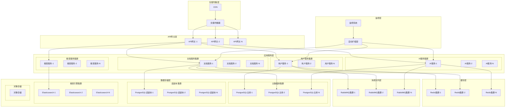

# 扩展性设计文档

## 1. 概述

### 1.1 项目背景

历史文本优化项目需要支持大规模用户访问和海量文档处理，系统必须具备良好的扩展性以应对业务增长。本文档详细描述了系统的扩展性设计方案，包括水平扩展、垂直扩展、微服务架构和自动扩缩容策略。

### 1.2 扩展性目标

- **用户规模**: 支持10万+并发用户
- **数据规模**: 支持千万级文档存储
- **处理能力**: 支持每秒万级请求处理
- **响应时间**: 保持毫秒级响应时间
- **可用性**: 99.99%系统可用性
- **成本效益**: 按需扩展，优化资源利用率

### 1.3 扩展性原则

1. **无状态设计**: 应用层无状态，便于水平扩展
2. **服务解耦**: 微服务架构，独立扩展
3. **数据分片**: 数据库分库分表，分散负载
4. **缓存优先**: 多层缓存，减少数据库压力
5. **异步处理**: 消息队列，削峰填谷
6. **弹性伸缩**: 自动扩缩容，应对流量波动

## 2. 整体扩展性架构

### 2.1 架构概览



### 2.2 扩展性层次

#### 2.2.1 水平扩展（Scale Out）

```typescript
// horizontal-scaling.ts
import { Injectable } from '@nestjs/common';
import { ConfigService } from '@nestjs/config';

@Injectable()
export class HorizontalScalingService {
  constructor(private configService: ConfigService) {}
  
  /**
   * 应用服务水平扩展配置
   */
  getApplicationScalingConfig() {
    return {
      // 最小实例数
      minReplicas: 3,
      // 最大实例数
      maxReplicas: 50,
      // 扩展指标
      metrics: {
        cpu: {
          targetUtilization: 70,
          scaleUpThreshold: 80,
          scaleDownThreshold: 30
        },
        memory: {
          targetUtilization: 80,
          scaleUpThreshold: 85,
          scaleDownThreshold: 40
        },
        requestsPerSecond: {
          targetValue: 1000,
          scaleUpThreshold: 1200,
          scaleDownThreshold: 500
        }
      },
      // 扩展策略
      scaleUpPolicy: {
        stabilizationWindowSeconds: 60,
        policies: [
          {
            type: 'Percent',
            value: 100, // 每次扩展100%
            periodSeconds: 60
          },
          {
            type: 'Pods',
            value: 5, // 每次最多增加5个实例
            periodSeconds: 60
          }
        ]
      },
      scaleDownPolicy: {
        stabilizationWindowSeconds: 300,
        policies: [
          {
            type: 'Percent',
            value: 10, // 每次缩减10%
            periodSeconds: 60
          }
        ]
      }
    };
  }
  
  /**
   * 数据库水平扩展配置
   */
  getDatabaseScalingConfig() {
    return {
      // 分片策略
      sharding: {
        strategy: 'hash', // hash, range, directory
        shardKey: 'user_id',
        shardCount: 16,
        replicationFactor: 3
      },
      // 读写分离
      readWriteSplit: {
        writeRatio: 0.2,
        readRatio: 0.8,
        readReplicas: 3
      },
      // 连接池配置
      connectionPool: {
        minConnections: 10,
        maxConnections: 100,
        acquireTimeoutMillis: 30000,
        idleTimeoutMillis: 600000
      }
    };
  }
  
  /**
   * 缓存水平扩展配置
   */
  getCacheScalingConfig() {
    return {
      // Redis集群配置
      cluster: {
        nodes: 6,
        replicationFactor: 2,
        shardCount: 3
      },
      // 一致性哈希
      consistentHashing: {
        virtualNodes: 160,
        hashFunction: 'crc32'
      },
      // 故障转移
      failover: {
        enabled: true,
        timeoutMs: 5000,
        retryAttempts: 3
      }
    };
  }
}
```

## 7. 监控和告警

### 7.1 扩缩容监控指标

```yaml
# scalability-monitoring.yaml
apiVersion: v1
kind: ConfigMap
metadata:
  name: scalability-monitoring-config
data:
  prometheus.yml: |
    global:
      scrape_interval: 15s
      evaluation_interval: 15s
    
    rule_files:
      - "scalability_rules.yml"
    
    scrape_configs:
      - job_name: 'kubernetes-pods'
        kubernetes_sd_configs:
          - role: pod
        relabel_configs:
          - source_labels: [__meta_kubernetes_pod_annotation_prometheus_io_scrape]
            action: keep
            regex: true
          - source_labels: [__meta_kubernetes_pod_annotation_prometheus_io_path]
            action: replace
            target_label: __metrics_path__
            regex: (.+)
      
      - job_name: 'kubernetes-nodes'
        kubernetes_sd_configs:
          - role: node
        relabel_configs:
          - action: labelmap
            regex: __meta_kubernetes_node_label_(.+)
      
      - job_name: 'kube-state-metrics'
        static_configs:
          - targets: ['kube-state-metrics:8080']
  
  scalability_rules.yml: |
    groups:
      - name: scalability.rules
        rules:
          # HPA指标
          - alert: HPAScalingFrequent
            expr: increase(kube_hpa_status_current_replicas[5m]) > 3
            for: 2m
            labels:
              severity: warning
            annotations:
              summary: "HPA扩缩容过于频繁"
              description: "{{ $labels.hpa }} 在过去5分钟内扩缩容超过3次"
          
          - alert: HPAMaxReplicasReached
            expr: kube_hpa_status_current_replicas == kube_hpa_spec_max_replicas
            for: 5m
            labels:
              severity: critical
            annotations:
              summary: "HPA达到最大副本数"
              description: "{{ $labels.hpa }} 已达到最大副本数 {{ $value }}"
          
          - alert: HPAMinReplicasReached
            expr: kube_hpa_status_current_replicas == kube_hpa_spec_min_replicas
            for: 10m
            labels:
              severity: warning
            annotations:
              summary: "HPA达到最小副本数"
              description: "{{ $labels.hpa }} 已达到最小副本数 {{ $value }}"
          
          # 资源利用率告警
          - alert: HighCPUUtilization
            expr: (rate(container_cpu_usage_seconds_total[5m]) * 100) > 85
            for: 3m
            labels:
              severity: warning
            annotations:
              summary: "CPU利用率过高"
              description: "{{ $labels.pod }} CPU利用率 {{ $value }}% 超过85%"
          
          - alert: HighMemoryUtilization
            expr: (container_memory_usage_bytes / container_spec_memory_limit_bytes * 100) > 90
            for: 3m
            labels:
              severity: critical
            annotations:
              summary: "内存利用率过高"
              description: "{{ $labels.pod }} 内存利用率 {{ $value }}% 超过90%"
          
          # 队列长度告警
          - alert: DocumentProcessingQueueHigh
            expr: document_processing_queue_length > 200
            for: 2m
            labels:
              severity: warning
            annotations:
              summary: "文档处理队列积压"
              description: "文档处理队列长度 {{ $value }} 超过阈值"
          
          - alert: AIAnalysisQueueHigh
            expr: ai_analysis_queue_length > 100
            for: 2m
            labels:
              severity: warning
            annotations:
              summary: "AI分析队列积压"
              description: "AI分析队列长度 {{ $value }} 超过阈值"
          
          # 响应时间告警
          - alert: HighResponseTime
            expr: histogram_quantile(0.95, rate(http_request_duration_seconds_bucket[5m])) > 2
            for: 3m
            labels:
              severity: warning
            annotations:
              summary: "响应时间过长"
              description: "95%分位响应时间 {{ $value }}s 超过2秒"
          
          # 错误率告警
          - alert: HighErrorRate
            expr: (rate(http_requests_total{status=~"5.."}[5m]) / rate(http_requests_total[5m]) * 100) > 5
            for: 2m
            labels:
              severity: critical
            annotations:
              summary: "错误率过高"
              description: "5xx错误率 {{ $value }}% 超过5%"
```

### 7.2 Grafana仪表板配置

```json
{
  "dashboard": {
    "id": null,
    "title": "扩展性监控仪表板",
    "tags": ["scalability", "kubernetes", "hpa"],
    "timezone": "browser",
    "panels": [
      {
        "id": 1,
        "title": "HPA副本数变化",
        "type": "graph",
        "targets": [
          {
            "expr": "kube_hpa_status_current_replicas",
            "legendFormat": "{{ hpa }} - 当前副本数"
          },
          {
            "expr": "kube_hpa_spec_min_replicas",
            "legendFormat": "{{ hpa }} - 最小副本数"
          },
          {
            "expr": "kube_hpa_spec_max_replicas",
            "legendFormat": "{{ hpa }} - 最大副本数"
          }
        ],
        "yAxes": [
          {
            "label": "副本数",
            "min": 0
          }
        ],
        "gridPos": {
          "h": 8,
          "w": 12,
          "x": 0,
          "y": 0
        }
      },
      {
        "id": 2,
        "title": "资源利用率",
        "type": "graph",
        "targets": [
          {
            "expr": "rate(container_cpu_usage_seconds_total[5m]) * 100",
            "legendFormat": "{{ pod }} - CPU利用率%"
          },
          {
            "expr": "container_memory_usage_bytes / container_spec_memory_limit_bytes * 100",
            "legendFormat": "{{ pod }} - 内存利用率%"
          }
        ],
        "yAxes": [
          {
            "label": "利用率%",
            "min": 0,
            "max": 100
          }
        ],
        "gridPos": {
          "h": 8,
          "w": 12,
          "x": 12,
          "y": 0
        }
      },
      {
        "id": 3,
        "title": "队列长度监控",
        "type": "graph",
        "targets": [
          {
            "expr": "document_processing_queue_length",
            "legendFormat": "文档处理队列"
          },
          {
            "expr": "ai_analysis_queue_length",
            "legendFormat": "AI分析队列"
          },
          {
            "expr": "ocr_processing_queue_length",
            "legendFormat": "OCR处理队列"
          }
        ],
        "yAxes": [
          {
            "label": "队列长度",
            "min": 0
          }
        ],
        "gridPos": {
          "h": 8,
          "w": 12,
          "x": 0,
          "y": 8
        }
      },
      {
        "id": 4,
        "title": "扩缩容事件",
        "type": "table",
        "targets": [
          {
            "expr": "increase(kube_hpa_status_current_replicas[1h])",
            "format": "table",
            "instant": true
          }
        ],
        "columns": [
          {
            "text": "HPA名称",
            "value": "hpa"
          },
          {
            "text": "命名空间",
            "value": "namespace"
          },
          {
            "text": "副本数变化",
            "value": "Value"
          }
        ],
        "gridPos": {
          "h": 8,
          "w": 12,
          "x": 12,
          "y": 8
        }
      },
      {
        "id": 5,
        "title": "响应时间分布",
        "type": "heatmap",
        "targets": [
          {
            "expr": "rate(http_request_duration_seconds_bucket[5m])",
            "legendFormat": "{{ le }}"
          }
        ],
        "gridPos": {
          "h": 8,
          "w": 24,
          "x": 0,
          "y": 16
        }
      }
    ],
    "time": {
      "from": "now-1h",
      "to": "now"
    },
    "refresh": "30s"
  }
}
```

### 7.3 扩缩容事件日志

```typescript
// scaling-event-logger.ts
import { Injectable } from '@nestjs/common';
import { EventEmitter2 } from '@nestjs/event-emitter';

export interface ScalingEvent {
  timestamp: Date;
  service: string;
  action: 'scale-up' | 'scale-down';
  fromReplicas: number;
  toReplicas: number;
  reason: string;
  trigger: 'hpa' | 'vpa' | 'custom' | 'manual';
  metrics?: Record<string, number>;
  duration?: number;
  success: boolean;
  error?: string;
}

@Injectable()
export class ScalingEventLogger {
  private events: ScalingEvent[] = [];
  
  constructor(private eventEmitter: EventEmitter2) {
    // 监听扩缩容事件
    this.eventEmitter.on('scaling.started', this.onScalingStarted.bind(this));
    this.eventEmitter.on('scaling.completed', this.onScalingCompleted.bind(this));
    this.eventEmitter.on('scaling.failed', this.onScalingFailed.bind(this));
  }
  
  /**
   * 记录扩缩容开始事件
   */
  private onScalingStarted(event: Partial<ScalingEvent>) {
    const scalingEvent: ScalingEvent = {
      timestamp: new Date(),
      service: event.service!,
      action: event.action!,
      fromReplicas: event.fromReplicas!,
      toReplicas: event.toReplicas!,
      reason: event.reason!,
      trigger: event.trigger!,
      metrics: event.metrics,
      success: false
    };
    
    this.events.push(scalingEvent);
    
    console.log(`扩缩容开始: ${scalingEvent.service} ${scalingEvent.action} ${scalingEvent.fromReplicas} -> ${scalingEvent.toReplicas}`);
    
    // 发送到监控系统
    this.sendToMonitoring(scalingEvent, 'scaling_started');
  }
  
  /**
   * 记录扩缩容完成事件
   */
  private onScalingCompleted(event: { service: string; duration: number }) {
    const lastEvent = this.getLastEvent(event.service);
    if (lastEvent) {
      lastEvent.success = true;
      lastEvent.duration = event.duration;
      
      console.log(`扩缩容完成: ${lastEvent.service} 耗时 ${event.duration}ms`);
      
      // 发送到监控系统
      this.sendToMonitoring(lastEvent, 'scaling_completed');
    }
  }
  
  /**
   * 记录扩缩容失败事件
   */
  private onScalingFailed(event: { service: string; error: string; duration: number }) {
    const lastEvent = this.getLastEvent(event.service);
    if (lastEvent) {
      lastEvent.success = false;
      lastEvent.error = event.error;
      lastEvent.duration = event.duration;
      
      console.error(`扩缩容失败: ${lastEvent.service} 错误: ${event.error}`);
      
      // 发送到监控系统
      this.sendToMonitoring(lastEvent, 'scaling_failed');
    }
  }
  
  /**
   * 获取最后一个事件
   */
  private getLastEvent(service: string): ScalingEvent | undefined {
    return this.events
      .filter(event => event.service === service)
      .sort((a, b) => b.timestamp.getTime() - a.timestamp.getTime())[0];
  }
  
  /**
   * 发送到监控系统
   */
  private sendToMonitoring(event: ScalingEvent, eventType: string) {
    // 发送到Prometheus
    const labels = {
      service: event.service,
      action: event.action,
      trigger: event.trigger,
      success: event.success.toString()
    };
    
    // 记录扩缩容计数器
    // scaling_events_total{service="api",action="scale-up",trigger="hpa",success="true"} 1
    
    // 记录扩缩容持续时间
    if (event.duration) {
      // scaling_duration_seconds{service="api",action="scale-up"} 0.5
    }
    
    // 记录副本数变化
    // scaling_replicas_change{service="api",action="scale-up"} 3
    const replicasChange = event.toReplicas - event.fromReplicas;
    
    console.log(`监控指标: ${eventType}`, {
      labels,
      duration: event.duration,
      replicasChange
    });
  }
  
  /**
   * 获取扩缩容历史
   */
  getScalingHistory(service?: string, limit: number = 100): ScalingEvent[] {
    let filteredEvents = this.events;
    
    if (service) {
      filteredEvents = filteredEvents.filter(event => event.service === service);
    }
    
    return filteredEvents
      .sort((a, b) => b.timestamp.getTime() - a.timestamp.getTime())
      .slice(0, limit);
  }
  
  /**
   * 获取扩缩容统计
   */
  getScalingStats(service?: string, timeRange: number = 24 * 60 * 60 * 1000): any {
    const now = new Date();
    const startTime = new Date(now.getTime() - timeRange);
    
    let events = this.events.filter(event => event.timestamp >= startTime);
    
    if (service) {
      events = events.filter(event => event.service === service);
    }
    
    const stats = {
      totalEvents: events.length,
      scaleUpEvents: events.filter(e => e.action === 'scale-up').length,
      scaleDownEvents: events.filter(e => e.action === 'scale-down').length,
      successfulEvents: events.filter(e => e.success).length,
      failedEvents: events.filter(e => !e.success).length,
      averageDuration: 0,
      triggerBreakdown: {} as Record<string, number>,
      serviceBreakdown: {} as Record<string, number>
    };
    
    // 计算平均持续时间
    const eventsWithDuration = events.filter(e => e.duration);
    if (eventsWithDuration.length > 0) {
      stats.averageDuration = eventsWithDuration.reduce((sum, e) => sum + e.duration!, 0) / eventsWithDuration.length;
    }
    
    // 按触发器分组
    events.forEach(event => {
      stats.triggerBreakdown[event.trigger] = (stats.triggerBreakdown[event.trigger] || 0) + 1;
    });
    
    // 按服务分组
    events.forEach(event => {
      stats.serviceBreakdown[event.service] = (stats.serviceBreakdown[event.service] || 0) + 1;
    });
    
    return stats;
  }
  
  /**
   * 清理旧事件
   */
  cleanupOldEvents(maxAge: number = 7 * 24 * 60 * 60 * 1000) {
    const cutoffTime = new Date(Date.now() - maxAge);
    this.events = this.events.filter(event => event.timestamp >= cutoffTime);
  }
}
```

## 8. 最佳实践

### 8.1 扩缩容策略最佳实践

1. **合理设置HPA参数**
   - 最小副本数不少于2，确保高可用
   - 最大副本数根据资源限制和成本考虑设置
   - CPU阈值通常设置在70-80%
   - 内存阈值通常设置在80-90%
   - 设置合理的稳定窗口，避免频繁扩缩容

2. **多指标组合使用**
   - 同时使用CPU和内存指标
   - 结合业务指标（队列长度、响应时间等）
   - 使用自定义指标进行精确控制

3. **预测性扩缩容**
   - 基于历史数据进行流量预测
   - 在高峰期前提前扩容
   - 使用机器学习算法优化预测准确性

### 8.2 资源管理最佳实践

1. **资源请求和限制**
   ```yaml
   resources:
     requests:
       cpu: "500m"
       memory: "1Gi"
     limits:
       cpu: "2"
       memory: "4Gi"
   ```

2. **节点亲和性配置**
   ```yaml
   affinity:
     nodeAffinity:
       preferredDuringSchedulingIgnoredDuringExecution:
       - weight: 100
         preference:
           matchExpressions:
           - key: node-type
             operator: In
             values:
             - compute-optimized
   ```

3. **Pod反亲和性**
   ```yaml
   affinity:
     podAntiAffinity:
       preferredDuringSchedulingIgnoredDuringExecution:
       - weight: 100
         podAffinityTerm:
           labelSelector:
             matchExpressions:
             - key: app
               operator: In
               values:
               - historical-text-api
           topologyKey: kubernetes.io/hostname
   ```

### 8.3 监控和告警最佳实践

1. **关键指标监控**
   - 副本数变化趋势
   - 资源利用率
   - 扩缩容频率
   - 扩缩容延迟
   - 业务指标（QPS、响应时间、错误率）

2. **告警策略**
   - 设置多级告警（警告、严重、紧急）
   - 避免告警风暴，设置合理的告警间隔
   - 结合业务影响设置告警优先级

3. **性能基线建立**
   - 定期进行性能测试
   - 建立性能基线和容量规划
   - 监控性能趋势变化

### 8.4 成本优化最佳实践

1. **合理的扩缩容策略**
   - 避免过度扩容造成资源浪费
   - 及时缩容释放不必要的资源
   - 使用Spot实例降低成本

2. **资源池化**
   - 使用节点池管理不同类型的工作负载
   - 合理配置节点规格和数量
   - 启用集群自动扩缩容

3. **定时扩缩容**
   - 根据业务规律设置定时扩缩容
   - 在低峰期自动缩容节约成本
   - 在高峰期前提前扩容保证性能

## 9. 总结

本文档详细设计了历史文本优化项目的扩展性架构，涵盖了以下关键方面：

### 9.1 核心设计原则
- **水平扩展优先**：通过增加实例数量而非单实例性能来应对负载增长
- **无状态设计**：确保服务实例可以随时启动和停止
- **自动化管理**：通过HPA、VPA和自定义控制器实现自动扩缩容
- **监控驱动**：基于实时监控数据进行扩缩容决策

### 9.2 技术实现
- **Kubernetes HPA/VPA**：提供基础的自动扩缩容能力
- **Istio服务网格**：实现服务间通信和流量管理
- **Redis集群**：提供可扩展的缓存服务
- **数据库分片**：支持数据层的水平扩展
- **消息队列**：实现异步处理和系统解耦

### 9.3 监控和运维
- **多维度监控**：覆盖基础设施、应用性能和业务指标
- **智能告警**：基于阈值和趋势的多级告警机制
- **事件追踪**：完整记录扩缩容事件和性能数据
- **可视化仪表板**：提供直观的监控和管理界面

### 9.4 最佳实践
- **渐进式扩容**：避免突发扩容对系统造成冲击
- **预测性扩容**：基于历史数据和业务规律提前扩容
- **成本优化**：在保证性能的前提下最小化资源成本
- **故障恢复**：快速检测和恢复扩缩容过程中的异常

通过这套完整的扩展性设计，历史文本优化项目能够：
- 自动应对流量波动，保证服务稳定性
- 根据业务需求灵活调整资源配置
- 在成本和性能之间找到最佳平衡点
- 为未来的业务增长提供可靠的技术保障

该架构设计具有良好的可扩展性、可维护性和可观测性，能够支撑项目从初期到大规模运营的各个阶段。

#### 2.2.2 垂直扩展（Scale Up）

```typescript
// vertical-scaling.ts
import { Injectable } from '@nestjs/common';

@Injectable()
export class VerticalScalingService {
  /**
   * 资源配置模板
   */
  getResourceTemplates() {
    return {
      // 小型配置
      small: {
        cpu: '500m',
        memory: '1Gi',
        storage: '10Gi',
        maxConnections: 100,
        useCase: '开发环境、轻量级服务'
      },
      // 中型配置
      medium: {
        cpu: '2',
        memory: '4Gi',
        storage: '50Gi',
        maxConnections: 500,
        useCase: '测试环境、中等负载'
      },
      // 大型配置
      large: {
        cpu: '4',
        memory: '8Gi',
        storage: '100Gi',
        maxConnections: 1000,
        useCase: '生产环境、高负载'
      },
      // 超大型配置
      xlarge: {
        cpu: '8',
        memory: '16Gi',
        storage: '200Gi',
        maxConnections: 2000,
        useCase: '核心服务、超高负载'
      },
      // 计算密集型
      computeOptimized: {
        cpu: '16',
        memory: '8Gi',
        storage: '50Gi',
        maxConnections: 500,
        useCase: 'AI计算、数据处理'
      },
      // 内存密集型
      memoryOptimized: {
        cpu: '4',
        memory: '32Gi',
        storage: '100Gi',
        maxConnections: 1000,
        useCase: '缓存服务、内存数据库'
      }
    };
  }
  
  /**
   * 动态资源调整
   */
  async adjustResources(serviceName: string, metrics: any) {
    const currentConfig = await this.getCurrentConfig(serviceName);
    const recommendedConfig = this.calculateOptimalConfig(metrics);
    
    if (this.shouldUpgrade(currentConfig, recommendedConfig)) {
      return this.upgradeResources(serviceName, recommendedConfig);
    } else if (this.shouldDowngrade(currentConfig, recommendedConfig)) {
      return this.downgradeResources(serviceName, recommendedConfig);
    }
    
    return currentConfig;
  }
  
  private calculateOptimalConfig(metrics: any) {
    const { cpuUsage, memoryUsage, requestRate, responseTime } = metrics;
    
    // 基于指标计算推荐配置
    let recommendedCpu = '2';
    let recommendedMemory = '4Gi';
    
    if (cpuUsage > 80) {
      recommendedCpu = this.increaseCpu(recommendedCpu);
    }
    
    if (memoryUsage > 85) {
      recommendedMemory = this.increaseMemory(recommendedMemory);
    }
    
    if (responseTime > 1000) {
      // 响应时间过长，增加资源
      recommendedCpu = this.increaseCpu(recommendedCpu);
      recommendedMemory = this.increaseMemory(recommendedMemory);
    }
    
    return {
      cpu: recommendedCpu,
      memory: recommendedMemory,
      reason: this.generateRecommendationReason(metrics)
    };
  }
  
  private increaseCpu(currentCpu: string): string {
    const cpuMap = {
      '500m': '1',
      '1': '2',
      '2': '4',
      '4': '8',
      '8': '16'
    };
    return cpuMap[currentCpu] || currentCpu;
  }
  
  private increaseMemory(currentMemory: string): string {
    const memoryMap = {
      '1Gi': '2Gi',
      '2Gi': '4Gi',
      '4Gi': '8Gi',
      '8Gi': '16Gi',
      '16Gi': '32Gi'
    };
    return memoryMap[currentMemory] || currentMemory;
  }
  
  private async getCurrentConfig(serviceName: string) {
    // 获取当前服务配置
    return {
      cpu: '2',
      memory: '4Gi',
      storage: '50Gi'
    };
  }
  
  private shouldUpgrade(current: any, recommended: any): boolean {
    return this.compareResources(recommended, current) > 0;
  }
  
  private shouldDowngrade(current: any, recommended: any): boolean {
    return this.compareResources(current, recommended) > 0;
  }
  
  private compareResources(a: any, b: any): number {
    // 比较资源配置大小
    const aCpuValue = this.parseCpuValue(a.cpu);
    const bCpuValue = this.parseCpuValue(b.cpu);
    const aMemoryValue = this.parseMemoryValue(a.memory);
    const bMemoryValue = this.parseMemoryValue(b.memory);
    
    if (aCpuValue > bCpuValue || aMemoryValue > bMemoryValue) {
      return 1;
    } else if (aCpuValue < bCpuValue || aMemoryValue < bMemoryValue) {
      return -1;
    }
    return 0;
  }
  
  private parseCpuValue(cpu: string): number {
    if (cpu.endsWith('m')) {
      return parseInt(cpu.slice(0, -1)) / 1000;
    }
    return parseInt(cpu);
  }
  
  private parseMemoryValue(memory: string): number {
    if (memory.endsWith('Gi')) {
      return parseInt(memory.slice(0, -2)) * 1024;
    } else if (memory.endsWith('Mi')) {
      return parseInt(memory.slice(0, -2));
    }
    return parseInt(memory);
  }
  
  private generateRecommendationReason(metrics: any): string {
    const reasons = [];
    
    if (metrics.cpuUsage > 80) {
      reasons.push(`CPU使用率过高: ${metrics.cpuUsage}%`);
    }
    
    if (metrics.memoryUsage > 85) {
      reasons.push(`内存使用率过高: ${metrics.memoryUsage}%`);
    }
    
    if (metrics.responseTime > 1000) {
      reasons.push(`响应时间过长: ${metrics.responseTime}ms`);
    }
    
    return reasons.join(', ');
  }
  
  private async upgradeResources(serviceName: string, config: any) {
    console.log(`升级服务 ${serviceName} 资源配置:`, config);
    // 实现资源升级逻辑
    return config;
  }
  
  private async downgradeResources(serviceName: string, config: any) {
    console.log(`降级服务 ${serviceName} 资源配置:`, config);
    // 实现资源降级逻辑
    return config;
  }
}
```

## 3. 微服务扩展性设计

### 3.1 服务拆分策略

```typescript
// microservice-architecture.ts
import { Injectable } from '@nestjs/common';

/**
 * 微服务架构设计
 */
@Injectable()
export class MicroserviceArchitecture {
  /**
   * 服务拆分原则
   */
  getServiceDecompositionPrinciples() {
    return {
      // 业务边界
      businessBoundary: {
        principle: '按业务领域拆分',
        examples: [
          '用户管理服务',
          '文档处理服务',
          'AI分析服务',
          '搜索服务',
          '通知服务'
        ]
      },
      // 数据边界
      dataBoundary: {
        principle: '每个服务拥有独立的数据存储',
        examples: [
          '用户服务 -> 用户数据库',
          '文档服务 -> 文档数据库',
          '搜索服务 -> Elasticsearch'
        ]
      },
      // 团队边界
      teamBoundary: {
        principle: '一个团队负责一个或多个相关服务',
        examples: [
          '前端团队 -> Web应用',
          '后端团队 -> 核心API服务',
          'AI团队 -> AI分析服务'
        ]
      },
      // 技术边界
      technologyBoundary: {
        principle: '不同技术栈的服务独立部署',
        examples: [
          'Node.js服务',
          'Python AI服务',
          'Go网关服务'
        ]
      }
    };
  }
  
  /**
   * 服务注册与发现
   */
  getServiceDiscoveryConfig() {
    return {
      // 服务注册中心
      registry: {
        type: 'consul', // consul, etcd, eureka
        endpoints: [
          'consul-1.internal:8500',
          'consul-2.internal:8500',
          'consul-3.internal:8500'
        ],
        healthCheck: {
          interval: '10s',
          timeout: '3s',
          deregisterAfter: '30s'
        }
      },
      // 服务发现
      discovery: {
        strategy: 'client-side', // client-side, server-side
        loadBalancing: 'round-robin', // round-robin, weighted, least-connections
        circuitBreaker: {
          enabled: true,
          failureThreshold: 5,
          recoveryTimeout: 30000
        }
      },
      // 服务网格
      serviceMesh: {
        enabled: true,
        provider: 'istio', // istio, linkerd, consul-connect
        features: [
          'traffic-management',
          'security',
          'observability'
        ]
      }
    };
  }
  
  /**
   * 服务间通信
   */
  getServiceCommunicationPatterns() {
    return {
      // 同步通信
      synchronous: {
        protocols: ['HTTP/REST', 'gRPC'],
        patterns: [
          'Request-Response',
          'Request-Reply'
        ],
        useCases: [
          '实时查询',
          '用户认证',
          '数据验证'
        ]
      },
      // 异步通信
      asynchronous: {
        protocols: ['Message Queue', 'Event Streaming'],
        patterns: [
          'Publish-Subscribe',
          'Event Sourcing',
          'CQRS'
        ],
        useCases: [
          '文档处理',
          'AI分析',
          '通知发送'
        ]
      },
      // 混合通信
      hybrid: {
        patterns: [
          'Saga Pattern',
          'Choreography',
          'Orchestration'
        ],
        useCases: [
          '分布式事务',
          '工作流处理',
          '复杂业务流程'
        ]
      }
    };
  }
}
```

### 3.2 服务网格配置

```yaml
# istio-service-mesh.yaml
apiVersion: networking.istio.io/v1beta1
kind: VirtualService
metadata:
  name: historical-text-services
spec:
  hosts:
  - api.historical-text.com
  gateways:
  - historical-text-gateway
  http:
  # 用户服务路由
  - match:
    - uri:
        prefix: /api/users
    route:
    - destination:
        host: user-service
        port:
          number: 3000
    fault:
      delay:
        percentage:
          value: 0.1
        fixedDelay: 5s
    retries:
      attempts: 3
      perTryTimeout: 2s
  
  # 文档服务路由
  - match:
    - uri:
        prefix: /api/documents
    route:
    - destination:
        host: document-service
        port:
          number: 3000
        subset: v1
      weight: 90
    - destination:
        host: document-service
        port:
          number: 3000
        subset: v2
      weight: 10
    timeout: 10s
  
  # AI服务路由
  - match:
    - uri:
        prefix: /api/ai
    route:
    - destination:
        host: ai-service
        port:
          number: 3000
    timeout: 30s
    retries:
      attempts: 2
      perTryTimeout: 15s

---
apiVersion: networking.istio.io/v1beta1
kind: DestinationRule
metadata:
  name: document-service-destination
spec:
  host: document-service
  trafficPolicy:
    connectionPool:
      tcp:
        maxConnections: 100
      http:
        http1MaxPendingRequests: 50
        maxRequestsPerConnection: 10
    loadBalancer:
      simple: LEAST_CONN
    circuitBreaker:
      consecutiveErrors: 5
      interval: 30s
      baseEjectionTime: 30s
      maxEjectionPercent: 50
  subsets:
  - name: v1
    labels:
      version: v1
  - name: v2
    labels:
      version: v2
    trafficPolicy:
      connectionPool:
        tcp:
          maxConnections: 50

---
apiVersion: security.istio.io/v1beta1
kind: PeerAuthentication
metadata:
  name: default
spec:
  mtls:
    mode: STRICT

---
apiVersion: security.istio.io/v1beta1
kind: AuthorizationPolicy
metadata:
  name: service-authorization
spec:
  rules:
  - from:
    - source:
        principals: ["cluster.local/ns/default/sa/api-gateway"]
  - to:
    - operation:
        methods: ["GET", "POST", "PUT", "DELETE"]
  - when:
    - key: request.headers[authorization]
      values: ["Bearer *"]
```

## 4. 数据库扩展性设计

### 4.1 分库分表策略

```typescript
// database-sharding.ts
import { Injectable } from '@nestjs/common';
import { createHash } from 'crypto';

@Injectable()
export class DatabaseShardingService {
  private readonly shardCount = 16;
  private readonly replicaCount = 3;
  
  /**
   * 分片策略配置
   */
  getShardingConfig() {
    return {
      // 水平分片（分库）
      horizontalSharding: {
        strategy: 'hash', // hash, range, directory
        shardKey: 'user_id',
        shardCount: this.shardCount,
        algorithm: 'crc32',
        databases: this.generateDatabaseShards()
      },
      // 垂直分片（分表）
      verticalSharding: {
        strategy: 'feature', // feature, size, access-pattern
        tables: {
          // 用户相关表
          userTables: [
            'users',
            'user_profiles',
            'user_settings',
            'user_sessions'
          ],
          // 文档相关表
          documentTables: [
            'documents',
            'document_versions',
            'document_metadata',
            'document_tags'
          ],
          // 分析相关表
          analyticsTables: [
            'ai_analysis',
            'analysis_results',
            'analysis_history'
          ],
          // 日志相关表
          logTables: [
            'access_logs',
            'operation_logs',
            'error_logs'
          ]
        }
      },
      // 读写分离
      readWriteSplit: {
        writeRatio: 0.2,
        readRatio: 0.8,
        readReplicas: this.replicaCount,
        loadBalancing: 'round-robin'
      }
    };
  }
  
  /**
   * 生成数据库分片配置
   */
  private generateDatabaseShards() {
    const shards = [];
    
    for (let i = 0; i < this.shardCount; i++) {
      shards.push({
        shardId: i,
        master: {
          host: `db-shard-${i}-master.internal`,
          port: 5432,
          database: `historical_text_shard_${i}`,
          username: 'app_user',
          password: '${DB_PASSWORD}',
          maxConnections: 100
        },
        replicas: this.generateReplicas(i)
      });
    }
    
    return shards;
  }
  
  /**
   * 生成副本配置
   */
  private generateReplicas(shardId: number) {
    const replicas = [];
    
    for (let i = 0; i < this.replicaCount; i++) {
      replicas.push({
        replicaId: i,
        host: `db-shard-${shardId}-replica-${i}.internal`,
        port: 5432,
        database: `historical_text_shard_${shardId}`,
        username: 'readonly_user',
        password: '${DB_READONLY_PASSWORD}',
        maxConnections: 50,
        readOnly: true
      });
    }
    
    return replicas;
  }
  
  /**
   * 计算分片ID
   */
  calculateShardId(shardKey: string): number {
    const hash = createHash('crc32');
    hash.update(shardKey);
    const hashValue = parseInt(hash.digest('hex'), 16);
    return Math.abs(hashValue) % this.shardCount;
  }
  
  /**
   * 获取数据库连接
   */
  getDatabaseConnection(shardKey: string, readOnly: boolean = false) {
    const shardId = this.calculateShardId(shardKey);
    const shardConfig = this.getShardingConfig().horizontalSharding.databases[shardId];
    
    if (readOnly && shardConfig.replicas.length > 0) {
      // 选择读副本
      const replicaIndex = Math.floor(Math.random() * shardConfig.replicas.length);
      return shardConfig.replicas[replicaIndex];
    } else {
      // 使用主库
      return shardConfig.master;
    }
  }
  
  /**
   * 跨分片查询
   */
  async crossShardQuery(query: string, params: any[] = []) {
    const promises = [];
    const shards = this.getShardingConfig().horizontalSharding.databases;
    
    for (const shard of shards) {
      const connection = shard.replicas[0] || shard.master;
      promises.push(this.executeQuery(connection, query, params));
    }
    
    const results = await Promise.all(promises);
    return this.mergeResults(results);
  }
  
  /**
   * 执行查询
   */
  private async executeQuery(connection: any, query: string, params: any[]) {
    // 实现数据库查询逻辑
    console.log(`执行查询: ${query} on ${connection.host}`);
    return [];
  }
  
  /**
   * 合并查询结果
   */
  private mergeResults(results: any[][]) {
    return results.flat();
  }
  
  /**
   * 分片迁移
   */
  async migrateShards(fromShardCount: number, toShardCount: number) {
    console.log(`开始分片迁移: ${fromShardCount} -> ${toShardCount}`);
    
    // 1. 创建新分片
    await this.createNewShards(toShardCount);
    
    // 2. 数据迁移
    await this.migrateData(fromShardCount, toShardCount);
    
    // 3. 更新路由配置
    await this.updateRoutingConfig(toShardCount);
    
    // 4. 清理旧分片
    await this.cleanupOldShards(fromShardCount);
    
    console.log('分片迁移完成');
  }
  
  private async createNewShards(shardCount: number) {
    console.log(`创建 ${shardCount} 个新分片`);
    // 实现新分片创建逻辑
  }
  
  private async migrateData(fromShardCount: number, toShardCount: number) {
    console.log(`迁移数据: ${fromShardCount} -> ${toShardCount}`);
    // 实现数据迁移逻辑
  }
  
  private async updateRoutingConfig(shardCount: number) {
    console.log(`更新路由配置: ${shardCount} 个分片`);
    // 实现路由配置更新逻辑
  }
  
  private async cleanupOldShards(shardCount: number) {
    console.log(`清理 ${shardCount} 个旧分片`);
    // 实现旧分片清理逻辑
  }
}
```

### 4.2 数据库连接池优化

```typescript
// connection-pool-optimizer.ts
import { Injectable } from '@nestjs/common';
import { Pool, PoolConfig } from 'pg';

@Injectable()
export class ConnectionPoolOptimizer {
  private pools: Map<string, Pool> = new Map();
  
  /**
   * 连接池配置
   */
  getPoolConfig(serviceName: string, dbType: 'master' | 'replica'): PoolConfig {
    const baseConfig = {
      // 基础配置
      host: process.env[`${serviceName.toUpperCase()}_DB_HOST`],
      port: parseInt(process.env[`${serviceName.toUpperCase()}_DB_PORT`] || '5432'),
      database: process.env[`${serviceName.toUpperCase()}_DB_NAME`],
      user: process.env[`${serviceName.toUpperCase()}_DB_USER`],
      password: process.env[`${serviceName.toUpperCase()}_DB_PASSWORD`],
      
      // SSL配置
      ssl: {
        rejectUnauthorized: false
      },
      
      // 连接超时
      connectionTimeoutMillis: 30000,
      idleTimeoutMillis: 600000,
      
      // 查询超时
      query_timeout: 60000,
      statement_timeout: 60000,
      
      // 应用名称
      application_name: `${serviceName}-${dbType}`
    };
    
    // 根据数据库类型调整配置
    if (dbType === 'master') {
      return {
        ...baseConfig,
        // 主库配置
        min: 5,
        max: 50,
        acquireTimeoutMillis: 30000,
        createTimeoutMillis: 30000,
        destroyTimeoutMillis: 5000,
        reapIntervalMillis: 1000,
        createRetryIntervalMillis: 200
      };
    } else {
      return {
        ...baseConfig,
        // 副本配置
        min: 2,
        max: 30,
        acquireTimeoutMillis: 15000,
        createTimeoutMillis: 15000,
        destroyTimeoutMillis: 5000,
        reapIntervalMillis: 1000,
        createRetryIntervalMillis: 200
      };
    }
  }
  
  /**
   * 获取连接池
   */
  getPool(serviceName: string, dbType: 'master' | 'replica'): Pool {
    const poolKey = `${serviceName}-${dbType}`;
    
    if (!this.pools.has(poolKey)) {
      const config = this.getPoolConfig(serviceName, dbType);
      const pool = new Pool(config);
      
      // 连接池事件监听
      pool.on('connect', (client) => {
        console.log(`新连接建立: ${poolKey}`);
      });
      
      pool.on('remove', (client) => {
        console.log(`连接移除: ${poolKey}`);
      });
      
      pool.on('error', (err, client) => {
        console.error(`连接池错误: ${poolKey}`, err);
      });
      
      this.pools.set(poolKey, pool);
    }
    
    return this.pools.get(poolKey)!;
  }
  
  /**
   * 动态调整连接池大小
   */
  async adjustPoolSize(serviceName: string, dbType: 'master' | 'replica', metrics: any) {
    const pool = this.getPool(serviceName, dbType);
    const currentConfig = pool.options;
    
    const { activeConnections, waitingClients, avgResponseTime } = metrics;
    
    let newMin = currentConfig.min || 5;
    let newMax = currentConfig.max || 50;
    
    // 根据指标调整连接池大小
    if (waitingClients > 10 && avgResponseTime > 1000) {
      // 有等待客户端且响应时间长，增加连接数
      newMax = Math.min(newMax * 1.5, 100);
      newMin = Math.min(newMin * 1.2, newMax * 0.2);
    } else if (activeConnections < newMin * 0.5 && avgResponseTime < 100) {
      // 活跃连接少且响应时间短，减少连接数
      newMax = Math.max(newMax * 0.8, 10);
      newMin = Math.max(newMin * 0.8, 2);
    }
    
    if (newMin !== currentConfig.min || newMax !== currentConfig.max) {
      console.log(`调整连接池大小: ${serviceName}-${dbType}, min: ${currentConfig.min} -> ${newMin}, max: ${currentConfig.max} -> ${newMax}`);
      
      // 创建新的连接池配置
      const newConfig = {
        ...currentConfig,
        min: newMin,
        max: newMax
      };
      
      // 重新创建连接池
      await this.recreatePool(serviceName, dbType, newConfig);
    }
  }
  
  /**
   * 重新创建连接池
   */
  private async recreatePool(serviceName: string, dbType: 'master' | 'replica', newConfig: PoolConfig) {
    const poolKey = `${serviceName}-${dbType}`;
    const oldPool = this.pools.get(poolKey);
    
    if (oldPool) {
      // 优雅关闭旧连接池
      await oldPool.end();
    }
    
    // 创建新连接池
    const newPool = new Pool(newConfig);
    this.pools.set(poolKey, newPool);
  }
  
  /**
   * 获取连接池统计信息
   */
  getPoolStats(serviceName: string, dbType: 'master' | 'replica') {
    const pool = this.getPool(serviceName, dbType);
    
    return {
      totalCount: pool.totalCount,
      idleCount: pool.idleCount,
      waitingCount: pool.waitingCount,
      config: {
        min: pool.options.min,
        max: pool.options.max,
        acquireTimeoutMillis: pool.options.acquireTimeoutMillis,
        idleTimeoutMillis: pool.options.idleTimeoutMillis
      }
    };
  }
  
  /**
   * 关闭所有连接池
   */
  async closeAllPools() {
    const promises = [];
    
    for (const [poolKey, pool] of this.pools) {
      console.log(`关闭连接池: ${poolKey}`);
      promises.push(pool.end());
    }
    
    await Promise.all(promises);
    this.pools.clear();
  }
}
```

## 5. 缓存扩展性设计

### 5.1 多层缓存架构

```typescript
// multi-layer-cache.ts
import { Injectable } from '@nestjs/common';
import { Redis } from 'ioredis';

@Injectable()
export class MultiLayerCacheService {
  private localCache: Map<string, any> = new Map();
  private redisCluster: Redis.Cluster;
  
  constructor() {
    this.initializeRedisCluster();
  }
  
  /**
   * 初始化Redis集群
   */
  private initializeRedisCluster() {
    this.redisCluster = new Redis.Cluster([
      { host: 'redis-cluster-1.internal', port: 6379 },
      { host: 'redis-cluster-2.internal', port: 6379 },
      { host: 'redis-cluster-3.internal', port: 6379 },
      { host: 'redis-cluster-4.internal', port: 6379 },
      { host: 'redis-cluster-5.internal', port: 6379 },
      { host: 'redis-cluster-6.internal', port: 6379 }
    ], {
      redisOptions: {
        password: process.env.REDIS_PASSWORD,
        connectTimeout: 10000,
        lazyConnect: true,
        maxRetriesPerRequest: 3
      },
      enableOfflineQueue: false,
      retryDelayOnFailover: 100,
      maxRetriesPerRequest: 3,
      scaleReads: 'slave'
    });
  }
  
  /**
   * 缓存层级配置
   */
  getCacheLayerConfig() {
    return {
      // L1缓存 - 本地内存
      l1Cache: {
        type: 'memory',
        maxSize: 1000,
        ttl: 60, // 60秒
        useCase: '热点数据、频繁访问'
      },
      // L2缓存 - Redis
      l2Cache: {
        type: 'redis',
        maxSize: 100000,
        ttl: 3600, // 1小时
        useCase: '会话数据、临时数据'
      },
      // L3缓存 - 分布式缓存
      l3Cache: {
        type: 'distributed',
        maxSize: 1000000,
        ttl: 86400, // 24小时
        useCase: '静态数据、配置数据'
      }
    };
  }
  
  /**
   * 获取缓存数据
   */
  async get(key: string): Promise<any> {
    // L1缓存查找
    if (this.localCache.has(key)) {
      console.log(`L1缓存命中: ${key}`);
      return this.localCache.get(key);
    }
    
    // L2缓存查找
    try {
      const redisValue = await this.redisCluster.get(key);
      if (redisValue) {
        console.log(`L2缓存命中: ${key}`);
        const parsedValue = JSON.parse(redisValue);
        
        // 回填L1缓存
        this.setLocalCache(key, parsedValue, 60);
        
        return parsedValue;
      }
    } catch (error) {
      console.error('Redis缓存查询失败:', error);
    }
    
    console.log(`缓存未命中: ${key}`);
    return null;
  }
  
  /**
   * 设置缓存数据
   */
  async set(key: string, value: any, ttl: number = 3600): Promise<void> {
    // 设置L1缓存
    this.setLocalCache(key, value, Math.min(ttl, 60));
    
    // 设置L2缓存
    try {
      await this.redisCluster.setex(key, ttl, JSON.stringify(value));
    } catch (error) {
      console.error('Redis缓存设置失败:', error);
    }
  }
  
  /**
   * 删除缓存数据
   */
  async delete(key: string): Promise<void> {
    // 删除L1缓存
    this.localCache.delete(key);
    
    // 删除L2缓存
    try {
      await this.redisCluster.del(key);
    } catch (error) {
      console.error('Redis缓存删除失败:', error);
    }
  }
  
  /**
   * 批量获取缓存
   */
  async mget(keys: string[]): Promise<Map<string, any>> {
    const result = new Map<string, any>();
    const missedKeys: string[] = [];
    
    // L1缓存批量查找
    for (const key of keys) {
      if (this.localCache.has(key)) {
        result.set(key, this.localCache.get(key));
      } else {
        missedKeys.push(key);
      }
    }
    
    if (missedKeys.length === 0) {
      return result;
    }
    
    // L2缓存批量查找
    try {
      const redisValues = await this.redisCluster.mget(...missedKeys);
      
      for (let i = 0; i < missedKeys.length; i++) {
        const key = missedKeys[i];
        const value = redisValues[i];
        
        if (value) {
          const parsedValue = JSON.parse(value);
          result.set(key, parsedValue);
          
          // 回填L1缓存
          this.setLocalCache(key, parsedValue, 60);
        }
      }
    } catch (error) {
      console.error('Redis批量查询失败:', error);
    }
    
    return result;
  }
  
  /**
   * 设置本地缓存
   */
  private setLocalCache(key: string, value: any, ttl: number): void {
    // 检查缓存大小限制
    if (this.localCache.size >= 1000) {
      // LRU淘汰策略
      const firstKey = this.localCache.keys().next().value;
      this.localCache.delete(firstKey);
    }
    
    // 设置缓存和过期时间
    this.localCache.set(key, {
      value,
      expireAt: Date.now() + ttl * 1000
    });
    
    // 设置过期清理
    setTimeout(() => {
      const cached = this.localCache.get(key);
      if (cached && Date.now() >= cached.expireAt) {
        this.localCache.delete(key);
      }
    }, ttl * 1000);
  }
  
  /**
   * 缓存预热
   */
  async warmupCache(keys: string[], dataLoader: (key: string) => Promise<any>): Promise<void> {
    console.log(`开始缓存预热，共 ${keys.length} 个键`);
    
    const batchSize = 10;
    for (let i = 0; i < keys.length; i += batchSize) {
      const batch = keys.slice(i, i + batchSize);
      
      const promises = batch.map(async (key) => {
        try {
          const data = await dataLoader(key);
          await this.set(key, data, 3600);
          console.log(`缓存预热完成: ${key}`);
        } catch (error) {
          console.error(`缓存预热失败: ${key}`, error);
        }
      });
      
      await Promise.all(promises);
    }
    
    console.log('缓存预热完成');
  }
  
  /**
   * 获取缓存统计信息
   */
  getCacheStats() {
    return {
      l1Cache: {
        size: this.localCache.size,
        maxSize: 1000,
        hitRate: this.calculateL1HitRate()
      },
      l2Cache: {
        connected: this.redisCluster.status === 'ready',
        nodes: this.redisCluster.nodes().length
      }
    };
  }
  
  private calculateL1HitRate(): number {
    // 实现L1缓存命中率计算
    return 0.85; // 示例值
  }
  
  /**
   * 清理过期的本地缓存
   */
  cleanupExpiredLocalCache(): void {
    const now = Date.now();
    
    for (const [key, cached] of this.localCache.entries()) {
      if (cached.expireAt && now >= cached.expireAt) {
        this.localCache.delete(key);
      }
    }
  }
}
```

### 5.2 缓存一致性策略

```typescript
// cache-consistency.ts
import { Injectable } from '@nestjs/common';
import { EventEmitter } from 'events';

@Injectable()
export class CacheConsistencyService extends EventEmitter {
  private cacheInvalidationQueue: Map<string, Set<string>> = new Map();
  
  /**
   * 缓存一致性策略
   */
  getConsistencyStrategies() {
    return {
      // 强一致性
      strongConsistency: {
        strategy: 'write-through',
        description: '写入时同步更新缓存和数据库',
        useCase: '关键业务数据',
        latency: 'high',
        consistency: 'strong'
      },
      // 最终一致性
      eventualConsistency: {
        strategy: 'write-behind',
        description: '异步更新数据库，立即更新缓存',
        useCase: '非关键业务数据',
        latency: 'low',
        consistency: 'eventual'
      },
      // 弱一致性
      weakConsistency: {
        strategy: 'cache-aside',
        description: '应用程序管理缓存',
        useCase: '静态数据、配置数据',
        latency: 'medium',
        consistency: 'weak'
      }
    };
  }
  
  /**
   * 缓存失效策略
   */
  async invalidateCache(pattern: string, reason: string = 'data-update'): Promise<void> {
    console.log(`缓存失效: ${pattern}, 原因: ${reason}`);
    
    // 发布缓存失效事件
    this.emit('cache-invalidation', {
      pattern,
      reason,
      timestamp: new Date().toISOString()
    });
    
    // 添加到失效队列
    if (!this.cacheInvalidationQueue.has(reason)) {
      this.cacheInvalidationQueue.set(reason, new Set());
    }
    
    this.cacheInvalidationQueue.get(reason)!.add(pattern);
    
    // 批量处理失效
    await this.processCacheInvalidation(reason);
  }
  
  /**
   * 处理缓存失效
   */
  private async processCacheInvalidation(reason: string): Promise<void> {
    const patterns = this.cacheInvalidationQueue.get(reason);
    if (!patterns || patterns.size === 0) {
      return;
    }
    
    try {
      // 批量删除缓存
      for (const pattern of patterns) {
        await this.deleteByPattern(pattern);
      }
      
      // 清空队列
      this.cacheInvalidationQueue.delete(reason);
      
      console.log(`缓存失效处理完成: ${reason}, 共 ${patterns.size} 个模式`);
    } catch (error) {
      console.error('缓存失效处理失败:', error);
    }
  }
  
  /**
   * 按模式删除缓存
   */
  private async deleteByPattern(pattern: string): Promise<void> {
    // 实现模式匹配删除逻辑
    console.log(`删除缓存模式: ${pattern}`);
  }
  
  /**
   * 缓存版本控制
   */
  generateCacheVersion(key: string, data: any): string {
    const dataHash = this.calculateHash(JSON.stringify(data));
    const timestamp = Date.now();
    return `${key}:v${timestamp}:${dataHash}`;
  }
  
  /**
   * 计算数据哈希
   */
  private calculateHash(data: string): string {
    // 简单哈希实现
    let hash = 0;
    for (let i = 0; i < data.length; i++) {
      const char = data.charCodeAt(i);
      hash = ((hash << 5) - hash) + char;
      hash = hash & hash; // 转换为32位整数
    }
    return Math.abs(hash).toString(16);
  }
  
  /**
   * 缓存同步
   */
  async syncCache(sourceKey: string, targetKeys: string[]): Promise<void> {
    console.log(`缓存同步: ${sourceKey} -> ${targetKeys.join(', ')}`);
    
    // 获取源数据
    const sourceData = await this.getFromCache(sourceKey);
    if (!sourceData) {
      console.warn(`源缓存不存在: ${sourceKey}`);
      return;
    }
    
    // 同步到目标缓存
    const promises = targetKeys.map(async (targetKey) => {
      try {
        await this.setToCache(targetKey, sourceData);
        console.log(`缓存同步完成: ${sourceKey} -> ${targetKey}`);
      } catch (error) {
        console.error(`缓存同步失败: ${sourceKey} -> ${targetKey}`, error);
      }
    });
    
    await Promise.all(promises);
  }
  
  private async getFromCache(key: string): Promise<any> {
    // 实现缓存获取逻辑
    return null;
  }
  
  private async setToCache(key: string, data: any): Promise<void> {
    // 实现缓存设置逻辑
  }
  
  /**
   * 缓存预加载
   */
  async preloadCache(keys: string[], loader: (key: string) => Promise<any>): Promise<void> {
    console.log(`开始缓存预加载，共 ${keys.length} 个键`);
    
    const concurrency = 5; // 并发数
    const chunks = this.chunkArray(keys, concurrency);
    
    for (const chunk of chunks) {
      const promises = chunk.map(async (key) => {
        try {
          const data = await loader(key);
          await this.setToCache(key, data);
          console.log(`缓存预加载完成: ${key}`);
        } catch (error) {
          console.error(`缓存预加载失败: ${key}`, error);
        }
      });
      
      await Promise.all(promises);
    }
    
    console.log('缓存预加载完成');
  }
  
  private chunkArray<T>(array: T[], chunkSize: number): T[][] {
    const chunks: T[][] = [];
    for (let i = 0; i < array.length; i += chunkSize) {
      chunks.push(array.slice(i, i + chunkSize));
    }
    return chunks;
  }
}
```

## 6. 自动扩缩容策略

### 6.1 Kubernetes HPA配置

```yaml
# horizontal-pod-autoscaler.yaml
apiVersion: autoscaling/v2
kind: HorizontalPodAutoscaler
metadata:
  name: historical-text-api-hpa
  namespace: default
spec:
  scaleTargetRef:
    apiVersion: apps/v1
    kind: Deployment
    name: historical-text-api
  minReplicas: 3
  maxReplicas: 50
  metrics:
  # CPU指标
  - type: Resource
    resource:
      name: cpu
      target:
        type: Utilization
        averageUtilization: 70
  # 内存指标
  - type: Resource
    resource:
      name: memory
      target:
        type: Utilization
        averageUtilization: 80
  # 自定义指标 - 请求速率
  - type: Pods
    pods:
      metric:
        name: requests_per_second
      target:
        type: AverageValue
        averageValue: "1000"
  # 自定义指标 - 队列长度
  - type: Object
    object:
      metric:
        name: queue_length
      describedObject:
        apiVersion: v1
        kind: Service
        name: rabbitmq-service
      target:
        type: Value
        value: "100"
  behavior:
    scaleUp:
      stabilizationWindowSeconds: 60
      policies:
      - type: Percent
        value: 100
        periodSeconds: 60
      - type: Pods
        value: 5
        periodSeconds: 60
      selectPolicy: Max
    scaleDown:
      stabilizationWindowSeconds: 300
      policies:
      - type: Percent
        value: 10
        periodSeconds: 60
      - type: Pods
        value: 2
        periodSeconds: 60
      selectPolicy: Min

---
apiVersion: autoscaling/v2
kind: HorizontalPodAutoscaler
metadata:
  name: document-service-hpa
  namespace: default
spec:
  scaleTargetRef:
    apiVersion: apps/v1
    kind: Deployment
    name: document-service
  minReplicas: 2
  maxReplicas: 30
  metrics:
  - type: Resource
    resource:
      name: cpu
      target:
        type: Utilization
        averageUtilization: 75
  - type: Resource
    resource:
      name: memory
      target:
        type: Utilization
        averageUtilization: 85
  behavior:
    scaleUp:
      stabilizationWindowSeconds: 120
      policies:
      - type: Percent
        value: 50
        periodSeconds: 60
    scaleDown:
      stabilizationWindowSeconds: 600
      policies:
      - type: Percent
        value: 5
        periodSeconds: 60

---
apiVersion: autoscaling/v2
kind: HorizontalPodAutoscaler
metadata:
  name: ai-service-hpa
  namespace: default
spec:
  scaleTargetRef:
    apiVersion: apps/v1
    kind: Deployment
    name: ai-service
  minReplicas: 1
  maxReplicas: 20
  metrics:
  - type: Resource
    resource:
      name: cpu
      target:
        type: Utilization
        averageUtilization: 80
  - type: Resource
    resource:
      name: memory
      target:
        type: Utilization
        averageUtilization: 90
  # GPU指标（如果使用GPU）
  - type: External
    external:
      metric:
        name: gpu_utilization
      target:
        type: AverageValue
        averageValue: "70"
  behavior:
    scaleUp:
      stabilizationWindowSeconds: 180
      policies:
      - type: Pods
        value: 2
        periodSeconds: 120
    scaleDown:
      stabilizationWindowSeconds: 900
      policies:
      - type: Pods
        value: 1
        periodSeconds: 300
```

### 6.2 垂直Pod自动扩缩容（VPA）

```yaml
# vertical-pod-autoscaler.yaml
apiVersion: autoscaling.k8s.io/v1
kind: VerticalPodAutoscaler
metadata:
  name: historical-text-api-vpa
spec:
  targetRef:
    apiVersion: apps/v1
    kind: Deployment
    name: historical-text-api
  updatePolicy:
    updateMode: "Auto"
  resourcePolicy:
    containerPolicies:
    - containerName: api
      minAllowed:
        cpu: 100m
        memory: 128Mi
      maxAllowed:
        cpu: 4
        memory: 8Gi
      controlledResources: ["cpu", "memory"]
      controlledValues: RequestsAndLimits

---
apiVersion: autoscaling.k8s.io/v1
kind: VerticalPodAutoscaler
metadata:
  name: document-service-vpa
spec:
  targetRef:
    apiVersion: apps/v1
    kind: Deployment
    name: document-service
  updatePolicy:
    updateMode: "Auto"
  resourcePolicy:
    containerPolicies:
    - containerName: document-service
      minAllowed:
        cpu: 200m
        memory: 256Mi
      maxAllowed:
        cpu: 8
        memory: 16Gi
      controlledResources: ["cpu", "memory"]
```

### 6.3 自定义扩缩容控制器

```typescript
// custom-autoscaler.ts
import { Injectable } from '@nestjs/common';
import { Cron, CronExpression } from '@nestjs/schedule';
import { ConfigService } from '@nestjs/config';

@Injectable()
export class CustomAutoscalerService {
  private scalingHistory: Map<string, any[]> = new Map();
  
  constructor(private configService: ConfigService) {}
  
  /**
   * 自定义扩缩容规则
   */
  getScalingRules() {
    return {
      // 基于时间的扩缩容
      timeBasedScaling: {
        enabled: true,
        rules: [
          {
            name: '工作时间扩容',
            schedule: '0 8 * * 1-5', // 工作日8点
            action: 'scale-up',
            targetReplicas: 10,
            services: ['api', 'document-service']
          },
          {
            name: '夜间缩容',
            schedule: '0 22 * * *', // 每天22点
            action: 'scale-down',
            targetReplicas: 3,
            services: ['api', 'document-service']
          },
          {
            name: '周末缩容',
            schedule: '0 0 * * 6', // 周六0点
            action: 'scale-down',
            targetReplicas: 2,
            services: ['api', 'document-service', 'ai-service']
          }
        ]
      },
      // 基于业务指标的扩缩容
      businessMetricScaling: {
        enabled: true,
        rules: [
          {
            name: '文档处理队列扩容',
            metric: 'document_processing_queue_length',
            threshold: 100,
            action: 'scale-up',
            scaleStep: 2,
            maxReplicas: 20,
            cooldown: 300 // 5分钟冷却
          },
          {
            name: 'AI分析请求扩容',
            metric: 'ai_analysis_requests_per_minute',
            threshold: 50,
            action: 'scale-up',
            scaleStep: 1,
            maxReplicas: 15,
            cooldown: 600 // 10分钟冷却
          },
          {
            name: '错误率扩容',
            metric: 'error_rate_percentage',
            threshold: 5,
            action: 'scale-up',
            scaleStep: 3,
            maxReplicas: 25,
            cooldown: 180 // 3分钟冷却
          }
        ]
      },
      // 预测性扩缩容
      predictiveScaling: {
        enabled: true,
        algorithm: 'linear-regression',
        lookbackPeriod: 7, // 7天历史数据
        forecastPeriod: 1, // 预测1小时
        confidenceThreshold: 0.8,
        rules: [
          {
            name: '流量预测扩容',
            metric: 'requests_per_second',
            predictedThreshold: 1500,
            action: 'scale-up',
            leadTime: 300 // 提前5分钟扩容
          }
        ]
      }
    };
  }
  
  /**
   * 定时检查扩缩容条件
   */
  @Cron(CronExpression.EVERY_MINUTE)
  async checkScalingConditions() {
    const rules = this.getScalingRules();
    
    // 检查业务指标扩缩容
    if (rules.businessMetricScaling.enabled) {
      await this.checkBusinessMetricScaling(rules.businessMetricScaling.rules);
    }
    
    // 检查预测性扩缩容
    if (rules.predictiveScaling.enabled) {
      await this.checkPredictiveScaling(rules.predictiveScaling);
    }
  }
  
  /**
   * 检查业务指标扩缩容
   */
  private async checkBusinessMetricScaling(rules: any[]) {
    for (const rule of rules) {
      try {
        const currentValue = await this.getMetricValue(rule.metric);
        const shouldScale = this.evaluateScalingCondition(rule, currentValue);
        
        if (shouldScale) {
          await this.executeScaling(rule, currentValue);
        }
      } catch (error) {
        console.error(`业务指标扩缩容检查失败: ${rule.name}`, error);
      }
    }
  }
  
  /**
   * 检查预测性扩缩容
   */
  private async checkPredictiveScaling(config: any) {
    try {
      const predictions = await this.generatePredictions(config);
      
      for (const rule of config.rules) {
        const prediction = predictions[rule.metric];
        
        if (prediction && prediction.confidence >= config.confidenceThreshold) {
          if (prediction.value >= rule.predictedThreshold) {
            console.log(`预测性扩容触发: ${rule.name}, 预测值: ${prediction.value}`);
            await this.scheduleScaling(rule, prediction, rule.leadTime);
          }
        }
      }
    } catch (error) {
      console.error('预测性扩缩容检查失败:', error);
    }
  }
  
  /**
   * 获取指标值
   */
  private async getMetricValue(metric: string): Promise<number> {
    // 实现指标获取逻辑
    const mockValues = {
      'document_processing_queue_length': Math.floor(Math.random() * 200),
      'ai_analysis_requests_per_minute': Math.floor(Math.random() * 100),
      'error_rate_percentage': Math.random() * 10,
      'requests_per_second': Math.floor(Math.random() * 2000)
    };
    
    return mockValues[metric] || 0;
  }
  
  /**
   * 评估扩缩容条件
   */
  private evaluateScalingCondition(rule: any, currentValue: number): boolean {
    // 检查冷却期
    const lastScaling = this.getLastScaling(rule.name);
    if (lastScaling && Date.now() - lastScaling.timestamp < rule.cooldown * 1000) {
      return false;
    }
    
    // 检查阈值
    if (rule.action === 'scale-up') {
      return currentValue >= rule.threshold;
    } else if (rule.action === 'scale-down') {
      return currentValue <= rule.threshold;
    }
    
    return false;
  }
  
  /**
   * 执行扩缩容
   */
  private async executeScaling(rule: any, currentValue: number) {
    console.log(`执行扩缩容: ${rule.name}, 当前值: ${currentValue}, 阈值: ${rule.threshold}`);
    
    try {
      // 获取当前副本数
      const currentReplicas = await this.getCurrentReplicas(rule.service || 'api');
      
      // 计算目标副本数
      let targetReplicas = currentReplicas;
      if (rule.action === 'scale-up') {
        targetReplicas = Math.min(currentReplicas + rule.scaleStep, rule.maxReplicas);
      } else if (rule.action === 'scale-down') {
        targetReplicas = Math.max(currentReplicas - rule.scaleStep, rule.minReplicas || 1);
      }
      
      if (targetReplicas !== currentReplicas) {
        await this.scaleService(rule.service || 'api', targetReplicas);
        
        // 记录扩缩容历史
        this.recordScaling(rule.name, {
          timestamp: Date.now(),
          action: rule.action,
          fromReplicas: currentReplicas,
          toReplicas: targetReplicas,
          reason: `${rule.metric}: ${currentValue}`,
          rule: rule.name
        });
      }
    } catch (error) {
      console.error(`扩缩容执行失败: ${rule.name}`, error);
    }
  }
  
  /**
   * 生成预测
   */
  private async generatePredictions(config: any): Promise<any> {
    // 实现预测算法
    const predictions = {};
    
    for (const rule of config.rules) {
      const historicalData = await this.getHistoricalData(rule.metric, config.lookbackPeriod);
      const prediction = this.linearRegression(historicalData, config.forecastPeriod);
      
      predictions[rule.metric] = {
        value: prediction.value,
        confidence: prediction.confidence
      };
    }
    
    return predictions;
  }
  
  /**
   * 线性回归预测
   */
  private linearRegression(data: number[], forecastPeriod: number): any {
    if (data.length < 2) {
      return { value: 0, confidence: 0 };
    }
    
    // 简单线性回归实现
    const n = data.length;
    const x = Array.from({ length: n }, (_, i) => i);
    const y = data;
    
    const sumX = x.reduce((a, b) => a + b, 0);
    const sumY = y.reduce((a, b) => a + b, 0);
    const sumXY = x.reduce((sum, xi, i) => sum + xi * y[i], 0);
    const sumXX = x.reduce((sum, xi) => sum + xi * xi, 0);
    
    const slope = (n * sumXY - sumX * sumY) / (n * sumXX - sumX * sumX);
    const intercept = (sumY - slope * sumX) / n;
    
    // 预测值
    const predictedValue = slope * (n + forecastPeriod - 1) + intercept;
    
    // 计算置信度（简化版）
    const predictions = x.map(xi => slope * xi + intercept);
    const errors = y.map((yi, i) => Math.abs(yi - predictions[i]));
    const meanError = errors.reduce((a, b) => a + b, 0) / errors.length;
    const confidence = Math.max(0, 1 - meanError / (sumY / n));
    
    return {
      value: Math.max(0, predictedValue),
      confidence: Math.min(1, confidence)
    };
  }
  
  /**
   * 获取历史数据
   */
  private async getHistoricalData(metric: string, days: number): Promise<number[]> {
    // 实现历史数据获取逻辑
    // 这里返回模拟数据
    const data = [];
    for (let i = 0; i < days * 24; i++) {
      data.push(Math.floor(Math.random() * 1000) + 500);
    }
    return data;
  }
  
  /**
   * 调度扩缩容
   */
  private async scheduleScaling(rule: any, prediction: any, leadTime: number) {
    setTimeout(async () => {
      console.log(`执行预测性扩缩容: ${rule.name}`);
      await this.executeScaling(rule, prediction.value);
    }, leadTime * 1000);
  }
  
  /**
   * 获取当前副本数
   */
  private async getCurrentReplicas(serviceName: string): Promise<number> {
    // 实现获取当前副本数逻辑
    return 3; // 模拟值
  }
  
  /**
   * 扩缩容服务
   */
  private async scaleService(serviceName: string, replicas: number) {
    console.log(`扩缩容服务: ${serviceName} -> ${replicas} 副本`);
    // 实现服务扩缩容逻辑
  }
  
  /**
   * 获取最后一次扩缩容记录
   */
  private getLastScaling(ruleName: string): any {
    const history = this.scalingHistory.get(ruleName);
    return history && history.length > 0 ? history[history.length - 1] : null;
  }
  
  /**
   * 记录扩缩容历史
   */
  private recordScaling(ruleName: string, record: any) {
    if (!this.scalingHistory.has(ruleName)) {
      this.scalingHistory.set(ruleName, []);
    }
    
    const history = this.scalingHistory.get(ruleName)!;
    history.push(record);
    
    // 保持最近100条记录
    if (history.length > 100) {
      history.shift();
    }
  }
  
  /**
   * 获取扩缩容历史
   */
  getScalingHistory(ruleName?: string) {
    if (ruleName) {
      return this.scalingHistory.get(ruleName) || [];
    }
    
    const allHistory = {};
    for (const [name, history] of this.scalingHistory) {
      allHistory[name] = history;
    }
    return allHistory;
  }
}
```