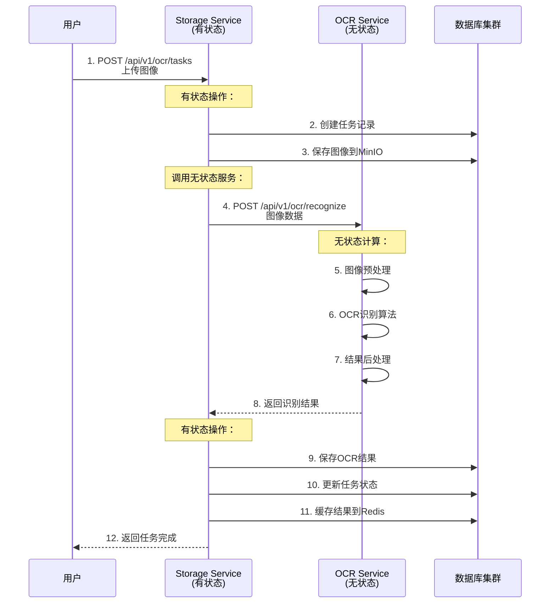

# 🏗️ 无状态 vs 有状态架构详解

## 🤔 什么是无状态(Stateless)和有状态(Stateful)？

### 📖 基本定义

**无状态服务 (Stateless Service)**
- 服务不保存任何持久化状态或数据
- 每个请求都是独立的，不依赖之前的请求
- 不直接连接数据库、缓存或文件系统
- 可以随时启动、停止、重启而不影响数据

**有状态服务 (Stateful Service)**  
- 服务保存和管理状态数据
- 请求之间可能有依赖关系
- 直接连接和管理数据库、缓存、文件系统
- 重启可能会影响正在进行的操作

---

## 🏗️ 我们项目中的架构实例

### 🟢 无状态服务示例 - OCR Service

#### 无状态设计
```python
# OCR Service 的处理流程
def process_ocr_request(image_data):
    # 1. 接收图像数据
    # 2. 进行OCR识别 (纯计算)
    result = tesseract.recognize(image_data)
    # 3. 返回结果，不保存任何数据
    return result

# 服务不知道：
# - 这个图像从哪里来
# - 结果要保存到哪里  
# - 用户是谁
# - 之前处理了什么
```

#### 数据流向
```
客户端 → OCR Service → 纯计算处理 → 返回结果
              ↓
         不保存任何数据
```

### 🔴 有状态服务示例 - Storage Service

#### 有状态设计
```python
# Storage Service 的处理流程
def save_ocr_result(user_id, image_id, result):
    # 1. 连接数据库
    db = connect_to_database()
    
    # 2. 保存OCR结果
    db.save_ocr_result(user_id, image_id, result)
    
    # 3. 更新缓存
    redis.set(f"ocr:{image_id}", result)
    
    # 4. 记录处理历史
    db.log_processing_history(user_id, "ocr", image_id)

# 服务需要知道和管理：
# - 数据库连接和状态
# - 用户信息和权限
# - 缓存数据
# - 处理历史
```

#### 数据流向
```
客户端 → Storage Service → 管理所有状态数据
                    ↓
            MongoDB + PostgreSQL + Redis + MinIO
```

---

## 🔍 详细对比分析

### 📊 我们项目中的服务分类

| 服务名称 | 类型 | 职责 | 状态管理 | 外部依赖 |
|---------|------|------|----------|----------|
| **OCR Service** | 🟢 无状态 | 图像识别计算 | 不管理状态 | 仅Storage Service |
| **NLP Service** | 🟢 无状态 | 文本分析计算 | 不管理状态 | 仅Storage Service |  
| **Image Processing** | 🟢 无状态 | 图像处理计算 | 不管理状态 | 仅Storage Service |
| **File Processor** | 🟢 无状态 | 文件格式转换 | 不管理状态 | 仅Storage Service |
| **Storage Service** | 🔴 有状态 | 数据管理中心 | 管理所有状态 | 5个存储系统 |

### 🔍 具体实例说明

#### 🟢 无状态服务实例：OCR Service

**请求处理过程：**
```
1. 接收请求：POST /api/v1/ocr/recognize
   - 输入：图像数据
   
2. 纯计算处理：
   - 图像预处理
   - OCR识别算法  
   - 结果后处理
   
3. 返回结果：
   - 识别出的文本
   - 置信度信息
   
4. 处理完成：
   - 不保存任何数据
   - 不记住这次请求
   - 服务状态没有任何改变
```

**重启影响：**
```
✅ 可以随时重启
✅ 不会丢失数据 (因为不存数据)
✅ 不会影响其他请求
✅ 立即可以处理新请求
```

#### 🔴 有状态服务实例：Storage Service

**请求处理过程：**
```
1. 接收请求：POST /api/v1/ocr/tasks
   - 输入：OCR任务请求
   
2. 状态管理：
   - 连接MongoDB保存任务
   - 连接Redis缓存结果  
   - 连接PostgreSQL记录日志
   - 调用OCR服务处理
   - 更新任务状态
   
3. 返回结果：
   - 任务ID和状态
   - 处理结果  
   
4. 持续管理：
   - 保存所有相关数据
   - 维护数据库连接
   - 管理用户会话
```

**重启影响：**
```
⚠️ 重启需要谨慎
⚠️ 可能影响正在进行的操作
⚠️ 需要重新建立数据库连接
⚠️ 需要恢复内存中的状态
```

---

## 🚀 无状态架构的优势

### 1. **可扩展性 (Scalability)**

#### 🟢 无状态服务扩展
```
负载均衡器
    ├── OCR Service 实例 #1 (Pod 1)
    ├── OCR Service 实例 #2 (Pod 2)  
    ├── OCR Service 实例 #3 (Pod 3)
    └── OCR Service 实例 #4 (Pod 4)

优势：
✅ 可以随时增加/减少实例
✅ 任何实例都可以处理任何请求
✅ 自动负载分配
✅ 水平扩展简单
```

#### 🔴 有状态服务扩展难题
```
Storage Service 主实例
    ├── 数据库连接池
    ├── 缓存状态  
    ├── 用户会话
    └── 文件句柄

问题：
❌ 难以水平扩展
❌ 数据一致性复杂
❌ 状态同步困难
❌ 需要主从复制
```

### 2. **容错性 (Fault Tolerance)**

#### 🟢 无状态服务容错
```
OCR Service 实例 #2 崩溃
    ↓
负载均衡器自动转发到其他实例
    ↓
用户请求不受影响
    ↓
崩溃实例自动重启，立即可用
```

#### 🔴 有状态服务容错
```
Storage Service 崩溃
    ↓
需要从备份恢复数据
    ↓  
重新建立数据库连接
    ↓
可能丢失内存中的状态
    ↓
需要更长时间恢复
```

### 3. **开发和维护简单**

#### 🟢 无状态服务开发
```python
# 简单的OCR服务
class OCRService:
    def recognize(self, image_data):
        # 纯计算逻辑
        result = self.ocr_engine.process(image_data)
        return result

# 优势：
✅ 逻辑简单
✅ 测试容易  
✅ 无需考虑状态管理
✅ 专注核心算法
```

#### 🔴 有状态服务开发
```python
# 复杂的存储服务
class StorageService:
    def __init__(self):
        # 需要管理多个连接
        self.db = DatabaseConnection()
        self.cache = RedisConnection()
        self.mq = RabbitMQConnection()
        
    def save_data(self, data):
        # 需要考虑事务、一致性、错误恢复
        transaction = self.db.begin_transaction()
        try:
            self.db.save(data)
            self.cache.update(data)
            self.mq.notify(data)
            transaction.commit()
        except Exception:
            transaction.rollback()
            raise

# 挑战：
❌ 逻辑复杂
❌ 错误处理复杂
❌ 需要考虑状态一致性
❌ 测试场景多样
```

---

## 🎯 为什么我们选择这种架构？

### 🏗️ 架构原则

#### 1. **单一职责原则**
```
无状态计算服务：专注算法
    OCR Service    → 只做图像识别
    NLP Service    → 只做文本分析  
    Image Service  → 只做图像处理
    
有状态管理服务：统一数据管理  
    Storage Service → 管理所有数据和状态
```

#### 2. **关注点分离**
```
计算关注点：
    - 算法优化
    - 性能提升
    - 准确率改进
    
数据关注点：
    - 数据一致性
    - 事务管理  
    - 备份恢复
    - 权限控制
```

#### 3. **微服务最佳实践**
```
✅ 服务边界清晰
✅ 独立部署和扩展
✅ 技术栈可以不同
✅ 团队可以并行开发
✅ 故障隔离
```

---

## 🔍 实际运行示例

### 📝 完整请求流程示例

#### 场景：用户上传图像进行OCR识别



#### 关键观察点

**🟢 OCR Service (无状态):**
```
步骤4-8：纯计算处理
- 接收图像数据
- 执行OCR算法  
- 返回结果
- 不保存任何信息
- 不知道用户是谁
- 不关心结果用途
```

**🔴 Storage Service (有状态):**
```
步骤1-3, 9-12：状态管理
- 管理用户会话
- 保存任务状态
- 管理文件存储
- 缓存处理结果
- 记录操作日志
- 处理错误恢复
```

---

## 📚 总结

### 🎯 核心理解

**无状态 = 专注计算，不管数据**
- OCR服务：专注图像识别算法
- NLP服务：专注文本分析算法
- 图像处理：专注图像处理算法

**有状态 = 管理数据，协调服务**  
- Storage服务：统一管理所有数据和状态
- 数据库连接、用户权限、文件存储、缓存等

### 🚀 架构优势

1. **清晰的职责分离**: 计算与数据管理分离
2. **灵活的扩展能力**: 无状态服务可随时扩展  
3. **简化的开发维护**: 每个服务专注核心功能
4. **强大的容错能力**: 无状态服务故障影响小
5. **统一的数据管理**: 避免数据不一致问题

这就是为什么我们说图像处理服务是"无状态"的 - 它专注于图像处理算法，不管理任何持久化数据或状态！🎯

---

*理解了吗？如果还有疑问，欢迎继续提问！* 😊