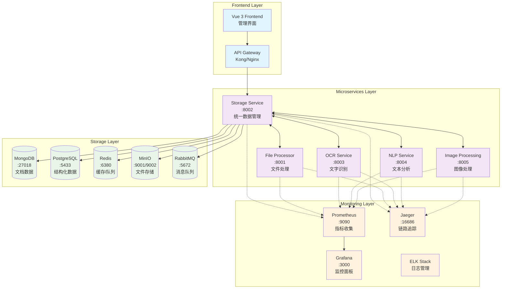
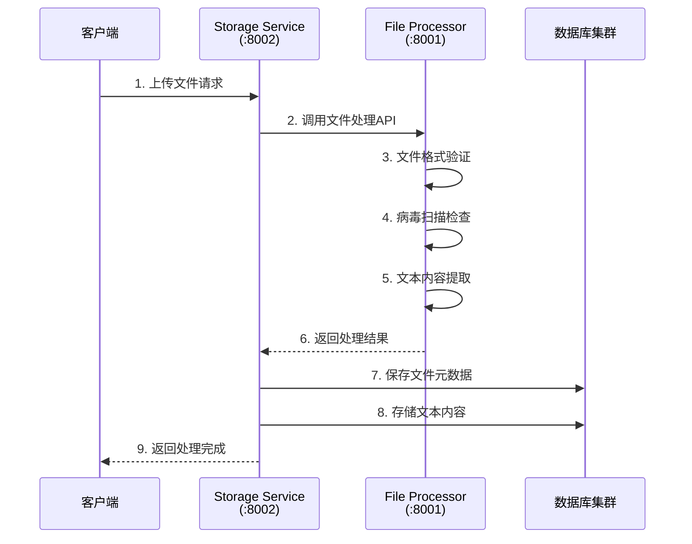
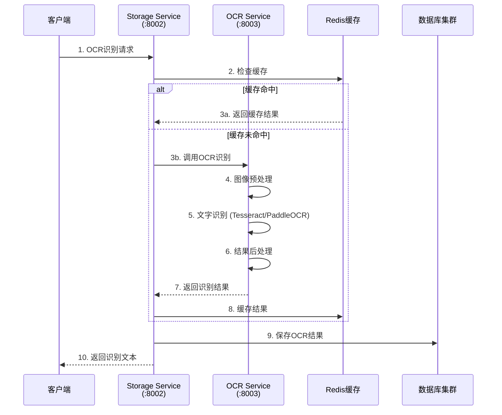
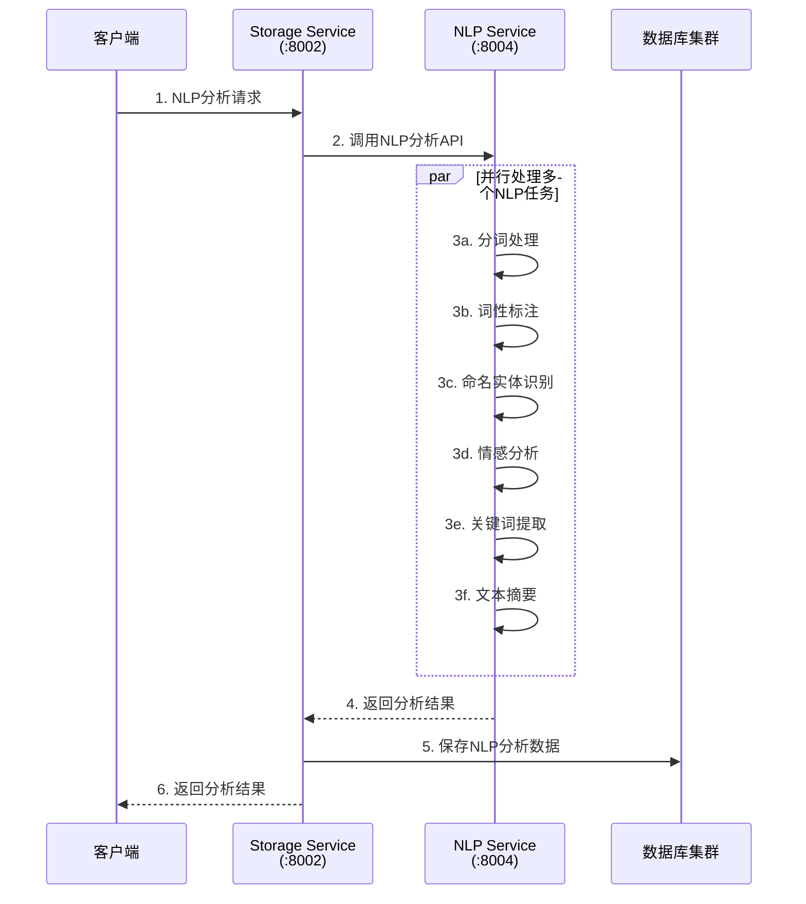
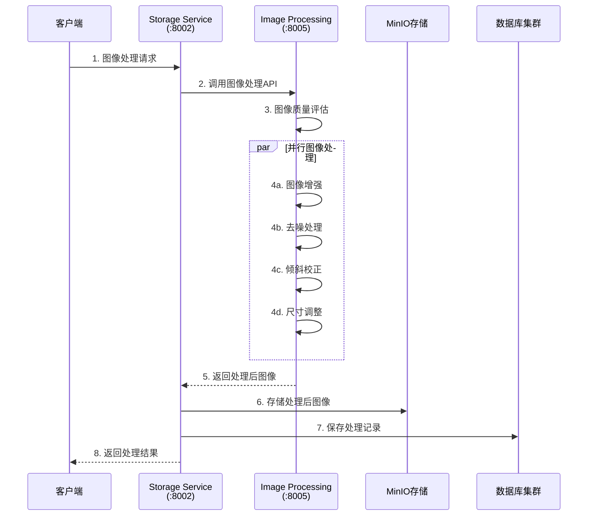
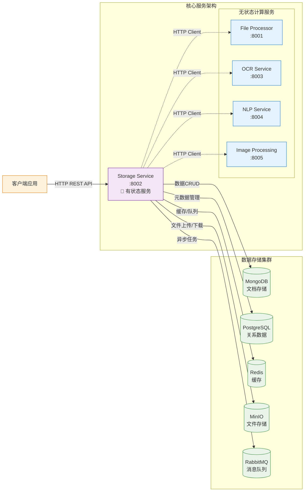
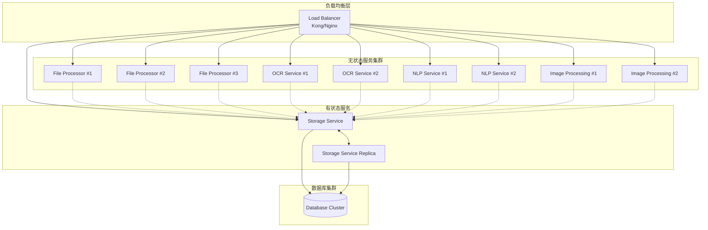

# 🏗️ 历史文本项目系统架构图

## 📊 完整系统架构概览

---

## 🔄 数据流向详细图

### 1. 文件处理流程

### 2. OCR文字识别流程

### 3. NLP文本分析流程

### 4. 图像处理流程

---

## 🌐 服务间调用关系详图

---

## 📋 服务详细信息表

### 🚀 微服务端口分配

| 服务名称 | 端口 | 状态 | 架构类型 | 主要功能 | 依赖服务 |
|---------|------|------|---------|---------|----------|
| **Storage Service** | 8002 | ✅ 运行 | 有状态 | 统一数据管理中心 | MongoDB, PostgreSQL, Redis, MinIO, RabbitMQ |
| **File Processor** | 8001 | ✅ 运行 | 无状态 | 文件处理和内容提取 | Storage Service |
| **OCR Service** | 8003 | ✅ 运行 | 无状态 | 光学字符识别 | Storage Service |
| **NLP Service** | 8004 | ✅ 运行 | 无状态 | 自然语言处理 | Storage Service |
| **Image Processing** | 8005 | ✅ 运行 | 无状态 | 图像处理和优化 | Storage Service |

### 💾 数据存储层

| 存储类型 | 端口 | 主要用途 | 数据类型 |
|----------|------|---------|----------|
| **MongoDB** | 27018 | 文档和内容存储 | 历史文本、处理结果、业务数据 |
| **PostgreSQL** | 5433 | 关系数据管理 | 文件元数据、用户信息、审计日志 |
| **Redis** | 6380 | 缓存和队列 | 会话缓存、任务队列、临时数据 |
| **MinIO** | 9001/9002 | 对象存储 | 原始文件、处理后文件、备份 |
| **RabbitMQ** | 5672 | 消息队列 | 异步任务、事件通知 |

### 📊 监控和日志

| 组件 | 端口 | 功能 | 监控对象 |
|------|------|------|----------|
| **Prometheus** | 9090 | 指标收集 | 所有微服务的性能指标 |
| **Grafana** | 3000 | 可视化面板 | 系统监控仪表板 |
| **Jaeger** | 16686 | 分布式追踪 | 服务间调用链路 |
| **ELK Stack** | 5601 | 日志管理 | 集中日志分析和搜索 |

---

## 🔒 安全和通信协议

### 🌐 服务间通信

1. **HTTP REST API**
   - 所有服务间采用HTTP/HTTPS协议
   - JSON格式数据交换
   - 标准RESTful接口设计

2. **身份验证**
   - JWT Token认证机制
   - 服务间API密钥验证
   - 请求速率限制

3. **数据加密**
   - HTTPS传输加密
   - 敏感数据数据库加密
   - 文件存储加密

### 📈 性能优化策略

1. **缓存策略**
   - Redis多层缓存
   - OCR结果缓存
   - 静态资源CDN缓存

2. **负载均衡**
   - 无状态服务水平扩展
   - Kubernetes Pod自动缩放
   - 数据库连接池优化

3. **异步处理**
   - RabbitMQ消息队列
   - 长时间任务异步执行
   - 批量处理优化

---

## 🚀 扩展性设计

### 水平扩展能力

---

*文档创建时间: 2025-09-08*  
*系统架构版本: v2.3*  
*维护者: Historical Text Project Team*