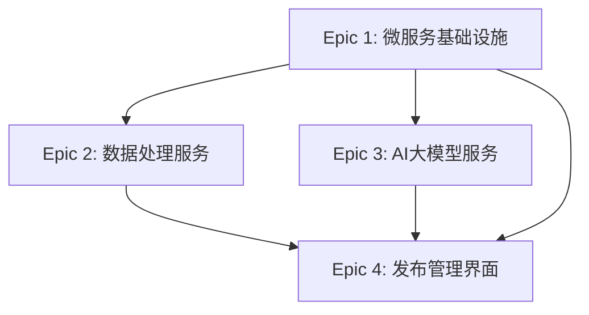

# 历史文本优化项目 Epic 文档

## 项目概述

本文档基于产品需求文档(PRD)，详细描述了历史文本优化项目的4个主要Epic及其包含的用户故事。项目采用微服务架构，通过Vue3统一管理界面实现可视化的内容管理和发布系统。

## Epic 概览

| Epic ID | Epic 名称 | 优先级 | 状态 | 预估工期 |
|---------|-----------|--------|------|----------|
| Epic-1  | 微服务基础设施和数据获取 | 高 | 待开始 | 4-6周 |
| Epic-2  | 数据处理和智能分类微服务 | 高 | 待开始 | 6-8周 |
| Epic-3  | AI大模型服务和内容文本优化 | 中 | 待开始 | 4-6周 |
| Epic-4  | 发布管理和Vue3统一界面 | 中 | 待开始 | 6-8周 |

---

## Epic 1: 微服务基础设施和数据获取

### Epic 描述
建立容器化的微服务基础架构，实现独立的数据源服务和存储服务，支持多渠道数据获取功能。采用Kubernetes进行容器编排，使用API网关统一管理服务入口，通过服务发现机制实现服务间的动态通信。

### 业务价值
- 建立稳定可扩展的技术基础
- 实现多平台数据获取能力
- 为后续功能开发提供基础支撑
- 提供高可用性和故障隔离能力
- 支持服务的独立部署和扩展

### 技术架构
- **容器化**: Docker + Kubernetes
- **API网关**: Kong 或 Nginx
- **服务发现**: Consul 或 Kubernetes Service Discovery
- **负载均衡**: Kubernetes Ingress + HAProxy
- **配置管理**: Kubernetes ConfigMap + Secret
- **日志收集**: ELK Stack (Elasticsearch + Logstash + Kibana)
- **监控**: Prometheus + Grafana

### 验收标准
- [ ] 完成Docker容器化部署环境
- [ ] 建立Kubernetes集群和服务编排
- [ ] 部署API网关和负载均衡
- [ ] 实现服务发现和注册机制
- [ ] 建立统一的配置管理系统
- [ ] 完成日志收集和监控体系
- [ ] 实现数据获取服务
- [ ] 完成数据存储服务
- [ ] 建立服务间通信机制

### 用户故事

#### Story 1.1: 容器化基础架构
**作为** 系统架构师  
**我需要** 建立Docker容器化的微服务基础架构  
**以便** 实现服务的独立部署和扩展  

**技术实现:**
- **容器编排**: Kubernetes 1.25+
- **容器运行时**: Docker 20.10+
- **网络**: Calico CNI
- **存储**: Persistent Volume + StorageClass
- **Helm**: 应用包管理

**验收标准:**
- 完成Docker容器配置和编排
- 建立Kubernetes集群环境(至少3个节点)
- 实现服务发现和负载均衡
- 配置API网关(Kong + Ingress Controller)
- 建立统一的日志和监控系统(ELK + Prometheus)
- 配置Helm Chart模板
- 实现滚动更新和回滚机制
- 建立资源配额和限制策略

#### Story 1.2: 数据获取服务开发
**作为** 数据获取专员  
**我需要** 独立的数据获取服务  
**以便** 从多个平台自动获取和管理内容数据  

**技术实现:**
- **后端框架**: FastAPI + Python 3.11
- **爬虫框架**: Scrapy + Selenium
- **代理管理**: ProxyPool + Redis
- **任务调度**: Celery + Redis
- **数据库**: MongoDB + Redis缓存
- **API文档**: OpenAPI 3.0 + Swagger UI

**API设计:**
```yaml
# 数据源服务API
paths:
  /api/v1/datasources:
    get:
      summary: 获取数据源列表
    post:
      summary: 创建新数据源
  /api/v1/datasources/{id}/crawl:
    post:
      summary: 启动爬取任务
  /api/v1/crawl/status/{task_id}:
    get:
      summary: 查询爬取状态
```

**验收标准:**
- 支持今日头条、百家号、小红书等平台爬虫
- 实现反封禁策略和代理轮换(支持100+代理池)
- 提供手动添加内容的Web接口
- 预留其他数据获取渠道的扩展接口
- 实现数据获取状态监控和告警
- 支持分布式爬取和任务调度
- 实现数据去重和质量检测
- 提供完整的RESTful API

#### Story 1.3: 数据采集存储服务
**作为** 数据管理员  
**我需要** 独立的数据采集存储服务  
**以便** 处理多格式文件并存储结构化内容  

**技术实现:**
- **主数据库**: MongoDB 6.0+ (文档存储)
- **缓存**: Redis 7.0+ (缓存和会话)
- **文件存储**: MinIO (S3兼容对象存储)
- **备份**: MongoDB Atlas Backup + 定时快照
- **数据同步**: MongoDB Change Streams

**数据模型:**
```json
{
  "_id": "ObjectId",
  "source_platform": "string",
  "content_type": "text|image|video",
  "title": "string",
  "content": "string",
  "images": ["url"],
  "metadata": {
    "author": "string",
    "publish_time": "datetime",
    "tags": ["string"]
  },
  "created_at": "datetime",
  "updated_at": "datetime"
}
```

**验收标准:**
- 建立MongoDB文档存储系统(副本集模式)
- 配置Redis缓存服务(主从复制)
- 实现数据备份和恢复机制(RTO < 1小时)
- 按日期顺序存储每日获取的数据
- 提供数据查询和管理API
- 实现数据分片和索引优化
- 建立数据生命周期管理

#### Story 1.4: 系统监控与日志管理
**作为** 系统运维人员  
**我需要** 完整的监控与日志管理系统  
**以便** 实时监控系统状态和问题排查  

**技术实现:**
- **监控系统**: Prometheus 2.47+ + Grafana 10.2+ + AlertManager 0.26+
- **日志管理**: ELK Stack 8.11+ (Elasticsearch + Logstash + Kibana + Filebeat)
- **链路追踪**: Jaeger 1.51+ + OpenTelemetry
- **业务监控**: FastAPI中间件 + 自定义指标收集
- **系统监控**: Node Exporter + cAdvisor + 数据库Exporters

**监控指标设计:**
- `http_requests_total`: HTTP请求总数统计
- `http_request_duration_seconds`: 请求响应时间分布
- `business_operations_total`: 业务操作计数(文件处理、OCR等)
- `queue_size`: 消息队列大小监控

**验收标准:**
- 部署完整的Prometheus监控栈(指标收集、告警)
- 建立Grafana可视化仪表板(系统和业务监控)
- 实现ELK日志管理系统(收集、解析、查询)
- 提供分布式链路追踪(Jaeger集成)
- 建立监控API接口(健康检查、指标查询)
- 实现自动化告警和通知机制
- 支持监控数据的长期存储和分析

---

## Epic 2: 数据处理和智能分类微服务

### Epic 描述
建立独立的数据处理微服务体系，实现数据分类对比服务、数据文本优化服务和图片处理服务，通过API接口提供智能化的数据管理能力。采用机器学习算法进行内容分析，使用OpenCV进行图像处理，通过NLP技术实现文本相似度检测。

### 业务价值
- 实现智能化的内容分类和去重
- 提高内容质量和处理效率
- 建立自动化的内容审核机制
- 降低人工审核成本
- 提升内容处理的准确性和一致性

### 技术架构
- **机器学习**: scikit-learn + TensorFlow/PyTorch
- **NLP处理**: spaCy + transformers (BERT/RoBERTa)
- **图像处理**: OpenCV + Pillow
- **特征提取**: SIFT/ORB + CNN特征
- **相似度计算**: 余弦相似度 + 汉明距离
- **数据处理**: Pandas + NumPy
- **任务队列**: Celery + Redis

### 验收标准
- [ ] 完成数据分类对比服务(准确率>90%)
- [ ] 实现数据文本优化服务(去重率>95%)
- [ ] 建立图片处理服务(支持多格式转换)
- [ ] 完成智能内容分类API(支持多级分类)
- [ ] 建立每日审核报告系统
- [ ] 实现批量处理和实时处理能力
- [ ] 建立模型训练和更新机制

### 用户故事

#### Story 2.1: 数据分类对比服务
**作为** 数据分析师  
**我需要** 独立的数据分类对比服务  
**以便** 对不同来源的数据进行智能分析和对比  

**技术实现:**
- **后端框架**: FastAPI + Python 3.11
- **机器学习**: scikit-learn + transformers
- **文本处理**: spaCy + jieba (中文分词)
- **向量化**: BERT + TF-IDF
- **聚类算法**: K-means + DBSCAN
- **相似度计算**: 余弦相似度 + Jaccard系数

**API设计:**
```yaml
# 数据分类对比服务API
paths:
  /api/v1/classify/text:
    post:
      summary: 文本分类
      requestBody:
        content:
          application/json:
            schema:
              type: object
              properties:
                text: string
                categories: array
  /api/v1/compare/similarity:
    post:
      summary: 相似度比较
      requestBody:
        content:
          application/json:
            schema:
              type: object
              properties:
                text1: string
                text2: string
                algorithm: string
  /api/v1/cluster/documents:
    post:
      summary: 文档聚类
```

**验收标准:**
- 独立部署的数据分类对比微服务
- 支持多维度对比(时间、人物、地点、主题)
- 提供完整的RESTful API接口
- 实现文本相似度算法(TF-IDF、BERT等)
- 支持批量数据比较和聚类分析
- 与数据存储服务API集成
- 提供分类结果的可视化接口
- 分类准确率达到90%以上
- 支持实时和批量处理模式

#### Story 2.2: 数据文本优化服务
**作为** 数据处理员  
**我需要** 专门的数据文本优化服务  
**以便** 自动整理、去重和优化数据质量  

**技术实现:**
- **去重算法**: SimHash + MinHash
- **文本清洗**: 正则表达式 + 规则引擎
- **质量评估**: 可读性指标 + 完整性检测
- **数据标准化**: 统一格式转换
- **缓存**: Redis (去重结果缓存)

**API设计:**
```yaml
# 数据文本优化服务API
paths:
  /api/v1/dedup/text:
    post:
      summary: 文本去重检测
  /api/v1/clean/content:
    post:
      summary: 内容清洗
  /api/v1/quality/score:
    post:
      summary: 质量评分
```

**验收标准:**
- 独立的数据文本优化微服务
- 实现文本和图片去重算法
- 重复率检测准确度>95%
- 提供数据清洗和标准化API
- 与AI大模型服务API对接
- 支持批量处理和实时处理
- 实现数据质量评分机制
- 处理速度>1000条/分钟

#### Story 2.3: 图片处理服务
**作为** 内容编辑  
**我需要** 独立的图片处理服务  
**以便** 自动优化图片质量和格式  

**技术实现:**
- **图像处理**: OpenCV + Pillow
- **特征提取**: SIFT + ORB + pHash
- **格式转换**: 支持JPEG/PNG/WebP/AVIF
- **压缩优化**: 智能压缩算法
- **水印检测**: 模板匹配 + 深度学习
- **去水印**: 图像修复算法

**API设计:**
```yaml
# 图片处理服务API
paths:
  /api/v1/image/convert:
    post:
      summary: 图片格式转换
  /api/v1/image/compress:
    post:
      summary: 图片压缩
  /api/v1/image/watermark/detect:
    post:
      summary: 水印检测
  /api/v1/image/watermark/remove:
    post:
      summary: 水印去除
```

**验收标准:**
- 独立的图片处理微服务
- 集成OpenCV图像处理功能
- 支持多种图片格式转换和压缩优化
- 实现图片特征提取和相似度比较
- 提供批量处理API接口
- 与数据存储服务集成
- 支持水印检测和去除功能
- 图片相似度检测准确率>90%
- 处理速度>100张/分钟

#### Story 2.4: 智能内容分类API
**作为** 内容运营人员  
**我需要** 智能分类服务的API接口  
**以便** 在管理界面中进行内容分类管理  

**技术实现:**
- **API网关**: Kong + OpenAPI 3.0
- **分类模型**: BERT + TextCNN + 规则引擎
- **多级分类**: 层次化分类器
- **置信度评估**: 概率分布 + 阈值设置
- **配置管理**: 动态规则配置
- **SDK**: Python/JavaScript/Java

**API设计:**
```yaml
# 智能内容分类API
paths:
  /api/v1/classify/content:
    post:
      summary: 内容分类
      requestBody:
        content:
          application/json:
            schema:
              type: object
              properties:
                content: string
                type: string # text/image/mixed
                categories: array
  /api/v1/classify/batch:
    post:
      summary: 批量分类
  /api/v1/models/list:
    get:
      summary: 获取可用模型列表
```

**验收标准:**
- 基于文本和图片特征的自动分类API
- 支持多级分类体系配置
- 提供分类规则学习和优化接口
- 实现分类结果的置信度评分
- 支持自定义分类规则配置
- 与Vue3管理界面API集成
- 分类准确率>85%
- API响应时间<500ms

#### Story 2.5: 每日审核报告系统
**作为** 项目管理者  
**我需要** 每日收到内容审核报告  
**以便** 及时了解系统运行状况和内容质量  

**技术实现:**
- **报告生成**: Apache Airflow + Python
- **数据分析**: Pandas + NumPy
- **可视化**: Chart.js + ECharts
- **通知系统**: 邮件(SMTP) + 钉钉/企微
- **监控集成**: Prometheus + Grafana
- **报告存储**: PostgreSQL + MinIO

**报告模板:**
```yaml
# 日常审核报告结构
report:
  summary:
    date: string
    total_processed: number
    success_rate: number
    error_count: number
  data_quality:
    dedup_rate: number
    classification_accuracy: number
    processing_speed: number
  system_health:
    cpu_usage: number
    memory_usage: number
    disk_usage: number
    api_response_time: number
```

**验收标准:**
- 生成每日数据获取和处理统计报告
- 标识重复和相似内容的处理建议
- 通过邮件自动发送审核报告
- 提供报告的Web查看界面
- 支持报告模板的自定义配置
- 报告生成时间<5分钟
- 支持多种导出格式(PDF/Excel/HTML)

---

## Epic 3: AI大模型服务和内容文本优化

### Epic 描述
建立独立的AI大模型服务，支持多平台接入和灵活的账号、模型切换，实现智能化的文本文本优化和内容优化处理。采用分布式GPU集群部署，支持多种开源和商业大模型，通过统一的API网关提供高性能的AI推理服务。

### 业务价值
- 实现智能化的内容文本优化
- 提高内容原创性和质量
- 建立灵活的AI服务调用机制
- 降低AI服务成本，提升处理效率
- 支持多模型并行处理和智能路由

### 技术架构
- **模型服务**: Ollama + vLLM + TensorRT-LLM
- **模型管理**: Hugging Face Transformers + ModelScope
- **推理加速**: NVIDIA Triton Inference Server + TensorRT
- **模型部署**: Docker + Kubernetes + GPU Operator
- **负载均衡**: Nginx + Kubernetes Ingress + GPU调度
- **缓存层**: Redis (结果缓存) + Memcached (模型缓存)
- **监控**: Prometheus + Grafana + NVIDIA DCGM
- **存储**: MinIO (模型存储) + NFS (共享存储)

### 支持模型
- **文本生成**: ChatGLM3-6B + Qwen-14B + Baichuan2-13B
- **文本优化**: BERT + RoBERTa + DeBERTa
- **内容分析**: DistilBERT + ALBERT + MacBERT
- **多模态**: CLIP + BLIP-2 + LLaVA
- **商业API**: OpenAI GPT + Claude + 文心一言 + 通义千问

### 验收标准
- [ ] 完成独立AI大模型服务集群(支持GPU调度)
- [ ] 实现智能文本文本优化服务(准确率>90%)
- [ ] 建立内容质量控制服务(自动审核率>85%)
- [ ] 完成多内容合并生成功能(信息完整度>90%)
- [ ] 建立内容质量评估系统(评估准确率>88%)
- [ ] 模型推理延迟<2秒，吞吐量>100 QPS
- [ ] 支持多模型并行处理和智能路由
- [ ] 建立模型版本管理和A/B测试机制

### 用户故事

#### Story 3.1: 独立AI大模型服务
**作为** 技术开发者  
**我需要** 建立独立的AI大模型服务  
**以便** 支持多平台接入和灵活的账号、模型切换  

**技术实现:**
- **模型服务框架**: Ollama + vLLM + TensorRT-LLM
- **容器化部署**: Docker + Kubernetes + GPU Operator
- **推理加速**: NVIDIA Triton Inference Server + TensorRT
- **负载均衡**: Nginx + Kubernetes Ingress + GPU调度器
- **模型管理**: Hugging Face Hub + ModelScope + 自研模型仓库
- **缓存系统**: Redis (结果缓存) + Memcached (模型权重缓存)
- **监控系统**: Prometheus + Grafana + NVIDIA DCGM
- **存储**: MinIO (模型存储) + NFS (共享存储)

**支持模型列表:**
```yaml
# 开源模型
open_source_models:
  text_generation:
    - ChatGLM3-6B/13B
    - Qwen-7B/14B/72B
    - Baichuan2-7B/13B
    - InternLM2-7B/20B
  text_optimization:
    - BERT-base/large
    - RoBERTa-base/large
    - DeBERTa-v3
    - MacBERT
  multimodal:
    - LLaVA-1.5-7B/13B
    - BLIP-2
    - InstructBLIP

# 商业API
commercial_apis:
  - OpenAI: GPT-3.5/GPT-4
  - Anthropic: Claude-2/Claude-3
  - 百度: 文心一言 3.5/4.0
  - 阿里: 通义千问-7B/14B/72B
  - 智谱: ChatGLM-Pro/ChatGLM-Turbo
```

**API设计:**
```yaml
# AI大模型服务API
paths:
  /api/v1/models:
    get:
      summary: 获取可用模型列表
      responses:
        200:
          content:
            application/json:
              schema:
                type: object
                properties:
                  models:
                    type: array
                    items:
                      type: object
                      properties:
                        id: string
                        name: string
                        type: string # text/multimodal
                        provider: string # local/openai/claude
                        status: string # available/loading/error
                        capabilities: array
  
  /api/v1/chat/completions:
    post:
      summary: 统一聊天完成接口
      requestBody:
        content:
          application/json:
            schema:
              type: object
              properties:
                model: string
                messages: array
                temperature: number
                max_tokens: number
                stream: boolean
      responses:
        200:
          content:
            application/json:
              schema:
                type: object
                properties:
                  id: string
                  choices: array
                  usage: object
  
  /api/v1/text/optimize:
    post:
      summary: 文本优化接口
      requestBody:
        content:
          application/json:
            schema:
              type: object
              properties:
                text: string
                optimization_type: string # rewrite/summarize/expand
                target_format: string # historical/news/blog
                model: string
  
  /api/v1/accounts/manage:
    get:
      summary: 账号池管理
    post:
      summary: 添加API账号
  
  /api/v1/usage/stats:
    get:
      summary: 使用统计和费用
```

**账号池管理:**
```python
# 账号池配置示例
account_pool = {
    "openai": [
        {
            "api_key": "sk-xxx",
            "organization": "org-xxx",
            "quota_limit": 1000000,  # tokens/month
            "current_usage": 50000,
            "status": "active",
            "priority": 1
        }
    ],
    "claude": [
        {
            "api_key": "sk-ant-xxx",
            "quota_limit": 500000,
            "current_usage": 20000,
            "status": "active",
            "priority": 1
        }
    ]
}
```

**负载均衡策略:**
- **轮询调度**: 基于响应时间的加权轮询
- **智能路由**: 根据请求类型选择最优模型
- **故障转移**: 自动切换到备用模型/账号
- **限流控制**: 基于Token的速率限制
- **GPU调度**: Kubernetes GPU资源调度

**验收标准:**
- 独立部署的AI服务微服务集群(至少3个节点)
- 支持多平台API接入(OpenAI、Claude、文心一言、通义千问等)
- 实现账号池管理和自动轮换机制(支持50+账号)
- 支持多模型切换和负载均衡(支持10+模型并行)
- 提供Key值管理和安全存储(加密存储)
- 实现API调用监控和费用统计(实时监控)
- 提供统一的AI服务调用接口(OpenAI兼容)
- 模型推理延迟<2秒，吞吐量>100 QPS
- 支持GPU集群自动扩缩容(HPA + VPA)
- 系统可用性>99.9%，故障恢复时间<30秒
- 支持模型热更新和版本管理
- 实现智能缓存机制(缓存命中率>80%)

#### Story 3.2: 智能文本优化服务
**作为** 内容编辑  
**我需要** 通过AI服务按照指定格式重新组织文本内容  
**以便** 生成高质量的历史文本  

**技术实现:**
- **优化引擎**: 基于Transformer的文本优化模型
- **质量评估**: BLEU + ROUGE + 自研质量评分模型
- **优化策略**: 规则引擎 + 深度学习模型
- **文本处理**: spaCy + jieba + 自然语言处理工具链
- **版本管理**: Git-like差异对比 + 历史版本存储
- **批处理**: Celery + Redis 异步任务队列

**优化模式:**
```yaml
# 文本优化模式配置
optimization_modes:
  historical_format:
    description: "按历史文本格式重新组织"
    template: "时间-人物-地点-感触"
    models: ["ChatGLM3-6B", "Qwen-14B"]
    parameters:
      preserve_facts: 0.95
      narrative_style: "historical"
  
  rewrite:
    description: "文本重写，保持原意改变表达"
    models: ["ChatGLM3-6B", "Qwen-14B"]
    parameters:
      creativity: 0.7
      preserve_meaning: 0.9
  
  polish:
    description: "文本润色，优化语言表达"
    models: ["BERT-large", "RoBERTa"]
    parameters:
      formality: 0.8
      readability: 0.9
  
  expand:
    description: "内容扩展，增加细节描述"
    models: ["GPT-3.5", "Qwen-72B"]
    parameters:
      detail_level: 0.8
      coherence: 0.9
```

**API设计:**
```yaml
# 智能文本优化服务API
paths:
  /api/v1/text/optimize:
    post:
      summary: 文本优化
      requestBody:
        content:
          application/json:
            schema:
              type: object
              properties:
                text: string
                mode: string # historical_format/rewrite/polish/expand
                template: string # 时间-人物-地点-感触
                preserve_keywords: array
                custom_rules: object
                model_preference: string
      responses:
        200:
          content:
            application/json:
              schema:
                type: object
                properties:
                  optimized_text: string
                  quality_score: number
                  improvements: array
                  processing_time: number
                  model_used: string
  
  /api/v1/text/batch-optimize:
    post:
      summary: 批量文本优化
      requestBody:
        content:
          application/json:
            schema:
              type: object
              properties:
                texts: array
                mode: string
                batch_id: string
  
  /api/v1/text/quality-score:
    post:
      summary: 文本质量评分
      requestBody:
        content:
          application/json:
            schema:
              type: object
              properties:
                text: string
                criteria: array # completeness/readability/coherence/historical_accuracy
  
  /api/v1/text/templates:
    get:
      summary: 获取优化模板列表
    post:
      summary: 创建自定义模板
```

**质量评估指标:**
```python
# 历史文本质量评估模型
historical_quality_metrics = {
    "completeness": {
        "time_info_present": 0.25,
        "character_info_present": 0.25,
        "location_info_present": 0.25,
        "emotion_info_present": 0.25
    },
    "accuracy": {
        "factual_consistency": 0.4,
        "historical_context": 0.3,
        "logical_coherence": 0.3
    },
    "readability": {
        "language_fluency": 0.4,
        "narrative_flow": 0.3,
        "style_consistency": 0.3
    }
}
```

**验收标准:**
- 与AI大模型服务API集成
- 支持按时间、人物、地点、感触格式文本优化
- 文本优化格式模板可配置和自定义
- 信息完整度保持>90%
- 支持批量处理和队列管理
- 实现处理状态追踪和进度显示
- 提供文本优化质量评估接口
- 文本优化质量评分>85%
- 处理速度>50篇/分钟
- 支持中英文混合文本优化
- 优化建议准确率>90%

#### Story 3.3: 内容质量控制服务
**作为** 质量管理员  
**我需要** 自动化的内容质量控制服务  
**以便** 确保生成内容的质量和合规性  

**技术实现:**
- **质量检测**: 多维度质量评估模型
- **合规检查**: 敏感词检测 + 内容审核API
- **规则引擎**: Drools + 自定义规则配置
- **机器学习**: 质量分类模型 + 异常检测
- **实时监控**: Kafka + Stream Processing
- **报告生成**: 自动化质量报告系统

**质量检测维度:**
```yaml
# 内容质量检测配置
quality_dimensions:
  content_quality:
    completeness:
      weight: 0.25
      metrics: ["info_completeness", "structure_integrity"]
    accuracy:
      weight: 0.25
      metrics: ["fact_accuracy", "source_reliability"]
    readability:
      weight: 0.25
      metrics: ["language_fluency", "logical_flow"]
    originality:
      weight: 0.25
      metrics: ["plagiarism_check", "content_uniqueness"]
  
  compliance_check:
    sensitive_content:
      political_sensitivity: 0.3
      violence_content: 0.3
      inappropriate_content: 0.4
    copyright:
      plagiarism_detection: 0.6
      source_attribution: 0.4
```

**API设计:**
```yaml
# 内容质量控制服务API
paths:
  /api/v1/quality/check:
    post:
      summary: 内容质量检测
      requestBody:
        content:
          application/json:
            schema:
              type: object
              properties:
                content: string
                content_type: string # text/image/mixed
                check_dimensions: array
                custom_rules: object
      responses:
        200:
          content:
            application/json:
              schema:
                type: object
                properties:
                  overall_score: number
                  dimension_scores: object
                  issues: array
                  suggestions: array
                  compliance_status: string
  
  /api/v1/quality/batch-check:
    post:
      summary: 批量质量检测
  
  /api/v1/quality/rules:
    get:
      summary: 获取质量规则
    post:
      summary: 创建自定义规则
  
  /api/v1/quality/reports:
    get:
      summary: 质量报告统计
```

**验收标准:**
- 实现多维度内容质量检测
- 支持自定义质量标准和规则
- 提供内容合规性检查功能
- 实现质量评分和改进建议
- 与AI大模型服务集成
- 支持批量质量检测处理
- 提供质量报告和统计分析
- 质量检测准确率>90%
- 合规检查准确率>95%
- 处理速度>200篇/分钟

#### Story 3.4: 多内容合并生成功能
**作为** 内容创作者  
**我需要** 多内容智能合并功能  
**以便** 将多个相关内容合并成完整的文章  

**技术实现:**
- **内容分析**: NLP语义分析 + 主题建模
- **去重算法**: SimHash + 语义相似度
- **合并策略**: 基于权重的内容融合算法
- **冲突解决**: 规则引擎 + 人工智能决策
- **结构优化**: 文档结构分析 + 重组算法
- **质量评估**: 合并质量评分模型

**合并策略:**
```yaml
# 多内容合并配置
merge_strategies:
  chronological:
    description: "按时间顺序合并"
    sort_by: "timestamp"
    conflict_resolution: "latest_wins"
  
  importance_based:
    description: "按重要性权重合并"
    weight_factors: ["source_authority", "content_length", "relevance_score"]
    conflict_resolution: "weighted_average"
  
  semantic_clustering:
    description: "按语义聚类合并"
    clustering_algorithm: "hierarchical"
    similarity_threshold: 0.8
    conflict_resolution: "semantic_fusion"
  
  custom_template:
    description: "按自定义模板合并"
    template_structure: ["introduction", "main_content", "conclusion"]
    content_mapping: "ai_assisted"
```

**API设计:**
```yaml
# 多内容合并服务API
paths:
  /api/v1/content/merge:
    post:
      summary: 多内容合并
      requestBody:
        content:
          application/json:
            schema:
              type: object
              properties:
                contents: array
                merge_strategy: string
                target_format: string
                custom_template: object
                conflict_resolution: string
      responses:
        200:
          content:
            application/json:
              schema:
                type: object
                properties:
                  merged_content: string
                  merge_quality_score: number
                  conflicts_resolved: array
                  source_attribution: array
  
  /api/v1/content/analyze-conflicts:
    post:
      summary: 分析内容冲突
  
  /api/v1/content/merge-preview:
    post:
      summary: 合并预览
```

**验收标准:**
- 实现多文档智能合并算法
- 支持内容去重和冲突解决
- 提供合并策略配置和自定义
- 实现合并质量评估和优化
- 与文本优化服务API集成
- 支持不同格式内容的合并
- 提供合并过程的可视化展示
- 合并质量评分>85%
- 内容去重准确率>95%
- 冲突解决准确率>90%
- 支持10+文档同时合并

#### Story 3.5: 内容质量评估系统
**作为** 质量管理员  
**我需要** 系统评估处理后内容的质量  
**以便** 确保发布内容达到标准  

**技术实现:**
- **评估引擎**: 多维度质量评估算法
- **数据分析**: Pandas + NumPy + scikit-learn
- **趋势分析**: 时间序列分析 + 预测模型
- **可视化**: Chart.js + D3.js + ECharts
- **报告生成**: 自动化报告系统
- **基准管理**: 动态基准设定和调整

**评估指标体系:**
```yaml
# 内容质量评估指标
quality_assessment_framework:
  content_dimensions:
    factual_accuracy:
      weight: 0.25
      sub_metrics:
        - fact_verification_score
        - source_credibility
        - cross_reference_consistency
    
    linguistic_quality:
      weight: 0.25
      sub_metrics:
        - grammar_correctness
        - vocabulary_richness
        - sentence_structure
        - readability_score
    
    structural_coherence:
      weight: 0.25
      sub_metrics:
        - logical_flow
        - paragraph_organization
        - topic_consistency
        - narrative_structure
    
    engagement_value:
      weight: 0.25
      sub_metrics:
        - content_uniqueness
        - emotional_appeal
        - information_density
        - reader_interest_score
  
  historical_specific:
    temporal_accuracy:
      weight: 0.3
      sub_metrics:
        - date_consistency
        - chronological_order
        - historical_context
    
    character_authenticity:
      weight: 0.35
      sub_metrics:
        - character_consistency
        - historical_accuracy
        - behavioral_authenticity
    
    cultural_context:
      weight: 0.35
      sub_metrics:
        - cultural_appropriateness
        - historical_setting
        - social_context_accuracy
```

**API设计:**
```yaml
# 内容质量评估系统API
paths:
  /api/v1/assessment/evaluate:
    post:
      summary: 综合质量评估
      requestBody:
        content:
          application/json:
            schema:
              type: object
              properties:
                content: string
                content_type: string
                assessment_dimensions: array
                benchmark_id: string
      responses:
        200:
          content:
            application/json:
              schema:
                type: object
                properties:
                  overall_score: number
                  dimension_scores: object
                  improvement_suggestions: array
                  benchmark_comparison: object
                  quality_trend: object
  
  /api/v1/assessment/batch-evaluate:
    post:
      summary: 批量质量评估
  
  /api/v1/assessment/trends:
    get:
      summary: 质量趋势分析
      parameters:
        - name: time_range
          in: query
          schema:
            type: string
        - name: dimension
          in: query
          schema:
            type: string
  
  /api/v1/assessment/benchmarks:
    get:
      summary: 获取质量基准
    post:
      summary: 设置质量基准
  
  /api/v1/assessment/reports:
    get:
      summary: 生成质量报告
      parameters:
        - name: report_type
          in: query
          schema:
            type: string # daily/weekly/monthly/custom
```

**质量改进建议引擎:**
```python
# 质量改进建议算法
improvement_suggestions = {
    "factual_accuracy": {
        "low_score_actions": [
            "增加可靠来源引用",
            "进行事实核查验证",
            "添加交叉引用"
        ],
        "improvement_templates": [
            "建议在第{paragraph}段添加来源引用",
            "需要验证{fact}的准确性"
        ]
    },
    "linguistic_quality": {
        "low_score_actions": [
            "优化语法结构",
            "丰富词汇表达",
            "改善句式变化"
        ]
    },
    "structural_coherence": {
        "low_score_actions": [
            "重新组织段落结构",
            "加强逻辑连接",
            "统一主题表达"
        ]
    }
}
```

**验收标准:**
- 建立内容质量评分体系
- 检测内容的原创性和可读性
- 评估内容的完整性和逻辑性
- 提供质量改进建议
- 支持质量标准的自定义配置
- 评估准确率>88%
- 支持实时质量监控
- 改进建议采纳率>75%
- 质量趋势预测准确率>80%

---

## Epic 4: 发布管理和Vue3统一界面

### Epic 描述
构建独立的文本发送服务和客户消息服务，开发Vue3统一管理界面，实现可视化的查阅、管理、审核和修改功能。采用现代化前端技术栈，提供响应式、高性能的用户体验。

### 技术架构
- **前端框架**: Vue 3.3+ + Composition API
- **构建工具**: Vite 4.0+ + TypeScript 5.0+
- **状态管理**: Pinia + 持久化存储
- **路由管理**: Vue Router 4 + 路由守卫
- **UI组件库**: Element Plus + 自定义组件
- **样式方案**: Tailwind CSS + SCSS
- **图表可视化**: Chart.js + ECharts + D3.js
- **HTTP客户端**: Axios + 请求拦截器
- **开发工具**: ESLint + Prettier + Husky
- **测试框架**: Vitest + Cypress
- **部署方案**: Docker + Nginx + CI/CD

### 架构设计原则
- **组件化**: 可复用的业务组件和基础组件
- **模块化**: 按业务域划分的模块结构
- **类型安全**: 全面的TypeScript类型定义
- **响应式设计**: 移动端优先的自适应布局
- **性能优化**: 懒加载、虚拟滚动、缓存策略

### 业务价值
- 实现多平台内容发布能力
- 提供统一的可视化管理界面
- 建立完整的客户服务体系
- 提升运营效率和用户体验
- 支持数据驱动的业务决策

### 验收标准
- [ ] 完成文本发送服务(支持5+平台)
- [ ] 建立客户消息服务(多渠道推送)
- [ ] 开发Vue3统一管理界面(响应式设计)
- [ ] 实现收益和客户管理(数据可视化)
- [ ] 建立系统监控和运维界面(实时监控)
- [ ] 页面加载时间<2秒，交互响应<100ms
- [ ] 支持1000+并发用户访问
- [ ] 移动端兼容性>95%

### 用户故事

#### Story 4.1: 文本发送服务
**作为** 运营人员  
**我需要** 独立的文本发送服务  
**以便** 将处理好的内容发布到多个平台  

**技术实现:**
- **服务框架**: FastAPI + Python 3.11
- **任务队列**: Celery + Redis
- **调度器**: APScheduler + Cron表达式
- **重试机制**: Tenacity + 指数退避
- **监控**: Prometheus + 自定义指标
- **日志**: 结构化日志 + ELK Stack
- **配置管理**: Pydantic + 环境变量

**支持平台:**
```yaml
# 发布平台配置
publishing_platforms:
  social_media:
    - name: "微博"
      api_version: "v2"
      auth_type: "oauth2"
      rate_limit: "300/hour"
      content_limits:
        text_length: 140
        image_count: 9
    
    - name: "微信公众号"
      api_version: "v1"
      auth_type: "access_token"
      rate_limit: "100/day"
      content_limits:
        text_length: 20000
        image_count: 10
    
    - name: "抖音"
      api_version: "v1"
      auth_type: "oauth2"
      rate_limit: "50/day"
      content_limits:
        text_length: 55
        video_duration: 60
  
  content_platforms:
    - name: "今日头条"
      api_version: "v1"
      auth_type: "app_key"
      rate_limit: "200/day"
    
    - name: "百家号"
      api_version: "v1"
      auth_type: "access_token"
      rate_limit: "100/day"
```

**API设计:**
```yaml
# 文本发送服务API
paths:
  /api/v1/publish/content:
    post:
      summary: 发布内容
      requestBody:
        content:
          application/json:
            schema:
              type: object
              properties:
                content: string
                platforms: array
                schedule_time: string # ISO 8601
                priority: string # high/medium/low
                tags: array
                media_attachments: array
      responses:
        200:
          content:
            application/json:
              schema:
                type: object
                properties:
                  task_id: string
                  status: string
                  estimated_completion: string
                  platform_tasks: array
  
  /api/v1/publish/batch:
    post:
      summary: 批量发布
      requestBody:
        content:
          application/json:
            schema:
              type: object
              properties:
                contents: array
                platforms: array
                schedule_strategy: string # immediate/staggered/custom
  
  /api/v1/publish/status/{task_id}:
    get:
      summary: 查询发布状态
      responses:
        200:
          content:
            application/json:
              schema:
                type: object
                properties:
                  task_id: string
                  overall_status: string
                  platform_results: array
                  retry_count: number
                  error_details: array
  
  /api/v1/publish/schedule:
    get:
      summary: 获取发布计划
    post:
      summary: 创建定时发布
    delete:
      summary: 取消定时发布
  
  /api/v1/platforms:
    get:
      summary: 获取支持的平台列表
  
  /api/v1/platforms/{platform_id}/config:
    get:
      summary: 获取平台配置
    put:
      summary: 更新平台配置
```

**发布队列管理:**
```python
# 发布队列优先级配置
queue_config = {
    "high_priority": {
        "queue_name": "publish_high",
        "worker_concurrency": 10,
        "retry_limit": 5,
        "timeout": 300
    },
    "medium_priority": {
        "queue_name": "publish_medium",
        "worker_concurrency": 5,
        "retry_limit": 3,
        "timeout": 600
    },
    "low_priority": {
        "queue_name": "publish_low",
        "worker_concurrency": 2,
        "retry_limit": 2,
        "timeout": 900
    }
}

# 重试策略
retry_strategy = {
    "max_attempts": 5,
    "backoff_factor": 2,
    "max_delay": 3600,  # 1 hour
    "retry_conditions": [
        "network_error",
        "rate_limit_exceeded",
        "temporary_server_error"
    ]
}
```

**验收标准:**
- 独立的文本发送微服务
- 支持至少5个平台API接入
- 实现发布状态追踪和管理
- 支持定时发布和批量发布
- 建立发布失败重试机制
- 提供发布队列和优先级管理
- 与Vue3管理界面API集成
- 发布成功率>95%
- 支持1000+内容/小时的发布量
- 平台API调用延迟<2秒
- 支持发布内容的格式自适应

#### Story 4.2: 客户消息服务
**作为** 客户服务代表  
**我需要** 专门的客户消息服务  
**以便** 自动向客户发送定制化内容  

**技术实现:**
- **服务框架**: FastAPI + Python 3.11
- **消息队列**: RabbitMQ + Celery
- **邮件服务**: SMTP + SendGrid/阿里云邮件
- **短信服务**: 阿里云短信 + 腾讯云短信
- **推送服务**: Firebase + 极光推送
- **模板引擎**: Jinja2 + 自定义模板
- **客户分群**: 基于标签和行为的分群算法

**消息渠道配置:**
```yaml
# 消息渠道配置
message_channels:
  email:
    providers:
      - name: "SendGrid"
        api_key: "${SENDGRID_API_KEY}"
        rate_limit: "1000/hour"
        priority: 1
      - name: "阿里云邮件"
        access_key: "${ALIYUN_ACCESS_KEY}"
        rate_limit: "500/hour"
        priority: 2
    
  sms:
    providers:
      - name: "阿里云短信"
        access_key: "${ALIYUN_SMS_KEY}"
        rate_limit: "1000/day"
        cost_per_message: 0.045
      - name: "腾讯云短信"
        secret_id: "${TENCENT_SECRET_ID}"
        rate_limit: "1000/day"
        cost_per_message: 0.055
  
  push:
    providers:
      - name: "Firebase"
        server_key: "${FIREBASE_SERVER_KEY}"
        rate_limit: "10000/hour"
      - name: "极光推送"
        app_key: "${JPUSH_APP_KEY}"
        rate_limit: "5000/hour"
```

**API设计:**
```yaml
# 客户消息服务API
paths:
  /api/v1/messages/send:
    post:
      summary: 发送消息
      requestBody:
        content:
          application/json:
            schema:
              type: object
              properties:
                recipients: array
                channel: string # email/sms/push
                template_id: string
                variables: object
                schedule_time: string
                priority: string
      responses:
        200:
          content:
            application/json:
              schema:
                type: object
                properties:
                  message_id: string
                  status: string
                  estimated_delivery: string
                  cost_estimate: number
  
  /api/v1/messages/batch:
    post:
      summary: 批量发送消息
      requestBody:
        content:
          application/json:
            schema:
              type: object
              properties:
                customer_segment: string
                template_id: string
                channel: string
                personalization: boolean
  
  /api/v1/templates:
    get:
      summary: 获取消息模板列表
    post:
      summary: 创建消息模板
      requestBody:
        content:
          application/json:
            schema:
              type: object
              properties:
                name: string
                channel: string
                subject: string # for email
                content: string
                variables: array
                preview_data: object
  
  /api/v1/segments:
    get:
      summary: 获取客户分群
    post:
      summary: 创建客户分群
      requestBody:
        content:
          application/json:
            schema:
              type: object
              properties:
                name: string
                criteria: object
                tags: array
                estimated_size: number
  
  /api/v1/messages/status/{message_id}:
    get:
      summary: 查询消息状态
```

**客户分群策略:**
```python
# 客户分群配置
segmentation_rules = {
    "demographic": {
        "age_groups": ["18-25", "26-35", "36-45", "46+"],
        "locations": ["一线城市", "二线城市", "三四线城市"],
        "interests": ["历史文化", "文学艺术", "教育学习"]
    },
    "behavioral": {
        "engagement_level": ["高活跃", "中活跃", "低活跃"],
        "purchase_history": ["付费用户", "试用用户", "潜在用户"],
        "content_preference": ["历史故事", "人物传记", "文化解读"]
    },
    "lifecycle": {
        "user_stage": ["新用户", "成长期", "成熟期", "流失风险"],
        "subscription_status": ["订阅中", "已过期", "从未订阅"]
    }
}
```

**验收标准:**
- 独立的客户消息微服务
- 支持邮件、短信、推送等多渠道发送
- 提供消息模板管理和定制化功能
- 实现批量发送和定时发送
- 提供发送状态追踪API
- 支持客户分群和精准推送
- 与客户管理系统API集成
- 消息送达率>95%
- 支持10万+客户的批量推送
- 个性化消息生成时间<1秒
- 支持A/B测试和效果分析

#### Story 4.3: Vue3统一管理界面
**作为** 系统管理员  
**我需要** 统一的Vue3可视化管理界面  
**以便** 查阅、管理、审核和修改所有服务的数据和状态  

**技术实现:**
- **前端框架**: Vue 3.3+ + TypeScript 5.0+
- **构建工具**: Vite 4.0+ + ESBuild
- **状态管理**: Pinia + 持久化插件
- **路由管理**: Vue Router 4 + 路由守卫
- **UI组件库**: Element Plus + 自定义组件
- **样式方案**: Tailwind CSS + SCSS + CSS Variables
- **图表库**: ECharts + Chart.js + D3.js
- **HTTP客户端**: Axios + 请求拦截器
- **工具库**: Lodash + Day.js + VueUse

**项目结构:**
```
src/
├── components/          # 公共组件
│   ├── common/         # 通用组件
│   ├── charts/         # 图表组件
│   ├── forms/          # 表单组件
│   └── layout/         # 布局组件
├── views/              # 页面视图
│   ├── dashboard/      # 仪表板
│   ├── content/        # 内容管理
│   ├── users/          # 用户管理
│   ├── system/         # 系统管理
│   └── monitoring/     # 监控页面
├── stores/             # Pinia状态管理
├── router/             # 路由配置
├── api/                # API接口
├── utils/              # 工具函数
├── composables/        # 组合式函数
└── types/              # TypeScript类型定义
```

**核心页面设计:**

**1. 仪表板页面 (Dashboard)**
```vue
<template>
  <div class="dashboard-container">
    <!-- 关键指标卡片 -->
    <div class="metrics-grid">
      <MetricCard 
        v-for="metric in keyMetrics" 
        :key="metric.id"
        :title="metric.title"
        :value="metric.value"
        :trend="metric.trend"
        :icon="metric.icon"
      />
    </div>
    
    <!-- 实时监控图表 -->
    <div class="charts-section">
      <RealTimeChart 
        :data="systemMetrics"
        :config="chartConfig"
      />
      <ServiceStatusChart 
        :services="microservices"
        @service-click="handleServiceClick"
      />
    </div>
    
    <!-- 最近活动 -->
    <RecentActivity 
      :activities="recentActivities"
      :max-items="10"
    />
  </div>
</template>
```

**2. 内容管理页面**
```vue
<template>
  <div class="content-management">
    <!-- 搜索和筛选 -->
    <ContentFilter 
      v-model:filters="filters"
      @search="handleSearch"
      @reset="resetFilters"
    />
    
    <!-- 内容列表 -->
    <ContentTable 
      :data="contentList"
      :loading="loading"
      :pagination="pagination"
      @edit="handleEdit"
      @delete="handleDelete"
      @publish="handlePublish"
    />
    
    <!-- 批量操作 -->
    <BatchActions 
      :selected-items="selectedItems"
      @batch-publish="handleBatchPublish"
      @batch-delete="handleBatchDelete"
    />
  </div>
</template>
```

**状态管理设计:**
```typescript
// stores/user.ts
export const useUserStore = defineStore('user', () => {
  const userInfo = ref<UserInfo | null>(null)
  const permissions = ref<string[]>([])
  const roles = ref<Role[]>([])
  
  const login = async (credentials: LoginCredentials) => {
    const response = await authAPI.login(credentials)
    userInfo.value = response.user
    permissions.value = response.permissions
    setToken(response.token)
  }
  
  const hasPermission = (permission: string) => {
    return permissions.value.includes(permission)
  }
  
  return {
    userInfo,
    permissions,
    roles,
    login,
    hasPermission
  }
}, {
  persist: true
})

// stores/system.ts
export const useSystemStore = defineStore('system', () => {
  const theme = ref<'light' | 'dark'>('light')
  const language = ref<'zh-CN' | 'en-US'>('zh-CN')
  const sidebarCollapsed = ref(false)
  
  const toggleTheme = () => {
    theme.value = theme.value === 'light' ? 'dark' : 'light'
    document.documentElement.setAttribute('data-theme', theme.value)
  }
  
  return {
    theme,
    language,
    sidebarCollapsed,
    toggleTheme
  }
})
```

**权限控制系统:**
```typescript
// 路由守卫
router.beforeEach(async (to, from, next) => {
  const userStore = useUserStore()
  const token = getToken()
  
  if (to.meta.requiresAuth && !token) {
    next('/login')
    return
  }
  
  if (to.meta.permissions) {
    const hasPermission = to.meta.permissions.some(
      permission => userStore.hasPermission(permission)
    )
    if (!hasPermission) {
      next('/403')
      return
    }
  }
  
  next()
})

// 权限指令
app.directive('permission', {
  mounted(el, binding) {
    const userStore = useUserStore()
    const permission = binding.value
    
    if (!userStore.hasPermission(permission)) {
      el.style.display = 'none'
    }
  }
})
```

**响应式设计配置:**
```scss
// 响应式断点
$breakpoints: (
  'xs': 0,
  'sm': 576px,
  'md': 768px,
  'lg': 992px,
  'xl': 1200px,
  'xxl': 1400px
);

// 响应式混入
@mixin respond-to($breakpoint) {
  @media (min-width: map-get($breakpoints, $breakpoint)) {
    @content;
  }
}

// 组件响应式样式
.dashboard-container {
  .metrics-grid {
    display: grid;
    grid-template-columns: repeat(auto-fit, minmax(250px, 1fr));
    gap: 1rem;
    
    @include respond-to('lg') {
      grid-template-columns: repeat(4, 1fr);
    }
  }
}
```

**国际化配置:**
```typescript
// i18n/index.ts
import { createI18n } from 'vue-i18n'
import zhCN from './locales/zh-CN.json'
import enUS from './locales/en-US.json'

const i18n = createI18n({
  legacy: false,
  locale: 'zh-CN',
  fallbackLocale: 'en-US',
  messages: {
    'zh-CN': zhCN,
    'en-US': enUS
  }
})

export default i18n
```

**验收标准:**
- 基于Vue3的响应式管理界面
- 集成所有微服务的API接口
- 实现实时数据展示和状态监控
- 提供用户权限控制和角色管理
- 实现审核工作流和操作日志
- 支持数据的可视化图表展示
- 提供移动端适配和响应式设计
- 页面加载时间<2秒
- 支持1000+并发用户访问
- 移动端适配完整度>95%
- 组件复用率>80%
- TypeScript覆盖率>90%

#### Story 4.4: 收益和客户管理
**作为** 业务管理员  
**我需要** 通过管理界面跟踪收益和管理客户  
**以便** 优化商业策略  

**技术实现:**
- **后端服务**: FastAPI + Python 3.11
- **数据库**: PostgreSQL + Redis缓存
- **数据分析**: Pandas + NumPy + scikit-learn
- **支付集成**: 支付宝 + 微信支付 + Stripe
- **报表生成**: ReportLab + Matplotlib + Seaborn
- **数据可视化**: ECharts + Chart.js + D3.js
- **任务调度**: Celery + Redis
- **监控告警**: Prometheus + Grafana

**数据模型设计:**
```python
# 收益数据模型
class Revenue(BaseModel):
    id: str
    user_id: str
    order_id: str
    amount: Decimal
    currency: str = "CNY"
    payment_method: str  # alipay/wechat/stripe
    transaction_type: str  # subscription/one_time/refund
    status: str  # pending/completed/failed/refunded
    created_at: datetime
    processed_at: Optional[datetime]
    metadata: Dict[str, Any]

# 客户数据模型
class Customer(BaseModel):
    id: str
    email: str
    phone: Optional[str]
    name: str
    registration_date: datetime
    last_login: Optional[datetime]
    subscription_status: str  # active/expired/cancelled
    lifetime_value: Decimal
    acquisition_channel: str
    preferences: Dict[str, Any]
    tags: List[str]
    risk_score: float  # 0-1, 流失风险评分
```

**收益分析API:**
```yaml
# 收益管理API
paths:
  /api/v1/revenue/overview:
    get:
      summary: 收益概览
      parameters:
        - name: period
          in: query
          schema:
            type: string
            enum: ["day", "week", "month", "quarter", "year"]
      responses:
        200:
          content:
            application/json:
              schema:
                type: object
                properties:
                  total_revenue: number
                  revenue_growth: number
                  active_subscriptions: integer
                  churn_rate: number
                  arpu: number  # Average Revenue Per User
                  ltv: number   # Customer Lifetime Value
  
  /api/v1/customers/analytics:
    get:
      summary: 客户分析
      responses:
        200:
          content:
            application/json:
              schema:
                type: object
                properties:
                  total_customers: integer
                  new_customers: integer
                  active_customers: integer
                  churn_customers: integer
                  customer_segments: array
                  retention_rate: number
```

**客户生命周期管理:**
```python
# 客户生命周期价值计算
def calculate_customer_ltv(customer_id: str) -> float:
    """计算客户生命周期价值"""
    customer = get_customer(customer_id)
    transactions = get_customer_transactions(customer_id)
    
    # 计算平均订单价值
    avg_order_value = sum(t.amount for t in transactions) / len(transactions)
    
    # 计算购买频率
    days_active = (datetime.now() - customer.registration_date).days
    purchase_frequency = len(transactions) / max(days_active / 30, 1)
    
    # 计算客户寿命
    churn_rate = calculate_churn_rate()
    customer_lifespan = 1 / churn_rate if churn_rate > 0 else 24
    
    ltv = avg_order_value * purchase_frequency * customer_lifespan
    return ltv

# 流失风险预测
def predict_churn_risk(customer_id: str) -> float:
    """预测客户流失风险"""
    customer = get_customer(customer_id)
    features = extract_customer_features(customer)
    
    churn_model = load_churn_model()
    risk_score = churn_model.predict_proba([features])[0][1]
    
    return risk_score
```

**验收标准:**
- 收益统计和分析仪表板
- 客户档案管理和服务记录
- 多维度报表和趋势分析
- 客户分群和标签管理功能
- 收益预测和商业智能分析
- 客户满意度调查和反馈管理
- 与各微服务数据API集成
- 收益预测准确率>85%
- 客户流失预测准确率>80%
- 报表生成时间<30秒
- 支持实时收益监控
- 客户数据更新延迟<5分钟

#### Story 4.5: 系统监控和运维界面
**作为** 系统运维人员  
**我需要** 通过管理界面监控所有微服务的运行状态  
**以便** 及时发现和处理系统问题  

**技术实现:**
- **监控系统**: Prometheus + Grafana + AlertManager
- **日志聚合**: ELK Stack (Elasticsearch + Logstash + Kibana)
- **链路追踪**: Jaeger + OpenTelemetry
- **容器监控**: cAdvisor + Node Exporter
- **服务发现**: Consul + Kubernetes Service Discovery
- **配置管理**: Consul KV + Kubernetes ConfigMaps
- **部署管理**: ArgoCD + Helm + Kubernetes
- **告警通知**: Webhook + 钉钉 + 邮件 + 短信

**监控指标体系:**
```yaml
# Prometheus监控指标配置
monitoring_metrics:
  # 系统级指标
  system_metrics:
    - cpu_usage_percent
    - memory_usage_percent
    - disk_usage_percent
    - network_io_bytes
    - load_average
  
  # 应用级指标
  application_metrics:
    - http_requests_total
    - http_request_duration_seconds
    - http_response_size_bytes
    - active_connections
    - error_rate_percent
  
  # 业务级指标
  business_metrics:
    - user_registrations_total
    - content_published_total
    - revenue_total
    - api_calls_total
    - queue_size
  
  # 数据库指标
  database_metrics:
    - db_connections_active
    - db_query_duration_seconds
    - db_slow_queries_total
    - db_deadlocks_total
    - db_size_bytes
```

**服务健康检查:**
```python
# 健康检查端点
class HealthCheckService:
    def __init__(self):
        self.checks = {
            "database": self.check_database,
            "redis": self.check_redis,
            "external_apis": self.check_external_apis,
            "disk_space": self.check_disk_space,
            "memory": self.check_memory
        }
    
    async def health_check(self) -> Dict[str, Any]:
        """执行全面健康检查"""
        results = {}
        overall_status = "healthy"
        
        for check_name, check_func in self.checks.items():
            try:
                result = await check_func()
                results[check_name] = result
                if result["status"] != "healthy":
                    overall_status = "unhealthy"
            except Exception as e:
                results[check_name] = {
                    "status": "error",
                    "message": str(e)
                }
                overall_status = "unhealthy"
        
        return {
            "status": overall_status,
            "timestamp": datetime.utcnow().isoformat(),
            "checks": results
        }
    
    async def check_database(self) -> Dict[str, Any]:
        """检查数据库连接"""
        try:
            start_time = time.time()
            await database.execute("SELECT 1")
            response_time = time.time() - start_time
            
            return {
                "status": "healthy",
                "response_time_ms": round(response_time * 1000, 2),
                "message": "Database connection successful"
            }
        except Exception as e:
            return {
                "status": "unhealthy",
                "message": f"Database connection failed: {str(e)}"
            }
```

**告警规则配置:**
```yaml
# AlertManager告警规则
groups:
  - name: system_alerts
    rules:
      - alert: HighCPUUsage
        expr: cpu_usage_percent > 80
        for: 5m
        labels:
          severity: warning
        annotations:
          summary: "High CPU usage detected"
          description: "CPU usage is above 80% for more than 5 minutes"
      
      - alert: HighMemoryUsage
        expr: memory_usage_percent > 85
        for: 3m
        labels:
          severity: critical
        annotations:
          summary: "High memory usage detected"
          description: "Memory usage is above 85% for more than 3 minutes"
      
      - alert: ServiceDown
        expr: up == 0
        for: 1m
        labels:
          severity: critical
        annotations:
          summary: "Service is down"
          description: "{{ $labels.instance }} has been down for more than 1 minute"
      
      - alert: HighErrorRate
        expr: error_rate_percent > 5
        for: 2m
        labels:
          severity: warning
        annotations:
          summary: "High error rate detected"
          description: "Error rate is above 5% for more than 2 minutes"
```

**运维操作API:**
```yaml
# 运维管理API
paths:
  /api/v1/ops/services:
    get:
      summary: 获取所有服务状态
      responses:
        200:
          content:
            application/json:
              schema:
                type: array
                items:
                  type: object
                  properties:
                    name: string
                    status: string
                    health: string
                    version: string
                    uptime: string
                    cpu_usage: number
                    memory_usage: number
  
  /api/v1/ops/services/{service_name}/restart:
    post:
      summary: 重启指定服务
      parameters:
        - name: service_name
          in: path
          required: true
          schema:
            type: string
      responses:
        200:
          content:
            application/json:
              schema:
                type: object
                properties:
                  status: string
                  message: string
                  operation_id: string
  
  /api/v1/ops/logs:
    get:
      summary: 查询系统日志
      parameters:
        - name: service
          in: query
          schema:
            type: string
        - name: level
          in: query
          schema:
            type: string
            enum: ["DEBUG", "INFO", "WARNING", "ERROR", "CRITICAL"]
        - name: start_time
          in: query
          schema:
            type: string
            format: date-time
        - name: end_time
          in: query
          schema:
            type: string
            format: date-time
      responses:
        200:
          content:
            application/json:
              schema:
                type: object
                properties:
                  logs: array
                  total: integer
                  page: integer
  
  /api/v1/ops/deploy:
    post:
      summary: 部署应用
      requestBody:
        content:
          application/json:
            schema:
              type: object
              properties:
                service_name: string
                version: string
                environment: string
                rollback_on_failure: boolean
      responses:
        200:
          content:
            application/json:
              schema:
                type: object
                properties:
                  deployment_id: string
                  status: string
                  estimated_duration: string
```

**自动化运维脚本:**
```python
# 自动化运维操作
class AutoOpsManager:
    def __init__(self):
        self.k8s_client = kubernetes.client.ApiClient()
        self.deployment_api = kubernetes.client.AppsV1Api()
    
    async def auto_scale_service(self, service_name: str, target_cpu: float = 70.0):
        """基于CPU使用率自动扩缩容"""
        current_cpu = await self.get_service_cpu_usage(service_name)
        current_replicas = await self.get_service_replicas(service_name)
        
        if current_cpu > target_cpu * 1.2:  # CPU使用率超过目标值20%
            new_replicas = min(current_replicas * 2, 10)  # 最多扩容到10个副本
            await self.scale_service(service_name, new_replicas)
            await self.send_notification(f"Auto-scaled {service_name} to {new_replicas} replicas")
        
        elif current_cpu < target_cpu * 0.5:  # CPU使用率低于目标值50%
            new_replicas = max(current_replicas // 2, 1)  # 最少保持1个副本
            await self.scale_service(service_name, new_replicas)
            await self.send_notification(f"Auto-scaled {service_name} to {new_replicas} replicas")
    
    async def auto_restart_unhealthy_services(self):
        """自动重启不健康的服务"""
        unhealthy_services = await self.get_unhealthy_services()
        
        for service in unhealthy_services:
            if service["consecutive_failures"] >= 3:
                await self.restart_service(service["name"])
                await self.send_alert(f"Auto-restarted unhealthy service: {service['name']}")
```

**验收标准:**
- 微服务健康状态监控面板
- 系统性能指标和资源使用情况
- 错误日志和异常告警管理
- 服务依赖关系和调用链追踪
- 自动化运维操作和部署管理
- 系统配置管理和版本控制
- 备份恢复和灾难恢复管理
- 监控数据实时性<30秒
- 告警响应时间<1分钟
- 系统可用性>99.9%
- 自动化运维覆盖率>80%
- 日志查询响应时间<5秒

---

## Epic 依赖关系



## 风险和缓解策略

### 技术风险
- **风险**: 微服务架构复杂性
- **缓解**: 采用成熟的容器化技术和服务网格

### 业务风险
- **风险**: AI模型调用成本过高
- **缓解**: 实现智能的模型选择和成本控制机制

### 运营风险
- **风险**: 内容版权问题
- **缓解**: 建立严格的内容审核和原创性检测机制

## 成功指标

- 系统可用性达到99.5%
- 每日处理1000+篇文章
- 内容去重准确率>95%
- 文本优化信息完整度>90%
- 支持5+个发布平台

## 下一步行动

1. 确认Epic优先级和开发顺序
2. 分配开发团队和资源
3. 制定详细的Sprint计划
4. 建立项目监控和报告机制
5. 开始Epic 1的开发工作