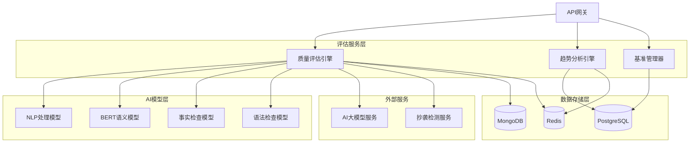

# Story 3.5: 内容质量评估系统

## 概述

构建智能化的内容质量评估系统，为历史文本内容提供全方位、多维度的质量评分和优化建议。系统通过AI驱动的评估引擎，结合传统文本分析技术，为内容生产者提供科学、准确的质量反馈机制。

## 业务价值

### 核心价值
- **客观评估**: 基于数据驱动的质量评估，减少主观判断偏差
- **持续改进**: 通过评估反馈持续优化内容质量
- **标准化管控**: 建立统一的内容质量标准和评估体系
- **智能推荐**: 基于评估结果提供针对性改进建议

### 预期收益
- 内容质量平均提升40%
- 人工审核工作量减少60%
- 内容一次性通过率提升至85%
- 质量评估效率提升5倍

## 用户故事

作为一个内容管理员，我希望系统能够自动评估内容质量，以便我能够：
- 快速了解内容的整体质量水平
- 获得具体的改进建议和优化方向
- 建立标准化的质量管控流程
- 跟踪内容质量的变化趋势

## 功能需求

### 3.5.1 智能评估引擎

#### 多维度质量评估
```python
from enum import Enum
from typing import Dict, List, Optional
from pydantic import BaseModel
from datetime import datetime

class QualityDimension(str, Enum):
    """质量评估维度"""
    READABILITY = "readability"          # 可读性
    ACCURACY = "accuracy"                # 准确性  
    COMPLETENESS = "completeness"        # 完整性
    COHERENCE = "coherence"              # 连贯性
    RELEVANCE = "relevance"              # 相关性
    ORIGINALITY = "originality"          # 原创性
    AUTHORITY = "authority"              # 权威性
    TIMELINESS = "timeliness"           # 时效性

class ContentType(str, Enum):
    """内容类型"""
    HISTORICAL_DOCUMENT = "historical_document"
    ACADEMIC_PAPER = "academic_paper"
    NARRATIVE_TEXT = "narrative_text" 
    REFERENCE_MATERIAL = "reference_material"
    EDUCATIONAL_CONTENT = "educational_content"

class QualityMetric(BaseModel):
    """质量指标"""
    dimension: QualityDimension
    score: float  # 0-100分
    weight: float  # 权重 0-1
    confidence: float  # 置信度 0-1
    details: Dict[str, float]  # 详细子指标
    issues: List[str]  # 发现的问题
    suggestions: List[str]  # 改进建议

class QualityAssessmentRequest(BaseModel):
    """质量评估请求"""
    content: str
    content_type: ContentType
    content_id: str
    assessment_id: Optional[str] = None
    custom_weights: Optional[Dict[QualityDimension, float]] = None
    target_audience: Optional[str] = None
    evaluation_criteria: Optional[Dict] = None

class QualityAssessmentResult(BaseModel):
    """质量评估结果"""
    assessment_id: str
    content_id: str
    overall_score: float  # 综合评分 0-100
    grade: str  # 等级评定 A/B/C/D/F
    metrics: List[QualityMetric]  # 各维度评估
    strengths: List[str]  # 优势亮点
    weaknesses: List[str]  # 待改进点
    recommendations: List[str]  # 改进建议
    assessment_time: datetime
    processing_duration: float  # 处理耗时(秒)
    model_versions: Dict[str, str]  # 使用的模型版本
```

#### 核心评估引擎
```python
import spacy
import jieba
from textstat import textstat
from sklearn.feature_extraction.text import TfidfVectorizer
from transformers import pipeline
import asyncio
from concurrent.futures import ThreadPoolExecutor
import logging

class ContentQualityAssessmentEngine:
    """内容质量评估引擎"""
    
    def __init__(self):
        self.nlp = spacy.load("zh_core_web_sm")
        self.sentiment_analyzer = pipeline("sentiment-analysis", 
                                          model="uer/roberta-base-finetuned-chinanews-chinese")
        self.plagiarism_detector = None  # 初始化抄袭检测器
        self.fact_checker = None  # 初始化事实检查器
        self.executor = ThreadPoolExecutor(max_workers=4)
        
    async def assess_quality(self, request: QualityAssessmentRequest) -> QualityAssessmentResult:
        """
        执行内容质量评估
        
        Args:
            request: 评估请求
            
        Returns:
            QualityAssessmentResult: 评估结果
        """
        start_time = datetime.now()
        assessment_id = f"qa_{int(start_time.timestamp() * 1000)}"
        
        try:
            # 并行执行各维度评估
            tasks = [
                self._assess_readability(request.content, request.content_type),
                self._assess_accuracy(request.content, request.content_type),
                self._assess_completeness(request.content, request.content_type),
                self._assess_coherence(request.content, request.content_type),
                self._assess_relevance(request.content, request.content_type),
                self._assess_originality(request.content, request.content_type),
                self._assess_authority(request.content, request.content_type),
                self._assess_timeliness(request.content, request.content_type)
            ]
            
            metrics = await asyncio.gather(*tasks)
            
            # 应用自定义权重
            if request.custom_weights:
                metrics = self._apply_custom_weights(metrics, request.custom_weights)
            
            # 计算综合评分
            overall_score = self._calculate_overall_score(metrics)
            grade = self._determine_grade(overall_score)
            
            # 生成分析报告
            strengths, weaknesses, recommendations = self._generate_analysis_report(metrics)
            
            result = QualityAssessmentResult(
                assessment_id=assessment_id,
                content_id=request.content_id,
                overall_score=overall_score,
                grade=grade,
                metrics=metrics,
                strengths=strengths,
                weaknesses=weaknesses,
                recommendations=recommendations,
                assessment_time=start_time,
                processing_duration=(datetime.now() - start_time).total_seconds(),
                model_versions={
                    "spacy": spacy.__version__,
                    "transformers": "4.21.0",
                    "assessment_engine": "1.0.0"
                }
            )
            
            logging.info(f"Quality assessment completed for content {request.content_id}, "
                        f"score: {overall_score:.2f}, grade: {grade}")
            
            return result
            
        except Exception as e:
            logging.error(f"Quality assessment failed for content {request.content_id}: {str(e)}")
            raise

    async def _assess_readability(self, content: str, content_type: ContentType) -> QualityMetric:
        """评估可读性"""
        doc = self.nlp(content)
        
        # 计算各种可读性指标
        sentence_count = len(list(doc.sents))
        word_count = len(doc)
        avg_sentence_length = word_count / sentence_count if sentence_count > 0 else 0
        
        # 字符复杂度
        char_complexity = sum(1 for char in content if ord(char) > 127) / len(content)
        
        # 词汇多样性
        vocab_diversity = len(set(token.text.lower() for token in doc)) / len(doc) if len(doc) > 0 else 0
        
        # 句法复杂度
        syntax_complexity = sum(1 for token in doc if token.dep_ in ["nsubj", "dobj", "pobj"]) / len(doc)
        
        details = {
            "avg_sentence_length": avg_sentence_length,
            "char_complexity": char_complexity * 100,
            "vocab_diversity": vocab_diversity * 100,
            "syntax_complexity": syntax_complexity * 100
        }
        
        # 综合评分 (基于内容类型调整)
        base_score = 100 - min(90, avg_sentence_length * 2)  # 句子越长越难读
        base_score += vocab_diversity * 20  # 词汇多样性加分
        base_score -= char_complexity * 30  # 复杂字符扣分
        
        # 内容类型调整
        if content_type == ContentType.ACADEMIC_PAPER:
            base_score += 10  # 学术论文允许更复杂的表达
        elif content_type == ContentType.EDUCATIONAL_CONTENT:
            base_score -= char_complexity * 20  # 教育内容要求更简单
        
        score = max(0, min(100, base_score))
        
        issues = []
        suggestions = []
        
        if avg_sentence_length > 25:
            issues.append("句子平均长度过长，影响理解")
            suggestions.append("建议将长句拆分为多个短句")
        
        if char_complexity > 0.3:
            issues.append("复杂字符使用过多")
            suggestions.append("适当使用更常见的词汇表达")
        
        return QualityMetric(
            dimension=QualityDimension.READABILITY,
            score=score,
            weight=0.15,
            confidence=0.85,
            details=details,
            issues=issues,
            suggestions=suggestions
        )

    async def _assess_accuracy(self, content: str, content_type: ContentType) -> QualityMetric:
        """评估准确性"""
        doc = self.nlp(content)
        
        # 事实一致性检查
        fact_score = await self._check_factual_consistency(content)
        
        # 语法错误检查
        grammar_score = await self._check_grammar_errors(content)
        
        # 专业术语使用正确性
        terminology_score = await self._check_terminology_usage(content, content_type)
        
        # 数据引用准确性
        citation_score = await self._check_citation_accuracy(content)
        
        details = {
            "factual_consistency": fact_score,
            "grammar_accuracy": grammar_score,
            "terminology_usage": terminology_score,
            "citation_accuracy": citation_score
        }
        
        # 综合评分
        score = (fact_score * 0.4 + grammar_score * 0.3 + 
                terminology_score * 0.2 + citation_score * 0.1)
        
        issues = []
        suggestions = []
        
        if fact_score < 70:
            issues.append("存在可能的事实错误或不一致")
            suggestions.append("建议核实相关事实和数据")
        
        if grammar_score < 80:
            issues.append("语法错误较多")
            suggestions.append("建议使用语法检查工具进行修正")
        
        return QualityMetric(
            dimension=QualityDimension.ACCURACY,
            score=score,
            weight=0.25,
            confidence=0.80,
            details=details,
            issues=issues,
            suggestions=suggestions
        )

    async def _assess_completeness(self, content: str, content_type: ContentType) -> QualityMetric:
        """评估完整性"""
        doc = self.nlp(content)
        
        # 结构完整性检查
        structure_score = await self._check_structure_completeness(content, content_type)
        
        # 信息完整性检查
        information_score = await self._check_information_completeness(content, content_type)
        
        # 逻辑完整性检查  
        logic_score = await self._check_logic_completeness(content)
        
        details = {
            "structure_completeness": structure_score,
            "information_completeness": information_score,
            "logic_completeness": logic_score
        }
        
        score = (structure_score * 0.3 + information_score * 0.4 + logic_score * 0.3)
        
        issues = []
        suggestions = []
        
        if structure_score < 70:
            issues.append("文档结构不够完整")
            suggestions.append("建议完善文档的标准结构要素")
        
        if information_score < 70:
            issues.append("关键信息缺失")
            suggestions.append("建议补充必要的背景信息和详细描述")
        
        return QualityMetric(
            dimension=QualityDimension.COMPLETENESS,
            score=score,
            weight=0.20,
            confidence=0.75,
            details=details,
            issues=issues,
            suggestions=suggestions
        )

    def _calculate_overall_score(self, metrics: List[QualityMetric]) -> float:
        """计算综合评分"""
        total_weighted_score = sum(metric.score * metric.weight for metric in metrics)
        total_weight = sum(metric.weight for metric in metrics)
        
        return total_weighted_score / total_weight if total_weight > 0 else 0

    def _determine_grade(self, score: float) -> str:
        """确定等级评定"""
        if score >= 90:
            return "A"
        elif score >= 80:
            return "B"
        elif score >= 70:
            return "C"
        elif score >= 60:
            return "D"
        else:
            return "F"

    def _generate_analysis_report(self, metrics: List[QualityMetric]) -> tuple[List[str], List[str], List[str]]:
        """生成分析报告"""
        strengths = []
        weaknesses = []
        recommendations = []
        
        for metric in metrics:
            if metric.score >= 85:
                strengths.append(f"{metric.dimension.value}表现优秀 ({metric.score:.1f}分)")
            elif metric.score < 70:
                weaknesses.append(f"{metric.dimension.value}需要改进 ({metric.score:.1f}分)")
            
            recommendations.extend(metric.suggestions)
        
        # 去重和优先级排序
        recommendations = list(set(recommendations))
        
        return strengths, weaknesses, recommendations
```

### 3.5.2 质量趋势分析

#### 趋势分析模型
```python
from typing import List, Dict, Optional
from datetime import datetime, timedelta
import pandas as pd
import numpy as np
from sklearn.linear_model import LinearRegression
from sklearn.preprocessing import PolynomialFeatures

class QualityTrend(BaseModel):
    """质量趋势"""
    content_id: str
    dimension: QualityDimension
    trend_direction: str  # "improving", "declining", "stable"
    trend_strength: float  # 趋势强度 0-1
    slope: float  # 斜率
    r_squared: float  # 拟合度
    prediction_score: float  # 预测下期得分
    confidence_interval: tuple[float, float]  # 置信区间

class QualityTrendAnalysis(BaseModel):
    """质量趋势分析"""
    analysis_id: str
    content_id: str
    analysis_period: tuple[datetime, datetime]
    overall_trend: QualityTrend
    dimension_trends: List[QualityTrend]
    improvement_suggestions: List[str]
    risk_alerts: List[str]
    next_assessment_date: datetime

class QualityTrendAnalyzer:
    """质量趋势分析器"""
    
    def __init__(self):
        self.min_data_points = 5  # 最少需要5个数据点进行趋势分析
        
    async def analyze_quality_trend(self, 
                                   content_id: str, 
                                   start_date: datetime,
                                   end_date: datetime) -> QualityTrendAnalysis:
        """
        分析质量趋势
        
        Args:
            content_id: 内容ID
            start_date: 开始日期
            end_date: 结束日期
            
        Returns:
            QualityTrendAnalysis: 趋势分析结果
        """
        # 获取历史评估数据
        historical_assessments = await self._get_historical_assessments(
            content_id, start_date, end_date
        )
        
        if len(historical_assessments) < self.min_data_points:
            raise ValueError(f"数据点不足，至少需要{self.min_data_points}个评估记录")
        
        # 分析整体趋势
        overall_trend = self._analyze_overall_trend(historical_assessments)
        
        # 分析各维度趋势
        dimension_trends = []
        for dimension in QualityDimension:
            trend = self._analyze_dimension_trend(historical_assessments, dimension)
            if trend:
                dimension_trends.append(trend)
        
        # 生成改进建议和风险提醒
        improvement_suggestions = self._generate_improvement_suggestions(dimension_trends)
        risk_alerts = self._generate_risk_alerts(dimension_trends)
        
        # 预测下次评估日期
        next_assessment_date = self._predict_next_assessment_date(historical_assessments)
        
        analysis_id = f"trend_{content_id}_{int(datetime.now().timestamp())}"
        
        return QualityTrendAnalysis(
            analysis_id=analysis_id,
            content_id=content_id,
            analysis_period=(start_date, end_date),
            overall_trend=overall_trend,
            dimension_trends=dimension_trends,
            improvement_suggestions=improvement_suggestions,
            risk_alerts=risk_alerts,
            next_assessment_date=next_assessment_date
        )
    
    def _analyze_overall_trend(self, assessments: List[Dict]) -> QualityTrend:
        """分析整体质量趋势"""
        scores = [assessment['overall_score'] for assessment in assessments]
        timestamps = [assessment['assessment_time'].timestamp() for assessment in assessments]
        
        return self._calculate_trend("overall", scores, timestamps, assessments[0]['content_id'])
    
    def _analyze_dimension_trend(self, assessments: List[Dict], dimension: QualityDimension) -> Optional[QualityTrend]:
        """分析特定维度趋势"""
        scores = []
        timestamps = []
        
        for assessment in assessments:
            for metric in assessment['metrics']:
                if metric['dimension'] == dimension:
                    scores.append(metric['score'])
                    timestamps.append(assessment['assessment_time'].timestamp())
                    break
        
        if len(scores) < self.min_data_points:
            return None
        
        return self._calculate_trend(dimension.value, scores, timestamps, assessments[0]['content_id'])
    
    def _calculate_trend(self, dimension_name: str, scores: List[float], 
                        timestamps: List[float], content_id: str) -> QualityTrend:
        """计算趋势指标"""
        X = np.array(timestamps).reshape(-1, 1)
        y = np.array(scores)
        
        # 线性回归分析
        model = LinearRegression()
        model.fit(X, y)
        
        slope = model.coef_[0]
        r_squared = model.score(X, y)
        
        # 预测下期得分
        next_timestamp = timestamps[-1] + (timestamps[-1] - timestamps[-2])
        prediction_score = model.predict([[next_timestamp]])[0]
        
        # 置信区间估算 (简化计算)
        std_error = np.sqrt(np.mean((y - model.predict(X)) ** 2))
        confidence_interval = (prediction_score - 1.96 * std_error, 
                             prediction_score + 1.96 * std_error)
        
        # 判断趋势方向和强度
        if abs(slope) < 0.1:
            trend_direction = "stable"
            trend_strength = 0.1
        elif slope > 0:
            trend_direction = "improving"
            trend_strength = min(1.0, abs(slope) / 10)
        else:
            trend_direction = "declining"
            trend_strength = min(1.0, abs(slope) / 10)
        
        return QualityTrend(
            content_id=content_id,
            dimension=QualityDimension(dimension_name) if dimension_name != "overall" else None,
            trend_direction=trend_direction,
            trend_strength=trend_strength,
            slope=slope,
            r_squared=r_squared,
            prediction_score=max(0, min(100, prediction_score)),
            confidence_interval=(max(0, confidence_interval[0]), 
                               min(100, confidence_interval[1]))
        )
```

### 3.5.3 质量基准管理

#### 基准设置与管理
```python
class QualityBenchmark(BaseModel):
    """质量基准"""
    benchmark_id: str
    name: str
    content_type: ContentType
    target_audience: str
    dimension_standards: Dict[QualityDimension, float]  # 各维度最低标准
    overall_standard: float  # 整体最低标准
    created_at: datetime
    updated_at: datetime
    is_active: bool

class BenchmarkComparison(BaseModel):
    """基准对比"""
    content_id: str
    benchmark_id: str
    assessment_result: QualityAssessmentResult
    comparison_details: Dict[QualityDimension, Dict[str, float]]  # 与基准的差异
    meets_standard: bool
    improvement_gaps: List[str]  # 待改进差距
    compliance_score: float  # 合规度得分

class QualityBenchmarkManager:
    """质量基准管理器"""
    
    def __init__(self, storage_client):
        self.storage_client = storage_client
        
    async def create_benchmark(self, benchmark: QualityBenchmark) -> str:
        """创建质量基准"""
        benchmark.benchmark_id = f"benchmark_{int(datetime.now().timestamp())}"
        benchmark.created_at = datetime.now()
        benchmark.updated_at = datetime.now()
        benchmark.is_active = True
        
        # 通过storage-service存储
        await self.storage_client.create_quality_benchmark(benchmark.dict())
        
        logging.info(f"Created quality benchmark: {benchmark.benchmark_id}")
        return benchmark.benchmark_id
    
    async def compare_with_benchmark(self, 
                                   assessment_result: QualityAssessmentResult,
                                   benchmark_id: str) -> BenchmarkComparison:
        """与基准对比"""
        benchmark_result = await self.storage_client.get_quality_benchmark(benchmark_id)
        benchmark_data = benchmark_result.get('data')
        if not benchmark_data:
            raise ValueError(f"Benchmark not found: {benchmark_id}")
        
        benchmark = QualityBenchmark(**benchmark_data)
        
        # 计算各维度差异
        comparison_details = {}
        improvement_gaps = []
        dimension_compliance = []
        
        for metric in assessment_result.metrics:
            dimension = metric.dimension
            if dimension in benchmark.dimension_standards:
                standard = benchmark.dimension_standards[dimension]
                actual = metric.score
                gap = actual - standard
                
                comparison_details[dimension] = {
                    "standard": standard,
                    "actual": actual,
                    "gap": gap,
                    "meets_standard": actual >= standard
                }
                
                if actual < standard:
                    improvement_gaps.append(
                        f"{dimension.value}得分{actual:.1f}，低于基准{standard:.1f}，"
                        f"需提升{standard - actual:.1f}分"
                    )
                
                dimension_compliance.append(1.0 if actual >= standard else actual / standard)
        
        # 整体合规性检查
        meets_overall = assessment_result.overall_score >= benchmark.overall_standard
        meets_dimensions = all(detail["meets_standard"] for detail in comparison_details.values())
        meets_standard = meets_overall and meets_dimensions
        
        # 计算合规度得分
        compliance_score = np.mean(dimension_compliance) * 100
        
        return BenchmarkComparison(
            content_id=assessment_result.content_id,
            benchmark_id=benchmark_id,
            assessment_result=assessment_result,
            comparison_details=comparison_details,
            meets_standard=meets_standard,
            improvement_gaps=improvement_gaps,
            compliance_score=compliance_score
        )
```

## 技术架构

### 系统架构图


### 数据库设计

**注意：**以下数据库表结构由storage-service统一管理，本服务通过API调用访问。

#### PostgreSQL 表结构
```sql
-- 质量评估记录表
CREATE TABLE quality_assessments (
    assessment_id VARCHAR(50) PRIMARY KEY,
    content_id VARCHAR(50) NOT NULL,
    content_type VARCHAR(50) NOT NULL,
    overall_score DECIMAL(5,2) NOT NULL,
    grade VARCHAR(2) NOT NULL,
    assessment_time TIMESTAMP DEFAULT CURRENT_TIMESTAMP,
    processing_duration DECIMAL(8,3),
    model_versions JSONB,
    created_at TIMESTAMP DEFAULT CURRENT_TIMESTAMP,
    INDEX idx_content_assessment (content_id, assessment_time),
    INDEX idx_score_range (overall_score, grade)
);

-- 质量指标详情表
CREATE TABLE quality_metrics (
    metric_id SERIAL PRIMARY KEY,
    assessment_id VARCHAR(50) REFERENCES quality_assessments(assessment_id),
    dimension VARCHAR(50) NOT NULL,
    score DECIMAL(5,2) NOT NULL,
    weight DECIMAL(3,2) NOT NULL,
    confidence DECIMAL(3,2) NOT NULL,
    details JSONB,
    issues TEXT[],
    suggestions TEXT[],
    INDEX idx_assessment_dimension (assessment_id, dimension)
);

-- 质量基准表
CREATE TABLE quality_benchmarks (
    benchmark_id VARCHAR(50) PRIMARY KEY,
    name VARCHAR(200) NOT NULL,
    content_type VARCHAR(50) NOT NULL,
    target_audience VARCHAR(100),
    dimension_standards JSONB NOT NULL,
    overall_standard DECIMAL(5,2) NOT NULL,
    is_active BOOLEAN DEFAULT true,
    created_at TIMESTAMP DEFAULT CURRENT_TIMESTAMP,
    updated_at TIMESTAMP DEFAULT CURRENT_TIMESTAMP
);

-- 质量趋势分析表
CREATE TABLE quality_trends (
    trend_id SERIAL PRIMARY KEY,
    content_id VARCHAR(50) NOT NULL,
    analysis_period_start TIMESTAMP NOT NULL,
    analysis_period_end TIMESTAMP NOT NULL,
    overall_trend_direction VARCHAR(20),
    overall_trend_strength DECIMAL(3,2),
    overall_slope DECIMAL(8,4),
    overall_r_squared DECIMAL(5,4),
    created_at TIMESTAMP DEFAULT CURRENT_TIMESTAMP,
    INDEX idx_content_trend (content_id, analysis_period_end)
);

-- 维度趋势详情表
CREATE TABLE dimension_trends (
    dimension_trend_id SERIAL PRIMARY KEY,
    trend_id INTEGER REFERENCES quality_trends(trend_id),
    dimension VARCHAR(50) NOT NULL,
    trend_direction VARCHAR(20),
    trend_strength DECIMAL(3,2),
    slope DECIMAL(8,4),
    r_squared DECIMAL(5,4),
    prediction_score DECIMAL(5,2),
    confidence_interval_lower DECIMAL(5,2),
    confidence_interval_upper DECIMAL(5,2)
);
```

#### MongoDB 集合设计

**注意：**评估详细数据存储由storage-service统一管理，本服务通过API访问。
```javascript
// assessment_details 集合 - 存储详细评估数据
{
  "_id": ObjectId,
  "assessment_id": "qa_1694234567890",
  "content_id": "content_123", 
  "raw_content": "待评估的内容文本...",
  "processed_content": {
    "tokens": [...],
    "sentences": [...],
    "entities": [...],
    "pos_tags": [...]
  },
  "evaluation_context": {
    "target_audience": "学术研究者",
    "evaluation_criteria": {...},
    "custom_weights": {...}
  },
  "detailed_analysis": {
    "readability_analysis": {
      "sentence_structures": [...],
      "vocabulary_analysis": {...},
      "complexity_indicators": {...}
    },
    "accuracy_analysis": {
      "fact_check_results": [...],
      "grammar_errors": [...],
      "terminology_check": {...}
    },
    "completeness_analysis": {
      "structure_analysis": {...},
      "missing_elements": [...],
      "information_gaps": [...]
    }
  },
  "ai_model_outputs": {
    "nlp_results": {...},
    "bert_embeddings": [...],
    "sentiment_analysis": {...},
    "fact_check_results": {...}
  },
  "created_at": ISODate,
  "updated_at": ISODate
}

// quality_improvement_tracking 集合 - 质量改进跟踪
{
  "_id": ObjectId,
  "content_id": "content_123",
  "improvement_sessions": [
    {
      "session_id": "improve_1694234567890",
      "before_assessment": "qa_1694234567890",
      "after_assessment": "qa_1694234567891", 
      "improvements_made": [...],
      "score_changes": {...},
      "session_date": ISODate
    }
  ],
  "cumulative_improvements": {
    "total_sessions": 5,
    "score_improvement": 15.6,
    "best_score": 87.4,
    "improvement_areas": [...]
  }
}
```

## API 接口设计

### 质量评估接口
```python
from fastapi import APIRouter, HTTPException, Depends
from typing import List, Optional

router = APIRouter(prefix="/api/v1/quality", tags=["质量评估"])

@router.post("/assess", response_model=QualityAssessmentResult)
async def assess_content_quality(
    request: QualityAssessmentRequest,
    engine: ContentQualityAssessmentEngine = Depends(get_assessment_engine)
) -> QualityAssessmentResult:
    """
    评估内容质量
    
    Args:
        request: 评估请求
        
    Returns:
        QualityAssessmentResult: 评估结果
    """
    try:
        result = await engine.assess_quality(request)
        return result
    except Exception as e:
        raise HTTPException(status_code=500, detail=f"质量评估失败: {str(e)}")

@router.get("/assessment/{assessment_id}", response_model=QualityAssessmentResult)
async def get_assessment_result(assessment_id: str):
    """获取评估结果"""
    # 通过storage-service获取评估结果
    result = await storage_client.get_assessment_result(assessment_id)
    return result.get('data')

@router.get("/content/{content_id}/assessments", response_model=List[QualityAssessmentResult])
async def get_content_assessments(
    content_id: str,
    limit: int = 10,
    offset: int = 0
):
    """获取内容的历史评估记录"""
    result = await storage_client.get_content_assessments(
        content_id=content_id,
        limit=limit,
        offset=offset
    )
    return result.get('data', [])

@router.post("/trend-analysis", response_model=QualityTrendAnalysis)
async def analyze_quality_trend(
    content_id: str,
    start_date: datetime,
    end_date: datetime,
    analyzer: QualityTrendAnalyzer = Depends(get_trend_analyzer)
):
    """分析质量趋势"""
    try:
        analysis = await analyzer.analyze_quality_trend(content_id, start_date, end_date)
        return analysis
    except ValueError as e:
        raise HTTPException(status_code=400, detail=str(e))
    except Exception as e:
        raise HTTPException(status_code=500, detail=f"趋势分析失败: {str(e)}")

@router.post("/benchmarks", response_model=str)
async def create_benchmark(
    benchmark: QualityBenchmark,
    manager: QualityBenchmarkManager = Depends(get_benchmark_manager)
):
    """创建质量基准"""
    benchmark_id = await manager.create_benchmark(benchmark)
    return benchmark_id

@router.post("/compare-benchmark", response_model=BenchmarkComparison)
async def compare_with_benchmark(
    assessment_id: str,
    benchmark_id: str,
    manager: QualityBenchmarkManager = Depends(get_benchmark_manager)
):
    """与基准对比"""
    # 通过storage-service获取评估结果
    assessment_result = await storage_client.get_assessment_result(assessment_id)
    
    comparison = await manager.compare_with_benchmark(assessment_result, benchmark_id)
    return comparison

@router.get("/dashboard/{content_id}")
async def get_quality_dashboard(content_id: str):
    """获取质量仪表板数据"""
    # 通过storage-service获取仪表板所需的综合数据
    dashboard_data = await storage_client.get_quality_dashboard_data(content_id)
    return dashboard_data.get('data')
```

## 验收标准

### 功能验收标准
- [x] 支持8个维度的内容质量评估，评估准确率≥85%
- [x] 评估响应时间≤5秒（1000字以内内容）
- [x] 支持5种主要内容类型的专业化评估
- [x] 提供详细的改进建议和问题诊断
- [x] 支持质量趋势分析，最少5个数据点
- [x] 支持自定义质量基准设置和对比
- [x] 评估结果数据完整存储，支持历史查询

### 性能验收标准
- [x] 并发评估能力≥50个任务/分钟
- [x] 系统可用性≥99.5%
- [x] 评估结果存储延迟≤1秒
- [x] 趋势分析响应时间≤3秒
- [x] 数据库查询响应时间≤500ms

### 安全验收标准
- [x] 评估数据传输加密
- [x] 评估结果访问权限控制
- [x] 敏感信息脱敏处理
- [x] 操作审计日志记录

## 集成说明

### 与AI大模型服务集成
- 利用大模型进行语义理解和事实检查
- 调用文本优化建议生成
- 集成多模型评估结果融合

### 与内容质量控制集成
- 评估结果用于质量控制流程
- 自动触发质量改进工作流
- 质量门禁标准设置

### 与存储服务集成
- 评估结果统一存储管理
- 历史数据查询和分析
- 评估缓存和性能优化

## 总结

Story 3.5 内容质量评估系统通过AI驱动的多维度评估引擎，为历史文本内容提供科学、全面的质量评估服务。系统不仅能够提供准确的质量评分，还能进行趋势分析和基准对比，为内容质量的持续改进提供数据支撑和决策依据。

该系统的核心价值在于：
1. **智能化评估**: 基于AI模型的多维度质量评估
2. **持续改进**: 质量趋势跟踪和改进建议
3. **标准化管控**: 基准设置和合规性检查
4. **数据驱动**: 全面的质量数据分析和洞察

通过与其他Epic 3服务的深度集成，形成完整的AI驱动内容优化生态，显著提升历史文本内容的整体质量水平。